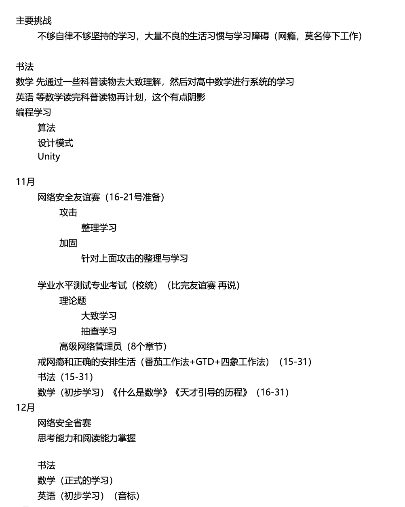
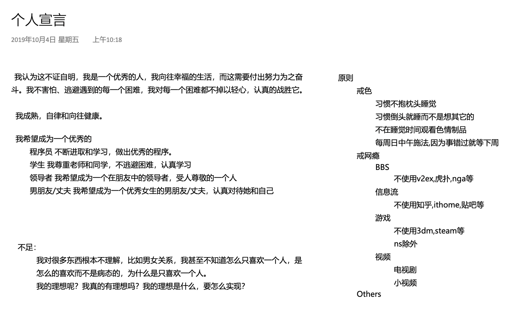

> 我刚看完一本讲写作的书，里面讲述一些关于写作的方法论。如果去构建起承转合，所以我想起我那『励志』的过去，我想写下来，写成一篇爽文，收获大家的关注。但是写着写着我发现我做不到，我写不出我没有经历过的东西，我的过去根本没有办法编成爽文，只有一路上的失败，但是我在失败之后还是坚持着学习，然后比之前做的更进一步而已。

我现在是一个全栈程序员，还没有毕业就被CTO在GitHub上一眼看中，招进了公司。现在在上海拿着还不错的薪水。

但是周围的人都不知道我的过去。2017年，我没考上高中，去了一所中专，家里的亲戚都要我报个卫校当个男护士，而我报了计算机网络。  

如果不出意外的话，我应该像我的同学一样，在中专毕业再读一个民办大专，然后回到我的小县城，在奶茶店里摇奶茶。然后被当初建议我报卫校的亲戚说，早知如此何必当初。
----
但是在2018年的一天，一个博客和其中的几篇文章就开始改变我的一生。  

先从中专入学开始说起吧，我如同几乎所有的中专生一般，每天都是玩手机、玩手机和玩手机，没有社交，也没有认识女生。每天打开手机，刷B站、贴吧、知乎、IT之家。

用[[浅薄]]这本书的内容来说， 就是消遣，我的大脑已经不是一个正常人的大脑了。我每天早上起来的第一眼一定是手机，QQ、微信、知乎，眼睛在几个应用之间轮流切换。

-- 这里加个故事，用具体的描述解决出我的中专生活，
1. 军训的第一天，有同班摸了学姐的腿。

这段时间我并没有多痛苦，似乎人生本来就应该这样。看手机、玩游戏、学习和自己没有半毛钱关系。反而是后面开始改变之后，变的痛苦无比，无限的感叹自己是多么的无力。

大概是2018年，我在IT之家的评论区刷到一个回复，已经不记得是什么帖子和什么内容。反正这个回复让我去墙外找一个博客: 编程随想。这个博客的名字我不能说，被墙了，人也被抓了，内容也不重要。

这个博客完全改变了我的世界观，世界是怎样运行的，人是怎样学习的、社会是怎样组成的。

当年明年说他在26岁的那年他知道了天道。我也是，我那一刻觉得我已经不再是过去的我了，我知道我要成长什么样的人，就如同前段时间在知乎上所看见的为什么成功是可以复制的，关键是看到成功的人是什么样。

我写下我的计划。
我会从中专考上本科，我会成为非常优秀的程序员，我能讲出一口流利的英语，我数学好、物理好，我能用各种科学理论来解释我生活中的各种生活现象，我还能用各种经济学知识，知道我应该怎么做。就像李永乐一样，尽管我当初还不知道他。

这样的目标很简单，我只要开始努力起来，我今天学完这个设计模式，明天刷完算法题，这周把新概念都背完，下周把古今数学理论过一遍，一天推一章的证明不过份吧。生活中的物理学也就1400多页，我这个月才干完吧。

是的。。。只要我开始努力起来。

如果我能做到，我现在也不会在这里用这样的语气和你们说话，而是比真的姜萍还姜萍的多，你们会从铺天盖地的新闻中听到我，但是现实没有，我就是没有做到。

如果我不曾见过光明，我也不会如此痛苦。

---

是的，我依然没有改变，我还是一样玩、一样废物，一样是学不进去，什么都没有改变。除了我现在会说我知道他妈的成功的人是什么样的。

--
这里还需要一个转折
--

一个人开始想上进就像朝闻道中那样抬头看星空的人，后面的人生就已经不一样了，尽管后面依然困难重重。比如我那已经沉迷进消遣之中的大脑，这毫无生气的学习环境。

我意识我的人生缺乏的课太多太多了，于是我开始我的补课之旅，从数学开始、然后是英语然后是我自己喜欢的计算机。这一路上困难重重，我开始用各种方法论来改造自己。我看过很多书，自控力、意志力、深度工作、原子习惯、GTD、ZTD、小强职场升职记、番茄钟。我可以像报菜名一样一直一直报下去。我都认真读过，并且试过。

但是这些书并没有解决我的问题。不是说它们的内容没有用，里面的知识就像一颗种子，让我知道了为什么会这样，比如我晚上比白天更难静下来学习，我知道是因为我意志力不够了(当然后面看了控糖还发现是因为血糖太高了。)

我对一本书的期待是里面的知识能立刻改变我的人生，我从明天开始就是一个完全不消遣，全身心投入不间断的学习的一个人，但是实现不是童话，没有一夜之间的成功。但是我在确实在不断的变好。

这里我在2019年为自己制定的学习目标，达成了吗? 现在回头看这些目标我确实都完成了，但是完成是在这个之后的很久很久以后。我定下的目标都没有完成的同时，并不是我拼劲全力也没有做，而是我明明有时间，但是我到了晚上就是不想去做不想去学。想去看一会视频。
又或者硬撑着打了书，坐在桌子上开始学习，确怎么也看不明白也学不会，知识就是不往脑子里去，然后在没有正反馈的十几分钟后就放弃了。 

我继续的阅读，有一个书叫『成功人士的七个习惯』。我反复读了好多遍。我认为是个好书，但是里面的点我确实做不太到，当然像『要事优先』和『双赢思维』这些基本算是刻进我的潜意识中。但是像以始为终写个人宣言，然后期待我的行为就会去符合这个宣言，这件事，我试了几次，我没有成功。

但是我确实在不断的进步，尽管比较慢，我开始观测自己，找到自己还不足的点，然后再去找书，进行阅读，尝试实践其中的方法论。

2020年的一天我考上了一所本科。2024年我毕业了，应届的我在上海找到了一份工作。