# Go 语言基础


本篇文章用例版本 `Go 1.20.4`


## 注释

注释就是对代码的解释和说明，其目的是让人们能够更加轻松地了解代码。

在 Go 中，注释方法有两种 —— 单行注释和多行注释

- 单行注释

  `//` 开头的，主要用于：

  - 解释代码的意图和目的：可以使用单行注释来描述某个代码块的作用、实现的功能或者设计意图。
  - 提醒或警示：在代码中使用注释来提醒其他开发人员或自己注意某个细节、潜在的问题或需要注意的事项。
  - 调试和排查问题：在开发和调试过程中，可以使用注释来临时禁用某个代码块或添加调试信息，以帮助定位问题。

  

- 多行注释（块注释）

  以 `/*` 开头 `*/` 结尾，主要用于：

  - 文件头部注释：在文件的顶部使用多行注释来提供文件的概要、作者信息、版本历史等详细说明。
  - 函数或方法的说明：在函数或方法的定义上方使用多行注释来描述函数的用途、参数、返回值以及可能的异常情况。
  - 类或模块的说明：在类或模块的定义上方使用多行注释来提供类的功能、设计理念、用法示例等详细说明。


> 注释只是提高代码可读性的一种方法，并不会被计算机执行


<br />

<br />

## 变量

在编程中，变量是用于存储和表示数据的一个命名容器。

它可以存储各种类型的数据，如整数、浮点数、字符串、布尔值等，并可以在程序中被引用和修改。


变量的实质可以理解为在内存中的一个标签或引用，它指向存储数据的内存地址。当我们给变量赋值时，实际上是将数据存储到该内存地址中，而当我们引用变量时，计算机会根据变量的名称找到对应的内存地址，从而获取存储在该地址中的数据。

### 变量声明

在 Go 语言中，变量声明的方法有3种：`var关键字声明`、`类型推导`、`简短声明`


#### 1. var 关键字声明


可以用 `var` 关键字进行变量的声明，具体格式为：


`var 变量名 变量类型 [= value]`


```go
// 例如
var name string   // 声明一个字符串类型的变量，名称为 name  不赋值默认为""
var age int  	  // 声明一个整数类型的变量，名称为 age  不赋值默认为 0
var isAdult bool  // 声明一个布尔类型的变量，名称为 isAdult  不赋值默认为 false
var sex string = "male"
var isMarried bool = false
```


**声明变量不赋值，则默认为该类型的空值**


<br />


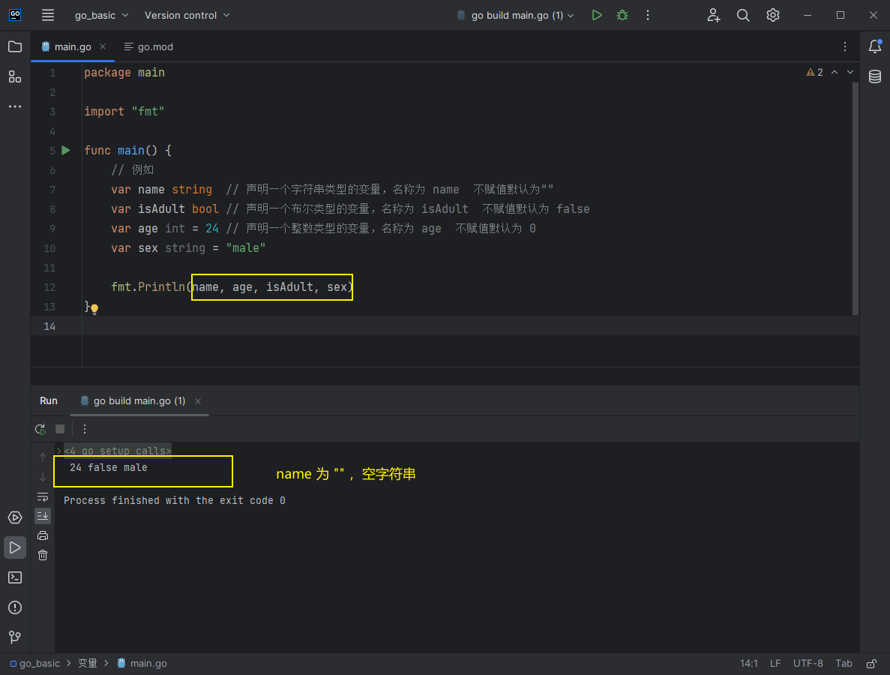


<br />

<br />


#### 2. 类型推导

在变量声明时可以省略类型，并让编译器自动推断变量的类型。例如：


```go
var name = "Coco" // 类型推断为 string
var age = 24 // 类型推断为 int
```

<br />


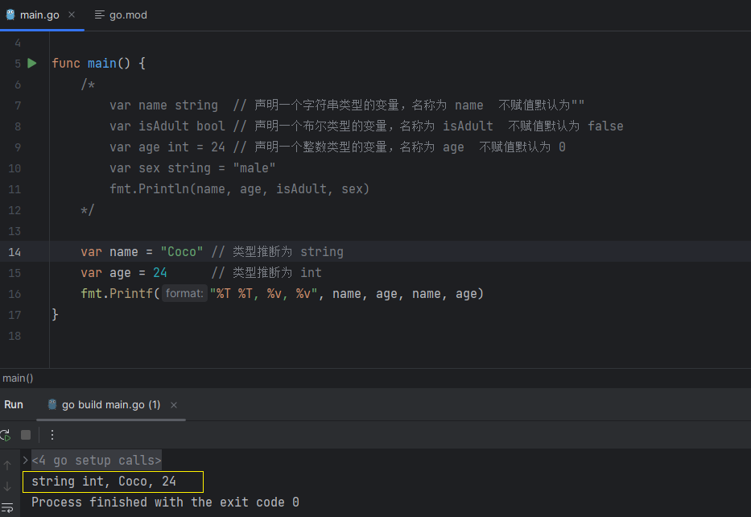


#### 3. 简短声明

使用 ` := ` 简短声明可以在不指定变量类型的情况下声明变量，并根据初始化值自动推断类型。例如：


```go
name := "Coco"
age := 24
```


<br />


**注意：**


1. 简短声明方式只能在函数内部使用，而不能在函数外部或包级别使用。

2. 可同时声明多个变量，例如：

   ```go
   // 同时声明多个同类型变量
   var height, width int
   
   // 同时声明多个不同类型变量
   var (
       name string
       age  int
   )
   
   // 同时声明多个变量并赋值
   var a, b, c = 10, 20, 30
   ```

   <br />

   


<br />

<br />


### 匿名变量


在Go语言中，匿名变量用一个下划线  `_`  表示，用于表示不需要使用的变量。主要用途有以下两个：


- 函数返回值：当一个函数的返回值中有一些不需要使用的变量时，可以使用匿名变量来占位。

  ```go
  func getData() (int, string, error) {
      // 假设获取数据的函数返回一个整数、一个字符串和一个错误
      // 我们只需要使用其中的部分返回值
      return 42, "Data", nil
  }
  
  func main() {
      data, _, _ := getData()
      fmt.Println("Data:", data)
  }
  ```

  <br />

  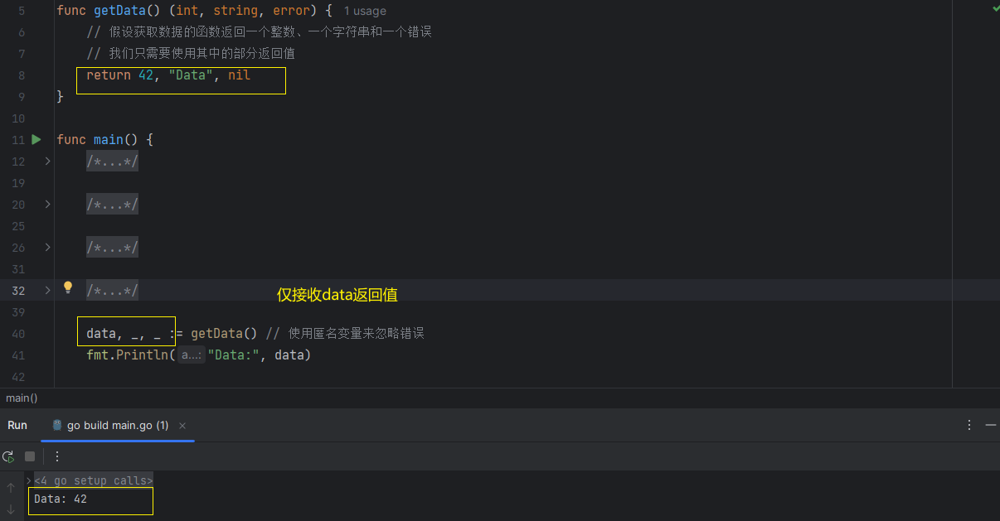

  <br />

  <br />

- 忽略索引或值：在循环遍历数组、切片、映射等数据结构时，如果只关心其中的索引或值而不需要另外一个，则可以使用匿名变量来忽略不需要的部分。

  ```go
  numbers := []int{1, 2, 3, 4, 5}
  
  for i, _ := range numbers {
      fmt.Println("Index:", i)
  }
  
  for _, value := range numbers {
      fmt.Println("Value:", value)
  }
  ```

  <br />

  


<br />

<br />


### 变量命名规则

变量需按规则命名，否则会导致编译出错或导致代码可读性变差

变量命名通常需要注意以下几点


1. 遵循语法规范

   - 变量名称必须由数字、字母、下划线组成。
   - 标识符开头不能是数字。
   - 标识符不能是保留字和关键字。
   - 建议使用驼峰式命名，当名字有几个单词组成的时优先使用大小写分隔
   - 变量名尽量做到见名知意。
   - 变量命名区分大小写

   

2. 不能与 `关键字` 同名

   

   Go语言中有25个关键字，不能用于自定义变量名

   

   ```go
   break        default          func           interface         select
   case         defer            go             map               struct
   chan         else             goto           package           switch
   const        fallthrough      if             range             type
   continue     for              import         return            var
   ```

   

3. 不能与 `预定义名` 同名

   预定义名用于内建的常量、类型和函数，不能与其同名

   ```go
   // 内建常量
   true  false  iota  nil
   
   // 内建类型
   int       int8      int16        int32      int64
   uint      uint8     uint16       uint32     uint64   uintptr
   float32   float64   complex128   complex64
   bool      byte      rune         string     error
   
   // 内建函数
   make     len     cap   new  append  copy  close  delete
   complex  real    imag
   panic    recover
   ```

   


### 变量作用域


在编程中，变量的作用域定义了变量的可见范围，即在程序的哪些部分可以访问和使用该变量。


Go 语言中，变量的作用域主要分为三种：函数作用域、块作用域、全局作用域


#### 1. 函数作用域

在函数内部声明的变量具有函数级作用域，只在函数内部可见和使用。函数的参数也属于函数内部作用域。


```go
func example() {
	var x int = 10 // 在函数内部声明的变量 x
	fmt.Println(x) // 可以在函数内部使用
}

func main() {
	fmt.Println(x) // 编译错误，x 在 main 函数内不可见
}

```

<br />


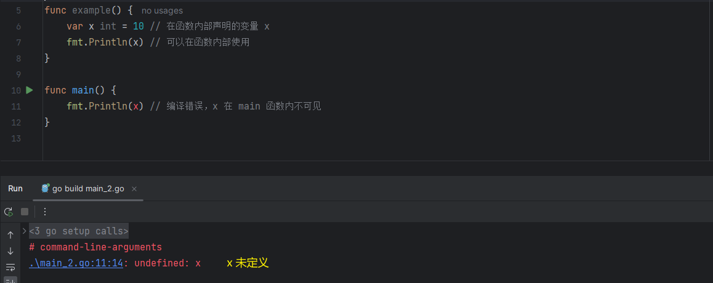


#### 2. 块作用域

在控制结构（如 if、for、switch）或代码块（用花括号 {} 包裹的一段代码）中声明的变量具有块级作用域，只在该块内可见和使用。


```go
func example() {
    
    if true {
        var x int = 10 // 在 if 块内声明的变量 x
        fmt.Println(x) // 可以在 if 块内使用
    }
    
    fmt.Println(x) // 编译错误，x 在 if 块外不可见
}
```

<br />


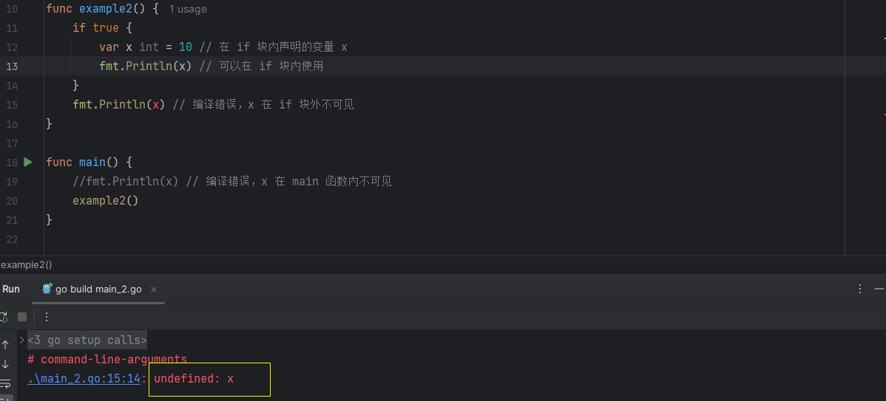


#### 3. 全局作用域

在函数外部或包级别声明的变量具有全局作用域，可以在整个包内的任何函数中访问和使用。


```go
var x int = 10 // 在包级别声明的变量 x

func example() {
    fmt.Println(x) // 可以在函数内部使用全局变量 x
}

func main() {
    fmt.Println(x) // 可以在 main 函数内部使用全局变量 x
}
```


<br />


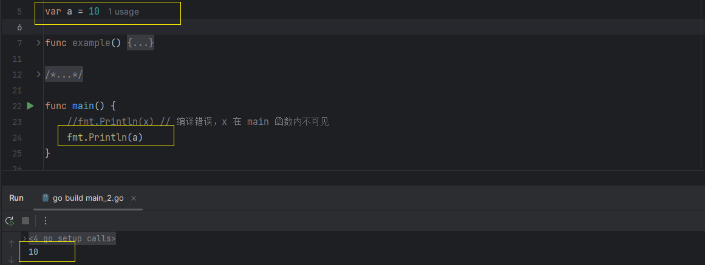


<br />


**注意**

1. 在嵌套作用域中，内部作用域可以访问外部作用域的变量。但是，外部作用域不能访问内部作用域的变量。


2. 如果在内部作用域中声明了与外部作用域同名的变量，则在内部使用变量时内部作用域的变量会覆盖外部作用域的同名变量。

   <br />

   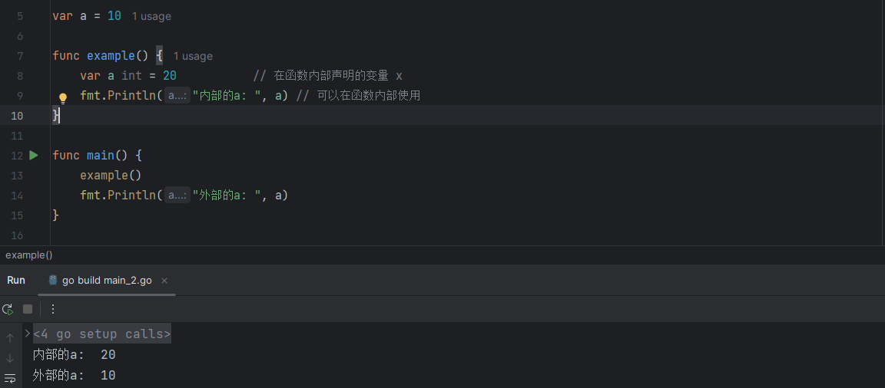


<br />

<br />

<br />


> 若觉得控制台每次提醒内容过多可以关掉
>
> 
>
> 
>
> 
>
> 按两下 shift 搜索 Registry，找到 `go.run.processes.with.pty` 或 `run.processes.with.pty`，取消勾选
>
> 
>
> 


<br />

<br />


## 常量

在Go语言中，常量（Constants）是固定不变的值，在程序运行过程中不会发生变化。常量在声明时就被赋予了一个初始值，并且在整个程序的执行过程中保持不变。


常量的声明使用关键字  `const` ，并遵循以下语法格式：

```go
const identifier [type] = value
```

其中：

- `identifier `是常量的名称，遵循标识符的命名规则。
- `type `是可选的，用于指定常量的数据类型。
- `value `是常量的初始值。


例如：


```go
const pi = 3.14159  
// 或
const pi float32 = 3.14159
```

### 常量的特点及使用方法

<br />

1. 常量必须在声明时进行初始化，并且初始化后不能修改。

   

   

   

2. 常量可以是基本数据类型（如整数、浮点数、字符串等），也可以是自定义类型。

   

3. 常量的值必须是编译时可确定的，不能包含运行时的表达式。

   

4. 常量可以在包级别或函数级别进行声明，作用范围取决于声明的位置。

   

5. 常量可以用于表示程序中的固定值，提高代码的可读性和可维护性。


<br />


### 常量与 iota 方法

在 Go 语言中，`iota `是一个被预定义的常量，用于生成一组相对连续的无类型整数常量。


它在常量声明中的初始值为 0，并且每遇到一个常量声明，它的值就会自动递增。


<br />

```go
func main() {
	const (
		Monday = iota + 1
		Tuesday
		Wednesday
	)
	fmt.Println(Monday, Tuesday, Wednesday)
}
```

<br />


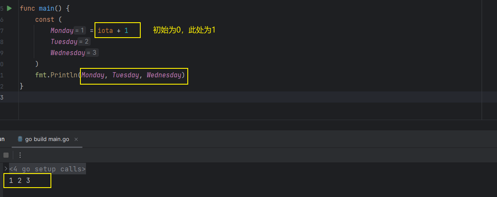


<br />


几个常见的示例：


1. 使用 `_` 跳过某些值

   ```go
   func main() {
   	const (
   		Monday = iota + 1
   		_ // _ 的值为2，但是被跳过了
   		Wednesday
   	)
   	fmt.Println(Monday, Wednesday) // 1  3
   }
   ```

   

2. `iota`声明的中间进行其他常量的赋值

   ```go
   
   func main() {
   	const (
   		Monday  = iota + 1
   		Tuesday = 2  // 中途插队，iota不增长
   		Wednesday
   	)
   	fmt.Println(Monday, Tuesday, Wednesday)  // 1  2  2
   }
   
   ```

   

3. 定义数量级操作

   ```go
   const (
   		_  = iota  // iota=0
   		KB = 1 << (10 * iota) // iota=1, 10*iota=10, 1左移10位为 010000000000 十进制为1024
   		MB = 1 << (10 * iota) // iota=2, 10*iota=20, 1左移20位 十进制为 1024*1024
   		GB = 1 << (10 * iota)
   		TB = 1 << (10 * iota)
   		PB = 1 << (10 * iota)
   	)
   ```

   

4. 多个`iota`定义在同一行

   ```go
   const (
   		a, b = iota + 1, iota + 2  // 1,2
   		c, d                       // 2,3
   		e, f                       // 3,4
   )
   ```

   


## 基本数据类型


基本数据类型包含整型和浮点型，布尔类型、字符类型及字符串类型

### 整型


整型（integers）：用于表示整数值


可根据表示长度、是否带有符号细分为以下10种类型


<br/>


| 整型类型   | 含义                                                         |
| ---------- | ------------------------------------------------------------ |
| **int**    | 与平台相关，32位操作系统上就是`int32`，64位操作系统上就是`int64` |
| **int8**   | 有符号 8 位整数 （-128 到 127）                              |
| **int16**  | 有符号 16 位整数（-32768 到 32767）                          |
| **int32**  | 有符号 32 位整数（-2147483648 到 2147483647）                |
| **int64**  | 有符号 64 位整数（-9223372036854775808 到 9223372036854775807） |
| **uint**   | 与平台相关，32位操作系统上就是`uint32`，64位操作系统上就是`uint64` |
| **uint8**  | 无符号 8 位整数（0 到 255）                                  |
| **uint16** | 无符号 16 位整数（0 到 65535）                               |
| **uint32** | 无符号 32 位整数（0 到 4294967295）。                        |
| **uint64** | 无符号 64 位整数（0 到 18446744073709551615）                |


<br/>

### 浮点型


浮点型（floats）：用于表示浮点数值。（小数）


根据所占空间不同，浮点型分为两种类型


| **浮点类型** | **含义**                                                     |
| ------------ | ------------------------------------------------------------ |
| **float32**  | 占用4个字节（32位）存储空间来存储一个浮点数，最多有7位十进制有效数字 |
| **float64**  | 使用 8个字节（64位）存储空间来存储一个浮点数，大约可以表示十进制的15或16位有效数字。 |

<br />


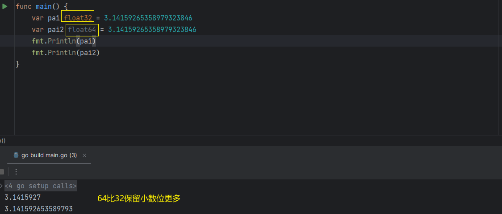


<br />


1. 类型推断时，默认为  `float64` 类型

   可以使用 `reflect.TypeOf()` 查看变量数据类型

   

   

   <br />

   

2. 可以使用科学计数法表示

   指数部分由 E 或 e 以及一个带正负号的十进制数组成

   ```go
   var num1 float64 = 66
   var num2 = .066
   var num3 = 6.2e+1
   fmt.Println(reflect.TypeOf(num1), num1, num2, num3)
   ```

   <br />

   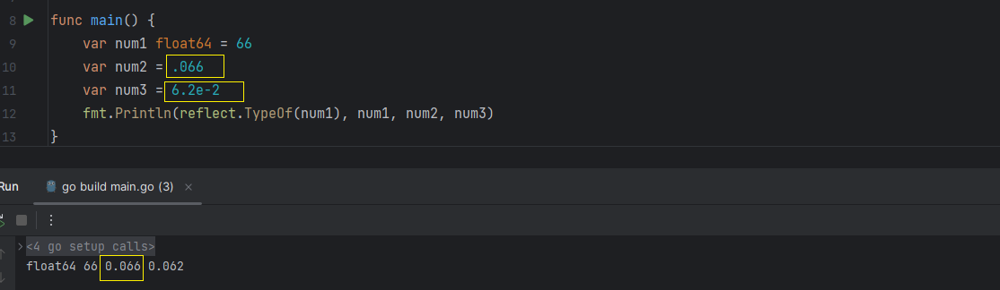

   

<br/>

<br />


### 布尔型

布尔型（boolean）：用于表示逻辑值。


bool：只有两个值，`true` 和 `false`。默认为 `false`，分别代表逻辑判断中的真和假，主要应用在条件判断中。


```go
var b bool  // 声明一个布尔类型变量，默认值为 false
fmt.Println(b, reflect.TypeOf(b))  // false bool
b = true  // 将变量命名为 true
fmt.Println(b, reflect.TypeOf(b))  // true bool
```


<br />

### 字符类型

字符型（characters）：用于表示单个字符。可细分为以下两种类型：


- `byte`

  `uint8 ` 的别名，用于表示 `ASCII `字符。

  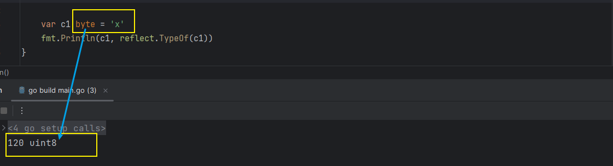

  

- `rune`

  `int32` 的别名，用于表示 `Unicode `字符。默认为此类型

  

  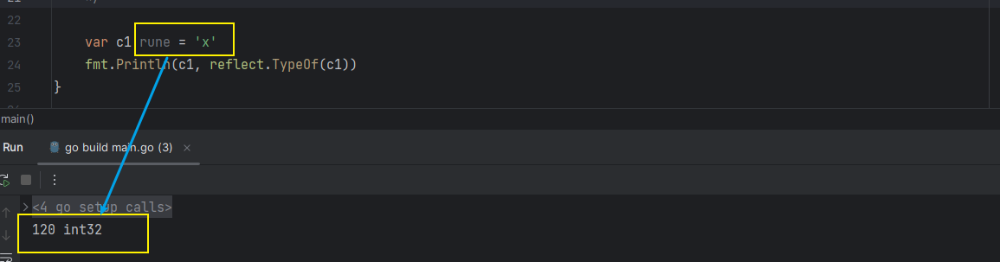

<br />


遍历一个字符串的每一个元素均为字符类型：

```go
str := "Hello"
for _, char := range str {
    fmt.Println(char, reflect.TypeOf(char))
}
```


<br />


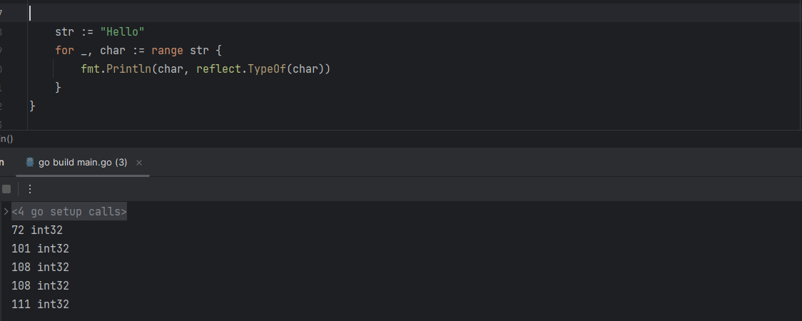

<br />

### 字符串类型


字符串型（strings）：用于表示文本字符串。最基本也是最常用的数据类型，是通过双引号将多个字符按串联起来的一种数据，用于展示文本。


#### 1. 基本使用

- 字符串的字面量

  可以使用双引号  ` ""` 和反引号 ````` ```  将字符串包裹以声明一个字符串，通常用双引号表示单行字符串，反引号表示多行字符串

  ```go
  s1 := "Hello World"
  
  s1 := ` 第一行
          第二行
          第三行
  `
  ```

  

  

- 字符串索引和切片

  字符串中的每个字符为一个单元，可以以字符的序号进行对字符串中字符的访问，序号从0开始，称为索引

  字符串的切片语法为 string[start:stop]，使用方法类似 python 中列表的切片方法，切片索引左开右闭

  例如：string[3:6]，切出的内容为string中的第4、5、6个字符，即 string[3]+string[4]+string[5]

  ```go
  str := "Hello World"
  char := str[0]        // 获取索引为0的字符 即 'H'
  subStr := str[6:11]   // 提取索引从6到11（不包含11）的子字符串，结果为 "World"
  ```

  

  

- 字符串的连接

  可以使用加号（+）进行字符串连接，将多个字符串拼接成一个新的字符串。

  ```go
  str1 := "Hello"
  str2 := "World"
  result := str1 + " " + str2 // 结果为 "Hello World"
  ```

  

  

- 字符串的比较

  可以使用关系运算符（==、!=、<、<=、>、>=）进行字符串的比较操作。

  ```go
  str1 := "Hello"
  str2 := "World"
  result := str1 == str2 // 结果为 false
  ```

  

  

- 字符串的遍历

  字符串遍历：可以使用 `for range` 语句遍历字符串中的字符。

  ```go
  str := "Hello"
  for _, char := range str {
      fmt.Println(char)
  }
  ```

  


#### 2. 转义字符

| 转义符 |                含义                |
| :----: | :--------------------------------: |
|  `\r`  |         回车符（返回行首）         |
|  `\n`  | 换行符（直接跳到下一行的同列位置） |
|  `\t`  |               制表符               |
|  `\'`  |               单引号               |
|  `\"`  |               双引号               |
|  `\\`  |               反斜杠               |


#### 3. 常用方法

| 方法                                    | 介绍                                                       |
| :-------------------------------------- | :--------------------------------------------------------- |
| `len(str)`                              | 求长度，即字符串中字符的个数。                             |
| `strings.ToUpper()`,`strings.ToLower()` | 生成一个新的全部大写的字符串，生成一个新的全部小写的字符串 |
| `strings.ReplaceAll()`                  | 生成一个新的原字符串被指定替换后的字符串                   |
| `strings.Contains()`                    | 判断是否包含                                               |
| `strings.HasPrefix,strings.HasSuffix()` | 前缀/后缀判断                                              |
| `strings.Trim()`                        | 去除字符串两端匹配的内容                                   |
| `strings.Index(),strings.LastIndex()`   | 子串出现的位置                                             |
| `strings.Split()`                       | 分割，将字符串按指定的内容分割成数组                       |
| `strings.Join(a[]string, sep string)`   | join操作，将数组按指定的内容拼接成字符串                   |


```go
import (
	"fmt"
	"reflect"
	"strings"
)

func main() {
	str := "Hello World"

	// 转大写，转小写  strings.ToUpper() 和 strings.ToLower()
	upperStr := strings.ToUpper(str) // HELLO WORLD
	lowerStr := strings.ToLower(str) // hello world
	fmt.Println(upperStr, lowerStr)

	// 两端去除  strings.Trim()
	str2 := "  String  "
	trimStr := strings.Trim(str2, " ")
	fmt.Println(trimStr) // String  去除了两边的所有空格

	// 子串索引，找到匹配的最后一个索引  strings.Index() 和 strings.LastIndex()
	var index = strings.Index(str, "World!!!")
	fmt.Println(index) // -1  未找到
	var index2 = strings.LastIndex(str, "l")
	fmt.Println(index2) // 9  从0开始，到倒数第二个

	// 前缀、后缀、是否包含  strings.HasPrefix() 、 strings.HasSuffix() 、 strings.Contains()
	fmt.Println(strings.HasPrefix(str, "He")) // true  前缀为 He
	fmt.Println(strings.HasSuffix(str, "ld")) // true  后缀为 ld
	fmt.Println(strings.Contains(str, "W"))   // true  包含 W

	// 字符串的切割  strings.Split()  返回值类型为数组
	var ret2 = strings.Split(str, " ")      // 以空格为标准将字符串切割
	fmt.Println(ret2, reflect.TypeOf(ret2)) // value:  [Hello World]    type:  []string

	// 将数组拼接成字符串  strings.Join()
	var ret3 = strings.Join(ret2, "-")
	fmt.Println(ret3, reflect.TypeOf(ret3)) // value:  Hello-World     type:   string
}
```


### 类型转换

在Go语言中，可以使用类型转换（Type Conversion）将一个类型的值转换为另一个类型。

类型转换使用一对圆括号和目标类型来完成。以下是几种常见的类型转换方式：


1. 基本类型转换：
   - 将整数类型转换为其他整数类型
   
     将`int`类型转换为`int64`类型：`var1 := int64(var2)`
   
     
   
   - 将浮点数类型转换为其他浮点数类型
   
     将`float32`类型转换为`float64`类型：`var1 := float64(var2)`
   
     
   
   - 将整数类型转换为浮点数类型
   
     将`int`类型转换为`float64`类型：`var1 := float64(var2)`
   
     
   
   - 将浮点数类型转换为整数类型
   
     将`float64`类型转换为`int`类型：`var1 := int(var2)`
   
     
   
   - 将数字类型转换为字符串类型
   
     将`int`类型转换为`string`类型：`var1 := strconv.Itoa(var2)`
   
     
   
   - 将字符串类型转换为数字类型
   
     将`string`类型转换为`int`类型：`var1, _ := strconv.Atoi(var2)`
   
     

2. Parse 系列函数用法

   

   在Go语言的标准库中，提供了一系列的Parse函数，用于将字符串解析为其他类型的值。这些Parse函数常用于从字符串中提取特定类型的数据，例如整数、浮点数、布尔值等。

   

   1. `strconv.ParseBool(str string) (bool, error)`：将字符串解析为布尔值。如果解析成功，返回解析后的布尔值和nil；如果解析失败，返回false和对应的错误。

      

   2. `strconv.ParseInt(str string, base int, bitSize int) (int64, error)`：将字符串解析为整数。参数`base`指定字符串的进制（例如10表示十进制），`bitSize`指定整数类型的位数（例如`int64`为64位）。如果解析成功，返回解析后的整数值和nil；如果解析失败，返回0和对应的错误。

      

   3. `strconv.ParseUint(str string, base int, bitSize int) (uint64, error)`：类似于`ParseInt`，但解析为无符号整数。

      

   4. `strconv.ParseFloat(str string, bitSize int) (float64, error)`：将字符串解析为浮点数。参数`bitSize`指定浮点数类型的位数（例如`float64`为64位）。如果解析成功，返回解析后的浮点数值和nil；如果解析失败，返回0和对应的错误。

      

   5. `time.Parse(layout string, value string) (Time, error)`：将字符串解析为时间。参数`layout`指定字符串的时间格式，`value`为要解析的字符串。如果解析成功，返回解析后的时间值和nil；如果解析失败，返回零值和对应的错误。

      

      ```go
      func handleParse() {
      	// 解析布尔值
      	boolStr := "true"
      	boolVal, _ := strconv.ParseBool(boolStr)
      	fmt.Println("解析布尔:", boolVal) // 解析布尔: true
      
      	// 解析整数
      	intStr := "123"
      	intVal, _ := strconv.ParseInt(intStr, 10, 64)
      	fmt.Println("解析整数:", intVal) //解析整数: 123
      
      	// 解析浮点数
      	floatStr := "3.14"
      	floatVal, _ := strconv.ParseFloat(floatStr, 64)
      	fmt.Println("解析浮点数:", floatVal) //解析浮点数: 3.14
      
      	// 解析时间
      	timeStr := "2023-05-17 10:30:00"
      	layout := "2006-01-02 15:04:05"
      	timeVal, _ := time.Parse(layout, timeStr)
      	fmt.Println("解析时间成功:", timeVal) //解析时间成功: 2023-05-17 10:30:00 +0000 UTC
      }
      ```

      


**注意**：类型转换可能会导致数据的精度损失或溢出。因此，在进行类型转换时应注意类型的兼容性和数据的范围。在进行类型转换时，建议使用安全的转换方式，并进行适当的错误处理，以避免潜在的运行时错误。


<br />

### 类型别名

类型别名是指为已有的类型创建一个新的名称，但在类型系统中，它们被视为不同的类型。类型别名可以提高代码的可读性，同时也可以帮助在不同的上下文中使用不同的名称来表示相同的底层类型。


类型别名的声明使用 `type` 关键字，后面跟着新类型的名称和等号，然后是被别名的类型。如：

```go
type myInt int

func main(){
    var a myInt = 10
	fmt.Println(a, reflect.TypeOf(a))  // 10 main.myInt
}
```

需要注意的是，他们被视为不同的类型体现在：

二者虽然本质都是 `int `类型，但不可做原生 `int` 间的加减乘除等操作，会报错 `mismatched types int and myInt`


<br />

<br />


## 运算符

运算符是编程语言中用于执行各种数学和逻辑运算的特殊符号。它们用于操作变量和常量，以生成结果。

### 运算符分类

#### 算数运算符

| 运算符 | 描述 |
| :----- | :--- |
| +      | 相加 |
| -      | 相减 |
| *      | 相乘 |
| /      | 相除 |
| %      | 求余 |


<br />

#### 关系运算符

| 运算符 | 描述                                                         |
| :----- | :----------------------------------------------------------- |
| ==     | 检查两个值是否相等，如果相等返回 True 否则返回 False。       |
| !=     | 检查两个值是否不相等，如果不相等返回 True 否则返回 False。   |
| >      | 检查左边值是否大于右边值，如果是返回 True 否则返回 False。   |
| <      | 检查左边值是否小于右边值，如果是返回 True 否则返回 False。   |
| >=     | 检查左边值是否大于等于右边值，如果是返回 True 否则返回 False。 |
| <=     | 检查左边值是否小于等于右边值，如果是返回 True 否则返回 False。 |

<br />

#### 逻辑运算符


| 运算符 | 描述                                                         |
| :----- | :----------------------------------------------------------- |
| &&     | 逻辑 AND 运算符。 如果两边的操作数都是 True，则条件 True，否则为 False。 |
| \|\|   | 逻辑 OR 运算符。 如果两边的操作数有一个 True，则条件 True，否则为 False。 |
| !      | 逻辑 NOT 运算符。 如果条件为 True，则逻辑 NOT 条件 False，否则为 True。 |

<br />

#### 赋值运算符

| 运算符 | 描述                                           |
| :----- | :--------------------------------------------- |
| =      | 简单的赋值运算符，将一个表达式的值赋给一个左值 |
| +=     | 相加后再赋值                                   |
| -=     | 相减后再赋值                                   |
| *=     | 相乘后再赋值                                   |
| /=     | 相除后再赋值                                   |
| %=     | 求余后再赋值                                   |
| <<=    | 左移后赋值                                     |
| >>=    | 右移后赋值                                     |
| &=     | 按位与后赋值                                   |
| ^=     | 按位异或后赋值                                 |
| \|=    | 按位或后赋值                                   |
| `++`   | `自增`                                         |
| `--`   | `自减`                                         |


<br />

### 运算符优先级


在Go语言中，运算符的优先级规则如下（由高到低）：


1. 一元运算符（例如，取反、取地址等）

2. 乘法、除法和取余运算符（`*`, `/`, `%`）

3. 加法和减法运算符（`+`, `-`）

4. 移位运算符（`<<`, `>>`）

5. 按位与运算符（`&`）

6. 按位异或和按位或运算符（`^`, `|`）

7. 关系运算符（`==`, `!=`, `<`, `<=`, `>`, `>=`）

8. 逻辑运算符（`&&`, `||`）

9. 位清除（按位与非）运算符（`&^`）

10. 赋值运算符（`=`, `+=`, `-=`, `*=`, `/=`, `%=`, `<<=`, `>>=`, `&=`, `^=`, `|=`, `&^=`）


需要注意的是，运算符的优先级可以通过使用括号来改变。括号内的表达式具有更高的优先级，因此在需要确保特定运算顺序时，可以使用括号来明确指定。以下是一个硬核示例：

```go
package main

import "fmt"

func main() {
	result := 2 + 3*4/2 - 1%2<<3&^4 == 0 || !(5 > 2 && 3 < 6)
	fmt.Println(result) // 输出: true
}
```


<br />

<br />


## 高级数据类型


除了以上基本数据类型，Go语言还提供了一些其他数据类型，如复数类型（complex）、指针类型（pointer）、数组类型（array）、切片类型（slice）、映射类型（map）、结构体类型（struct）等。


本章主要学习指针、数组、切片和map类型


### 指针


#### 指针定义

在Go语言中，指针（Pointer）是一种特殊的变量类型，用于存储变量的内存地址。指针指向了某个变量在内存中的位置，通过指针可以直接访问或修改该变量的值。


上文介绍变量时说：变量的实质可以理解为在内存中的一个标签或引用，通俗的说，变量是对内存中某一块区域内所存的值的引用，更改变量值本质上是更改内存中的值，但指针用来存储变量的内存地址，在生活中，可以将指针比喻为家的地址，变量可以比喻为这个地址上的所有东西。

（仅个人理解）


<br />


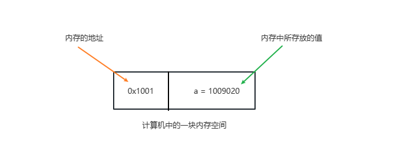


<br />


#### 指针的使用方法

Go语言中使用对于指针存在两种操作： `取址`和`取值`。

| 符号      | 名称   | 作用                   |
| :-------- | :----- | :--------------------- |
| &变量     | 取址符 | 返回变量所在的地址     |
| *指针变量 | 取值符 | 返回指针指地址存储的值 |


声明一个变量的语法为： `var 指针变量名 *T`

其中 `T` 表示Go语言中的数据类型，如 `int`、`float`、`bool`、`string`、`array`、`struct`等


```go
package main

import (
	"fmt"
	"reflect"
)

func main() {
	var p1 *int
	fmt.Println(p1, reflect.TypeOf(p1)) // <nil> *int
}
```


<br />


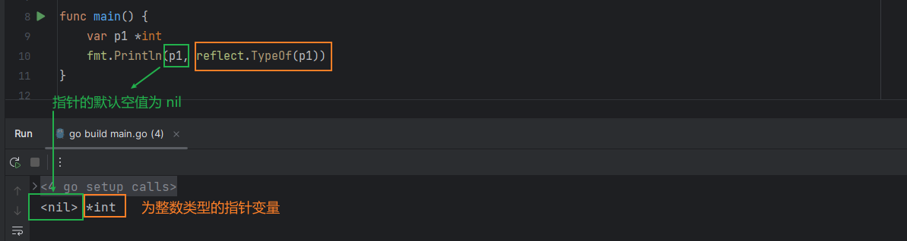

<br />


取变量内存地址的语法为： `ptr := &v`


其中：

1. `v` 表示需要取地址的变量，假设该变量类型为 `T`
2. `ptr` 表示存放该变量地址的指针变量，该指针变量的类型为：`*T`


```go
func main() {
	var num int8 = 10
	pNum := &num
	fmt.Println(pNum, reflect.TypeOf(pNum))
}

```

<br />


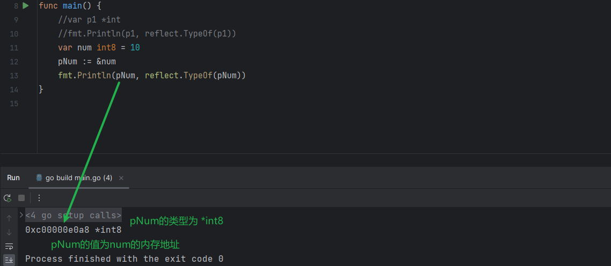


<br />

该流程的图示如下：


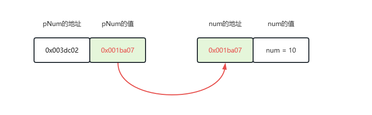


<br />

可以通过指针修改其指向变量的值，例如：


```go
func main() {
	var num int8 = 10
	pNum := &num
	*pNum = 5
	fmt.Println(num)
}
```

<br />


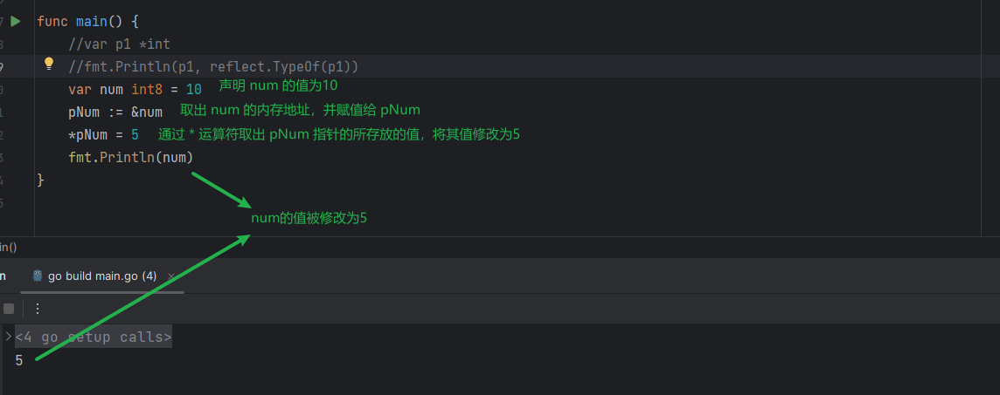


#### 作用

1. 通过指针传递变量的引用，可以在函数间共享变量，避免复制大型数据。

2. 在函数内部修改指针所指向的变量的值，可以实现对外部变量的修改。

   ```go
   func normalModify(x int) {
   	x = 200
   }
   
   func pointerModify(x *int) {
   	*x = 200
   }
   
   func main() {
   	var x = 50
   	normalModify(x)
   	fmt.Println("普通类型，函数内修改值", x)
   	pointerModify(&x)
   	fmt.Println("指针类型，函数内修改值", x)
   }
   ```

   <br />

   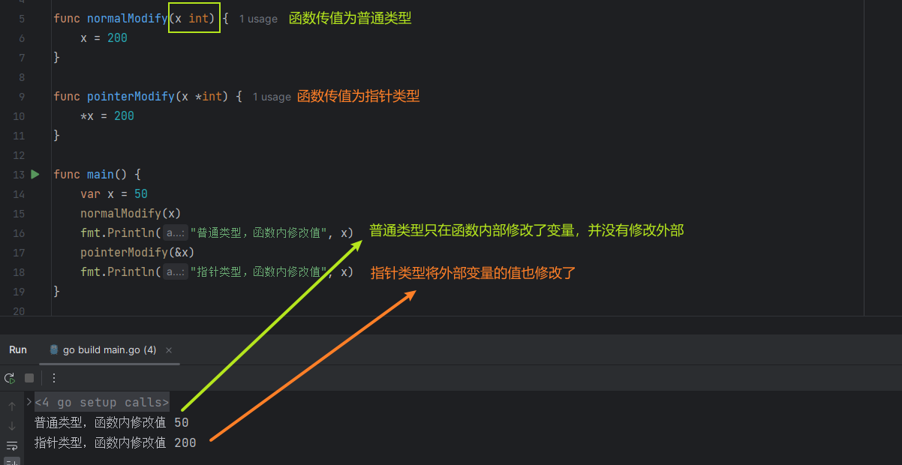

   

3. 动态分配内存，可以在运行时创建和管理数据结构。

   

注意：

1. 指针不能进行算术运算
2. 指针不能进行比较操作
3. Go语言中的引用类型（如切片、映射、通道）本质上是指针的封装，它们具有指针的特性，可以直接传递和操作，而不需要显式使用指针。


#### 总结


取地址操作符`&`和取值操作符`*`是一对互补操作符，`&`取出地址，`*`根据地址取出地址指向的值。


1. 对变量进行取地址（&）操作，可以获得这个变量的指针变量。
2. 指针变量的值是指针地址。
3. 对指针变量进行取值（*）操作，可以获得指针变量指向的原变量的值。


<br />

<br />

### 数组

#### 数组定义


在Go语言中，数组是一种`固定长度`且具有`相同数据类型`的数据结构。数组的长度在创建时就已经确定，并且不可改变。但是使用时可以修改数组成员。


Go语言中的数组声明的语法如下：


```go
var arrayName [length]Type
```


其中:

1. `arrayName `： 数组的名称
2. `length `： 数组的长度
3. `Type `： 数组元素的数据类型。


```go
var arr [5]int              // 声明一个长度为5的整数数组，初始值为0
arr := [3]string{"a", "b"}  // 声明一个长度为3的字符串数组，指定初始值
```

<br />


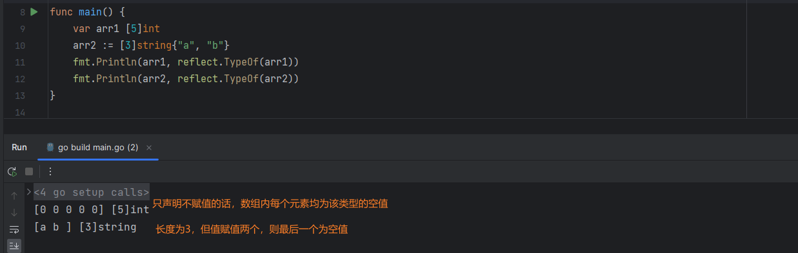


<br />

#### 数组的初始化方法

根据传入参数的不同，数组初始化有以下几种形式


1. 不使用初始值

   该形式必须传入数组长度

   ```go
   var testArray = [3]int // [0, 0, 0]
   ```

2. 使用部分初始值

   ```go
   var testArray = [3]int{1, 2}  // [1, 2, 0]
   ```

3. 使用全部初始值

   ```go
   var cityArray = [3]string{"北京", "上海", "深圳"}  // ["北京", "上海", "深圳"]
   ```

4. 可以使用 `...` 表示让编译器根据初始值的个数自行推断数组长度

   ```go
   var testArray = [...]int{1, 2}  // [1, 2]
   var cityArray = [...]string{"北京", "上海", "深圳"}  // ["北京", "上海", "深圳"]
   ```

5. 可以使用索引指定元素具体位置

   ```go
   var testArray = [4]int{1: 2, 2: 4}  // [0, 2, 4, 0]
   // 没有传入值的位置为空值 索引从0开始
   ```


<br />


#### 数组使用

##### 数组长度


可以使用内置函数` len() `获取数组的长度，如：

```go
func main() {
	var testArray = [...]int{1, 2}
	fmt.Println(len(testArray))  // 2
}
```


##### 数组取值

###### 取单个值

可以通过数组的索引直接拿到数组该索引对应的元素值

```go
func main() {
	var testArray = [...]int{1, 2, 4, 6, 8}
	value := testArray[3]  
	fmt.Println(value)  // 6
}
```


###### 取多个值

使用索引切片方法可以拿到子数组，得到的数据为切片类型

```go
func main() {
	var testArray = [...]int{1, 2, 4, 6, 8}
	value := testArray[2:]
	fmt.Println(value)  // [4 6 8] []int
}
```


###### 遍历数组

对数组 `var a = [4]int{0, 1, 2, 3}` 进行遍历有以下两种方法

- 使用`for`对数组的索引进行遍历，通过索引取值

  ```go
  for i := 0; i < len(a); i++ {
      fmt.Println(a[i])
  }
  ```

  

- 使用`for range`方法进行遍历可直接拿到数组的索引和值

  ```go
  for index, value := range a {
      fmt.Println(index, value)
  }
  ```

  

#### 多维数组


在 Go 语言中，多维数组是由多个一维数组组成的数据结构，可以理解为数组的数组。此处以二维数组为例：


创建：

```go
var matrix [3][3]int  // 声明一个 3x3 的二维整数数组

// 初始化二维数组
matrix = [3][3]int{
    {1, 2, 3},
    {4, 5, 6},
    {7, 8, 9},
}
```


取值


```go
value = matrix[2][2]  // 9
```


遍历

- for 方法

  ```go
  for i := 0; i < len(matrix); i++ {
      for j := 0; j < len(matrix[i]); j++ {
          fmt.Println(matrix[i][j])
      }
  }
  ```

  

- for range 方法

  ```go
  for _, key := range matrix {
      for _, value := range key {
          fmt.Println(value)
      }
  }
  ```

  

- 二者结合

  ```go
  for i := 0; i < len(matrix); i++ {
      for _, value := range matrix[i] {
          fmt.Println(value)
      }
  }
  ```


**注意：** 多维数组只有第一层（最外层）可以使用`...`来让编译器推导数组长度


<br />

<br />

### 切片

#### 切片定义


在 Go 语言中，切片（Slice）是一种动态长度的数据结构，它提供了方便的操作和灵活的扩展能力是，是对底层数组的一个引用。


它包含了以下三个重要的属性：

- 指针（Pointer）：指向底层数组的第一个元素。
- 长度（Length）：切片当前包含的元素个数。
- 容量（Capacity）：切片从第一个元素开始计算，到底层数组的最后一个元素的个数。


切片的创建方式有三种：

1. 切片或数组中切取
2. 声明语句声明
3. 通过`make`关键字创建


###### 声明方式定义


切片的声明语句为

```go
var slice = []Type{value1, value2, ...} // T 为元素类型
```

切片与数组在此种声明方式下唯一的不同在于，切片无长度参数，而数组必须填写长度参数（具体长度或 `...`）


例如：


```go
func main() {
	var ageArray = [...]int{1, 2, 3, 5, 6}  // 声明一个数组
	var ageSlice = []int{1, 2, 3, 5, 6}     // 声明一个切片
	fmt.Println(ageSlice, len(ageSlice), reflect.TypeOf(ageSlice))
	fmt.Println(ageArray, len(ageArray), reflect.TypeOf(ageArray))
}
```

<br />

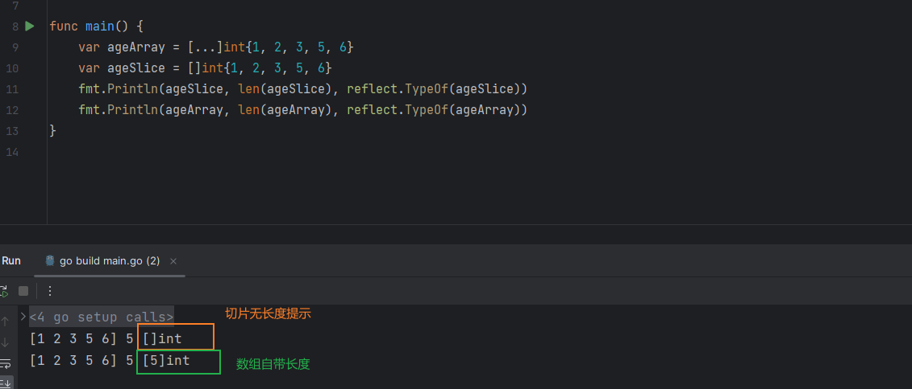


<br />


###### 从切片或数组中切取

```go
func main() {
	var ageArray = [...]int{1, 2, 3, 5, 6}
	var ageSlice = ageArray[2:]  // 从数组中切取
	var ageSlice2 = ageSlice[1:] // 从切片中切取
	fmt.Println(ageSlice)
	fmt.Println(ageSlice2)
}
```

<br />

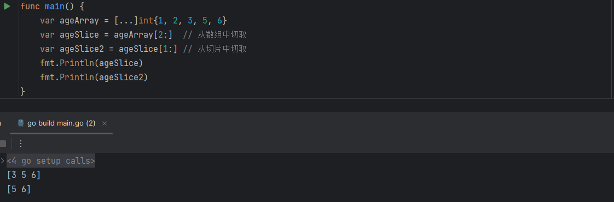


<br />


> 切片的索引总结如下：
>
> 
>
> 1. 左闭右开 [ )
> 2. 取出的元素数量为：结束位置 - 开始位置；
> 3. 取出元素不包含结束位置对应的索引，切片最后一个元素使用 `slice[len(slice)] `获取；
> 4. 当缺省开始位置时，表示从连续区域开头到结束位置；当缺省结束位置时，表示从开始位置到整个连续区域末尾；两者同时缺省时，与切片本身等效；


<br />

###### 使用 make 关键字构造

语法为：

```go
make([]T, size, cap)
```

其中：

- `T`： 切片的元素类型
- `size`： 切片中元素的数量
- `cap`： 切片的容量


例如：

```go
func main() {
	a := make([]int, 2, 10)
	fmt.Println(a)      // [0 0]， 初始化时传入长度为2,则只生成两个空元素
	fmt.Println(len(a)) // 2
	fmt.Println(cap(a)) // 10
}
```


#### 值类型和引用类型

值类型和引用类型是两种不同的数据类型分类方式，用于描述数据在赋值、传递和存储时的行为。

##### 值类型


Go 中的值类型包括`int`、`float`、`bool `、`rune`、`byte`、`string`、数组和结构体。


值类型数据直接存储其实际值在变量中，变量直接持有数据的副本。当将一个值类型的变量赋值给另一个变量时，会复制原始值，两个变量互不影响。


举个简单的例子：

```go
func main() {
	var a = 10
	var b = a
	a = 20
	fmt.Println(a, b)
}
```


<br />

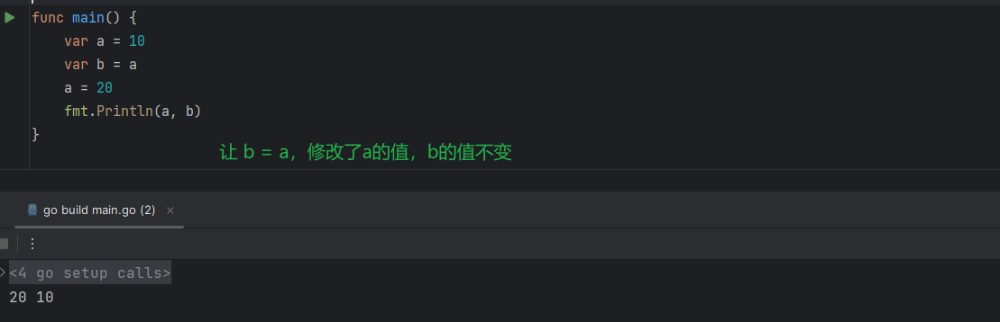

<br />


##### 引用类型

Go 中的引用类型包括`Slice`、`Map`、`Channel `、`Interface`


引用类型数据存储的是对数据的引用（内存地址），变量中存储的是数据的引用而不是实际数据本身。多个变量可以引用同一个数据，它们共享相同的数据。当一个引用类型的变量赋值给另一个变量时，两个变量都将引用同一个数据。引用类型在赋值和传递时是传递引用（内存地址），而不是进行值的拷贝。这意味着多个引用可以指向同一个数据，它们共享相同的底层数据。


举个简单的例子


```go
func main() {
	var a = []int{1, 2, 3, 4}
	var b = a
	a[2] = 10
	fmt.Println(a, b)
}
```

<br />

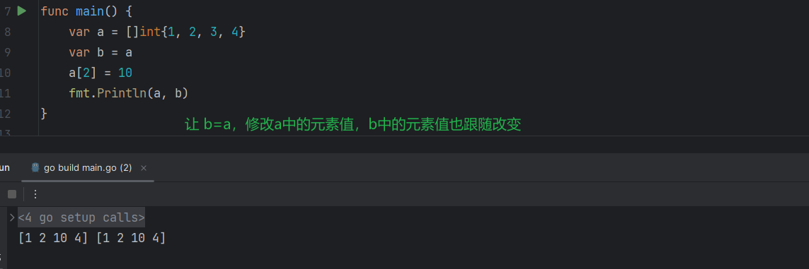


<br />


#### 切片的本质

通过寻找 Go 的源码可看到 切片的定义如下：


```go
type slice struct {
	array unsafe.Pointer
	len   int
	cap   int
}
```


<br />

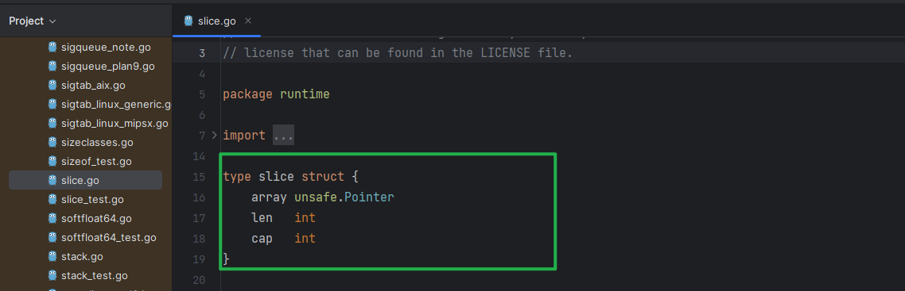

<br />


切片的本质是一个结构体，内含有底层数组的指针、长度及容量三个参数


#### make 关键字

在上文中我们讲到，切片定义的其中一种方法是用`make`函数去定义，在此详细讲解一下


在声明值类型的变量时， 所定义的变量所占内存的大小可以直接确认，系统会默认帮我们分配好内容空间；而对于引用类型来说，不仅仅需要声明该变量，还需要为该变量手动的申请一些内存空间，而`make`函数的作用就体现在这里


`make `函数的本质是分配内存并初始化指定类型的对象。具体来说，`make `函数会分配适当大小的内存空间，并进行相关类型的初始化，以确保对象可以正确地使用。


对于不同的引用类型，`make `函数的内部实现是不同的：

- 当创建切片时，`make `函数会分配一个连续的内存块来存储切片的元素，并初始化相关字段，如长度和容量等。
- 当创建映射时，`make `函数会分配一个哈希表，并初始化相关字段，如哈希表的大小等。
- 当创建通道时，`make `函数会分配相应的通道数据结构，并初始化相关字段，如缓冲区大小等。


需要注意的是，`make `函数只能用于创建引用类型的对象，而不能用于创建值类型的对象。对于值类型的对象，可以使用 new 函数来创建相应类型的指针。


<br />

#### 切片元素的增加删除

切片作为一个动态的数组，可以突破数组关于长度的限制，进行内部元素的增加与删除等操作

##### 1. 增加元素

在Go中，用内置函数 `append()` 为切片添加元素，可以一次性向切片中添加一个或多个元素，返回一个新的切片，语法为：

```go
targetSlice = append(originSlice, ......)
```


以下是几种常用方法


- 默认从末尾添加元素，可添加多个参数

  ```go
  func main() {
  	var age = []int{5, 6, 7}
  	age = append(age, []int{8, 9, 10}...)
      // 切片后跟 ... 代表将切片进行解包，等同于
      // age = append(age, 8, 9, 10)
  	fmt.Println(age)  // [5, 6, 7, 8, 9, 10]
  }
  ```

  

- 在切片开头添加元素

  ```go
  // 在切片开头添加元素，即用一个新的切片作为原切片，将现有切片 qppend 到其后面
  func main() {
  	var age = []int{5, 6, 7}
  	age = append([]int{1, 2, 3, 4}, age...)  // 同样为解包操作
  	fmt.Println(age)  // [1 2 3 4 5 6 7]
  }
  ```

  

- 在切片任意位置插入元素

  ```go
  // 在切片中间添加元素，即将所插入位置前半部分作为原切片，将要插入元素与另一部分append后，与前部分合并
  func main() {
  	var age = []int{1, 2, 7, 8}
  	age = append(age[:2], append([]int{3, 4, 5, 6}, age[2:]...)...)
  	fmt.Println(age)
  }
  ```

<br />

##### 2. 删除元素

Go语言中并没有删除切片元素的专用方法，我们可以使用切片本身的特性来删除元素。


###### 删除某一索引处的元素

从切片中删除元素，即将原切片该元素之前与该元素之后拼接，即`a = append(a[:index], a[index+1:]...)`如：

```go
func main() {
	var age = []int{1, 2, 4, 7, 8} // 删除掉第三个元素
	age = append(age[:2], age[3:]...) // 将第三个元素跳过
	fmt.Println(age) // [1 2 7 8]
}
```


<br />

###### 删除值为给定值的元素

1. 重新使用一个 slice，将要删除的元素过滤掉。

   ```go
   func main() {
   	infoSlice := []string{"name", "age", "key", "value", "sex", "xx"}
   	var ret []string
   	value := "list"
   	for s, v := range infoSlice {
   		fmt.Println(s, v)
   		if v != value {
   			ret = append(ret, v)
   		}
   	}
   	fmt.Println(ret)
   }
   ```

   

2. 利用对 slice 的截取删除指定元素。

   ```go
   func main() {
   	infoSlice := []string{"name", "age", "key", "value", "sex", "xx"}
   	value := "list"
   	for i := 0; i < len(infoSlice); i++ {
           // 检测到匹配就删除掉这个值
   		if infoSlice[i] == value {
   			infoSlice = append(infoSlice[:i], infoSlice[i+1:]...)
   		}
   	}
   	fmt.Println(infoSlice)
   }
   ```

<br />

#### 切片排序

可以通过 `sort` 包中的方法对切片中的元素进行排序， 如：

```go
func main() {
    // 对整型数据进行排序
	intSlice := []int{19, 21, 1, 12, 24, 55, 27}
	sort.Ints(intSlice)
	fmt.Println(intSlice)
	
    // 对浮点型数据进行排序
	floatSlice := []float64{12.98, 3.14, 6.18, 32.14, 6.2}
	sort.Float64s(floatSlice)
	fmt.Println(floatSlice)
	
    // 对字符串数据进行排序
	strSlice := []string{"name", "age", "key", "value", "sex", "xx"}
	sort.Strings(strSlice)
	fmt.Println(strSlice)
}
```


以下简要对 `sort` 包中常用的方法及其用途进行简要说明：

| 方法                  | 说明                                                         |
| --------------------- | ------------------------------------------------------------ |
| `Sort`                | 对实现了 `sort.Interface` 接口的集合进行排序                 |
| `Stable`              | 对实现了 `sort.Interface` 接口的集合进行稳定排序             |
| `Reverse`             | 反转实现了 `sort.Interface` 接口的集合                       |
| `IsSorted`            | 检查实现了 `sort.Interface` 接口的集合是否已经排序           |
| `Search`              | 在有序集合中查找指定元素的索引值                             |
| `SearchInts`          | 在已排序的整数切片中查找指定值的索引值                       |
| `SearchFloat64s`      | 在已排序的浮点数切片中查找指定值的索引值                     |
| `SearchStrings`       | 在已排序的字符串切片中查找指定值的索引值                     |
| `Slice`               | 对切片进行排序，使用自定义的比较函数                         |
| `SliceStable`         | 对切片进行稳定排序，使用自定义的比较函数                     |
| `SliceIsSorted`       | 检查切片是否已经排序，使用自定义的比较函数                   |
| `SliceSearch`         | 在有序切片中查找指定元素的索引值，使用自定义的比较函数       |
| `SliceSearchInts`     | 在已排序的整数切片中查找指定值的索引值，使用自定义的比较函数 |
| `SliceSearchFloat64s` | 在已排序的浮点数切片中查找指定值的索引值，使用自定义的比较函数 |
| `SliceSearchStrings`  | 在已排序的字符串切片中查找指定值的索引值，使用自定义的比较函数 |


这些方法提供了丰富的排序和搜索功能，可以根据具体的需求选择适合的方法进行使用。


<br />

#### 切片拷贝

由于切片是引用类型，在进行切片的赋值时，如果使用 `b = a` 的方式去将`a`的值赋值给 `b`的话，会导致二者共同指向同一块内存地址，修改任一变量的值都会影响到另一变量。


为解决这种问题，Go语言中提供了 `copy()` 函数，用于将原切片的数据提取，转移到另一块内存空间，从而生成一个值相同的另一个切片


`copy()` 函数的使用格式为：


```go
copy(destSlice, srcSlice []T) int
```

其中：

1. `destSlice `： 目标切片

2. `srcSlice `： 源切片，

3. `T `： 切片元素的类型。

   

`copy()` 函数将源切片中的元素复制到目标切片中，并返回实际复制的元素个数。


**注意：**

使用 `copy() `函数进行切片拷贝时，目标切片必须具有足够的容量来存储源切片的元素，否则只会拷贝目标切片可容纳的元素个数。

如果目标切片的长度小于源切片的长度，只会拷贝目标切片长度范围内的元素，超出部分将被截断。


<br />

#### 切片的扩容原理


<br />

### map


#### map 定义


在 Go 语言中，map 是一种无序的键值对集合，也被称为哈希表或字典。它的声明语法如下：


```go
var mapName map[keyType]valueType
```

其中： 

1. `mapName `： map 变量名称
2. `keyType `： 键的类型
3. `valueType `： 值的类型。


**注意**： 

1. 键必须是支持相等比较操作的类型，例如整数、字符串、浮点数、指针、结构体等。

2. 值可以是任意类型，包括内置类型和自定义类型。


也可以使用 `make` 关键字进行 `map`的声明与初始化：

```go
mapName := make(map[keyType]valueType)
```

例如：

```go
func main() {
	sexMap := make(map[string]string)
	sexMap["Coco"] = "male"
	fmt.Println(reflect.TypeOf(sexMap), sexMap)  
    // map[string]string map[Coco:male]
}
```


#### map 的初始化方法

由于map是引用类型，因此其声明后必须要分配内存空间才可以继续初始化

例如：

```go
func main() {
	var ageMap map[string]int
	ageMap["Coco"] = 24
	fmt.Println(reflect.TypeOf(ageMap), ageMap)
}
```

这样不分配内存空间就赋值是不正确的做法，会报错：

```go
panic: assignment to entry in nil map
```

引用类型的变量未初始化时默认的零值是`nil`。直接向``nil map `写入键值数据会导致运行时错误


正确的做法为：声明之后为其用`make` 关键字进行初始化：

```go
var ageMap map[string]int
ageMap = make(map[string]int)
```

这样才能继续对其进行赋值操作


可以在创建时直接进行赋值操作：

```go
func main() {
	ageMap := map[string]int{"Coco": 24}
	fmt.Println(reflect.TypeOf(ageMap), ageMap)
}
```

#### map 的增删改查

1. 增加元素

   增加的语法为：

   ```go
   mapName[Key] = Value
   ```

   当Key不存在于map中时，可使用此语法为map增加键值

   

2. 删除元素

   可以通过内置函数 `delete()` 删除 `map` 的键值对

   ```go
   func main() {
   	infoMap := map[string]string{"name": "Coco", "age": "24"}
   	delete(infoMap, "name")
   	for key, value := range infoMap {
   		fmt.Println(key, value)
   	}
   }
   // age 24
   ```

   

   清空`map`， 最快的方法时直接赋值为一个空`map`

   ```go
   func main() {
   	infoMap := map[string]string{"name": "Coco", "age": "24"}
   	infoMap = map[string]string{}
   	for key, value := range infoMap {
   		fmt.Println(key, value)
   	}
   }
   ```

   

   

3. 修改元素

   修改的语法为：

   ```go
   mapName[Key] = Value
   ```

   当`Key`存在于`map`中时，可使用此语法为`map`增加键值

   

4. 查找元素

   - 查找单个元素：通过 `Key` 值访问

     ```go
     func main() {
     	infoMap := map[string]string{"name": "Coco", "age": "24"}
     	name := infoMap["name"]
     	fmt.Println(name)  // Coco
     }
     ```

     

     当要查找的 `Key` 值在 `map` 中不存在时，不会报错，但会返回该类型的空值，我们可以通过取值的返回值判断该键是否存在

     ```go
     func main() {
     	infoMap := map[string]string{"name": "Coco", "age": "24"}
     	name, isExist := infoMap["gender"]
     	fmt.Println(name, isExist)  // 空 false
     }
     ```

     

   - map的遍历

     可以直接使用 `for range` 语法对 `map` 进行遍历

     ```go
     func main() {
     	infoMap := map[string]string{"name": "Coco", "age": "24"}
     	for key, value := range infoMap {
     		fmt.Println(key, value)
     	}
     }
     // name Coco
     // age 24
     ```

     > 由于 `map` 是无序的，故每次遍历出的顺序不一定相同

#### map 的扩展用法

```go
func main() {
	// 以切片为值的 map
	regionMap := map[string][]string{"北京市": []string{"海淀区", "昌平区"}, "山东省": []string{"烟台市", "济南市"}}
	fmt.Println(regionMap)
    // map[北京市:[海淀区 昌平区] 山东省:[烟台市 济南市]]


    
	// 以 map 为值的切片
	regionSlice := []map[string][]string{{"北京市": []string{"海淀区", "昌平区"}}, {"山东省": []string{"烟台市", "济南市"}}}
	fmt.Println(regionSlice)
    // [map[北京市:[海淀区 昌平区]] map[山东省:[烟台市 济南市]]]
    
    
	// 以 map 为值的 map
	stuInfoMap := map[int]map[string]string{1001: {"name": "Coco", "age": "24"}, 1002: {"name": "Vicky", "age": "24"}}
	fmt.Println(stuInfoMap)
    // map[1001:map[age:24 name:Coco] 1002:map[age:24 name:Vicky]]
}
```


#### map 的容量


和数组不同，map 可以根据新增的 key-value 动态的伸缩，因此它不存在固定长度或者最大限制，但是也可以选择标明 map 的初始容量 capacity，格式如下：

```go
make(map[keytype]valuetype, cap)
```

例如：

```go
m := make(map[string]float, 100)
```

当 map 增长到容量上限的时候，如果再增加新的 key-value，map 的大小会自动加 1，所以出于性能的考虑，对于大的 map 或者会快速扩张的 map，即使只是大概知道容量，也最好先标明。


<br />

<br />


## 流程控制

### 选择

选择语句用于根据不同的条件`选择`执行不同的代码块。


Go 语言提供了两种选择语句：`if-else` 和 `switch`。


#### if-else

语法如下：

```go
if condition1 {
    // 如果条件1为真，则执行这里的代码
} else if condition2 {
    // 如果条件2为真，则执行这里的代码
} else {
    // 如果以上条件都不满足，则执行这里的代码
}
```


**注意：**

1. `else if` 可以有多个，同一次选择中 只能有一个 `if  `一个 `else`
2. 关键字 `if` 和 `else `之后的左大括号`{`必须和关键字在同一行
3. `condition` 处的括号可以省略


例如：

```go
// 单分支
func main() {
	score := 60
	if score >= 60 {
		fmt.Println("你及格了")
	}
}

// 二分支
func main() {
	score := 60
	if score >= 60 {
		fmt.Println("你及格了")
	} else {
		fmt.Println("你没有及格")
	}
}

// 多分支
func main() {
	score := 60
	if score >= 85 {
		fmt.Println("你的成绩是优秀")
	} else if score >= 60 {
		fmt.Println("你的成绩合格了")
	} else {
		fmt.Println("你没有及格")
	}
}
```


#### switch

`switch` 语句用于根据不同的条件执行不同的代码块。与 `if-else` 不同的是，`switch` 可以针对多个条件进行匹配，并根据匹配结果执行相应的代码块。语法如下：


```go
switch expression {
case value1:
    // 如果 expression 的值等于 value1，则执行这里的代码
case value2:
    // 如果 expression 的值等于 value2，则执行这里的代码
default:
    // 如果 expression 的值与上述值都不匹配，则执行这里的代码
}
```


`switch` 语句中的 `expression` 是需要进行匹配的表达式，`case` 后面的值与 `expression` 进行比较，如果匹配成功，则执行相应的代码块。可以使用多个 `case` 来匹配不同的值，如果没有匹配的值，则执行 `default` 块中的代码。


例如：

```go
func main() {
	grade := "B"
	switch grade {
	case "A":
		fmt.Println("优秀")
	case "B":
		fmt.Println("良好")
	case "C":
		fmt.Println("及格")
	default:
		fmt.Println("不及格")
	}
}
```


<br />

<br />

### 循环


在 Go 语言中，循环的方式只有 `for` 循环一种，但 `for` 循环的几种形式已经可以满足所有的循环需求


`for` 循环在 Go 中有以下几种形式：


- 基本的 `for` 循环：

  ```go
  for 初始化语句; 条件表达式; 后置语句 {
      // 循环体
  }
  ```

  例如：

  ```go
  for i := 0; i < 5; i++ {
      fmt.Println(i)
  }
  ```

  

- 省略初始化语句的 `for` 循环：

  ```go
  for ; 条件表达式; 后置语句 {
      // 循环体
  }
  ```

  例如：

  ```go
  i := 0  // 提前声明一个初始值
  for ; i < 5; i++ {
      fmt.Println(i)
  }
  ```

  

- 省略初始化语句和后置语句的 `for` 循环：

  ```go
  for 条件表达式 {
      // 循环体
  }
  ```

  例如：

  ```go
  i := 0
  for i < 5 {
      fmt.Println(i)
      i++  // 把条件的变化放到循环体内
  }
  ```

  

- 无限循环的 `for` 循环：

  ```go
  for true {
      // 循环体
  }
  ```

  例如：

  ```go
  i := 0
  for true {
      fmt.Println(i)
      i++
      if i == 5 {
          break  // 中断标准设计在循环体内
      }
  }
  ```

  


**注意：**

1. 与多数语言不同的是，Go语言中的循环语句只支持 for 关键字，而不支持 while 和 do-while 结构
2. `for` 后面的条件表达式不需要用圆括号`()`括起来
3. 左花括号`{`必须与 for 处于同一行。
4. 无限循环的场景 `for true {}`，可以简写 `for {}`

<br />

### 跳转

Go 语言中有四种方法实现程序的跳转功能，分别是：


#### break 

`break`：用于跳出当前循环或 `switch` 语句。


例如：

```go
for i := 0; i < 10; i++ {
    if i == 5 {
        break
    }
    fmt.Println(i)
}
```


#### continue

`continue`：用于跳过当前循环的剩余代码，进入下一次循环迭代。


例如：

```go
for i := 0; i < 10; i++ {
    if i%2 == 0 {
        continue
    }
    fmt.Println(i)
}
```


#### goto

`goto`：用于无条件跳转到程序中指定的标签。


例如：

```go
for i := 0; i < 10; i++ {
    if i == 5 {
        goto myLabel  // i=5 时 直接跳转到 myLabel 所在行下一行执行
    }
    fmt.Println(i)
}
myLabel:
fmt.Println("Jumped to myLabel")
```


#### fallthrough

`fallthrough`：用于在 `switch` 语句中继续执行下一个 `case` 分支的代码，而不论下一个分支的条件是否匹配。


例如：

```go
switch num := 3; num {
    case 1:
        fmt.Println("Case 1")
    case 2:
        fmt.Println("Case 2")
    case 3:
        fmt.Println("Case 3")
    	fallthrough
    default:
        fmt.Println("Default case")
}

// Case 3
// Default case
```

<br />

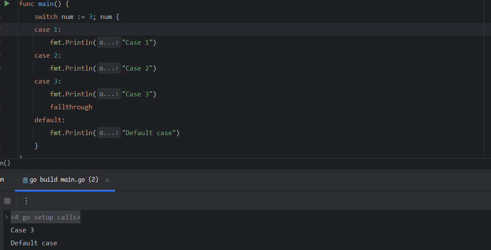


> 在大多数情况下，应该避免滥用跳转语句，以保持代码的可读性和可维护性。


<br />

<br />


## 函数

### 函数定义

函数是 Go 语言中的基本构建块，用于封装可重用的代码块。函数提供了代码的模块化、组织和重用性，使代码更加可读、可维护和可扩展。


在 Go 语言中，函数的定义使用关键字 `func`，其语法如下：

```go
func functionName(parameter1 type1, parameter2 type2, ...) returnType {
    // 函数体
    // 可以包含一系列语句和逻辑
    return value
}
```


其中：

- `functionName`：函数的名称，按照 Go 语言的命名规范进行命名。
- `parameter1 type1 , parameter2 type2, ...`：函数的参数列表，每个参数都包含参数名称和参数类型。
- `returnType`：函数的返回值类型，可以是单个类型或多个类型。
- `return value`：函数的返回值，可以有多个返回值，如果没有返回值，则可以省略。


以下所讲的所有函数均为此语法的变形。


<br />

<br />


### 函数参数

在 Go 语言中，函数参数是函数定义中用于接收外部传入值的变量。函数参数有以下几种类型


#### 形式参数（位置参数）


位置参数指的是必须按照正确的顺序将实际参数传到函数中，换句话说，调用函数时传入实际参数的数量和位置都必须和定义函数时保持一致。

#### 不定参数（可变参数）


可变参数是指函数可以接受任意数量的参数。在 Go 语言中，使用 `...` 语法表示可变参数，它会被作为一个切片传递给函数。


例如：


```go
// 根据传入不同数量的数据计算所有数据的和
func sum(numbers ...int) int {
    total := 0
    for _, num := range numbers {
        total += num
    }
    return total
}
```

<br />

在上面的例子中，sum 函数的参数 numbers 是可变参数，类型为 []int 切片。函数调用时可以传入任意数量的整数参数，例如 `sum(1, 2, 3)`。


**注意：**

可变参数一般为参数列表的最后一项

#### 指针参数

指针参数是指函数接受指针类型的参数。通过传递指针，函数可以修改指针指向的变量的值。


例如：


```go
func double(num *int) {
	*num *= 2
}

func main() {
	a := 10
	var pNum = &a
	double(pNum)
	fmt.Println(*pNum)  // 20
}
```


#### 函数参数传递方式

Go 语言中的函数参数传递方式有`值传递`和`引用传递`两种方式。


##### 值传递

在函数调用时，将实际参数的值 **复制** 一份给对应的形式参数。函数内部对形式参数的修改不会影响原始参数的值。

##### 引用传递

在函数调用时，将实际参数的 **地址** 传递给对应的形式参数。函数内部通过指针访问原始参数，并且可以修改原始参数的值。


Go 语言中的大部分类型（如基本类型和结构体）都是以值传递的方式进行函数参数传递。如果需要修改传入的参数值，可以使用指针参数。


总结起来，函数参数用于接收函数调用时传入的值，可以是普通参数、可变参数或指针参数。函数参数可以根据需求进行定义，通过参数传递方式可以控制是否修改原始参数的值


<br />

<br />


### 函数的返回值


函数的返回值是指函数被调用之后，执行函数体中的代码所得到的结果，这个结果通过 **`return`** 语句返回。**`return`** 语句将被调函数中的一个确定的值带回到主调函数中，供主调函数使用。函数的返回值类型是在定义函数时指定的。return 语句中表达式的类型应与定义函数时指定的返回值类型必须一致。


函数的返回值通过指定函数声明中参数声明与 `{` 括号中间的部分进行定义


例如

```go
func 函数名(形参 形参类型) (返回值类型) {
    //  函数体
    return 返回值
}
// 包裹返回值的括号可加可不加
```


 

函数的返回值有几种不同的形式：


#### 单返回值

例如：

```go
func add(a, b int) int {
    return a + b
}
```


#### 无返回值

有时函数不需要返回任何值，可以使用空返回值。


例如：

```go
// 该函数无参数，也无返回值
func printHello() {
    fmt.Println("Hello")
}
```


#### 多返回值

函数也可以返回多个值，用逗号分隔


例如：

```go
func swap(a, b string) (string, string) {
    return b, a
}
```


#### 命名返回值

在函数定义时，可以为返回值指定名称，称为命名返回值。命名返回值在函数体内可以直接使用，并在函数结束时自动返回。


例如：

```go
func divide(a, b float64) (quotient, remainder float64) {
    quotient = a / b
    remainder = a % b
    return  // return 时自动返回函数定义时声明的变量
}
```


<br />

<br />

### 函数声明


在 Go 语言中，根据参数和返回值的不同，函数的声明可以有多种形式


1. 单参数

   ```go
   func greet(name string) {
       fmt.Println("Hello, " + name + "!")
   }
   
   greet("Alice")
   ```

   

2. 多参数

   ```go
   func add(a, b int) int {
       return a + b
   }
   
   result := add(3, 4)
   fmt.Println(result)
   ```

   

3. 多参数、多返回值的简写形式

   ```go
   // 函数定义时，多种类型相同的变量可以简写，只声明一次变量类型
   func divideAndRemainder(dividend, divisor int) (quotient, remainder int) {
       quotient = dividend / divisor
       remainder = dividend % divisor
       return // 使用简写的返回语句
   }
   
   q, r := divideAndRemainder(10, 3)
   fmt.Println("Quotient:", q)
   fmt.Println("Remainder:", r)
   ```

   

4. 函数作为参数

   ```go
   func applyOperation(a, b int, operation func(int, int) int) int {
       return operation(a, b)
   }
   
   func add(a, b int) int {
       return a + b
   }
   
   result := applyOperation(3, 4, add)
   fmt.Println(result)
   ```

   

5. 函数作为返回值

   ```go
   func getOperation(operationType string) func(int, int) int {
       if operationType == "add" {
           return func(a, b int) int {
               return a + b
           }
       } else if operationType == "subtract" {
           return func(a, b int) int {
               return a - b
           }
       }
       return nil
   }
   
   operation := getOperation("add")
   result := operation(3, 4)
   fmt.Println(result)
   ```

   

<br />

### 匿名函数

在 Go 语言中，匿名函数是一种没有函数名的函数。它可以在代码中直接定义和使用，不需要提前声明或定义一个函数名称。

匿名函数可以在函数内部或函数外部定义，使用较方便。


#### 匿名函数的声明

匿名函数可以使用 `func` 关键字定义，并可以直接赋值给变量，或者作为参数传递给其他函数。

```go
// 定义并赋值给变量  add 表示一个匿名函数
add := func(a, b int) int {
    return a + b
}

// 作为参数传递给函数
func calculate(op func(int, int) int) {
    result := op(3, 4)
    fmt.Println(result)
}
```

#### 闭包性质

匿名函数可以访问其外部作用域中的变量。这种行为称为闭包，因为匿名函数包含了自身定义位置外部的变量引用。


```go
func makeIncrementer() func() int {  // makeIncrementer 函数不是匿名函数
    count := 0
    return func() int {
        count++  // count 为匿名函数的外部变量
        return count
    }
}

func main() {
    increment := makeIncrementer()
    fmt.Println(increment()) // 输出 1
    fmt.Println(increment()) // 输出 2
}
```


匿名函数常用于以下场景：

1. 在需要定义一个函数但不需要重复使用的情况下，可以直接定义匿名函数。
2. 在函数内部定义一个函数，形成闭包，用于访问外部函数的变量。
3. 作为回调函数或参数传递给其他函数，实现更灵活的编程。
4. 使用匿名函数可以简化代码结构，提高代码的可读性和可维护性。它是 Go 语言中常用的一种函数编程方式。


<br />

<br />

### 延迟调用

在Go语言中，延迟调用 `Deferred Call` 是一种特殊的函数调用形式，它可以在函数执行完毕之前或发生错误时执行一段代码块。


延迟调用通常用于在函数结束时执行一些清理操作，例如关闭文件、释放资源等。


延迟调用使用关键字 `defer `加上需要执行的函数或方法来定义。延迟调用的函数参数会在声明时就被确定，并且函数调用的参数值会被保存起来，直到函数执行完毕时才会被实际调用。


例如：


```go
func main() {
    fmt.Println("test01") // 先执行
	defer fmt.Println("test02")  // 遇到 defer 函数退出前再最后执行
	fmt.Println("test03") // 第二个执行
}
```

<br />

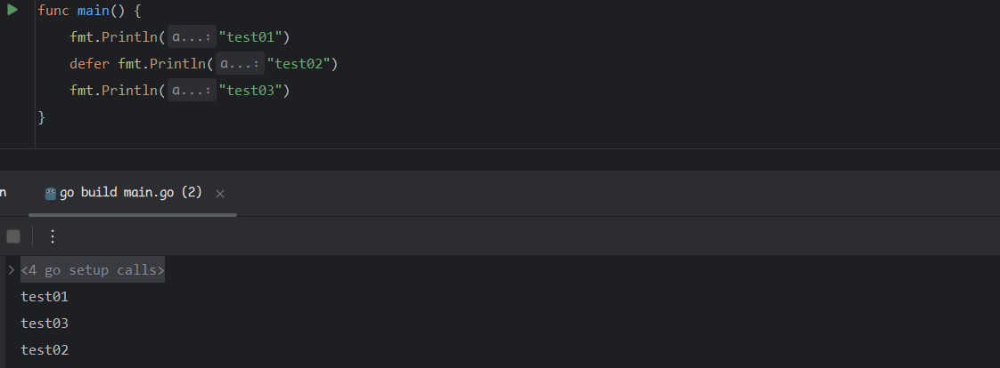


<br />

下面举几个延迟调用的例子：


1. 关闭文件

   ```go
   func readFile() {
       file, err := os.Open("file.txt")
       if err != nil {
           fmt.Println("Failed to open file:", err)
           return
       }
       defer file.Close() // 在函数返回之前关闭文件
       // 读取文件内容
   }
   ```

   

2. 记录函数执行时间

   ```go
   func measureTime() {
       start := time.Now()
       defer func() {
           duration := time.Since(start)
           fmt.Println("Time taken:", duration)
       }()
       // 执行代码
   }
   ```

   

**注意：**

1. 延迟调用的执行顺序与声明顺序相反，即**最后声明的延迟调用最先执行**。多个延迟调用之间按照后进先出（LIFO）的顺序执行。**越往后`defer`，越先执行**
2. 延迟调用发生在任何退出函数操作之前。无论是通过 return 语句正常返回还是发生了恐慌（panic），都会执行延迟调用。


<br />

<br />

### 异常处理

在Go语言中，异常处理使用的是错误处理机制而不是传统的异常机制。Go鼓励开发者使用显式的错误处理方式来处理可能发生的错误，而不是依赖于异常来处理异常情况。


在Go中，错误是通过 `返回值` 来表示的。函数通常会返回一个额外的错误值，用于指示函数执行过程中是否发生了错误。开发者需要检查返回的错误值，并根据需要采取适当的处理措施。


以下是Go语言中的异常处理的几个关键点：

1. 错误类型：Go使用内置的 `error` 类型来表示错误。通常情况下，函数会返回一个 `error` 作为其最后一个返回值。如果没有发生错误，则该值为 `nil`。

2. 错误检查：开发者需要在调用函数后检查返回的错误值。可以使用if语句或者:=简写来进行错误检查。

   ```go
   result, err := someFunction()
   if err != nil {
       // 处理错误
   }
   ```

3. 错误处理：对于发生的错误，可以根据实际情况采取适当的处理措施，例如记录日志、返回错误信息、重试操作等。

4. 自定义错误：开发者可以自定义错误类型，以便更好地描述特定的错误情况。自定义错误类型需要实现error接口中的Error()方法。

   ```go
   type MyError struct {
       message string
   }
   
   func (e *MyError) Error() string {
       return e.message
   }
   ```

5. `Panic` 和 `Recover`：Go语言中也提供了`panic`和`recover`机制来处理特定的异常情况。`panic`用于引发恐慌，而`recover`用于恢复恐慌并进行错误处理。然而，这种机制通常用于处理不可恢复的错误，而不是一般的错误处理。

   ```go
   func someFunction() {
       defer func() {
           if r := recover(); r != nil {
               // 恢复恐慌并进行错误处理
           }
       }()
       // 发生恐慌
       panic("Something went wrong")
   }
   ```

<br />

<br />


## 结构体


Go语言中存在多种基本数据类型，这些数据类型只能很局限的用来描述简单的事物。如描述姓名的字符串，描述年龄的整数类型，描述是否已婚的布尔类型等，但当需要用来描述一个人的所有特征时，简单的数据类型就力不从心了。


接下来我们介绍的结构体是一种自定义的复合数据类型，用于存储和组织一组相关的数据字段。结构体可以包含不同类型的字段，这使得它非常适合表示实际问题中的实体对象。


### 结构体的定义

结构体的定义使用 `type `关键字，后面跟着结构体的名称和字段列表。每个字段都有一个名称和类型。例如：

```go
type Person struct {
	Name      string
	Age       int
	isMarried bool
}

// 相同类型的字段可以写在同一行
type Person struct {
	Name, City string
	Age        int
	isMarried  bool
}
```

上述代码定义了一个名为`Person`的结构体，它有三个字段：`Name`、`Age`和`isMarried`，分别对应字符串、整数和布尔类型。


可以使用字面量初始化一个结构体，例如：

```go
p := Person{
    Name: "Alice",
    Age:  30,
    City: "New York",
}
```


可以通过 `.` 操作符进行结构体内部变量的访问和修改，例如：

```go
type Person struct {
	Name      string
	Age       int
	isMarried bool
}

func main() {
	var p Person
	p.Name = "Coco"
	p.Age = 24
	p.isMarried = false
	fmt.Println(p.Name, p.Age, p.isMarried)  // Coco 24 false
}
```


### 匿名结构体

当我们需要临时存储一些临时数据或者在函数中定义一些临时的数据结构时，可以使用匿名结构体。


例如：


```go
func main() {
	person := struct {
		Name string
		Age  int
	}{
		Name: "Coco",
		Age:  24,
	}
	fmt.Println(person.Name) // 输出: Coco
	fmt.Println(person.Age)  // 输出: 24
}
```

上述例子中，并没有将结构体进行单独的定义，而是在使用时直接用声明语法定义了一个结构体，并进行了初始化赋值操作


通过匿名结构体，我们可以快速创建临时的数据结构，而无需提前定义结构体类型。


### 结构体字段的私有性

在Go语言中，结构体内字段的大小写有着特定的含义。


1. 大写字母开头的字段：如果结构体字段以大写字母开头，表示该字段是导出的（Exported），可以被外部包访问和使用。这些字段在包外部是可见的，可以直接访问和修改。

   ```go
   type Person struct {
       Name string // 可以被外部包访问
       age  int    // 只能在当前包内访问
   }
   ```

   

2. 小写字母开头的字段：如果结构体字段以小写字母开头，表示该字段是未导出的（Unexported），只能在当前包内部访问和使用。这些字段对于外部包来说是不可见的，无法直接访问和修改。

   ```go
   type Person struct {
       name string // 只能在当前包内访问
       Age  int    // 可以被外部包访问
   }
   ```

   


### 结构体的匿名字段

结构体的匿名字段是指在定义结构体时，字段名字为空，只指定字段的类型。这样定义的字段称为匿名字段。


```go
type Person struct {
    string // 匿名字段，类型为 string
    int    // 匿名字段，类型为 int
}

func main() {
    p := Person{"John Doe", 25}
    fmt.Println(p.string) // 可以直接访问匿名字段的值
    fmt.Println(p.int)
}
```


> 使用匿名字段的主要原因是为了提升代码的简洁性和可读性，并在一定程度上实现代码的复用。
>
> 
>
> 以下是使用匿名字段的几个优点：
>
> 1. 简洁性：匿名字段可以省略字段名，减少代码量，使结构体定义更加简洁。
>
> 2. 直接访问：通过匿名字段，可以直接访问嵌入类型的字段或方法，而无需使用额外的层级访问。
>
> 3. 继承特性：通过嵌入结构体，可以继承其字段和方法，使得代码复用更加方便。
>
> 4. 隐藏细节：当结构体嵌入的类型发生变化时，对外部调用者来说，只需要关心结构体提供的字段和方法，而不需要关心内部实现的变化。
> 5. 接口实现：通过匿名字段实现接口时，嵌入的类型自动继承了接口的方法，从而实现了接口的隐式实现。
>
> 
>
> 总之，使用匿名字段可以提高代码的可读性和简洁性，同时允许在结构体中嵌入其他类型并利用其特性，从而实现代码的复用和灵活性。


### 结构体的嵌套


结构体嵌套是指在一个结构体中嵌套另一个结构体作为其字段的过程。这种嵌套关系可以形成复杂的数据结构，使得程序可以更好地组织和管理相关数据。


```go
package main

import "fmt"

type Address struct {
	City  string
	State string
}

type Person struct {
	Name    string
	Age     int
	Address Address
}

func main() {
	address := Address{
		City:  "New York",
		State: "NY",
	}

	person := Person{
		Name:    "John",
		Age:     30,
		Address: address,
	}

	fmt.Println(person.Name)
	fmt.Println(person.Age)
	fmt.Println(person.Address.City)
	fmt.Println(person.Address.State)
}
```


>结构体嵌套可以带来以下几个优势：
>
>1. 组合复用：通过嵌套结构体，可以将多个相关的数据字段组合在一起，形成更复杂的数据结构。这样可以提高代码的可读性和可维护性，同时实现了数据的复用。
>
>   ```go
>   type Engine struct {
>       Model string
>       Horsepower int
>   }
>   
>   type Car struct {
>       Brand string
>       Year int
>       Engine Engine
>   }
>   
>   func main() {
>       engine := Engine{Model: "V8", Horsepower: 500}
>       car := Car{Brand: "Ferrari", Year: 2022, Engine: engine}
>   
>       fmt.Println(car.Brand)                // 输出: Ferrari
>       fmt.Println(car.Engine.Model)         // 输出: V8
>       fmt.Println(car.Engine.Horsepower)    // 输出: 500
>   }
>   
>   ```
>
>   
>
>2. 命名空间：结构体嵌套可以创建命名空间，避免命名冲突。通过嵌套结构体，可以在不同的层次上使用相同的字段名，而不会发生冲突。
>
>   ```go
>   type Person struct {
>       Name string  // 定义了 Name 属性
>       Age int
>   }
>   
>   type Company struct {
>       Name string  // 也定义了 Name 属性
>       Address string
>   }
>   
>   func main() {
>       person := Person{Name: "Alice", Age: 25}
>       company := Company{Name: "ABC Company", Address: "123 Main St"}
>   
>       fmt.Println(person.Name)     // 输出: Alice
>       fmt.Println(company.Name)    // 输出: ABC Company
>   }
>   
>   ```
>
>   
>
>3. 封装性：嵌套结构体可以实现数据的封装性。通过将某些结构体作为私有字段嵌套在公有结构体中，可以限制对其内部结构的访问，只暴露必要的字段和方法。


### 结构体传值

结构体可以作为函数的参数和返回值。它们通过 **值传递** 给函数，因此在函数内部对结构体的修改不会影响原始结构体。如果希望在函数中修改原始结构体，可以使用指针传递。


```go
func modifyPerson(p Person) {
    p.Name = "Bob" // 函数对结构体内的元素进行更改
    p.Age = 25
    p.City = "London"
}

func modifyPersonByPointer(p *Person) {  // 函数通过指针找到内存中真正的结构体值
    p.Name = "Bob"
    p.Age = 25  // 函数对结构体内的元素进行更改
    p.City = "London"
}

func main() {
    p := Person{
        Name: "Alice",
        Age:  30,
        City: "New York",
    }

    modifyPerson(p)  // 将结构体作为参数传递给修改的函数
    fmt.Println(p.Name, p.Age, p.City) // 输出: Alice 30 New York  没有修改成功
 
    modifyPersonByPointer(&p)  // 将结构体地址进行传递
    fmt.Println(p.Name, p.Age, p.City) // 输出: Bob 25 London  修改成功
}
```


### 结构体方法

Go语言中的结构体方法是与结构体关联的函数。它们可以在结构体上定义，用于为结构体添加行为和功能。结构体方法允许我们对结构体进行操作和访问其字段。


方法的定义语法如下：


```go
func (s StructType) methodName(parameters) returnType {
	// 方法的实现
}
```

其中：

1. `s StructType`： 方法的接受者，即该方法写给谁用的
2. `methodName`： 方法的名称
3. `parameters`： 方法的参数列表
4. `returnType`： 方法的返回值


方法的定义与函数的定义大致相同，区别大概可以解释为函数是公用的，而方法是固定给某些类型用的


例如：

```go
type Rectangle struct {
	Width  float64
	Height float64
}

// 定义一个方法，计算矩形的面积，该方法只能是 Rectangle 对象才能调用
func (r Rectangle) Area() float64 {
	return r.Width * r.Height
}

// 定义一个方法，计算矩形的周长
func (r Rectangle) Perimeter() float64 {
	return 2 * (r.Width + r.Height)
}
```


调用：

```go
rect := Rectangle{Width: 10, Height: 5}
fmt.Println(rect.Area())      // 输出：50
fmt.Println(rect.Perimeter()) // 输出：30
```


上述举的例子中，因只是使用接受者内部变量，并没有对其进行更改，因此使用值类型即可，当要修改结构体内的参数时，则需要使用值类型的接收者，例如：

```go
type Person struct {
	Name string
	Age  int
}

// 定义一个方法，修改 Person 结构体的 Age 属性
func (p *Person) ChangeAge(newAge int) {
	p.Age = newAge
}

func main() {
	person := &Person{Name: "John", Age: 25}
	fmt.Println("Before:", person.Age) // 输出：Before: 25

	person.ChangeAge(30)
	fmt.Println("After:", person.Age) // 输出：After: 30
}
```


> 在选择值接收者（value receiver）和指针接收者（pointer receiver）时，主要考虑以下几个因素：
>
> 
>
> 1. 是否需要修改原始对象：如果方法需要修改原始对象的属性或状态，通常会选择指针接收者。因为指针接收者可以直接修改原始对象，而值接收者只能修改方法内部的副本。
>
> 2. 对象的大小：如果结构体比较大，复制对象的代价较高，可能会选择指针接收者。使用指针接收者可以避免在方法调用时复制整个结构体，提高性能。
>
> 3. nil 值的处理：如果方法需要判断接收者是否为 nil，通常会选择指针接收者。因为只有指针类型的接收者才可以判断为 nil，而值类型的接收者不具备该能力。
>
> 
>
> 总的来说，当方法需要修改原始对象或操作较大的对象时，通常会选择指针接收者。而当方法只需要读取对象的属性或不涉及对象修改时，可以选择值接收者。但这并不是绝对的规则，具体的选择还需要根据具体的情况和需求进行权衡。


<br />

<br />

## 接口


## 包管理


## 标准库

### net

### errors

### os

### sync

### time

### io

### fmt

### log

