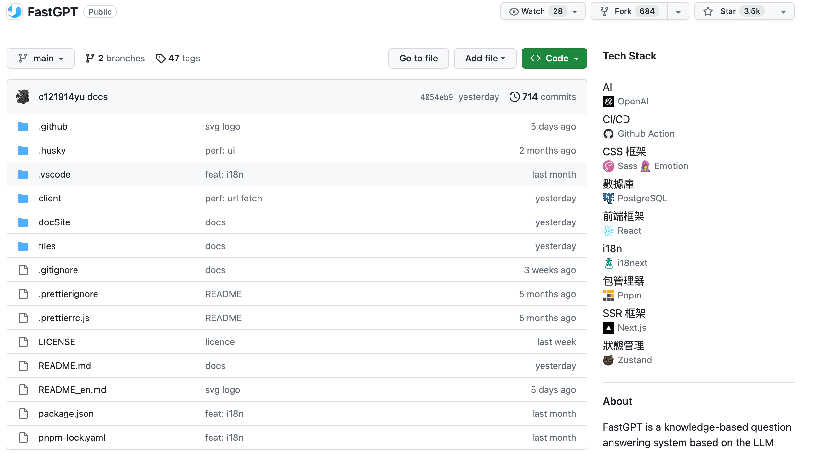

## 前情
[TechStack](https://github.com/Get-Tech-Stack/TechStack) 是一个用于显示一个 GitHub 项目的技术栈的浏览器插件。在开发它的过程中，我遇到一个挺有意思的技术需求。

比如在 package.json 中，我们可以通过依赖项 react 直接映射到 React 技术栈。但是有些依赖并不是这样。 比如 `@radix-ui/react-checkbox` 和 `@radix-ui/react-icons` 它们都属于 Radix UI 的一部分，如果让这些依赖直接对应到 Radix 呢?
 
我觉得大部分人都很想容易想到正则。对，可以写一个正则，大概是这样`@radix-ui/[\\w-]+`，如果被它匹配到就是 Radix。

所以我就想搞一个数据结构，一个 key 可以是 string 也可以是正则的map。🤔
就像这样
```
map = {
	"react": "React",
	"@radix-ui/[\\w-]+": "Radix"
}

map["react"] => "React"
map["@radix-ui/react-checkbox"] => "Radix"
map["@radix-ui/react-icons"] => "Radix"
```

开工!

## 实现第一版
先大概验证一下想法的可行性，我直接干了一个map，大概像这样
```go
// 伪代码
type  Map[T any] struct {
    intermap map[string]T
    regexp   []string
}

func (r *Map[T])Store(key string, value T) {
    直接存
}

func (r *Map[T])StoreRegexp(key string, value T) {
    存到正则表达式数组中
}

// 这里这个看到，返回值比一般的map多了一个 match ，是为了方便调试知道这个string是被哪个正则表达式匹配到的
func (r *Map[T]) Load(key string)  (actual T, loaded bool, match string)  {
    如果intermap中没有就去遍历所有的正则表达式.
}
```

当我们去取一个值时，遍历所有的正则表达式。可以看到这个实现的时间复杂度为 O(n)，n 为正则表达式的数量。这个复杂度其实在我的业务中是可以接受的，因为正则表达式的数量不会太多。🤔但是都要做成库的话，肯定不能止步于此。

## benchmark
先来做个benchmark，不然怎么能知道后面提升多少呢!
```
➜  benchmark git:(main) ✗  go test -bench='Map$' . 
goos: darwin
goarch: arm64
pkg: github.com/CorrectRoadH/regexp_map/benchmark
BenchmarkMap-10                          3756829               371.5 ns/op
BenchmarkRegexpMap-10                    4147221               365.4 ns/op
BenchmarkPureRegepxRegexpMap-10           142440              8531 ns/op <- 重点在这里，全是正则表达式key的测试
BenchmarkAllxRegexpMap-10                 136924              8788 ns/op <- 重点在这里，混合正则表达式key和普通key的测试
PASS
```
这里看起来数据量小的时候还凑合，直接上大数据量
```
➜  benchmark git:(main) ✗  go test -bench='Map$' -benchtime=5s . 
goos: darwin
goarch: arm64
pkg: github.com/CorrectRoadH/regexp_map/benchmark
Benchmark_Map-10                        18406218               366.6 ns/op
Benchmark_RegexpMap-10                  19119948               423.1 ns/op
Benchmark_PureRegepx_RegexpMap-10          10000           4082512 ns/op <- 可以看到性能影响还是非常明显的
Benchmark_All_RegexpMap-10                 10000           4097201 ns/op 
PASS
ok      github.com/CorrectRoadH/regexp_map/benchmark    179.822s
```

大概测了一下，可以看到当数据量达到10000时，就慢的可怜。😭

## 实现第二版
🤔我当然不能满足这么差的性能表现呀! 怎么做呢? 凭我的直觉，我感觉可能用一个二分再搭一个树就能把时间复杂度优化到Log(N)，感觉这个性能是可以勉强接受的。

直接开工，大概代码如下
```go
type Map[T any] struct {
	internalMap map[string]T
	regexMap    []string
	RegexpTree  *RegexpNode
}

func (r *Map[T]) StoreRegex(key string, value T) {
	if r.internalMap == nil {
		r.internalMap = make(map[string]T)
	}
	if r.RegexpTree == nil {
		r.RegexpTree = &RegexpNode{}
	}

	_, ok := r.internalMap[key]
	if ok {
        // 正则已经在树中存在的情况就只要替换值
		r.internalMap[key] = value
	} else {
        把正则插到树中
    }
}
```

## benchmark
```
➜  benchmark git:(main) ✗  go test -bench='Map$' -benchtime 1s .   
goos: darwin
goarch: arm64
pkg: github.com/CorrectRoadH/regexp_map/benchmark
Benchmark_PureRegepx_RegexpMap-10           9561           4392539 ns/op <--旧的
Benchmark_PureRegepx_V2RegexpMap-10        10000           9758544 ns/op <--新的
PASS
ok      github.com/CorrectRoadH/regexp_map/benchmark    140.046s
```
🤔可以看到其实性能不增反降，这很反直觉，不应该是这样。直接上 pprof，看看问题在哪里。

通过pprof，我定位到时间大概花了 Regexp Compile 和 GC 上，后者先不管，先看看前者。我们现在的 regexp 是在 Store 时生成的，所以明显会有多次不必要浪费的 Compile，所以这个可以lazy一下，当用到时再 Compile。


我原来的代码大概是 Insert 时 compile 正则，现在是 Find 时 compile 正则

因为原来Insert之后可能还会有Insert，会让原来的编译出来正则用不上，所以这个编译其实是无用的。

## Lazy compile
在把代码改了一下之后，就OK了。可以看到性能提升了很多。
```
go test -bench='Map$' -benchtime 5s .
goos: darwin
goarch: arm64
pkg: github.com/CorrectRoadH/regexp_map/benchmark
Benchmark_PureRegepx_RegexpMap-10      	   10000	   4339141 ns/op
Benchmark_PureRegepx_V2RegexpMap-10    	   10000	    631144 ns/op <--- 可以看到性能提升很明显
PASS
ok  	github.com/CorrectRoadH/regexp_map/benchmark	50.718s
```

## 其它优化
然后就是在树上继续修修改改，看看能不能把GC时间也减掉一点(就是少用指针)🤔。

### 如何保持树的平衡
平衡树，大家很容易想到红黑树。但是其实红黑树并不适合我们，因为红黑树会改变节点的顺序，而顺序会重建 regexp。所以我们目前是尽可能在插入时保证树的平衡。🤔

所以我想到一个很骚的平衡算法🤪 随机插入，通过随机性来保证树的平衡。🤣目前看来其实还能接受。


### 后续优化
其实二叉树并不是正则Map一个适合的树，完全可以上多叉树🤔所以后续的优化就是上多叉树。后续我研究一下 B 树，看看能不能把借鉴一下相关的思想。

### 安全性检查
可以看到这个Map是有一个要求的，也就是每个正则表达式都要能匹配到一个唯一的值。所以我们需要一个安全性检查，来保证这个要求。

这个实现也很简单，就是判断是不是左右能匹配的上，如果左右子树都匹配的上就是出问题了。

但是这个目前没有一个好的表现方式，我打算额外做一个函数，比如 安全的Load。在这里取值时额外检查，如果遇到问题就是 panic。

### 线程安全
这个是还没有做的，目前还是用普通的 Map，后续考虑用 sync.Map 加一些其它机制来实现线程安全。

### 总结
从一个需求到落地代码，大概用了一个晚上+一个中午。还挺兴奋的，特别是每次跑通测试，或者一个 benchmark 相较之前有所提升的时候。🤣 还是挺有成就感的。

## 其它
目前这个 Regexp Map 已经在 GitHub 上了，可以在这里找到文档和代码 : https://github.com/CorrectRoadH/regexp_map

然后就是运营时间😗
TechStack 是一个用于显示一个 GitHub 项目的技术栈的浏览器插件。可以快速判断一个Github项目的技术栈，一眼判断出是不是假开源项目。目前已正式结束测试，欢迎大家来试试。

Chrome: https://chrome.google.com/webstore/detail/tech-stack-show-github-re/lbhjnhabgddabnagncmcgomggeadlbhh

Firefox:  https://addons.mozilla.org/en-US/firefox/addon/tech-stack/

比如这个: FastGPT，虽然看到这个是一个前端项目，不过能看到有调 OpenAI 和用到 Postgres ，所以一眼就可以判断出应该是一个真的开源项目，也可以大概判断出实现思路，比如是用 Postgres 做向量数据库。
