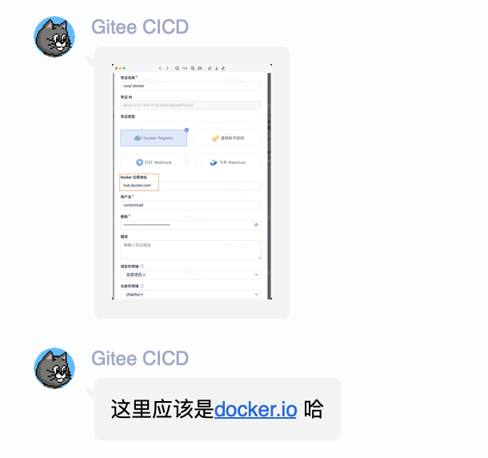
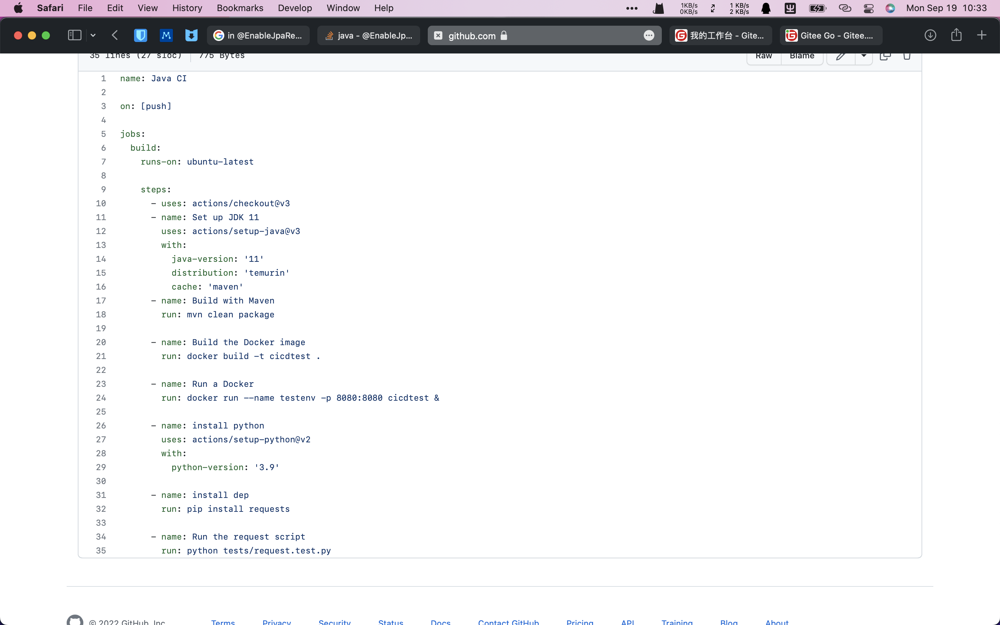
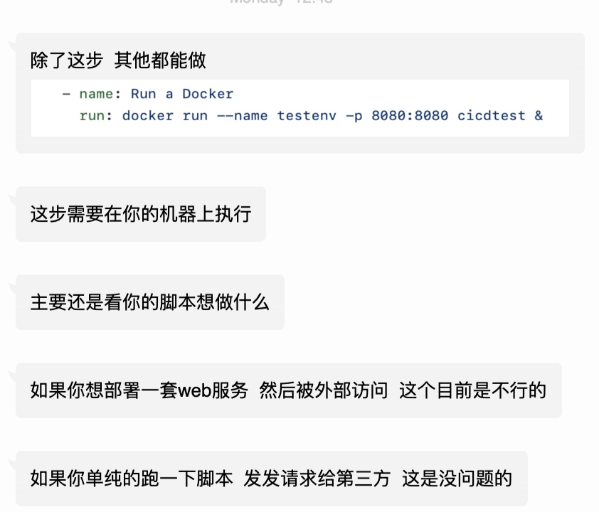

## 背景
最近在做的一个项目，缺少unit test。并且在合并PR时，经常出现修改的代码导致的BUG。(目前没做到一个好的Code Review)。

比较适合就是先补上unit test，但是确实不太好搞。首先，这个项目比较大，现存一部分unit test，但是已经跑不通了，然后我对java和JUnit也不熟，参与项目的同学对这里的知识也比较欠缺。但是我想至少能补上e2e测试，来保证系统最基本上的运行测试。

所以我的整体思路大概就形成了:把mvn package出来的jar放到docker里，然后运行docker。最后用python写的request和selenium headless进行测试。

## 实践
我们有一台双核4G的百度云服务器，我们部署了Jenkins做CD。但是特别卡，还经常出现卡死的情况(通过CD时自动关闭其它应用来解决的).所以在没能在这里上Gitlab和用Jenkins实现CI。

这个项目是校企合作的外包项目，老师在gitee上注册了高校组织。然后指定我们这个项目在gitee上进行合作。所以我们只能采用Gitee go(gitee 流水线)进行CI.

### Gitee
思路的第一步:`maven package`出jar，没有问题。但是到了`docker build`出镜像时，在这里Gitee就出现问题了,我用的是官方提供的`镜像构建`。Gitee里build出的image，需要上传到`docker hub`上。我按照文档折腾了两天，轮流换了不同的地址、密码等。都没有成功。

最后只能加上gitee的官方群，才得到解答，但是从加群到通过就隔了两天(可能是因为非工作日吧)。

😅挺离谱的，既然这里要写的是`docker.io`，那你提醒的时候显示的是的`hub.docker.com`。就纯误导。

### GitHub上的实践
在等待加群的两天中，我在github的action尝试做到这样的功能，学习、尝试了半个小时后，我成功配出了我的需求。

仓库地址: https://github.com/CorrectRoadH/CICDtest

`GitHub Action`真的很好上手，同时样例丰富。可以很方便构建出我们的CI。同时Github也有很多优点，比如Gitee Go每个阶段的产物都要通过中转，比如maven的jar是上传到gitee官方的文件服务器，然后在镜像构建时再curl下来。然后docker build出的image要上传到docker仓库，然后运行docker镜像时要再下载下来才能运行。而`GitHub Action`这些不同阶段是可以在一台电脑上运行，中间产物不需要额外中转。

### 在Gitee上继续
在官方人员的指导下，我成功上传了docker image。但是在下一步中，运行docker就卡住了。在Gitee go中，无法给docker run传参数，也就是说docker里的web服务，外部根本无法访问。

## 总结
这次自动化CI的实践算是失败了，主要还是技术选型的问题。目前是没有办法把项目转到Github上，主要原因就是项目里的一部分同学不会翻墙，培训起来也不太方便啥的。再继续思考一下如何实践这个CI。