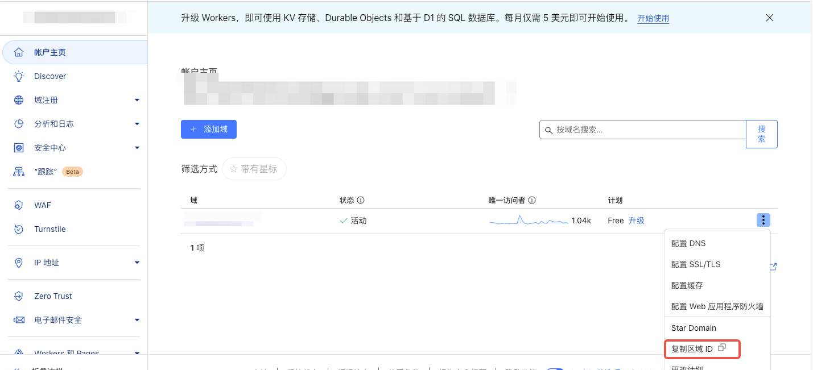
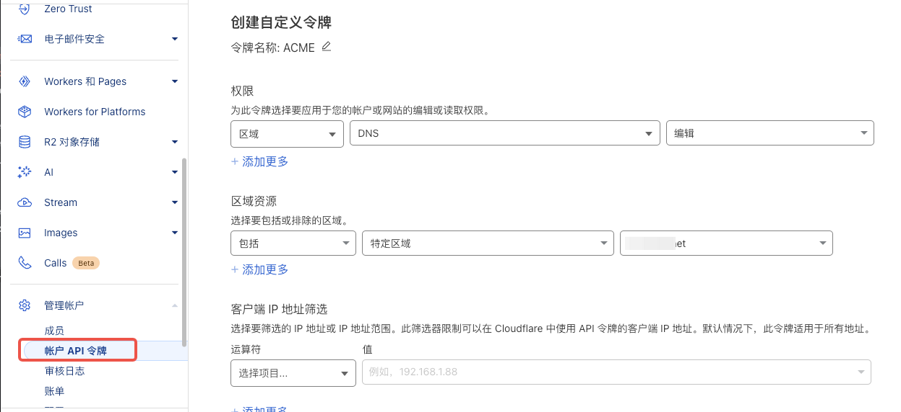

# 安装acme
```bash
curl https://get.acme.sh | sh -s email=my@example.com
```
> email随意填

# 使用DNS API验证生成证书
> 下面以CloudFlare举例
1. 获取区域ID
    
2. 获取API TOKEN
    
3. 配置上面获取到的变量
    ```bash
    export CF_Zone_ID="xxxxxx4f1bcebd8b5c95e9fc50d010b4" && export CF_Token="Y_xxxxxxfQmuX5Ss9M_qaNab6SQwme3HWXNxxxxs"
    ```
4. 生成证书
    ```bash
    ./acme.sh --issue --dns dns_cf -d <your domain> -d '*.<your domain>'
    ```
   
# 复制证书
> nginx示例
```bash
./acme.sh --install-cert -d <your domain> \
--key-file       /etc/ssl/path/key.pem  \
--fullchain-file /etc/ssl/path/cert.pem \
--reloadcmd     "service nginx reload"
```

# 多节点同步证书
1. [安装Rclone](https://rclone.org/downloads/)
2. [配置rclone](https://rclone.org/docs/)
    > rclone支持多种存储类型 按需配置
3. acme运行节点配置
    ```bash
    vim sync_ssl.sh
    ```
    ```shell
    rclone sync /etc/ssl/path <your rclone remote name>:/backup/ssl/path
    ```
    ```bash
    chmod +x sync_ssl.sh
    ```
    ```bash
    crontab -e
    # 0 14 * * * /your/path/sync_ssl.sh
    ```
4. 其他节点配置
    ```bash
    vim sync_ssl.sh
    ```
    ```shell
    rclone sync <your rclone remote name>:/backup/ssl/path /etc/ssl/path
    ```
    ```bash
    chmod +x sync_ssl.sh
    ```
    ```bash
    crontab -e
    # 0 14 * * * /your/path/sync_ssl.sh
    ```


# 参考文章
1. [acme安装](https://github.com/acmesh-official/acme.sh/wiki/%E8%AF%B4%E6%98%8E)
2. [rclone文档](https://rclone.org/docs/)