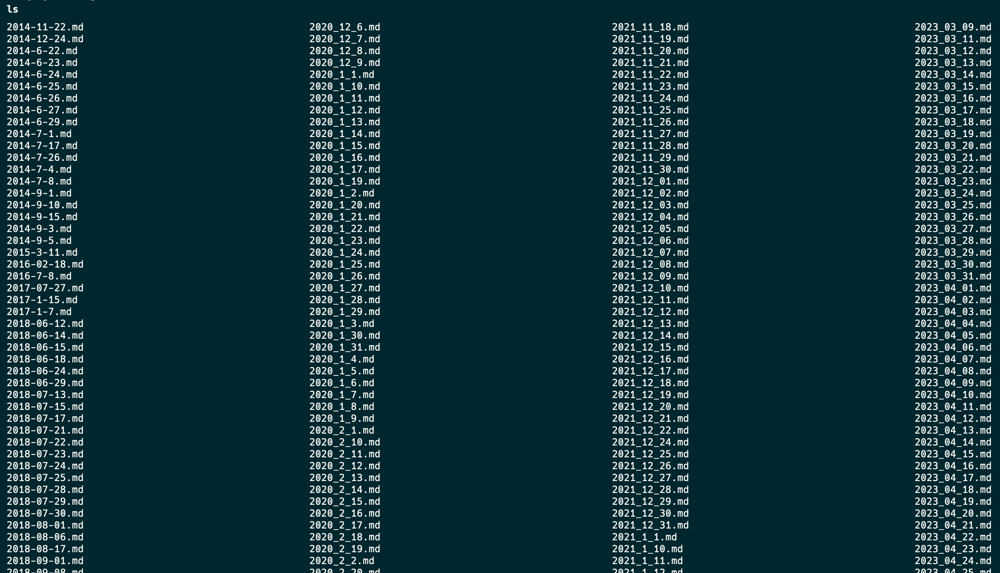

## ai note

之前写过一些日记，从18年才开始写的多，这五年间，我换了好几个笔记软件，从 OneNote 到 Obsidian 再到 Logseq。之前不敢想像能把多年的日记能聚集在一起，因为确实抽不出来时间来写脚本，把他们之前的差异打平，一直想着或者有一天，有哪个开源软件把转换功能给做好了。

但是最近用上 Claude 之后发现这个 AI 确实不太一样，能写出来的代码确实很 work。在一顿操作之后，用 claude 写了十几个one off脚本，，把不同格式、来源的笔记都转换成当前使用的logseq的格式。

[正如之前所提到的](ai-change-program)，AI 将可能改变开发的范式，在之前写one off都是用 ruby，这玩意写起来可比 Python 舒服多了，但是在 AI 时代，语法糖并不重要了，用 Python 反而有优势，一是语料大，二是懂的人多。用 Python 反而出活快的多。

这样类似的事在 V0.dev 出来的时候我就想过，比如 solid.js 很甜是吧，但是 react 的语料是你的数倍，用 AI 写前端，React 的质量就是会比 Solid.js 高、容易。这些后发的新语言/框架感觉更难出头了。

除非语法糖是对 AI 友好的，比如 TailwindCSS，把 CSS 和 组件放在一起，AI 写 Tailwind 可比写什么 Sass 容易。