By default, Linux OS does not automount any other partition at startup other than the root and the home partition.

You can mount other partitions very easily later, but you might want to enable some kind of automount feature on startup. This means that you won't need to mount them later one by one or all at once after logging into your Linux OS.

Personally, I like to enable the automount feature on startup for some of my partitions which I use a lot while working on my desktop computer.

As I need to access those partitions all the time, I don't like the hassle of mounting them individually each time I log into my computers – so I also use the automount feature on them. That is why I thought, why not share how to do that here as well!

Well, there are many set up automount. In this article, I will introduce you to a process that I think is simpler and easier among them.

Fear not! I have also made a video tutorial about this entire procedure. So if you want to a visual walkthrough, then you can watch that video [here](https://youtu.be/0Hfde3Iy41E).

<iframe width="100%" height="468" src="https://www.youtube.com/embed/0Hfde3Iy41E" title="Automount any partition in the startup in your Linux operating system 🐧" frameborder="0" allowfullscreen></iframe>

<!-- The above iframe is the correct one! -->

## How to Automount Any Partition on Startup in LinuxOS

In this walkthrough, I am going to use a simple GUI application named gnome-disk-utility. You can check their official repo in [GitLab](https://gitlab.gnome.org/GNOME/gnome-disk-utility) as well.

This time, I am using a well-known Linux distribution named [Manjaro](https://manjaro.org/), but you can apply the same method to any kind of Linux distribution.

First of all, let me show you my disks and partitions. Currently, I have two storage devices on my desktop computer. One of them is a 240GB SSD and the other one is a 2 TB HDD.

The image below shows the partitions I have in my HDD:

First of all, let me show you my disks and partitions. Currently, I have two storage devices on my desktop computer. One of them is a 240GB SSD and the other one is a 2 TB HDD.

The image below shows the partitions I have in my HDD:

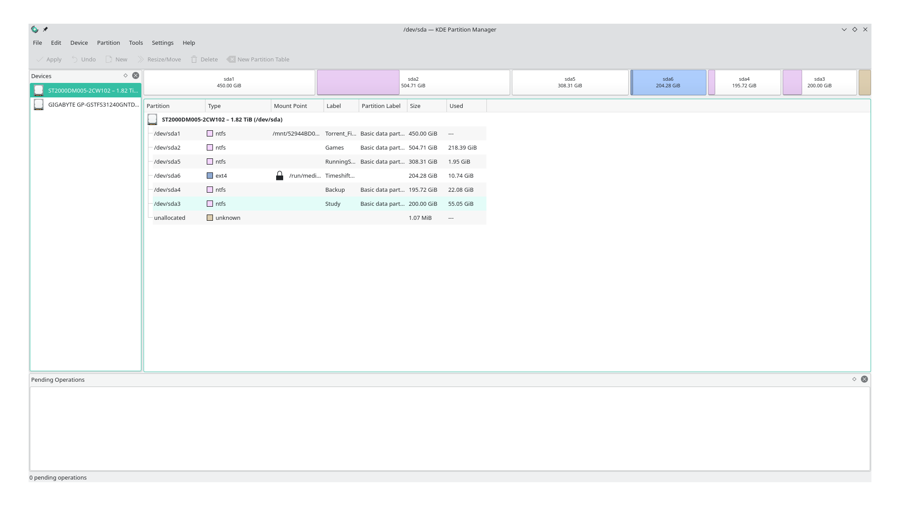

And this one shows the partitions I have in my SSD:

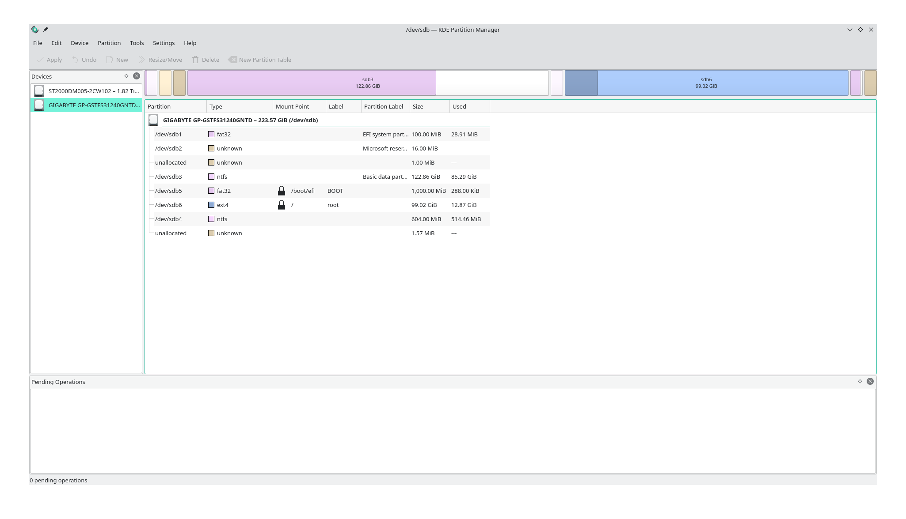

To apply the automount feature on my desired partitions, I need to install the application now. Follow the steps given below.

## Steps to Set Up Automount

1. Open your software center or Add/Remove Software.

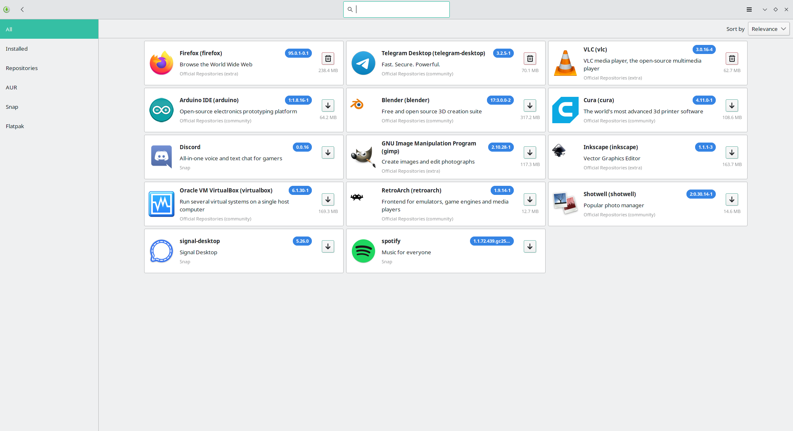

2. Search for gnome-disk-utility and you will get the following:

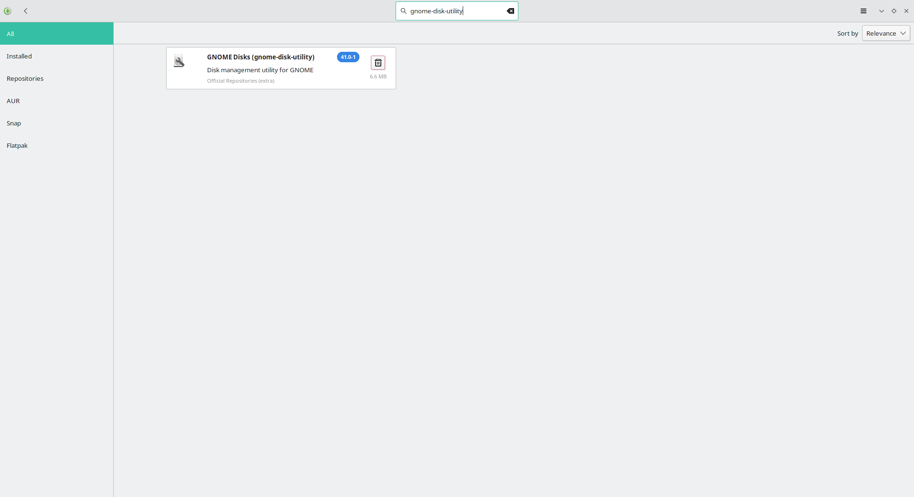

In this case, I have already installed the application, and therefore it is not asking me to install it.

If you haven't installed this application already, then you will need to install it first. The installation procedure is very basic. Simply provide the permission and it will install itself.

3. Open the application we have installed just now. You may find it in the menu as **Disks**.

You will see the SSDs/HDDs you have on the left side of the application:

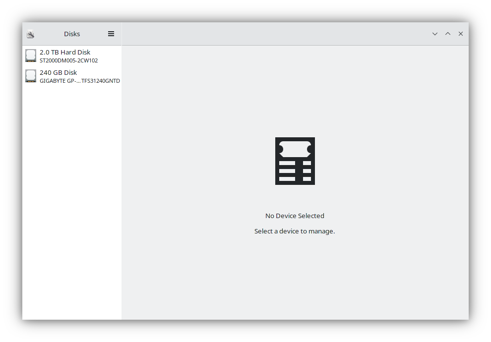

4. Select the SSD/HDD on which you want to enable the automount feature.

In this case, I want to enable that feature in my Hard Disk's partition. Therefore, I will select the `2.0TB Hard Disk` from the left side. After this, it will show me all the active partitions I have on the Hard Disk.

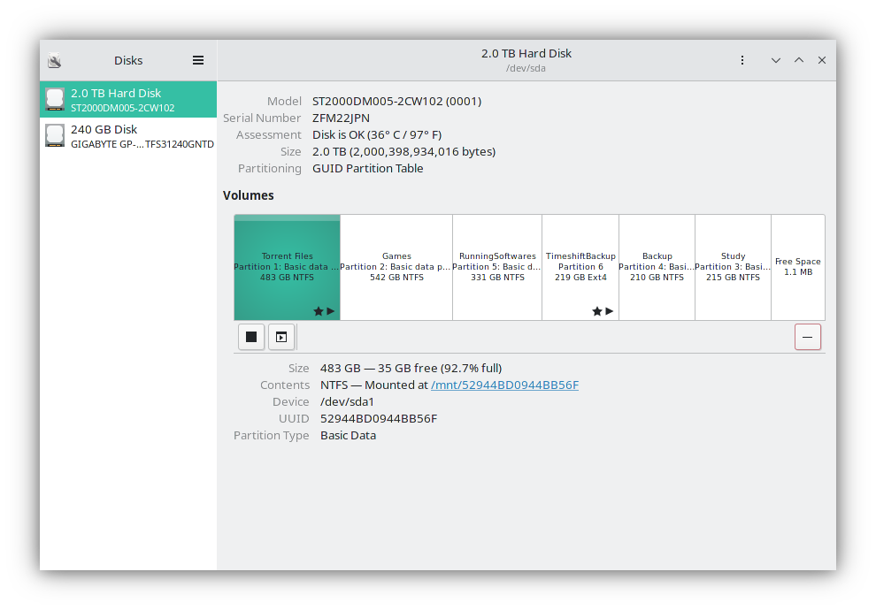

5. Next, simply select the partition you want the feature to be enabled on, and then click on the right-side icon from the left side down below. It will open the "Additional Partitions Options" for you.

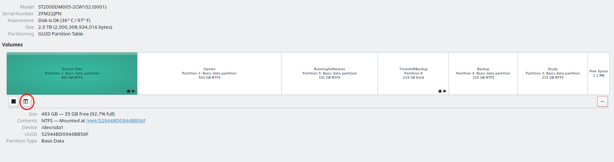

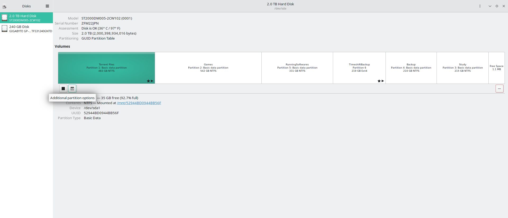

6. Then select the `Edit Mount Options...` from the side menu bar:

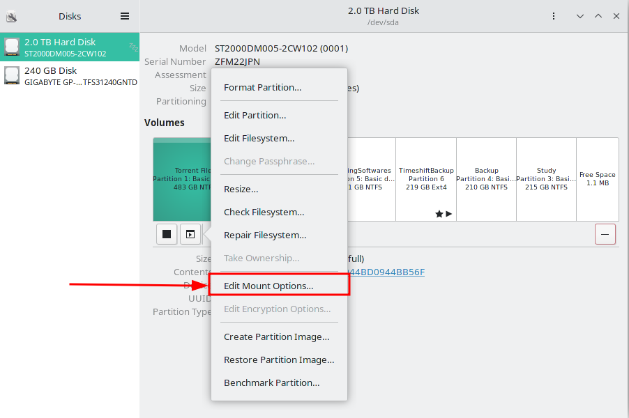

7. Uncheck the `User Session Defaults`.

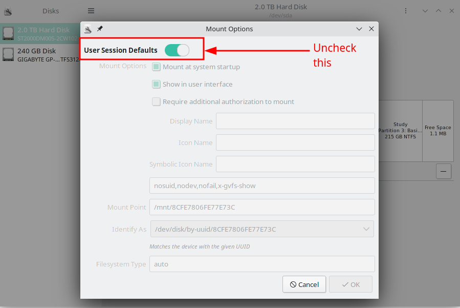

8. Make sure the box is checked on beside `Mount at system startup`. You can customize the other settings as well if you want, but for our auto-mounting process at the system startup, our task is almost complete.

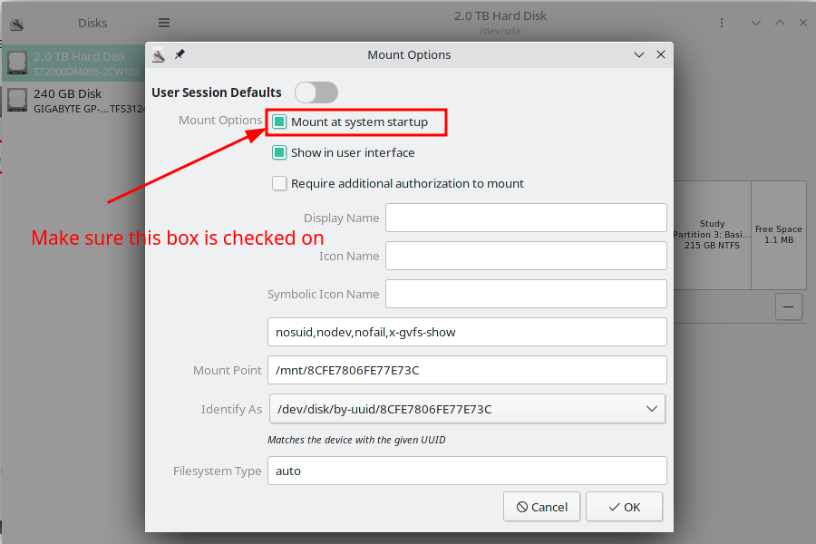

9. Now click on `OK`.

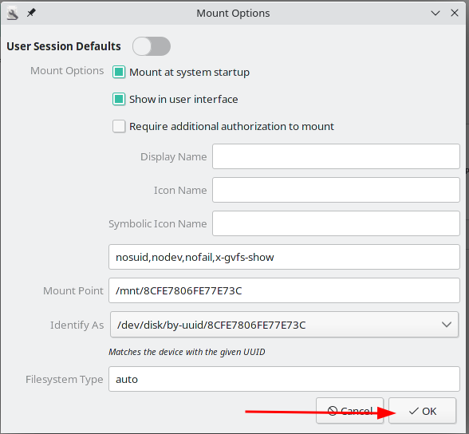

And you are good to go from now on! This same method is applicable for any drive partition on which you want to enable the automounting feature.

## Conclusion

Thanks for reading the entire article. If it helps you then you can also check out other articles of mine at my [blog site](https://blog.fahimbinamin.com).

If you want to get in touch with me, then you can do so using [Twitter](https://x.com/Fahim_FBA), [LinkedIn](https://www.linkedin.com/in/fahimfba/), and [GitHub](https://github.com/FahimFBA).

You can also [SUBSCRIBE to my YouTube channel](https://www.youtube.com/@FahimAmin?sub_confirmation=1) (Fahim Amin) if you want to learn various kinds of programming languages with a lot of practical examples regularly.

You can also [visit my website](https://www.fahimbinamin.com/) to learn more about me and what I'm working on.

Thanks a bunch!