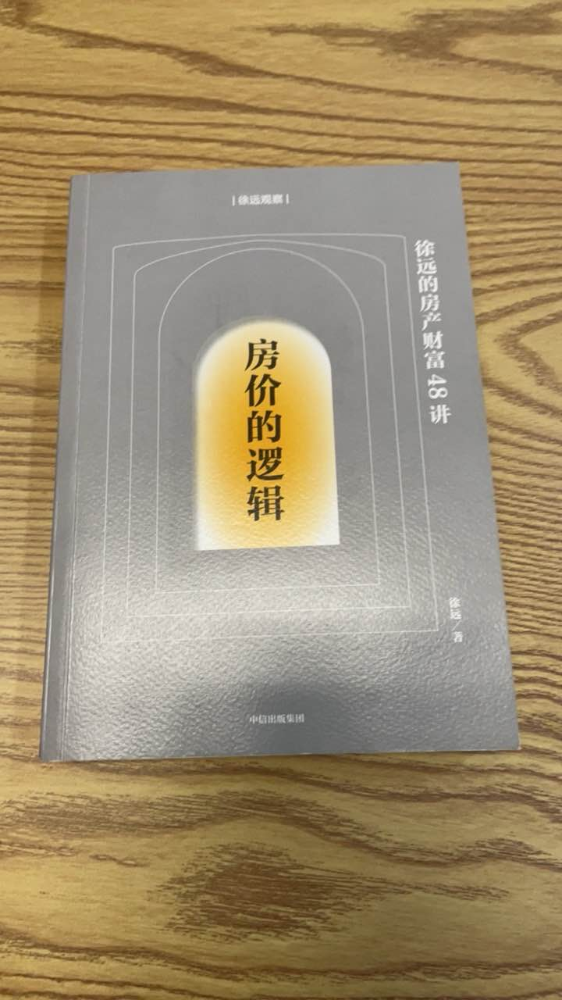
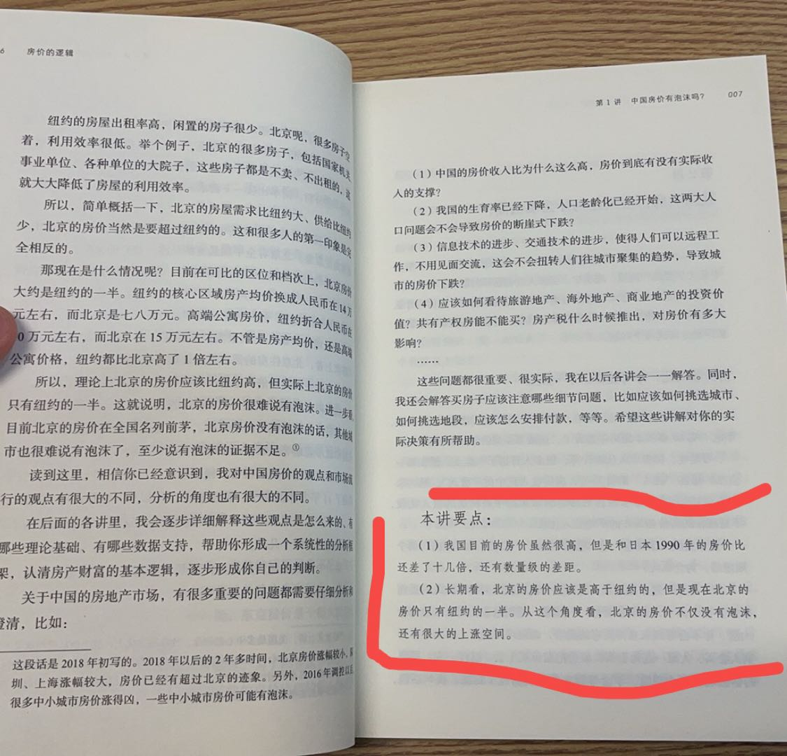

## 做出决策
能挣大钱的事都是有风险的，在『美团清华产品课』中美团的王慧文说他们能成功有很大一部分原因是因为他们勇敢。

我在雷锋网读了到那些现在那些独角兽、成功的公司还有那些失败的公司的故事，其实各种调研、分析都很难说个对错，确实迈出第一步的勇敢是很重要的。

尽管现在复盘起来他们的当初的决策中会有看到各种判断、分析。从怎样的理论上来思考，但是当初谁不能肯定一定会成功。但是为什么他们能勇敢呢? 是因为他们的眼界更广吗、[看到别人的成功，所以对自己能成功的信心更足](https://www.zhihu.com/question/314284424/answer/3148781453)、还是带点基因与原生家庭影响。

我看到一个[关于房价的视频](https://www.bilibili.com/video/BV17f421R7WZ)，中说房价是与负债率有关的，负债率低房价更容易涨起来，而到了20、21年中国的负债率已经居高不下了，所以房价很难涨了。正巧，前几天在公司翻到一本21年出版的书籍，里面同样通过一系列的逻辑推理，得出中国房价还会涨的结论。

所以很多理论调研就像是一个轮子，正说反说都说的通，所以最后的决策就是得看勇气。现在对看各种理论分析，什么[抖音搞电商成功了是因为什么什么](https://mp.weixin.qq.com/s/WyPLD25BziZcabXFkHk8_A)，[快手化商业化做的不如抖音好又是什么用户量不够，导致的广告单价上不去](https://mp.weixin.qq.com/s/mkZH6Ml4FbAdu8v8ZZ6NOA)。

 

## 我的越来越小的勇气
我感觉我的胆子越来越小了，这几天进了几次医院，先是健身导致了横纹肌溶解、然后回家骑车的时候摔了，再接着是打羽毛球的时候，头盖骨被狠狠的扣了一球拍。人们常说人教人教不会，事教人一教就会，我以后上重量肯定不会那么极限了，雨天骑车的时候速度会更慢、运动的时候也会更加小心。

在这些事上小心看起来确实没有问题什么，也对我不会有什么明显的害处，但是如果我对我的职业选择更加保守呢? 如果我要选择工作，我是选择一家创业公司还是一家大公司? 如果让我选择城市，我是选择去北上广深去漂还是回老家有房挣的少一点呢?

我现在遇到的各种挫折可能就会让我变得保守，可能就让我放弃更好的机会。

## 踩在风口上的人
你们说那些在房价上涨之前做出决策的人，那些买房的人，他们敢做这么大的决策是因为他们有多聪明吗? 做出多少研究吗? 可能只是因为勇敢吧，那为什么会这样勇敢呢，可能是他们上一次做出勇敢的决定成功，所以他们这次又勇敢了。那些决策相对保守人，他们在做买房决策的可能就有更多的犹豫，错过了风口。

王兴在做出美团之前，考上清华大学，再做出校内网、饭否网。确实是一路成功，那么他在美团遇到各种风险的时候确实会有更多的勇气。如果他的前几个项目失败了，说不定他会变的更加保守，美团可能也没有今天这么成功了。

那些由于勇敢而成功的人，可能对比另一批失败者，他们只是之前的运气更好而已。