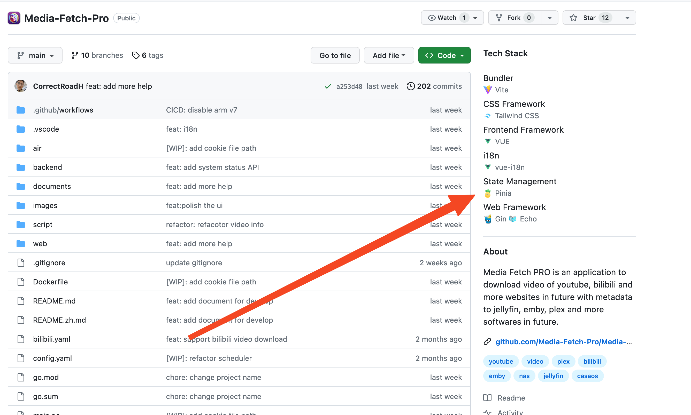

## 前情
前几天突然来了灵感，于是提笔就写，在每天下班之后都肝到凌晨，终于在今天基本完成了程序了。也上架了各大浏览器商店。这里记录一下这个过程与踩的坑。

## 浏览器插件基本知识
Content Script : 插件当进入插件需要的网页时执行的 JS 脚本

Background.js  : 插件后台运行的 JS 脚本， 有一些浏览器的特殊的 API

Manifest.json  : 大概类型一个插件的元数据，里面包含了插件的名称、描述、版本、权限等等。然后目前有两个版本，一个是 MV2 一个是 MV3，MV3 是比较新的版本，但是有些浏览器还不支持，比如 Firefox。

## 开发
最大的问题就是不同的浏览器的插件有一点不同，然后又不是完全不同🤯。最开始是只想上架份额最大的 Chrome ，所以在Github找了一个针对 Chrome + React 的手脚架，肝了一天肝出来之后发现 Chrome 上架要等很久很久，没有办法只能尝试看看能不能上架 Firefox ，没有想到原来的代码能在 Firefox 跑起来，但是会有一些小问题。 因为 Firefox 对 manifest MV3 的兼容不是很好。

但是原来那些代码手脚架在这里写的比较死，无奈只能重新找。最后找到了这个: https://github.com/WebExp0528/React-Extension-Boilerplate ，然后把原来的代码搬了过来。然后又调了半天 Webpack。完成了对多端浏览器的兼容。

中间借鉴了不少 [V2ex Polish](https://github.com/coolpace/V2EX_Polish) 的代码，感觉写的真不错。可惜这个用的 UI 库，我不太会用，不然我直接用这套架构写我自己的插件了。

## 踩坑
### 网络请求的坑
首先就是 Content Script 只执行一次的问题，比如我这个插件是在 GitHub 仓库页显示这个项目的技术栈，如果用户先进来一次，然后进组织，再从组织进一个仓库，这样新仓库里并没有调用这个 Content Script。我不确定有没有更优雅的解决方式，但是我直接加了一个 background.js，然后在 background.js 里监听 tab 的变化，然后发送事件重新执行 Content Script。

然后就是 Firefox 的 manifest.json 里的权限问题，有个 Permission 中我只能写 <all_urls> 不能写 `*://github.com/*`, 否则后者就是不让我发请求，但是我不确定是哪里坑，后续要是找到了就来更新一下。

*UPDATE*
🤣这里要改的被请求的网站的地址。比如后端地址是`xxx.zeabur.app`，那么应该在 Permission 加上这个，而不是`github.com`。

### I18N 的坑
然后是 I18N 的问题，这个插件不能直接把 locale 的 json 放到 public 了。所以我自己架了一台 Nginx 专门放这个 locale 的 Json，然后我是有 React 的 i18next，还遇到了 useSuspense 的问题。 最后我是按这个[教程](https://medium.com/@byeduardoac/using-react-i18next-within-chrome-extension-manifest-v3-1d6f16a43556)里调了一下就成功了。

### Cookies 的坑

最后是Cookie的坑，插件运行在Github.com网站，但是我的后端是在另一个网站，我先是折腾了好久，发现拿到的这个Cookie，根本设置不到浏览器中。然后发现是要在前端请求时加上 `credentials: 'include'`。像这样:
```js
    fetch('xxxx', {
        method: 'POST',
        credentials: 'include',
    }).catch((err) => {});

```
然后提醒我`Access-Control-Allow-Credentials`响应头应该设成`true`，而我是空。🤔我看了一下代码，明明我设置了呀!
```go
c.Response().Header().Set("Access-Control-Allow-Credentials", "true")
```
折腾到最后发现是 Echo 的坑，得在中间件写，我也不知道为什么会这样。最后如中间件这样设就OK了。

```go
	e.Use(middleware.CORSWithConfig(middleware.CORSConfig{
		AllowOrigins:     []string{"https://github.com"},
		AllowHeaders:     []string{echo.HeaderOrigin, echo.HeaderContentType, echo.HeaderAccept, echo.HeaderAccessControlAllowCredentials},
		AllowMethods:     []string{http.MethodGet, http.MethodPost, http.MethodOptions},
		AllowCredentials: true,
	}))
```
## 上架
开发的工作的坑基本都能靠肝解决，但是上架这个遇到的坑只能靠等。 我最先上架的是 Chrome ，但是想上架应用商店得先交 5 美元注册一个开发者，交完之后还得审核你的插件很久很久。 无奈只能转战其它浏览器先整起来。 最后因为我的这个插件涉及到了 Host Permission (就是要写入 content script 到 GitHub)。所以需要更多的审核。最后提示可能需要 30 天才能通过审核。 当然最后其实并没有用到这么久，大概3-4天就通过了。

然后就是上架 Firefox 了，与 Chrome 不同的是 Firefox 上架是免费的，但是需要审核。但是 Firefox 的审核速度比 Chrome 快多了，大概半天就通过了。不过提交插件的时候是需要提交自己的代码的。🤣我不确定那些商业插件是不是也需要提交代码。或者怎么整，会不会出现代码泄露的问题。也没有试过传个假代码会怎么样。

最后就是 Edge 了，虽然 Edge 也是免费上架的，但是整体的体验是非常差劲的。 首先就是要注册一个开发者计划，需要填 State , 我先后填了 福建 、 Fujian 都过不了，最后搜索了一下要填缩写，比如北京就是 BJ。 我填了一下 FJ 才过。这里真的尬住了，感觉这个应该是美国的习惯吧，把州名缩写，但是在中国确实没有人把省名缩写的。

然后就是这个整个 Developer experience 体验最差的也是 Edge，像谷歌的 Developer DashBoard, 感觉挺流畅加好看的。用起来引导也自然，基本靠直觉就完了。firefox 虽然风格有点10几年前的风格，但是也挺流畅的。但是微软的那个 Partner Center 真的像一坨屎，风格尽管很现代，但是卡的一批。真不知道前后端是用什么写的。

## 技术的感悟
之前写 React 大多都是写配置好的项目中的写应用，所以感觉 Javascript 和 React差的很多。但是这次不得不在 Javascript 代码中去手动的去调用`ReactDOM.createRoot`然后去render。这一下就感觉一些思维上转换， React只是一种特殊的 Javascript 代码。

然后就是 Webpack，之前也从来没有配置过，但是这次不得不配了，但是其实真配起来感觉也不太难，也基本符合直觉。

## 插件的推广
🤔 大概把项目的 [Homepage](https://github.com/Get-Tech-Stack/TechStack) 搭建了一下。 然后在自己的一些朋友群里私下分享了一下，先来一波内测，看看有没有一些大的问题，等后续上架各大商店，把插件的权限仅可能减少(现在了为了开发方便，是把可能能用到的权限都申了，但是实际上用不到这么多)，然后还有防刷 API 的都解决一下，计划在 V2EX 上还有 Twitter 上发些内容做一些推广。😄

如果你感兴趣也可以现在就试试这个插件:
Firefox: https://addons.mozilla.org/en-US/firefox/addon/tech-stack/

Chrome: https://chrome.google.com/webstore/detail/tech-stack-show-github-re/lbhjnhabgddabnagncmcgomggeadlbhh




