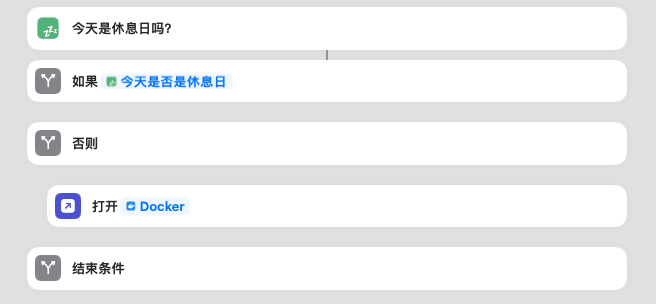
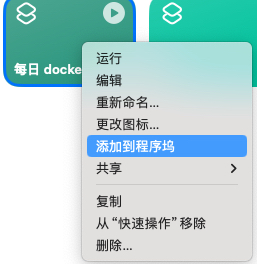
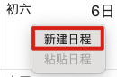
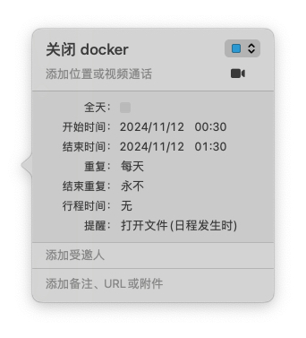
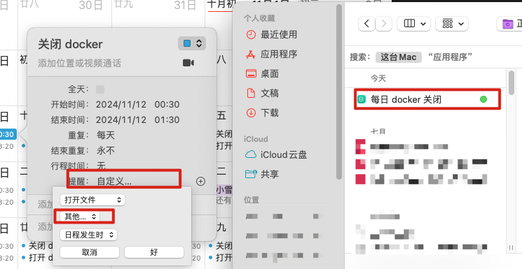

> 因为某种原因，需要实现每天晚上定时关闭 mac 的 docker 以及在工作日早上定时开启 docker，因此有了这个记录
# 下载休息日 app
- [下载链接](https://apps.apple.com/cn/app/%E4%BC%91%E6%81%AF%E6%97%A5/id6501973975)

# 添加开启/关闭 docker desktop 快捷指令
1. （开启快捷指令）判断是否为休息日，不是则打开 docker desktop

2. （关闭快捷指令）不做判断，关闭 docker desktop

# 将快捷指令添加到程序坞

# 定时运行快捷指令
- macos 操作系统快捷指令不提供自动化运行模块，因此需要另辟蹊径
## 使用 [Shortery](https://www.numberfive.co/detail_shortery.html) 定时运行快捷指令
- 需要收费，订阅制
## 使用系统日历定时运行快捷指令
1. 添加日程

2. 将日程设置为每天重复，定时提醒，提醒方式为打开软件

3. 打开软件选项中选择快捷指令

# 参考文章
1. [App+1 | Shortery，为 macOS 捷径增加自动化运行的新方式](https://sspai.com/post/72692)
2. [使用「系统日历」计划定时打开 macOS 应用](https://xiaoyi.vc/macos-auto-run-macos-app.html)