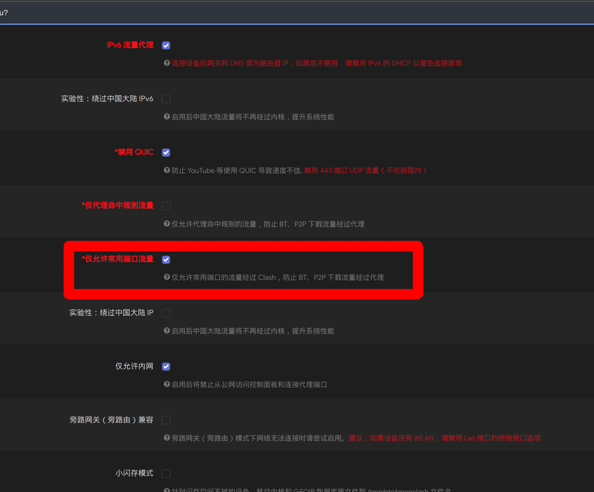
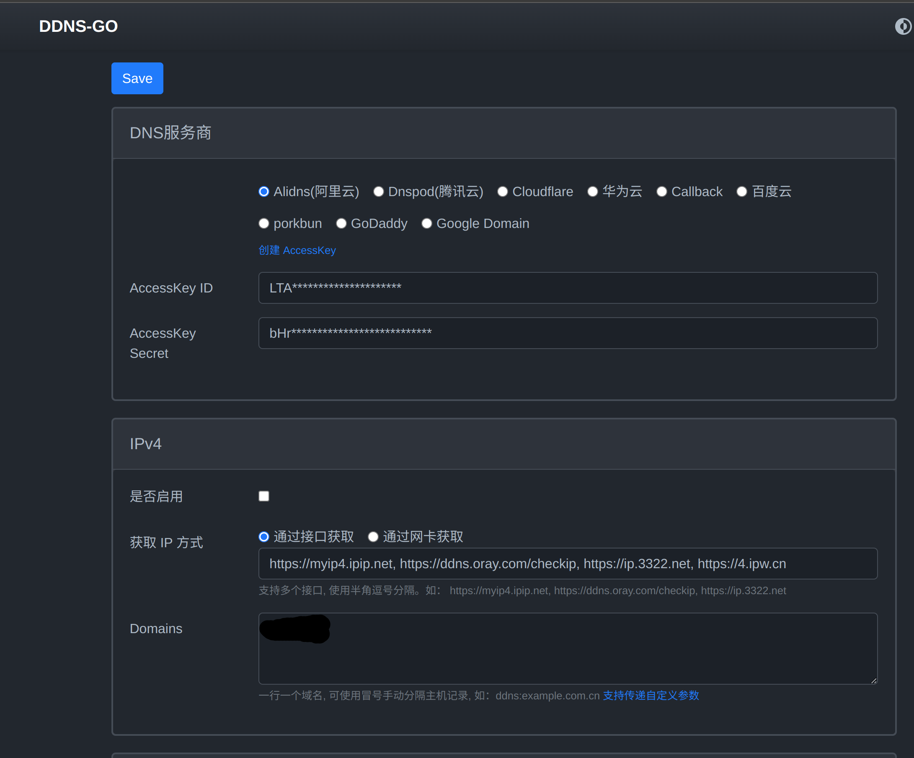
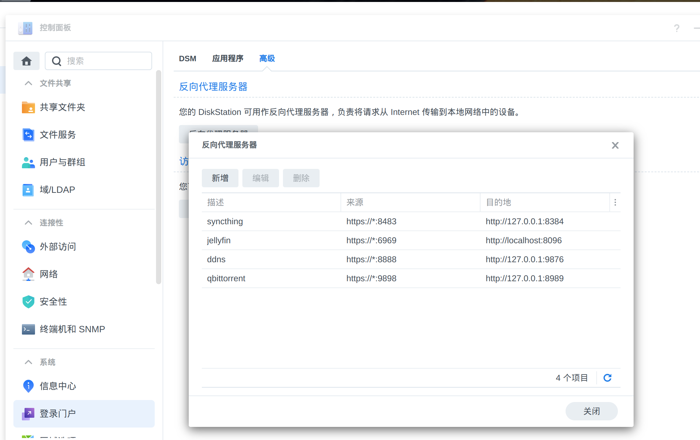
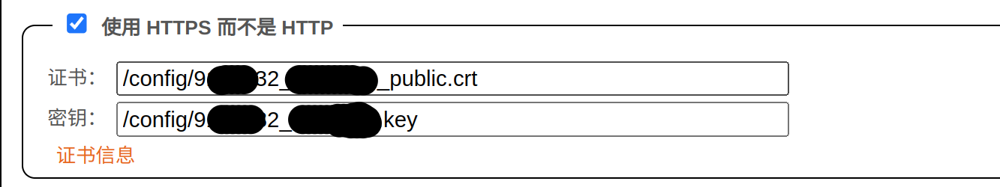

## 为什么需要一台NAS
我之前使用Google Photo管理照片，后转移到iPhone。但是因为Google Photo容量满了之后，使用TakeOut导出了Google里的照片并删除。所以我需要一个工具合并两边的照片。

文件同步与存储。我使用Synchting在多个设备，我想要一个永远在线的设备为我的台式与笔记本之中做为中转同步文件。

## 挑选过程
我主要从常见的群晖与威联通还是DIY NAS黑晖中进行一个挑选。 

- 群晖  
	- 群晖看了ds220+和ds920+与ds923+。三个型号，但是三个型号对性能与价格都不够满意。  
- 威联通  
	- 对其中一款还算满意。但是想到威联通这个系统比较差。但是其实网上对他的评论还凑合。看了App Store中的app里的评分，群辉的drive比威联通好的多。所以我还是想了解一下Diy NAS之后再说  
- DIY NAS  
	- 难点就是硬件的挑选、安装与后期洗白与升级。不过看起来，其实做起来简单。了解了一下就放弃买威联通决定DIY 黑群晖。
  
## DIY NAS的过程
### 学习黑晖的相关知识
我之前从来没有接触过相关知识，所以可以说是一个小白，主要就是看了B站、隔壁网还和一些相关的博客。这些是我认为还不错的内容。   
[gxnas的博客](https://wp.gxnas.com/)

[2022年组建群晖实体机的一些建议](http://www.gebi1.com/thread-301584-1-1.html)  

### 挑选硬件
作为一个完全的黑群晖小白，我以为黑群晖的硬件像黑苹果一样非常的苛刻。但是想直接抄作业，但是无论是在v2ex、隔壁网、bilibili都没有找到一个合适的黑群晖的配置单。

不过在隔壁网、bilibili还是看到黑群晕硬件的挑选政策，主要就是黑群晖对硬件是比较宽容，我基于 [2022年组建群晖实体机的一些建议](http://www.gebi1.com/thread-301584-1-1.html) 这个帖子，挑选了 i3-8100t + z370作为我的主板。

### 如何安装黑群晖
我看了bilibili上的视频

https://www.bilibili.com/video/BV1z8411G7Rv  

- 引导  
	- ARPL  
		- 这个是一个引导制作工具，通过识别配置生成黑群的型号  
		- 然后生成一个引导  
		- 然后这个引导就是装在机子上了，然后就可以直接装群辉了。  
- 下载群辉7.1.1  
	- 然后把群辉写到u盘里。  

## 群晖的后续

### 洗白
这个挺简单的，我看b站里的洗白过程的教学视频，然后在闲鱼买码。就一遍过了。

#### 黑群与白群有什么区别
|功能点|黑群|半洗|全洗|
|--|--|--|--|
|quickConnection|不行|不行|6可以 7不行|

##### 其它可修复的功能点
##### 没有人脸识别

[黑群晖DSM7.1.1 Synology Photos人脸识别补丁
](https://www.daibei.info/%E9%BB%91%E7%BE%A4%E6%99%96dsm7-1-1-synology-photos%E4%BA%BA%E8%84%B8%E8%AF%86%E5%88%AB%E8%A1%A5%E4%B8%81.html)

我觉得这个人脸识别觉得挺拉的，似乎是一个单线程的，我导入的几千张照片识别了一个晚上。CPU占用率根本没有起来。然后经常同一个人识别成不同的人。还要我手动去合并。

[黑群晖DSM7.X的Synology Photos套件没有人脸识别的解决方法（2023年1月7日更新）](https://wp.gxnas.com/11592.html)

##### 不能播放hevc的视频
[DSM7.X版本的各种坑，黑群晖安装/升级须知！（2022年7月9日更新）](https://wp.gxnas.com/11819.html)

### 照片管理
导入google照片
通过google photos里take out导出，然后用github上的工具把json里的信息写到了照片里。然后通过ftp上传到群晖的photos文件夹下。

导入icloud照片
直接在iPhone上安装synogoly driver。

#### 照片去重

通过存储空间分析器找到重复的照片，然后通过cvs转出文件目录，通过脚本删除。类似这样的shell命令。也是在b站上找视频学的。
```shell
cat needToDelete.txt|grep GooglePhotos|xargs -I {} rm -f "{}"
```

### Docker管理
主要就是感觉下载特别的慢，然后按网上的换源方法没有用。通过搭建了openclash搞透明代理直接解决问题。

### 图书管理
搭建了calibre-web，但是感觉不好用。就放弃了。目前没有找到好用的方案

### 影音管理
搭建jellyfin，直接docker一把梭。

#### jellyfin的硬解
方案来源: 
[群晖用Jellyfin实现GPU硬解实时转码](https://wp.gxnas.com/4912.html)

```shell
sudo docker run -d --name jellyfin \
-v /volume1/homes/jellyfin/config:/config \
-v /volume1/homes/qbittorrent/downloads:/video \
-v /volume1/av:/av \
-p 8096:8096 \
--device=/dev/dri/renderD128 \
--restart unless-stopped \
jellyfin/jellyfin
```

### 与icloud的双向同步
先说结果，没有成功。

为什么要会有这种需求呢?我这个主要是为了logseq的同步问题。我的目前是通过icloud+syncthing同步。但是比如我在Linux上写了一点Logseq，我就不能在iOS上继续写，必须要先打开Macbook，把数据从syncting上同步过来然后同步到iCloud上才行。如果能有一个第三方双向同步，就可以不要Macbook中转。

我找了一下dockerHub，是找到有一些叫icloud相关的docker，结果仔细一下，只能下载iCloud文件不能上传。不是双向同步，没有办法实在解决不了。

不过是也不是完全不可以，不过需要一个windows挂在后台，因为Windows有可以双向同步的官方iCloud。

### 公网访问

#### zerotier

##### 在群晖上安装zerotier
[Synology NAS](https://docs.zerotier.com/devices/synology/)
直接按官方教程一把梭，然后就可以很方便的访问到nas了 。

##### 安装moon
但是官方速度还是不够快，我们可以通过搭建moon，让速度更快一点。

[zerotier搭建moon模式_zetion_3的博客-CSDN博客](https://blog.csdn.net/zetion_3/article/details/124046219)
[No.001 简单搭建 Zerotier Moon 为虚拟网络加速 | 开源周末](https://tvtv.fun/vps/001.html)

在nas和macOS上同时加入这个moon。

但是令人遗憾的是，在移动端不能实用moon加速。

[How to add moon for ios? - Community Support / iOS/iPadOS - ZeroTier Discussions](https://discuss.zerotier.com/t/how-to-add-moon-for-ios/7624/2)

##### 实用体验
我的大概测试速度是。非局域网访问(但是在一个路由器下，就是套层nat)通过zerotier能跑到500多kb。非局域网加只能无moon能跑到50~100kb。有moon之后速度带到2M多。

然后在我搞了公网ipv6之后，这个速度能直接跳满上传，速度直接到了6MB/S。

#### frp
但是后者的好处就是，在手机上也能享受公网服务器的加速。这个简单，直接按少数派的教程一把过了。

其实本来是不想搞的，但是后面有一天发现zerotier坏了，访问不到了。就搞了frp。但是最后发现是因为openclash和zerotier冲突了。把openclash里的设置改一改，让openclas只代理常见端口就好了。



#### 公网ipv6+域名+ddns
当前的方法，非常的好用。

公网ipv6倒是搞了一下下午，先是光猫改桥接了，但是没有pppoe的账号密码。然后在光猫里的连接信息中把input的type从password改成text。拿到宽带账号密码。

然后折腾路由器，openWRT是支持ipv6的，先是按网上的方法折腾了半天都没有成功。最后直接重置路由器，然后跟着一个youtube的视频做，最后成功了。

然后是域名。花一块钱买了一个top域名，然后用ddns-go做了ddns。挺好用的，连接挺快的。内网也不用额外处理ip地址。

这里因为我只有公网ipv6，所以我只没有启用ipv4的ddns。


然后ssl证书，阿里云搞了一个免费的。然后nas防火墙把8080、443、还有80端口给关了，这样就访问不了。不会被停家宽。

##### 开启附属服务的HTTPS
我在nas上跑的很多很多的服务，像qbittorrent、bitwarden、jellyfin。bitwarden是强制要求开启https。其它这些服务默认都是http的，如果有心人的话，通过中间人攻击很容易就能拦截到账号密码。或者在外使用共公的wifi时也可能被拦截到。所以开启https是重要的。

像大部分服务都是可以直接通过群晖反向代理。在『控制面板->登录门户->高级->反向代理服务器』中就可以开启。这样的优点就是当ssl证书更换时只要换一次就行，不用每个服务都换一次。


但是像qbittorrent这种就不能直接反代了，因为qbittorrent要求访问时的端口和web设置时的端口是一样的，不然就提示`Unauth`啥的。只能在webUI里自己配置。


