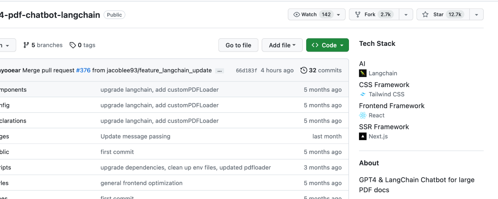

## 前言
最近在做一个 Side Project，计划等差不多完成之后就发到 V2EX 之类宣传一下。但是根据之前的经验，在 V2EX 上会有一些用户会对别人来宣传的网站进行攻击，可能是出于恶作剧吧。太难的先不说，最起码的对着没有鉴权的接口硬刷的简单攻击可以防御一下。

## 解决思路
很容易想到简单的解决方案，建个 map 把访问者的 ip 和统计的次数存起来。然后短时间访问超过一定次数就给 Ban 掉。说干就干。 我这个产品的后台是用 Go + Echo 写的，所以就用 Go 来实现个中间件。

代码放在[这里](https://github.com/CorrectRoadH/echo-ban-ip)了: `https://github.com/CorrectRoadH/echo-ban-ip`  (这个名字确实反复了好久🤣，本来想像 FilterRequest 之类的，但是想来想去还是 ban IP 最简单直接，所以就叫这个名字了)。

最基础的用例在这里:

`go get github.com/CorrectRoadH/echo-ban-ip`
```go
package main

import (
	"net/http"
	"time"

	banip "github.com/CorrectRoadH/echo-ban-ip"
	"github.com/labstack/echo/v4"
)

func main() {
	e := echo.New()

	e.Use(banip.FilterRequestConfig(banip.FilterConfig{
		LimitTime:         1 * time.Minute,
		LimitRequestCount: 60,
		BanTime:           1 * time.Hour,
	}))

	e.GET("/", func(c echo.Context) error {
		return c.String(http.StatusOK, "Hello, World!")
	})
	e.Logger.Fatal(e.Start(":1323"))
}
```

我还根据 Echo 的一些基本的实践加上了 `Skiper`、`Custom Deny Hander`、 `Custom Error Hander`之类的可选项。具体的使用方式可以看项目中的 [README.md](https://github.com/CorrectRoadH/echo-ban-ip)。

## 展望
🤔 感觉只是简单的这些限制手段还是不太够，比如说能不能多级限制政策，比如一分钟60次、两分钟100次，十分钟500次之类更多限制，防止攻击者来卡这个边际线来攻击。

再比如按访问者的类型来限制，一眼就是机器人(比如从UA、指纹来判断)一分钟30次的限制，但是比如有一些带Cookie、Token之类的用户可以有更高的限制条件。但是我这里确实没有想到这种分级条件是当成业务里写好，还是当成中间件去做。放到中间去做唯一的问题就是会让简单的中间件变的复杂了，尽管能实现各种通用的需求，但是用户上手起来可能有点学习成本了。


## 运营(广告)时间
👀我来带上我的 Side Project 来宣传一下: Tech Stack, 一款浏览器插件，可以在访问 GitHub 公共存储库时，该扩展将显示该项目所用的技术栈。像这样:




目前已经在 firefox 和 Chrome 上架了， 和Edge(可以直接用Chrome的)还在审核中。欢迎大家来试试一下。

Firefox: https://addons.mozilla.org/en-US/firefox/addon/tech-stack/
Chrome: https://chrome.google.com/webstore/detail/tech-stack-show-github-re/lbhjnhabgddabnagncmcgomggeadlbhh
