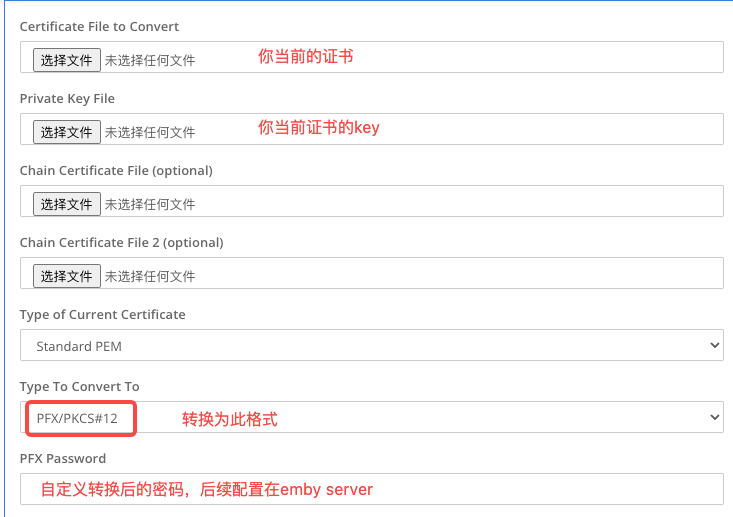
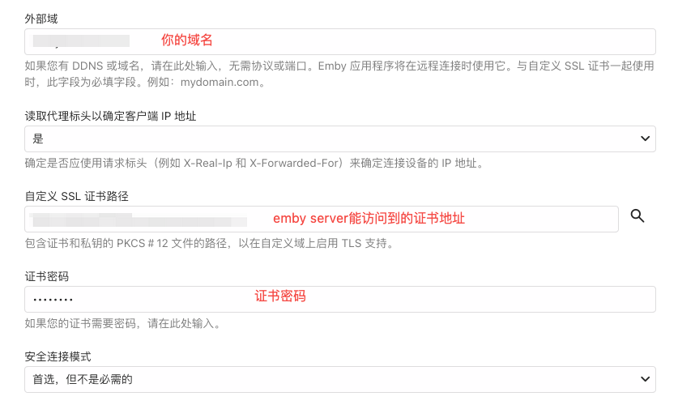

# 在家里云中下载emby 
- [下载地址](https://emby.media/download.html)
# 使用zerotier 节点将emby流量到家里云
- 节点 nginx配置
    ```shell
    user www-data;
    worker_processes auto;
    pid /run/nginx.pid;
    include /etc/nginx/modules-enabled/*.conf;
    
    events {
            worker_connections 768;
            # multi_accept on;
    }
    
    http {
    proxy_cache_path  /var/cache/nginx/emby-videos levels=1:2 keys_zone=emby-videos:100m inactive=15d max_size=50g use_temp_path=off;
    map $request_uri $h264Level { ~(h264-level=)(.+?)& $2; }
    map $request_uri $h264Profile { ~(h264-profile=)(.+?)& $2; }
    
    proxy_cache_path /var/cache/nginx/emby levels=1:2 keys_zone=emby:100m max_size=5g inactive=90d use_temp_path=off;
    
    upstream emby-backend {
         server  <ip>:<port>;
         keepalive 1024;
    }
    
    server {
        listen 80;
        listen [::]:80;
        listen 443 ssl http2;
        listen [::]:443 ssl http2;
        server_name emby.beocean.net;
        ssl_certificate /etc/ssl/beocean.net/certificate.crt;
        ssl_certificate_key /etc/ssl/beocean.net/private.key;
        ssl_protocols TLSv1.1 TLSv1.2 TLSv1.3;
        ssl_ciphers EECDH+CHACHA20:EECDH+CHACHA20-draft:EECDH+AES128:RSA+AES128:EECDH+AES256:RSA+AES256:EECDH+3DES:RSA+3DES:!MD5;
        ssl_prefer_server_ciphers on;
        ssl_session_cache shared:SSL:10m;
        ssl_session_timeout 10m;
        error_page 497  https://$host$request_uri;
    
        client_body_buffer_size 512k;
        client_max_body_size 200000M;
        add_header Strict-Transport-Security "max-age=15552000; preload" always;
        add_header 'Referrer-Policy' 'origin-when-cross-origin';
        add_header X-Frame-Options "SAMEORIGIN" always;
        add_header X-Content-Type-Options "nosniff" always;
        add_header X-XSS-Protection "1; mode=block" always;
    
        keepalive_timeout 120s;
        keepalive_requests 10000;
    
        proxy_hide_header X-Powered-By;
        proxy_buffer_size 32k;
        proxy_buffers 4 64k;
        proxy_busy_buffers_size 128k;
        proxy_temp_file_write_size 128k;
        proxy_connect_timeout 1h;
        proxy_send_timeout 1h;
        proxy_read_timeout 1h;
    
        location /swagger {
            return 404;
        }
    
        location = / {
            return 302 web/index.html;
        }
    
        location / {
            proxy_pass https://emby-backend;
            proxy_set_header Host $host;
            proxy_set_header X-Real-IP $remote_addr;
            proxy_set_header X-Forwarded-For $proxy_add_x_forwarded_for;
            proxy_set_header X-Forwarded-Proto $scheme;
            proxy_set_header X-Forwarded-Protocol $scheme;
            proxy_set_header X-Forwarded-Host $http_host;
            proxy_set_header REMOTE-HOST $remote_addr;
            proxy_set_header Upgrade $http_upgrade;
            proxy_set_header Connection "";
            proxy_set_header Accept-Encoding "";
            proxy_http_version 1.1;
            proxy_cache off;
        }
    
        location /web/ {
            proxy_pass https://emby-backend;
            proxy_set_header Host $host;
            proxy_set_header X-Real-IP $remote_addr;
            proxy_set_header X-Forwarded-For $proxy_add_x_forwarded_for;
            proxy_set_header X-Forwarded-Proto $scheme;
            proxy_set_header X-Forwarded-Protocol $scheme;
            proxy_set_header X-Forwarded-Host $http_host;
            proxy_set_header REMOTE-HOST $remote_addr;
            proxy_set_header Upgrade $http_upgrade;
            proxy_set_header Connection "";
            proxy_set_header Accept-Encoding "";
            proxy_http_version 1.1;
            # 如果你使用cloudflare或其他缓存js|css文件，可取消下一行的注释来关闭本机缓存
            # proxy_cache off;
        }
    
        location = /embywebsocket {
            proxy_pass https://emby-backend;
            proxy_set_header Host $host;
            proxy_set_header X-Real-IP $remote_addr;
            proxy_set_header X-Forwarded-For $proxy_add_x_forwarded_for;
            proxy_set_header X-Forwarded-Proto $scheme;
            proxy_set_header X-Forwarded-Protocol $scheme;
            proxy_set_header X-Forwarded-Host $http_host;
            proxy_set_header REMOTE-HOST $remote_addr;
            proxy_set_header Upgrade $http_upgrade;
            proxy_set_header Connection "upgrade";
            proxy_set_header Accept-Encoding "";
            proxy_http_version 1.1;
            proxy_cache off;
        }
    
        location /emby/videos/ {
            proxy_pass https://emby-backend;
            proxy_set_header Host $host;
            proxy_set_header X-Real-IP $remote_addr;
            proxy_set_header X-Forwarded-For $proxy_add_x_forwarded_for;
            proxy_set_header X-Forwarded-Proto $scheme;
            proxy_set_header X-Forwarded-Protocol $scheme;
            proxy_set_header X-Forwarded-Host $http_host;
            proxy_set_header REMOTE-HOST $remote_addr;
            proxy_set_header Upgrade $http_upgrade;
            proxy_set_header Connection "";
            proxy_set_header Accept-Encoding "";
            proxy_http_version 1.1;
            proxy_cache off;
            proxy_buffering off;
        }
    
        location ~ ^/emby/videos/\d+/(?!live|\w+\.m3u8|hls1) {
            slice 14m;
    
            proxy_pass https://emby-backend;
            proxy_set_header Host $host;
            proxy_set_header X-Real-IP $remote_addr;
            proxy_set_header X-Forwarded-For $proxy_add_x_forwarded_for;
            proxy_set_header X-Forwarded-Proto $scheme;
            proxy_set_header X-Forwarded-Protocol $scheme;
            proxy_set_header X-Forwarded-Host $http_host;
            proxy_set_header REMOTE-HOST $remote_addr;
            proxy_set_header Upgrade $http_upgrade;
            proxy_set_header Connection "";
            proxy_set_header Accept-Encoding "";
            proxy_set_header Range $slice_range;
            proxy_ignore_headers Expires Cache-Control Set-Cookie X-Accel-Expires;
            proxy_http_version 1.1;
            proxy_connect_timeout 15s;
    
            proxy_cache emby-videos;
            proxy_cache_valid 200 206 301 302 7d;
            proxy_cache_lock on;
            proxy_cache_lock_age 60s;
            proxy_cache_use_stale error timeout invalid_header updating http_500 http_502 http_503 http_504;
            proxy_cache_key "$uri?MediaSourceId=$arg_MediaSourceId&VideoCodec=$arg_VideoCodec&AudioCodec=$arg_AudioCodec&AudioStreamIndex=$arg_AudioStreamIndex&VideoStreamIndex=$arg_VideoStreamIndex&ManifestSubtitles=$arg_ManifestSubtitles&VideoBitrate=$arg_VideoBitrate&AudioBitrate=$arg_AudioBitrate&SubtitleMethod=$arg_SubtitleMethod&TranscodingMaxAudioChannels=$arg_TranscodingMaxAudioChannels&SegmentContainer=$arg_SegmentContainer&MinSegments=$arg_MinSegments&BreakOnNonKeyFrames=$arg_BreakOnNonKeyFrames&h264-profile=$h264Profile&h264-level=$h264Level&slicerange=$slice_range";
        }
    
        location ~ ^/emby/Items/.*/Images/ {
            proxy_pass https://emby-backend;
            proxy_set_header Host $host;
            proxy_set_header X-Real-IP $remote_addr;
            proxy_set_header X-Forwarded-For $proxy_add_x_forwarded_for;
            proxy_set_header X-Forwarded-Proto $scheme;
            proxy_set_header X-Forwarded-Protocol $scheme;
            proxy_set_header X-Forwarded-Host $http_host;
            proxy_set_header REMOTE-HOST $remote_addr;
            proxy_set_header Upgrade $http_upgrade;
            proxy_set_header Connection "";
            proxy_set_header Accept-Encoding "";
            proxy_http_version 1.1;
    
            proxy_cache emby;
            proxy_cache_key $request_uri;
            proxy_cache_revalidate on;
            proxy_cache_lock on;
        }
    }
    }
    ```
# 配置emby ssl
1. 获取 **PKCS #12** 格式证书，若是已有其他格式的证书可以通过[证书格式转换器](https://www.sslshopper.com/ssl-converter.html)转换
   
2. 配置emby server
   

# 参考文章
1. [Secure Your Server](https://emby.media/support/articles/Secure-Your-Server.html#setup-emby-with-your-domain-and-ssl-certificate)


