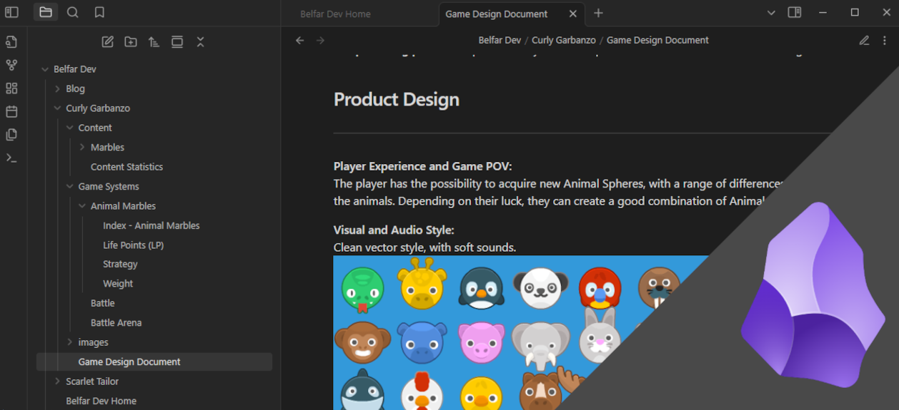

_This week on "What's new with Project Marbles?"_

> I have no idea what I am doing.

Well, it's not _exactly_ like that...

## Ok, what has changed?

First of all, I'd like to reserve some words to praise [Obsidian](https://obsidian.md). It is a great platform for note-taking and overall organization, helping with my chaotic organization to have some strucure due to its linking between documents. It also has a neat graph visualization mode - 90% of the current nodes are animals and they are not connected, I know, but that will change in the future.

But let's go forward and not allow ourselves be stuck on petty matters, and talk about what's **new**:

### No more weird-shaped angled arena
One challange that was hindering my progress on the dynamic of the battles between marbles was the need for the arena to have a central angled floor, in order to force the competing marbles to collide. But then, speaking with a cherished person of mine about the game, they made me remember one small, important fact: this was a game! It would not have to follow real world logic - or else we'd be already tossing marbles in bowls in huge competitions around the world (I began this phrase with the intention of being sarcastic, but now that I wrote it out, I see that is entirely possible. Not sure if that niche audience is good or bad for my game, but, anyway!).