When you're working on a project or computer program, you might need to use the ASCII value of a certain character.

This is a common phenomenon in competitive programming, as well – we typically need to use the ASCII value of characters when solving some of the problems on various online platforms like HackerRank, Codeforces, and Codechef.

What do we do in those situations? Most of us simply search for the ASCII value on the internet, like this:

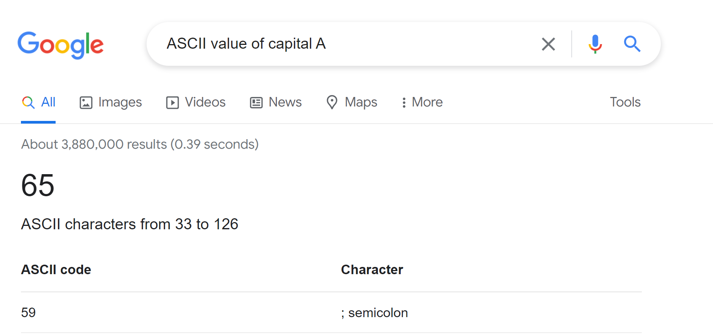

Yes, it's true that we can get the ASCII value of any character directly by searching the internet. But sometimes you might not be able to search for them on the internet. Like if you are taking an exam, you might be forbidden from accessing the internet during the exam.

So what would you do if you don't remember the ASCII value of the character you need, and you are also forbidden to search for it on the internet?

No need to panic! In this article, I am going to solve the problem for you. You will never need the internet for searching the ASCII value of any character ever again.

## Getting Started

Suppose you are writing a C program, and you also need to know the ASCII value of a character. Fear not! You do not need to shift to other languages just to get the value using code – you can do that within your C code! Follow the code below:

```c
#include<stdio.h>
int main()
{
    char ch = 'A';
    printf("%c\n" , ch);
}
```

Can you tell me what we would get in the output? If you think that you would get the character itself in the output, then you are correct!

```
// A
```

I used the `//` to indicate the comment here.

Let me give you a nice screenshot below as well:

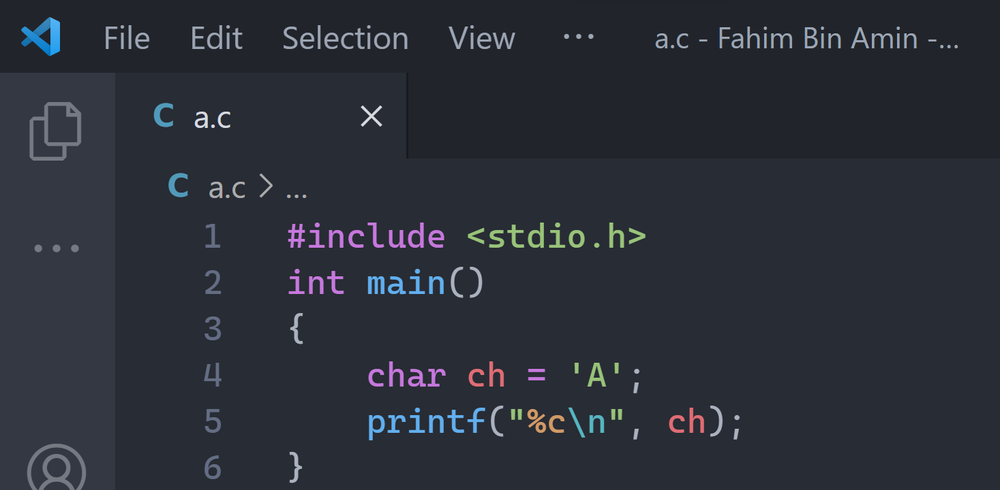

In line 4, I am taking a character type data as `ch`, and I am assigning a character to this variable. For now, I am taking the character 'A', then I am printing the character itself in line 5.

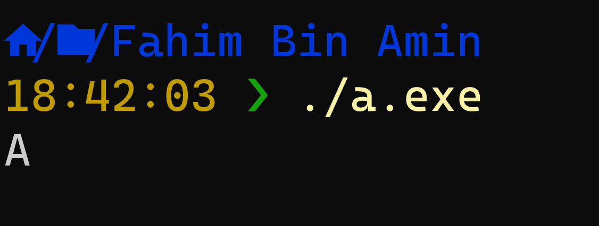

But if I use `%d` instead of `%c`, then I am telling it to print the integer value of the character, not the character itself.

If we talk about the integer value of a character, then it can represent one thing – the ASCII value of the character, right? The sample code is given below:


In the output, we will get the ASCII value of the character 'A'.


That is how we get the ASCII value of any character using the above code.

Let me introduce you to a more interesting thing now. As I am only showing you the process of getting the ASCII value of the English alphabet, you may wonder whether the code only works for getting the ASCII value of an alphabet letter or whether it works with any valid characters.

Well, the good news is that this process works for any valid characters! Let me show you more examples first.

## How to Get the ASCII Value of a Space ( )

A space is also considered a valid character. In code, normally we use a space to represent it, like char `ch = ' '`. So if I use the space in the above code – but this time I use the space instead of the alphabet letter – then the code would be like this:

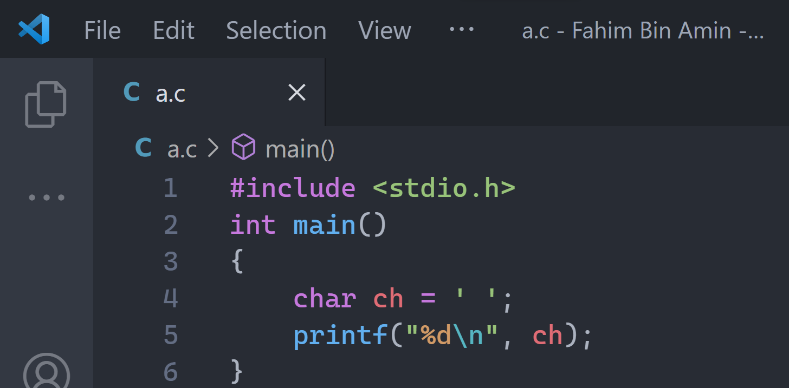

In line 4, we assigned a space into the character variable named `char`. Now, if I run the code, then I would get the ASCII value of a space, which is 32.

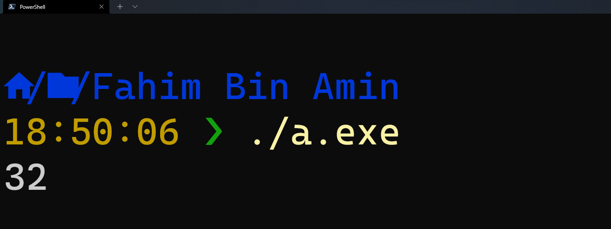

Now, if you can understand how this works, then let me give you a simple task. In all of the code, we assigned character data manually and we checked the ASCII value by printing the value in the output.

In this process, if we want to get the ASCII value of various characters, then we need to change the code manually each time. But this might be a hassle if we want something like an ASCII calculator, where the user would provide the character as an input and the code would provide the exact ASCII value as the output in the terminal.

Do you think you could create that now on your own? Don't scroll down until you have tried to write down the code at least once!

Alright, I hope you have tried to make the calculator by tweaking the code a little bit. If you struggle in doing so, then do not worry as I have you covered.

## How to Make an ASCII Calculator

Earlier we assigned each character manually in our code. As we want the user to provide the character itself, we will tweak the code a little bit.

This time, we won't assign character values in the character variables. We will declare a character variable first so that we can assign the character to the variable later. Then we'll ask the user to provide a character in the terminal.

After getting the input from the user, we will assign the value to our character variable. Then we'll simply print the ASCII value of the character in the terminal. It's that easy!

Simply follow the code below, and I'll explain all of the steps again below:

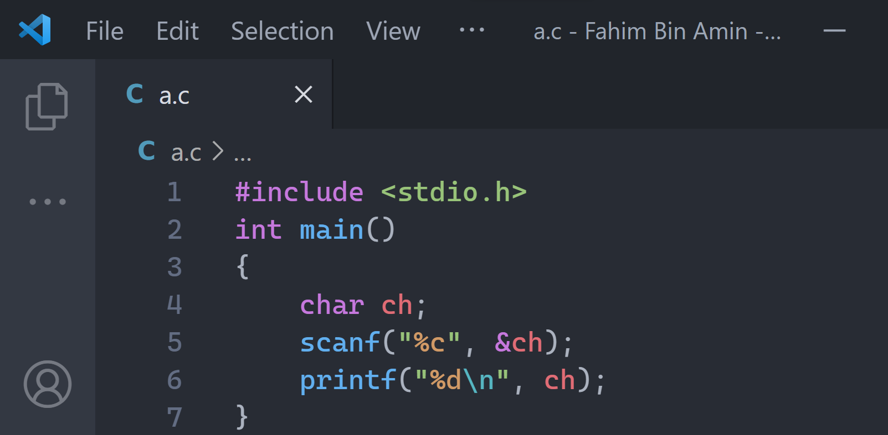

Let me explain what I did in the code first. Then I will show you the result by running the program.


As you can see, I included the basic and must needed standard header file in line 1. `stdio` represents the standard input and output format.

Basically, `stdio.h` is a header file that has the necessary information to include the input/output related functions in our program. As we will definitely work on input and output, it is a necessary header file in our C program.


In line 2, I added the main function. A main is a predefined keyword or function in C. The execution of any C program always starts from the main function – keep that in your mind.

We have to provide the return type of the function. I used `int` so that the main function can return any integer value. But as you can see, I am not actually returning anything later. So, I can also use `void` instead of `int` in line 2. The output would be exactly the same. Void means that it does not return anything.


In line 3 and in line 7, I used curly braces `{` `}`. Normally we use curly braces to group a set of statements. As all of the statements (or, you could say, the lines of code) from line 4 to line 6 are included in the main function, I used those curly braces to represent them all as a set of statements, or a block of code.


In line 4, I declared a character variable. We use `char` to represent the character data type.

After declaring the data type, we need to provide the name of the character. I used `ch` as my variable name, but you can use any name you want except the [C keyword](https://www.javatpoint.com/keywords-in-c). There are [some conventions of naming a variable in the C programming language](https://www.programiz.com/c-programming/c-variables-constants#:~:text=%3D%20%27l%27%3B-,Rules%20for%20naming%20a%20variable,name%20(identifier)%20can%20be.) you can check out, too.

The semicolons ( `;` ) are the end statements in the C programming language. We use `;` to indicate the end of a line of code.


In line 5, I am using the `scanf` function. We use it to get input from the user. I am taking a character value from the user as input. Here, `%c` refers to character type data.

After taking the character value as input from the user, we are storing the value into our character variable, `ch`. (If we don't store the data, then how we are going to make calculations on them, right?).

`&` is an address operator, and the `&` operator is used to get the address of the variable. As we are using `&ch`, it indicates that we are telling the C compiler that we are giving or passing the input data value in the `ch` variable. We pronounce `&` as Ampersand.


In line 6, I am printing the ASCII value of the character (the character we have taken as an input from the user).

I have talked a lot, haven't I? 😅 Now, it is time to show you the result of our very simple ASCII calculator.

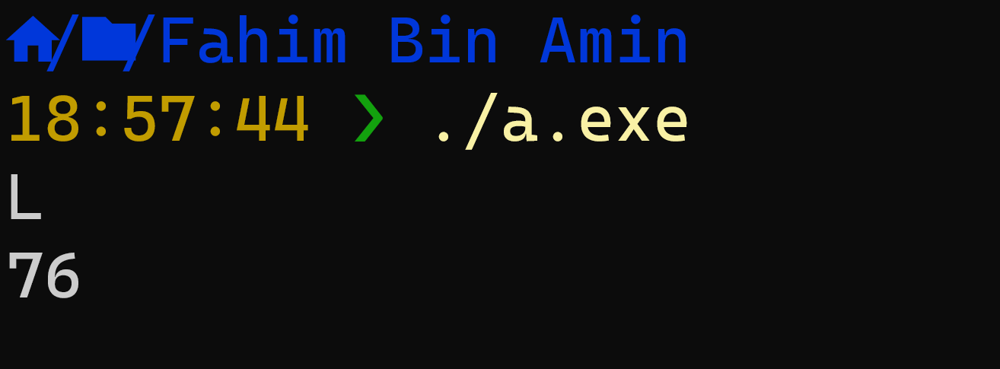

Here I provided `L` as input to get the ASCII value of `L`. In the next line, the program provided 76 as the output, and 76 is the exact ASCII value of `L`.

Now let's check something different. I will check the ASCII value of `!` now.

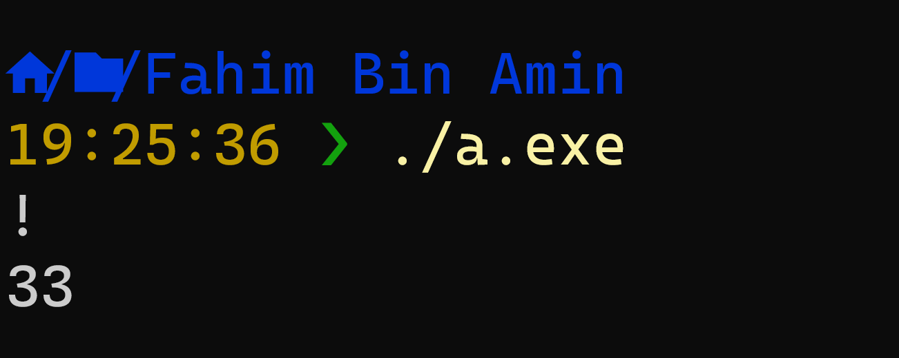

As you can see, it's working flawlessly! Now let's make the code prettier.

You see, as we have written the entire code, we can understand that we have to give a character value as input first. Then the program provides the ASCII value.

But other users might not get that. They might also get confused about what they should do after running the code – like, will the code directly provide the ASCII value of any random character or anything else? We do not want to make others confused with our simple yet kind of handy project, right?

Let's provide some statements first that make it easier for users to figure out what they need to do after executing the code. The code would look like this:

```c
#include <stdio.h>
void main()
{
    char ch;
    printf("Enter a character: ");
    scanf("%c", &ch);
    printf("The ASCII value of %c is: %d\n", ch, ch);
}
```

We all want a nice screenshot. Let me give you one:

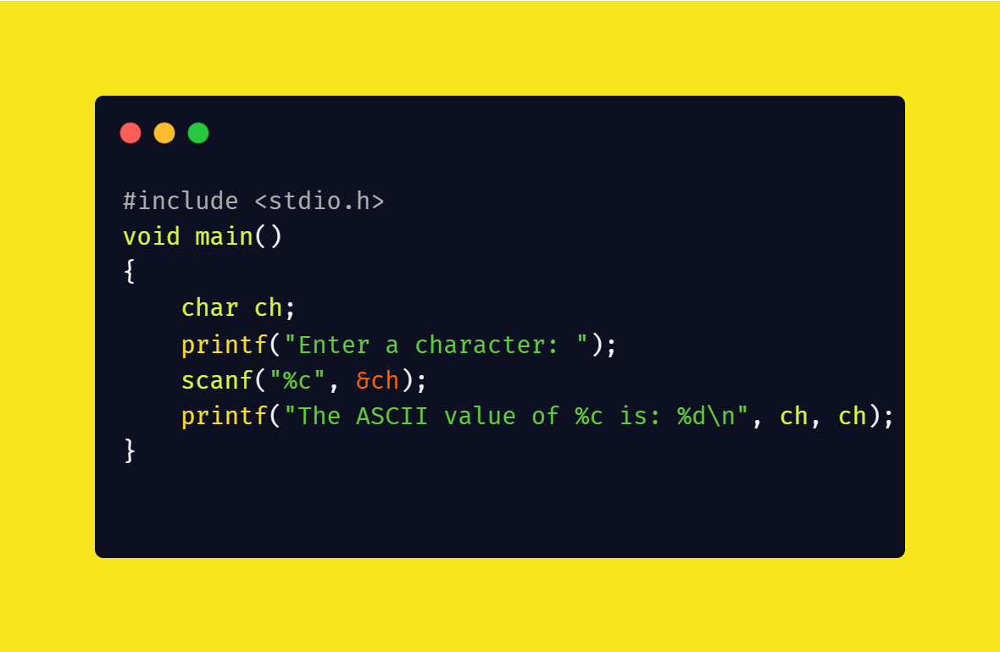

Fear not! I will explain all the modified parts now:


In line 5, I have added a print statement to show the given string each time the user executes the code. I want the users to know that they simply need to input a character in the terminal after running the program.


In line 7, I have modified the print function a little bit. I want the code to generate a nice line along with providing the ASCII value of the given character. The `%c` indicates that we would provide the character itself here, and the `%d` is indicating to print the integer value as earlier.

Now let me show you the result by providing random characters as input.

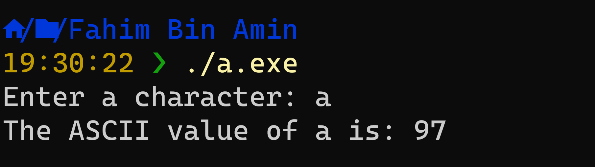

It looks beautiful, right? At least, prettier than the earlier code, as the users will get everything here – what they would need to do, what value the program is providing in the output, and so on, right?

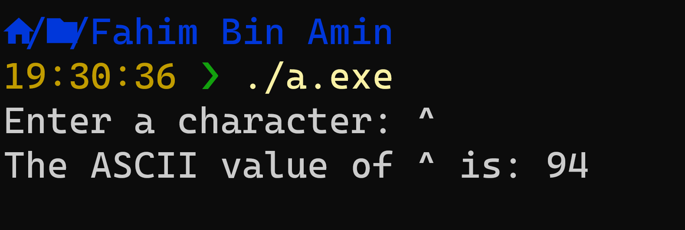

I have also added this last code in [my public gist](https://gist.github.com/FahimFBA/e0c9c3697db9dd45301edb8cdde499db).

Our ASCII calculator is ready! We have learned a lot, even though we only used some simple code.

If you're wondering that we used the C programming language in this article, but can't we do this using other programming languages? The answer is YES! I was thinking about showing you the exact ASCII calculator using other languages, but that would make this article way bigger. So I am keeping that task and letting you do it for yourself.

You can also customize the code to fit your needs, add a nice GUI, and so on. Explore the wonderful world of programming 😊 

## Conclusion

I hope this article helps you in understanding how basic C programs work.

Thanks for reading the entire article. If it helps you then you can also check out other articles of mine!

If you want to get in touch with me, then you can do so using [Twitter](https://x.com/Fahim_FBA), [LinkedIn](https://www.linkedin.com/in/fahimfba/), and [GitHub](https://github.com/FahimFBA).

You can also [SUBSCRIBE to my YouTube channel](https://www.youtube.com/@FahimAmin?sub_confirmation=1) (Fahim Amin) if you want to learn various kinds of programming languages with a lot of practical examples regularly.

You can also [visit my website](https://fahimbinamin.com/) to learn more about me and what I'm working on.

Thanks a bunch!