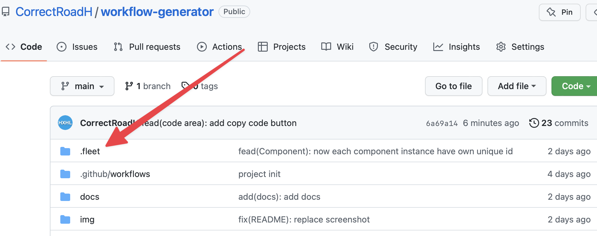
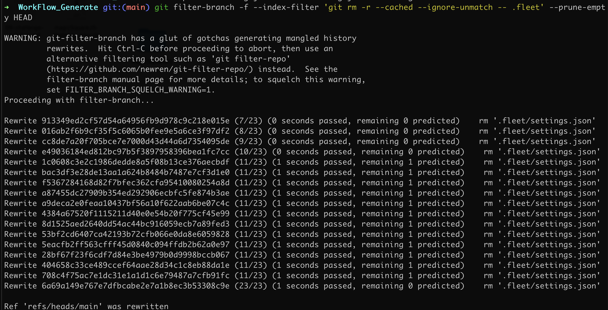

前几天在收到Fleet的内测邮件后，我开始尝试Fleet。但是忘记在`.gitignore`里忽略`.fleet`了。在commit多个版本之后，才后知后觉的发现多了一个无必要的文件夹，所以要把git里的所以commit里的这个文件夹都删掉。


如果要删除一个文件用这个
```git
git filter-branch -f --index-filter 'git rm --cached --ignore-unmatch -- 文件名' --prune-empty HEAD
```

如果要删除一个文件夹用这个
```git
git filter-branch -f --index-filter 'git rm -r --cached --ignore-unmatch -- 文件夹名' --prune-empty HEAD
```


成功删除