## 简介
最近在看**raywenderlich**家的*Advanced Git*，**raywenderlich**的出的书，我一直挺喜欢的。这本*Advanced Git*第三章讲了一些关于`rebase`的拓展操作让我觉得非常的有用。所以在这里记录了一下。

提供一个供练习的git库 https://github.com/CorrectRoadH/git-practice

## 使用rebase合并commit
如果我们有多个commit时，如果我们想把多个commit合并成一个时

`git log --oneline --graph`

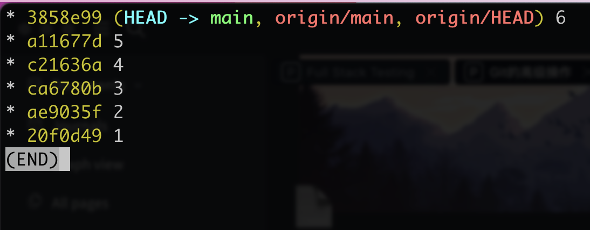

以这个log为例，我们想把commit 2 与 3 合并成一个commit。

我们就需要`rebase -i `到2之前的commit，比如这里为`git rebase 20f0d49`。

然后我们就进到这样的一个页面。

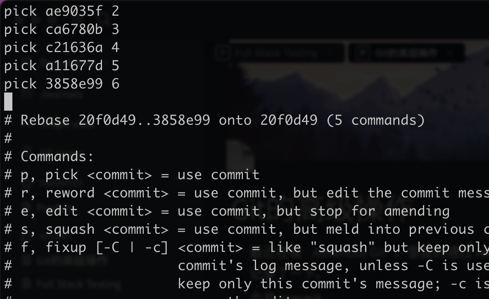

我们把3的`pick`改成`squash`或者`s`都行，这样3与3的上面那个(2)都会进行合并。

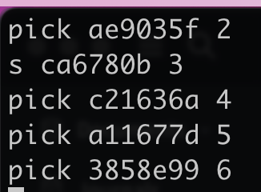

然后退出(esc,:wq)，看到这里应该不会有不会用vim的同学吧。🤔

在退出vim之后，又会进到另一个vim。在这里编辑2、3所合并的新commit的commit message。

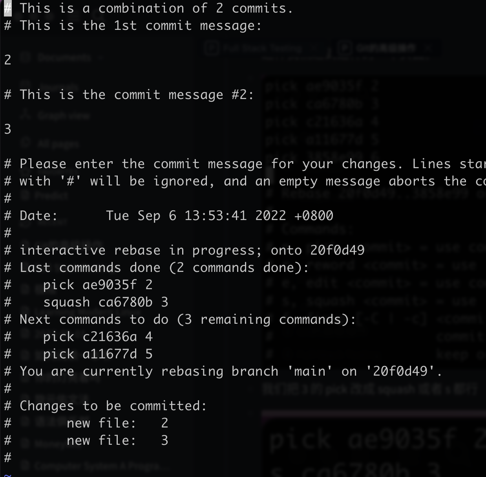

在这里，我们直接`gg`、`dG`，把整个文件清空，然后写上整合2和3的新commit的消息。

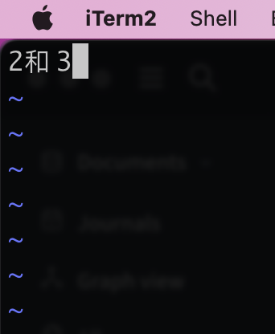

继续保存退出。

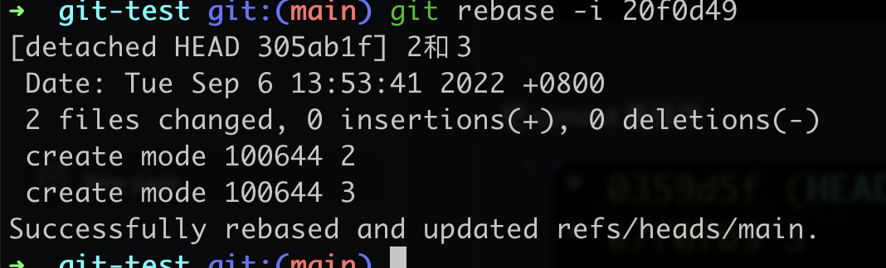

现在我们看git log。合并完成!

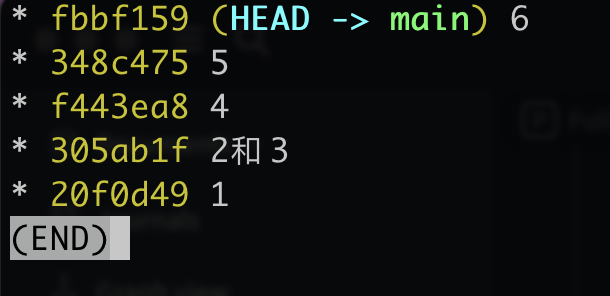

## 调整commit的顺序

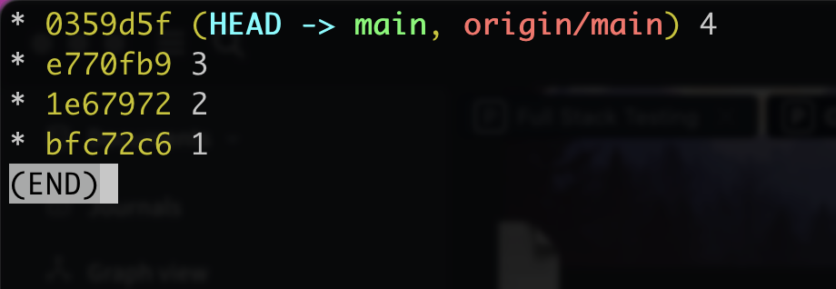

我们想把2与3的位置交换的话  

`git rebase -i 1的hash`   

然后进入VIM  

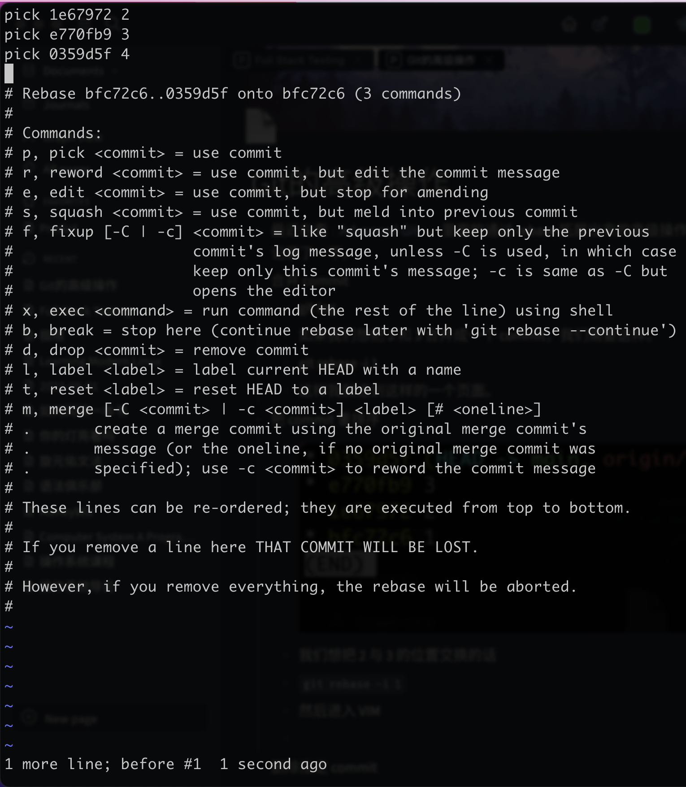

交换你想交换的commit的顺序。(比如可以使用`dd`和`p`)

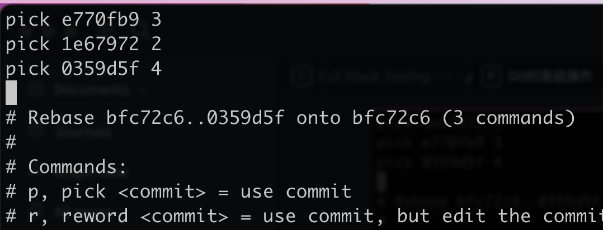

然后退出vim就可以了

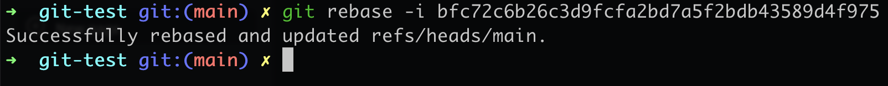

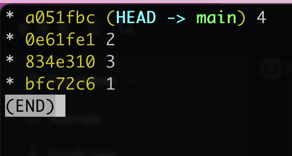

交换成功!

## 重写历史commit的消息

同上，直接rebase -i进去，然后修改的commit消息。  

在你要重写历史的commit之前把`pick`改成`reword`或者 `r` 

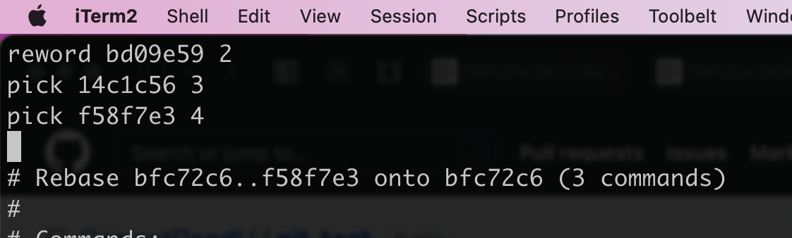

然后保存退出vim，接下来进来这里，

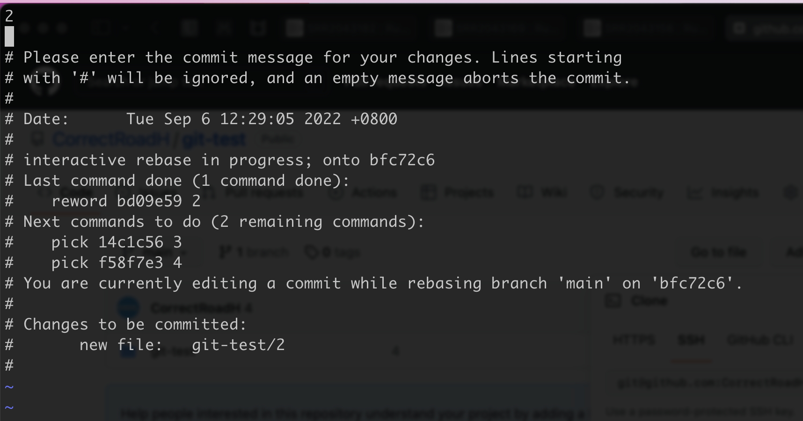

这里我们可以直接清空，然后把新的 commit 消息写下。然后保存退出就ok了。

## 删除指定commit

同上，进入到rebase interact之后，我们把要删的commit前面的pick改成d或者drop之后保存退出就ok了。

## 总结

rebase通过`-i`(interact)提供了大量有用的功能，同时非常的好记、好上手。