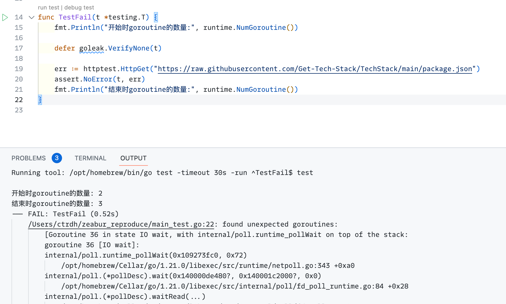
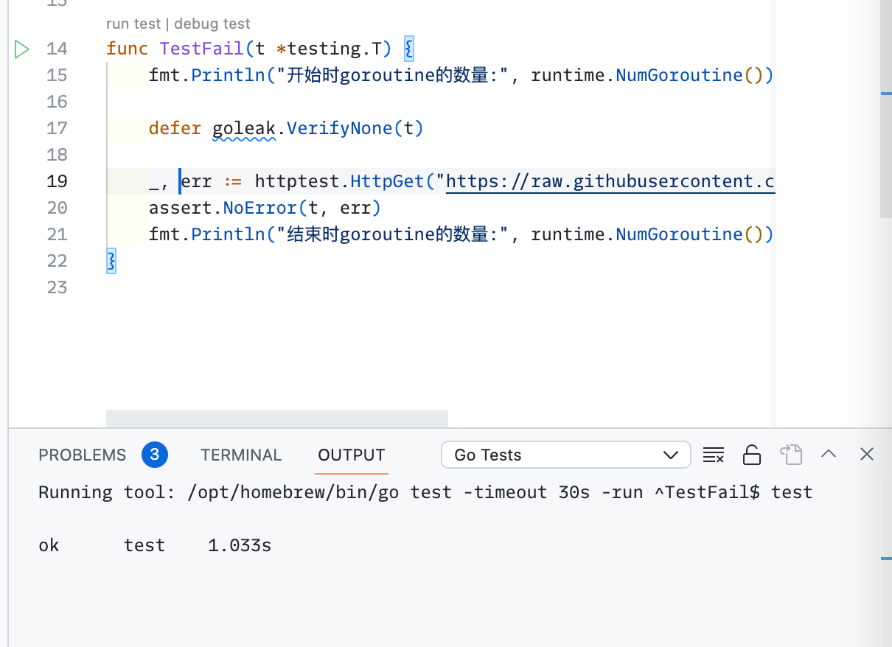

## 问题背景
不得不说 Golang 的 DX 做的很舒服，比如在测试有问题的并发代码中会提醒你 Data Race 。这样就不用等你发现数据出问题了，再去找代码的问题。👀 最近开始用的一个很有帮助的工具就是 Goleak。来帮助我们找到泄漏的 goroutine。可以理解成其它语言的线程👀，泄漏意思就是工作做完之后，还有些这个工作开的 goroutine 没有结束。就像申请的内存在使用完之后没有释放一样。

按[教程](https://zhuanlan.zhihu.com/p/361737398)给我的代码测试加个了 goleak 测试。

但是一下测试， goleak 和我说我的代码有 goroutine 泄漏。🤯 我代码有不少并发代码，但是都是用的 sync.WaitGroup 来控制的。没有[网上常见的什么 channel 导致的问题](https://www.cnblogs.com/paulwhw/p/17003763.html)，所以我很奇怪为什么会有 goroutine 泄漏的问题。

通过给子函数加单元测试二分查找一下，我很快定位问题的位置，并不是我写的并发代码产生的 goroutine 泄漏。这个泄漏居然产生一个 Http 请求的代码里面。🤯

代码通过简化大概如下 👇

代码:
```golang
package httptest

import (
	"net/http"
)

func HttpGet(url string) error {
	resp, err := http.Get(url)
	if err != nil {
		return err
	}
	defer resp.Body.Close()
	return nil
}
```

测试:
```golang
package httptest_test

import (
	"fmt"
	"runtime"
	"testing"

	"github.com/stretchr/testify/assert"
	"go.uber.org/goleak"

	httptest "test"
)

func TestFail(t *testing.T) {
	fmt.Println("开始时goroutine的数量:", runtime.NumGoroutine())

	defer goleak.VerifyNone(t)

	err := httptest.HttpGet("https://raw.githubusercontent.com/Get-Tech-Stack/TechStack/main/package.json")
	assert.NoError(t, err)
	fmt.Println("结束时goroutine的数量:", runtime.NumGoroutine())
}
```
测试结果: 可以看到结果时的 goroutine 数量比开始时多了一个。说明有一个 goroutine 泄漏了。


```
开始时goroutine的数量: 2
结束时goroutine的数量: 3
--- FAIL: TestFail (0.52s)
    /Users/ctrdh/zeabur_reproduce/main_test.go:22: found unexpected goroutines:
        [Goroutine 36 in state IO wait, with internal/poll.runtime_pollWait on top of the stack:
        goroutine 36 [IO wait]:
        internal/poll.runtime_pollWait(0x109273fc0, 0x72)
        	/opt/homebrew/Cellar/go/1.21.0/libexec/src/runtime/netpoll.go:343 +0xa0
        internal/poll.(*pollDesc).wait(0x140000de480?, 0x140001c2000?, 0x0)
        	/opt/homebrew/Cellar/go/1.21.0/libexec/src/internal/poll/fd_poll_runtime.go:84 +0x28
        internal/poll.(*pollDesc).waitRead(...)
        	/opt/homebrew/Cellar/go/1.21.0/libexec/src/internal/poll/fd_poll_runtime.go:89
        internal/poll.(*FD).Read(0x140000de480, {0x140001c2000, 0x1300, 0x1300})
        	/opt/homebrew/Cellar/go/1.21.0/libexec/src/internal/poll/fd_unix.go:164 +0x200
        net.(*netFD).Read(0x140000de480, {0x140001c2000?, 0x1400018e340?, 0x102242674?})
        	/opt/homebrew/Cellar/go/1.21.0/libexec/src/net/fd_posix.go:55 +0x28
```

如果看到[我该 close 的都 close 的🤔](https://manishrjain.com/must-close-golang-http-response#:~:text=The%20http%20Client%20and%20Transport,may%20not%20reuse%20HTTP%2F1.)，在好几个群里问来问去，我尝试换 URL 之类的还出过几个乌龙。最后谷歌了一下，在 [stack overflow](https://stackoverflow.com/questions/75026700/goroutine-leaks-when-trying-to-readallresponse-body-where-response-is-retu/75816347#75816347) 找到了问题所在，这个原因是由于`http.Get(url)`导致的。第二天另一个 Zeabur 的同学也找到了同样的帖子帮我解决了这个问题。🤣这里不得不感谢 Zeabur 了，经常遇到啥技术问题都发在他们工单群里，他们没有踢掉我不说还经常帮我解决问题。

## 解决方案
直接上解决该问题之后的代码:
```golang
func HttpGet(url string) ([]byte, error) {
	req, err := http.NewRequest("GET", url, nil)
	if err != nil {
		return []byte{}, err
	}
	client := http.Client{}
	resp, err := client.Do(req)
	if err != nil {
		return []byte{}, err
	}
	defer resp.Body.Close()
	defer client.CloseIdleConnections() // <-- 把空闲的连接关闭掉

	result, err := io.ReadAll(resp.Body)
	if err != nil {
		return []byte{}, err
	}

	return result, nil
}
```

这样就能通过测试了。🎉


## 原因

上面的 Stack overflow 其实也说了这个问题是因为`http.Client`使用了`Transport`，而这个会维护一个连接池保持那些`kept-alive`的连接。所以我们需要在`defer`里面调用`CloseIdleConnections`来关闭这些连接。