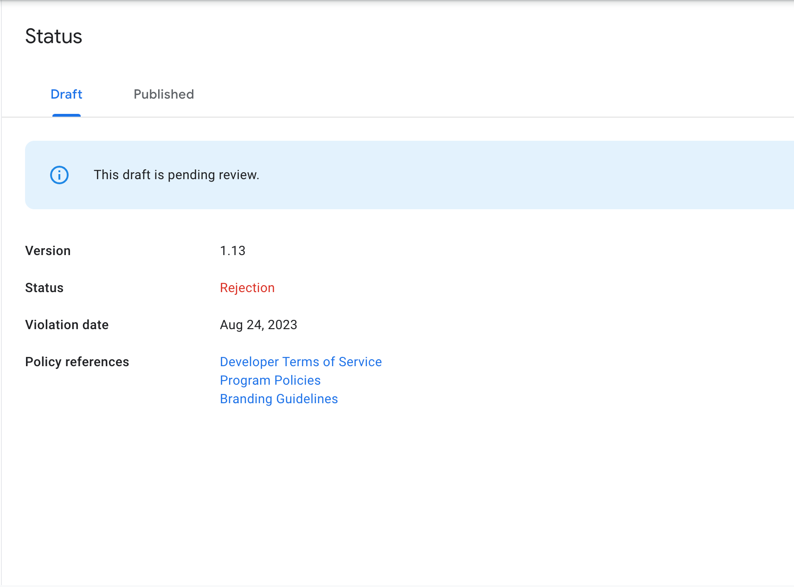
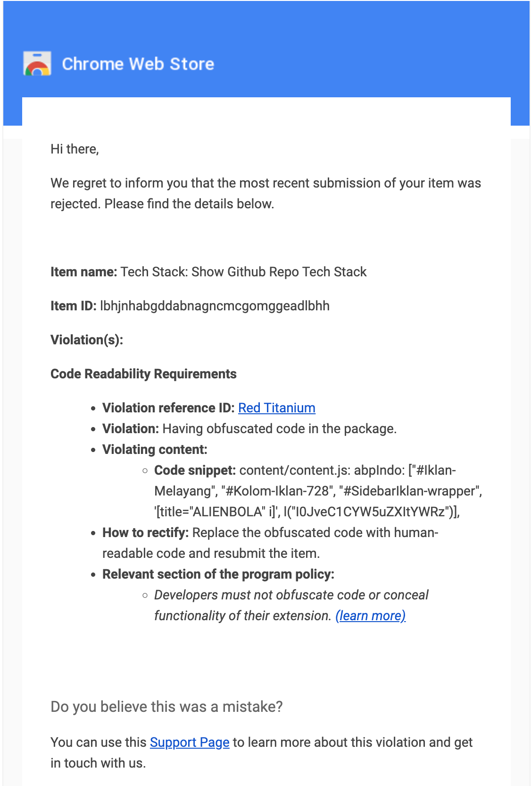
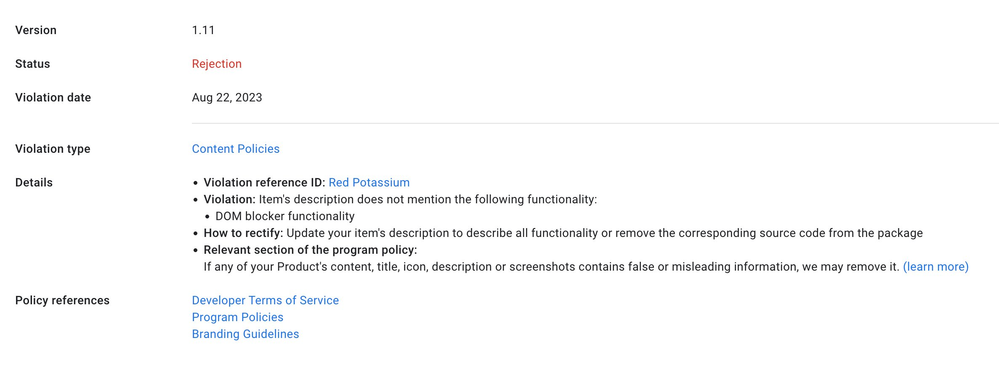
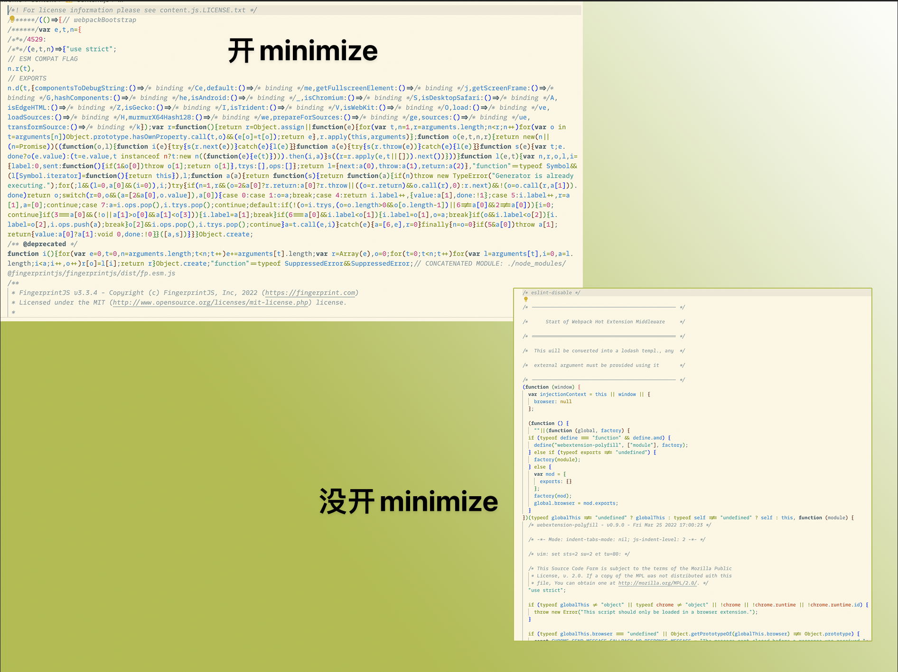
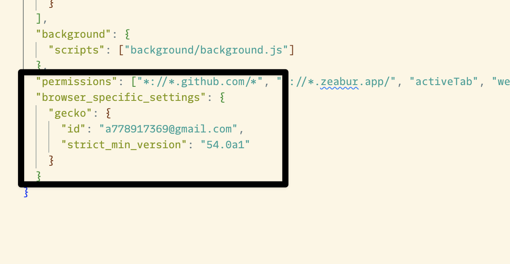
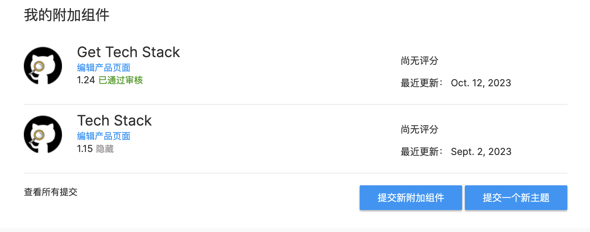

PS: 本文写于  2023-08-25 ，但是因为最近基本所有的下班时间都趴在 [TechStack](https://github.com/Get-Tech-Stack/TechStack?ref=blog) 上，再加上本人的拖延症一直犯，所以在咕了两个月之后才写好。🤣

### 谷歌插件无法过审
我的浏览器插件已经两周没有更新了，倒不是我没有写代码，而是总是被不停的拒绝并且没有任何的理由😭。所以我在不停的尝试代码中的各种地方，但是就是不能过审

最早以为是我的代码中有一个feedback(用了mailto)，点击就触发邮箱应用。是因为这个原因不能过审。

但是在每天晚上被拒绝一次之后我又提交一次之后并且每天晚上骂谷歌十分钟之后的今天我终于发现几封未读的邮件。🤯原来谷歌在这里把拒绝原因分开来发，倒不是我没有想到，主要是行为的不一致性，因为有时候拒绝原因是写在 Developer Dashboard 中的，如下图。 让人容易产生误解。以为就是只在 Developer Dashboard 通知开发者，根本没有想还会通过邮件通知开发者。

#### 解决办法
既然知道问题了就要解决问题。大概就是我提交的代码中不能混淆。但是我的插件是基于 GitHub 上的 boilerplate ，别人怎么就能用这个 boilerplate ，我不行?😅 

首先看一眼代码，确实感觉混淆在一起了把这里 minimize 改掉。

现在来看看效果，感觉还不错。大概有了代码的样子，但是这个应该还是babel转义过了🤔但是确实没有被混淆了。估计能过。

结果还是不行。认真看邮件，原来不是说我代码混淆过了。而是说我代码有『混淆』的代码。🤯 这里是指有一些代码是base64的，然后通过base64解密后再eval执行。这怎么可能，我怎么会写这种代码呢? 

定位到原因的代码。原来是 Fingerprint 搞的鬼，定位一下[issue](https://github.com/fingerprintjs/fingerprintjs/issues/734)，问题找到了，Fingerprint 在代码中用了Base64又编码了一些代码。无奈只能退回老版本。

改了之后终于可以比较正常的通过审核了

### Firefox 的 插件 ID
Firefox 的拓展是需要一个插件ID的，但是如果你没有给他，其实也是能用的，它会自动分配一个临时ID。但是一定要记的，自己手动分配一个ID。不然就会像我一样惨😭

我这里遇到的问题是如果调用 Storage 相关的 API 就一定不能用自动分配的临时ID，而我在做 Options 页的时候会用到 Storage，但是无奈新旧版本的 ID 不一样，不能更新，只能无奈放弃旧的插件用户，不过幸好 Firefox 的用户还少。不至于让一批用户无法更新。

### 不同浏览器的API兼容问题
这个主要就是做 Storage，Chrome 和 Firefox 关于插件存储的 API 不一致导致的。 这个通过web polyfill很简单就能解决了。

