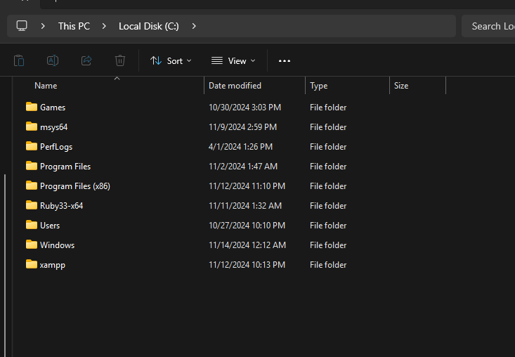
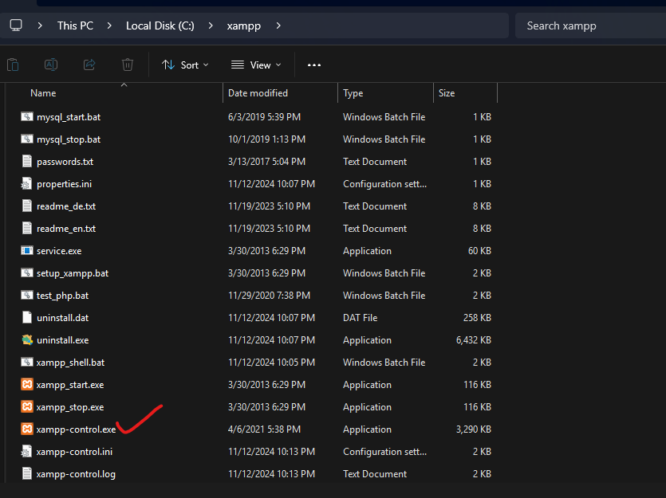
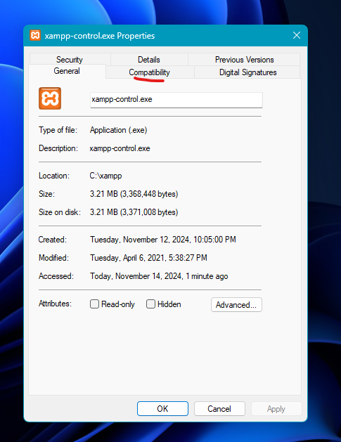

XAMPP is popular software for those who use MySQL databases and PHP. It’s free software, and it supports Windows, Linux OS, and MacOS. This makes it quite popular among developers even though it can also present us with many challenges.

One common issue you may have faced is the errors you can get when you want to exit the application. You can easily mitigate that issue by opening the application launcher as Administrator. But opening the launcher via administrator correctly can also be troublesome. This means that you’ll need to configure a setting so that it asks for administrator access each time you want to launch it.

In this quick tutorial, I’ll walk you through this process so you don’t have to struggle with it.

## Video Guide

I have prepared a complete video where I show you how to download and install the client. I also teach you how to make some changes so that you don’t encounter any issues when you want to quit the application.

<!-- <iframe width="100%" height="468" src="https://www.youtube.com/embed/5gIf0_xpFPI?si=N1WTorLKL0uwLsU_" title="YouTube video player" frameborder="0" allowfullscreen></iframe> -->

<iframe width="893" height="502" src="https://www.youtube.com/embed/3viM71-ULAw" title="How to Install &amp; Configure XAMPP Properly So That It Doesn&#39;t Give Error When You Want to Quit It!" frameborder="0" allow="accelerometer; autoplay; clipboard-write; encrypted-media; gyroscope; picture-in-picture; web-share" referrerpolicy="strict-origin-when-cross-origin" allowfullscreen></iframe>

## Step-By-Step Process

If you keep the default installation directory during the installation, it will install it inside the C drive of your Windows operating system.

So simply enter into the “C” drive and go inside the “xampp” directory.

Scroll down until you find the “xampp-control.exe” file.

Right-click after selecting the file and open the **Properties**.

Next, go to the **Compatibility** section. Make sure to add a check mark by clicking on the checkbox by “Run the program as an administrator”.

Click “Apply”, and “OK”.

That’s it!

Now, whenever you want to open the XAMPP launcher, it will always open with administrator access.

## Quitting the application

When you want to quit the application, you need to click the “Quit” button instead of using the “X” exit button at the upper right side of the window.

And now you shouldn’t get any errors when exiting the control panel anymore!

## Conclusion

Thanks for reading this short tutorial. I hope it helped you interact more easily with XAMPP.

You can follow me on [GitHub](https://github.com/FahimFBA), [LinkedIn](https://github.com/FahimFBA), and [YouTube](https://www.linkedin.com/in/fahimfba/) to get more content like this. Also, my [website is always available](https://www.fahimbinamin.com/) for you!