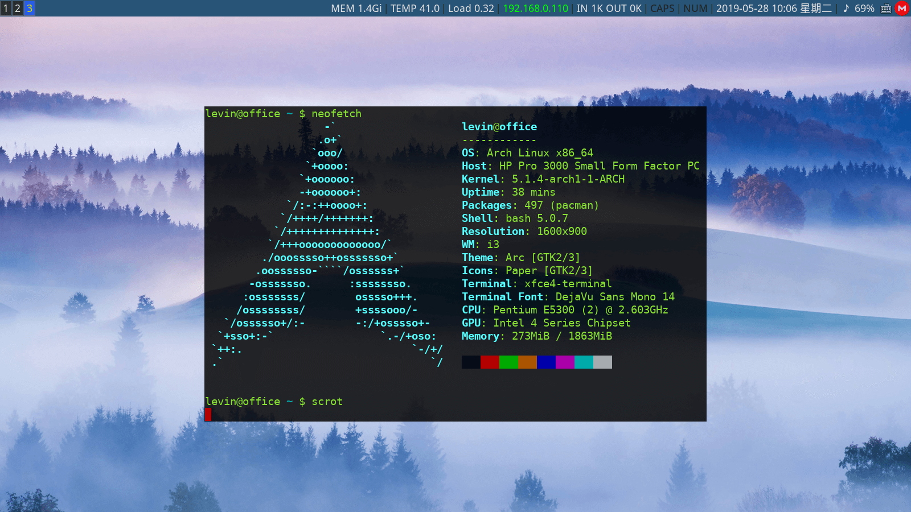
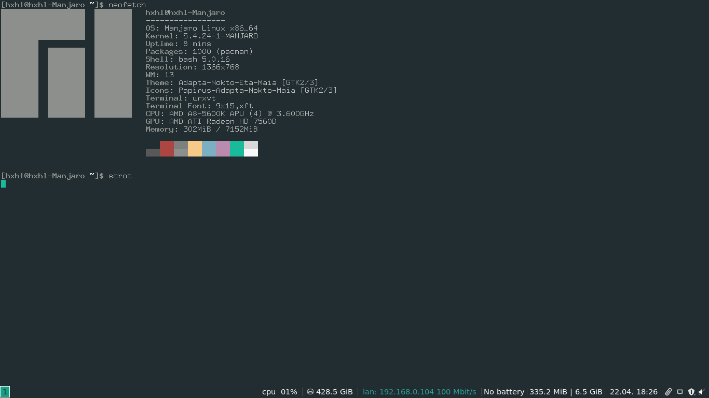
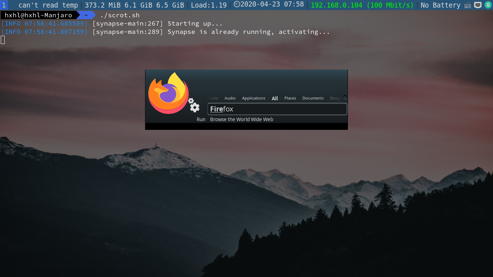
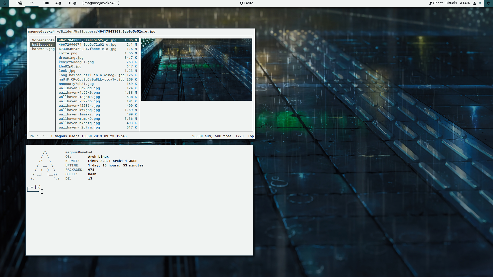
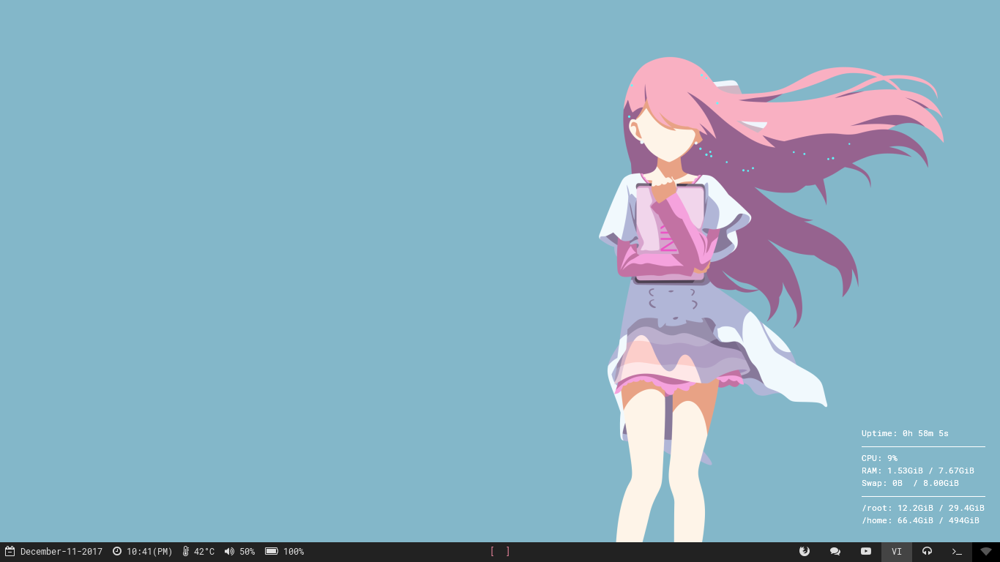
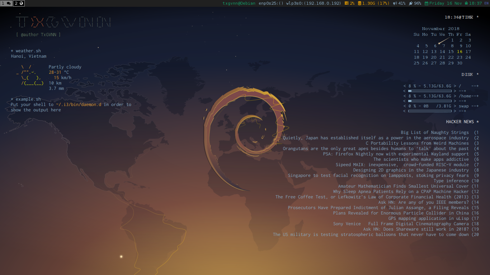

## 什么是I3WM

**我可以从本文中学习到什么**?
学习完本文,你将学会配置一个漂亮的 I3WM 桌面.

**有什么要求吗?**

本文需要你拥有一点 Linux 基础,比如会使用 VIM.

让我猜猜你!

你可能会不少 Linux 命令,但是你用起来没有如 Windows 那个顺手,你知道去安装一个『软件』但是不知道如何去打开一个『软件』,或者不知道去设置『开机自启』.

你还可能是一个资深的 Linux 用户,已经用过『KDE』或者『Gnome』,但是你想了解一下 I3WM,但是你在使用别人的配置时遇上各种问题,你想了解一下 I3WM 的相关好去排错.

本文是在『Manjaro』上做的,但是 I3WM 是 Linux 的『窗口管理器』而并非只属于哪个特定的 Linux 版本,所以理论上本文的内容是可以在其它版本的 Linux 上使用的.

**有多漂亮呢?**

这是一张成品图



它来自github用户『levinit』所分享的配置,[项目链接](https://github.com/levinit/i3wm-config).十分感谢他分享自己的配置.

**直接快速搞个好看的 I3 主题怎么办?**

那请使用本主题作者所使用的[脚本](https://github.com/levinit/i3wm-config)与[教程](https://levinit.github.io/i3wm-config/)。

## 如何配置

**那我应该怎么做**?

现在这是我们现在最初的样子



我们可以看见,与上面所提到的成本品的区别,我将分别介绍如何实现它们.

**怎么打开终端?**

同时按下『Win 键』和『回车键』.

### 壁纸

**我该如何设置一张壁纸?**

I3WM 异或者是 Linux 均没有提供壁纸功能,所以我需要使用一款软件『feh』.

**我该如何得到它?**

如果你是『Arch』或者『Manjaro』的用户,可以使用`sudo  pacman -S  feh`

如果是其它的 Linux 发行版,请使用 相应的包管理器安装该软件.

**我该如何设置一张图片做我的壁纸**

`feh --bg-scale "图片的路径"`

其中`--bg-scale`参数将会缩放你的图片,使其填满你的桌面.

如果你不想把缩放,请使用`--bg-fill`

**为什么我重启电脑之后我的壁纸就没有了**?

如果你有过一些电脑基础,你应该知道『程序自启』这个概念,我们的壁纸程序并没有设置『自启』,我将在下一小节中讲述如何使用.

### I3WM 的配置

由 Mike Gancarz 所提出的 UNIX 哲学中的第五条

```English
5.Store data in flat text files.
五.数据应该保存为纯文本文件。
```

所以 I3WM 的配置也是保存在一个文本文件之中,你应该使用『VIM』或者其它文本编程器去编辑它们,并没有一个像『Windows』异或者是『MacOS』那样拥有一个『设置面板』.

**那 I3WM 的配置文件在哪里呢?**

它在你的`home`目录的`config`的`i3`文件夹中.如果你知道一点 Linux 知识的话,那你应该知道可以用`~`代指你的`home`目录.

所以你可以使用`cd ~/config/i3` 来进入你的 I3WM 配置文件目录.

其中的个名为`config`的文件就是你的I3WM 的配置文件.

**所以我应该如何让我的壁纸在重启之后不会消失呢?**

I3WM 在启动时就会读取它的配置文件,我们当然希望我们的壁纸跟 I3 一起启动.正好 I3WM 提供了这个功能!

现在回想一下我们设计壁纸的命令是什么?

对!是`feh --bg-scale "图片的路径"`

我们将这段话添加到`config`文件之中,最好是在末尾!

`exec --no-startup-id feh --bg-scale "图片的路径"`

**我还可以做些什么?**

我觉得这可以举一反三了,`exec --no-startup-id 你需要执行的命令`,可以把想执行的命令加在`config`这样命令就会随着 I3WM 启动所执行了.

当然如果命令很多很长,你可以写在一个 shell文件 之中,然后通过 `exec`去执行你这个 shell文件 ,同时你可以在后面加上`&`,让你的 Shell文件 或者 命令 转入到后台执行.不会把 I3WM 阻塞住.

例如:`exec --no-startup-id  ~/请换成shell的名字.sh &`

**`--no-startup-id` 是什么意思啊?**

有些『脚本』或者『程序』并没有『启动提醒』,就是说它们启动之后并不会告诉系统,我启动好了.这会让你的系统认为我卡住了.导致你的鼠标指针处于忙碌状态.这个参数可以解决这种情况.

### 终端透明

**我怎么才能把我的终端变成透明的?**

我们在设置壁纸时使用了『feh』,这次我们使用『xcompmgr』这款软件.

**为什么要用到这么多软件啊,有没有『全家桶』呀**?

我们又要说到 UNIX 哲学了. Doug Mcllroy 这个人,和上面那个不是一个人呀,他提出了三条,其中第一条就是:

```English
 1.Write programs that do one thing and do it well
 一.写一个程序做一件事和把它做好.
```

Linux 有太多小而美的软件,几乎没有大而全的软件.因为这一点也不 UNIX.

**我装好了,怎么用呢?**

请在终端中输入`xcompmgr &`,`&`是做什么用的,上文提到过了,你可以尝试把`&`去掉,你就会发现程序运行在 前台 ,导致你的终端不能再输入其它命令了!

**也需要加入到`config`中让它自启吗?**

完美的一次举一反三!没错!请把这个加入其中`exec --no-startup-id xcompmgr &`

**我可以选择什么终端?**

这里推荐`roxterm`、`xfce-terminal`和`terminator`,因为它们更方便设置透明度.

**我使用的是 Manjaro I3,我的 xcompmgr(或者 compton) 不能启动,提示`Anoter composite manager is already running(picom)`.**

想学会『独立解决问题』就必须学会认真的看提示信息,报错写的非常清楚`Anoter composite manager is already running(picom)`,『其它的窗口管理器已经在运行(picom)』.显然易见因为已经在运行了一款叫做『picom』的软件.

如果你尝试去卸载它时,你还会发现报错,因为它和 i3WM 居然是依赖!这是 Manjaro I3 给你们预先装好的环境.出现什么问题,当然都不奇怪.既然都是窗口管理器`xcompmgr`能做的事`picom`也能做,那我们就可以去使用它把终端变透明吧!

**我要使用 urxvt 终端,怎么才能让它变透明?**

或许你的版本不能安装`terminator`,异或者你就是想使用`urxvt`.但是这个不是什么问题.并且能轻易在网上找到解决方案,你可以点击[这里参看一片关于配置 urxvt 的透明的教程, 它使用的是 compton(也叫 picom)](https://www.cnblogs.com/vachester/p/5649813.html).感谢每位在无私在互联网上分享自己经验的人.

### 快捷键

**我可以不用快捷键吗?**

如果你使用的是『KDE』或者『Gnome』这些『窗口管理器』,你或许还可以不学,但是 I3WM 如你所见,并没有什么按钮供你去点击.所以你必须去学习与使用

**我需要要去背很长的快捷键表吗?**

当然不是! 我要教你的是如何设置与查看快捷键.

继续编辑我们的`config`,往上走.在最上面我们就能看见

```
set $mod Mod4
```

这句话是指把 Mod4 键设置$mod.

**Mod4 是哪个键?**

正常情况下是你键盘上那个『Win键』.

**`$mod`是什么?**

我们称之为『Super key』,我通常把这个键和其它键来组成使用快捷键.

**里面有哪些设置好的快捷键?**

我们往下翻翻,就会看见

```
bindsym $mod+s layout stacking
bindsym $mod+t layout tabbed
bindsym $mod+c layout toggle split
```

如果你没有改动上面所说的$mod,那这里的意思就是说同时按下『Win 键』和『S 键』时,将窗口堆叠模式改成『堆叠式』(stacking).按下『Win 键』和『 T 键』 就是『标签式』(tabbed),而『Win 键』加上『C 键』可以让你在 垂直平铺和水平平铺之间 来回切换.

动手试试吧,不要光看不用!你会爱上这种操作方式的!绝对会!

**我可以让某个快捷键启动一个程序吗?**

当然!我们把这句添加进去.

```
bindsym $mod+F2 exec firefox
```

我觉得你已经能够理解了!当按下『Win 键』和『 F2 键』时, Firefox 就会启动了!把按键和软件换成你想换的吧!

### 举一反三

**所以启动 Linux 软件就是在终端输入它的名字吗?**

在上面的学习过程中,你应该知道『软件』和启动是和 执行命令 是一样,就像你启动`firefox`和执行其它命令是一样的.

**可以在软件名后面加上`&`让它不阻塞我的终端吗?**

是的!如果你对知识足够敏感,我觉得你已经可以从上文中学会了这种方式,在命令行中输入你软件的名字,并且在后面加个`&`,软件就在会后面独立运行.否则,当你关掉终端时,你的软件也会跟着关闭.

**软件名太长了,我也记不住啊,有没有怎么简单的办法启动软件?**

有的!这种软件在 Linux 当中叫做『软件启动器』.



比如图中我所使用的叫做`Synapse`

**启动软件要软件启动器,那我怎么启动软件启动器这个软件?**

这并不是一个勃论.很简单,在上一张,我们就谈到通过快捷键启动`firefox`,你相信你已经反应过来的.如何去启动『软件启动器』.

## 额外的问题

**中文输入 fcitx fcitx fcitx!**

**我已经按照网上的解决办法安装`fcitx`和`fcitx-im`还有`fcitx-rime`,同时在`/etc/profile`加入那三行,可是还是不能输入中文!**

在`/etc/profile`加入这三行.

```
export XMODIFIERS="@im=fcitx"
export GTK_IM_MODULE="fcitx"
export QT_IM_MODULE="fcitx"
```

几乎是网上所有能找到的不能使用 fcitx教程的解决办法. 我也照做,但是还是依然还是不能输入中文。

我发现在 `Input Method`只有` Keyboard - English(US)`一个。而没有中文。这是我遇到的问题，可能是因为太简单的所以根本没有人写过解决方法。

所以只要在 `Input Method`中添加一个中文输入方式.

点击`Configure`去添加`Input Method`，但是我一点击就闪退。查看报错信息是因为缺少程序，通过`pacman`去安装。这样就行了。

这样之后输入法就正常了。

**我看完了全文,但是除了基础的配置以外,我还是不懂得修改一个主题的外观.**

这是一个更深入的问题,我暂时还不能提供帮助,不过你可以在[这里](https://i3wm.org/docs/userguide.html)找到你想要的.

**我还想要更多的主题,我可以在哪里找到它们?**

你可以在[GitHub](www.github.com)搜索『[i3wm](https://github.com/search?q=i3wm)』,有许多人在上面发布了自己的 config.

例:

[Dotfiles_i3](https://github.com/Algorithm79/Dotfiles_i3)



[Rin : shelter](https://github.com/CSaratakij/i3-rice-rin-shelter)



[TxGVNN](https://github.com/TxGVNN/i3-config)



## 后记
本文想模仿*The Little Schemer 递归与函数式的奥妙*中通过一问一答的学习形式。尽管形式上确实模仿了，不过确实本文效果看起来并不像原书那么友好，可能是『学我者生，似我者死』吧。而且还可能让读者觉得态度太臭。下次不会再如此拙劣模仿的这种风格。


著作权归作者所有。

商业转载请联系作者获得授权，非商业转载请注明出处。

作者：CorrectRoad(HXHL)

链接：https://correctroadh.github.io/posts/i3wm/

作者：CorrectRoad's Blog