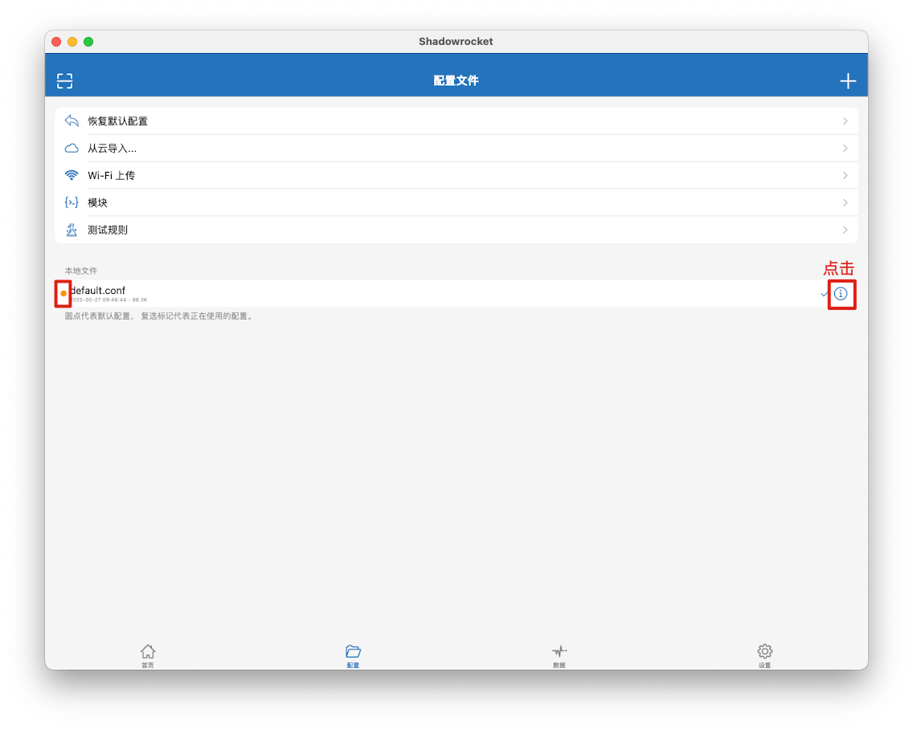
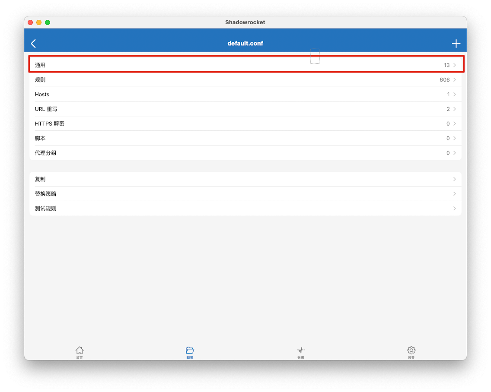
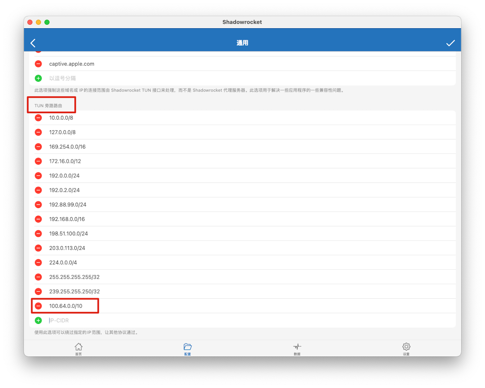

# 背景
> 刚部署完 headscale 后当我的 mac 同时打开 shadowrocket 和 tailscale 时，发现只能正常科学，但是无法连接到其他 tailscale 的节点

# 解决方案
1. 首先先确定自己 tailscale 的 IP 网段，我的是 headscale 默认的网段 `100.64.0.0/10` 
2. 在 shadowrocket 中找到当前使用的配置，找到当前配置「TUN旁路路由」中的 headscale 网段
   
   
   
3. 从「TUN旁路路由」中删除该网段，点击保存
   
4. 现在即可同时使用两者

