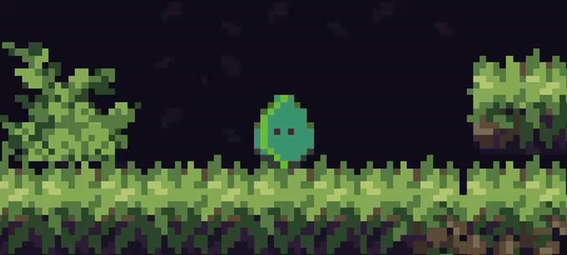

_Two weeks ago..._
> **Matheus:** Hey, it's been a while since we joined a game jam.  
> **Eduardo:** Yeah, I kind of miss it.  
> **Matheus:** There is a Mini Jam two weeks from now, wanna join?  
> **Eduardo:** Sure!

And here is the result. But at what cost?

## Hold on, what are game jams?

Game Jams are game development events where you join a group of people to create a game following a certain theme, within a few days. They can last two days or two weeks, even a month. You can even earn prizes in some, and in others, the prizes are the games made along the way.

Nevertheless, each Game Jam has its own caveat. Matheus' and mine favorite is the [Mini Jam](https://minijamofficial.com/). It happens every couple of weeks, has a theme (that you don't have to follow) and a limitation, voted by the public, among a list of options.

The limitation is the only rule you have to abide to, and in this edition, it was **"The player is the weakest creature"**.

## All events should start with a couple of pizzas

Friday, 28th of March. [Pedrobc002](https://itch.io/profile/pedrobc002) and I went to [Matheus](https://theusbrz.itch.io/)' house to kickoff the game jam - 19 hours late, but we are three adults with full-time jobs - to discuss what kind of game we wanted to make, between slices of pizza and diet soda.

The initial idea was to control a rabbit - the game jam theme - in a platform style game, running from bigger animals. But creating games with a worn-out formula is boring, we needed a twist that respected our limited time and capabilities.

> What if we controlled an **easter egg**?

That could work. Is a weird fun twist, the movement and control are more open for experimentation and an egg is easy to draw, right?

## Our hero, the easter egg

Look at the splendid, wrapped, oblivious of what he's bound to encounter, easter egg. After a few sketches among all three of us, we decided that our egg would be a chocolate one, wrapped in a aluminum and plastic covers. Go play and see the animation between these states, the art ended up fantastic!

Anyhow, while pedrobc002 and I worked on the foundations of the programming, Matheus was dedicated to finish the sprites before the start of the next day, using his software of choice, [Aseprite](https://www.aseprite.org/) - a marvelous pixel art creation program, favorite of many.

## The controls

Our idea was to not have strict control over how the egg would move. It had to jump to avoid enemies - chocolate eating rabbits - and escape the hellhole he was taken captive to. But how he would move? Uncontrollably, of course. The player is only able to start its movement - depending which direction que is facing - and when can he jump.

Please, keep your head and hands far from the screen while watching the below demonstration:

The player can get motion sickness? Yes. The camera movement could be smoother? Also yes. But here we do not deal with coulds and shoulds.

## Embellishing the game

Even though we do this for fun and there is no real prize, there's still a voting, and we'd like to cross the finish line with at least a good score. For that to happen, we have to cover other aspects other than the gameplay - that in itself, it's not really mind blowing, so we had to ensure:

* Comfortable enough visuals
* A somewhat satisfying level design
* Not annoying sound effects
* Reliable-ish controls
* A working game, of course

That could be done in a day with three pairs of hands, am I right? Or that would be during a few hours? Time is an elusive concept during game jams.

### The Hangover Effect

There are two different reasons I'd like to bring up the movie [The Hangover](https://en.wikipedia.org/wiki/The_Hangover), a gem from the far away year of 2009.

#### The missing person

We all have that one friend that vanishes during an event. Let that be a party or a trip, they find a way to get out of sight and enjoy what is behind the frivolous curtain of the obvious, just to be back when it's all over, like our movie's protagonist, Doug. And in game jams, this is even more common.

Some other times, a member is struck by love and decides to abandon their teammates to pursue it - I was this person once, and came back to reality after an _eventful_ relationship. Don't get me wrong, we all have appointments that were schedule before jams, and we often need to honor them, but the vanishing person is a real trope in a commitment scenario that is a game jam.

#### Time flies

Circling back to the movie, after a drug induced toast, the protagonists wake up in an unknown location, under even more unfamiliar circumstances. That is me waking up today, after the jam ended.

Taking control of what remained of my conscience and feeling like I was hit by a truck, I gather the pieces of my broken will to get ready for work, seeing flashes of the weekend's events asking myself "When did I do that?" or "How long I worked on that for?"

Questions never to be answered by the survivors of a game jam.

---

All that to excuse and distract you, my dear reader, from the fact that I already can't recall all tasks done during these intense two days. But that list is the gist of it.

## The finishing line

Ten minutes remaining, all export tests done before delivery, Matheus utters a single line:

> What if the game had an end?

let me explain that for you. Our game was not supposed to have an ending. The map that the player would play in would go forever, alternating with some pre-made chunks for it, making the player aim for the highest score according to how far up the player got.

> We can't change that, we only have ten more minutes.  

But in fact, we could, and we did. The first map was really good, showing the best aspects of our game, but that was it. A single chunk of map, not repeatable for infinite gameplay.

Ten minutes to make the change, an impossible task if we wanted to submit in time.

### Extreme Go Horse Tangent

In programming, there is something we all hate and need at the same time: a few ideas and rules to follow, taken from what everyone knows as ["The agile manifesto"](https://agilemanifesto.org/). It is a manifesto written by 17 people, with twelve principles to follow while approaching the complex task of planning and executing a software development, the good way.

 All good and dandy, until you go to the real world, with deadlines and your project owner huffing in your ear "Any updates?".

 In moments like these, where all that matters is that _something_ is delivered, doesn't matter if the code is garbage, if it wasn't tested or if a user follows a specific set of steps it could delete the whole production database. A release must be pushed out of that metaphorical door.

 That's when it enters the room, a magical creature: the [Extreme Go Horse](https://gohorse.com.br/extreme-go-horse-xgh.html) ([en](https://brunomb.com/xgh/)).
 
 Silence in the air. All developers gasp at the sight, managers starts sweating cold. One brave soul builds up the courage to approach that beast, gently offering their last crumbs of energy and dignity as a snack, to bound with the steed. 
 
 At this point, you can feel the tension in your bones. Will it accept the gift in order to save the fate of all those in need? After a loud breath, it snatches the offering, and the developer rides its majestic saddle, while everyone bursts into applause, gathering around their savior.

 ---

Coming back to the real world, the Extreme Go Horse (XGH) is a satire of the Agile Manifesto. It has twenty-two statements to follow, along lines like these:

1. I think, _therefore_, it’s **not XGH**.
2. There are 3 ways of solving a problem:
    * The **right** way;
    * The **wrong** way;
    * The **XGH** way, which is exactly like the **wrong** one but _faster_.
3. The **more XGH** you do, the **more you need** it.
4. ...

And so on.

---

All that to say: every programming project is bound to adopt the Extreme Go Horse methodology at some point. And short events like the Mini Jam are even more susceptible to such things: bypassing tests and code reviews in the brink of deliver and hope that the horse was merciful enough to keep your code functional at the end of the ride.

## And did you do it?

Yes, we did it. But only due to the goodwill of the organizers, to accept late submissions, as we were a few minutes late.

Overall, it was a good game jam, as it is a great opportunity to release - in a small scope - a game, and gather feedback from other game developers. And with every iteration of the event, we can feel our skills of programming, art and designing getting better, as some of the pathways have been crossed many times during the years.

---

You can play the game at: https://belfarfinoli.itch.io/egg-out

Thank you for reading and have a great week!