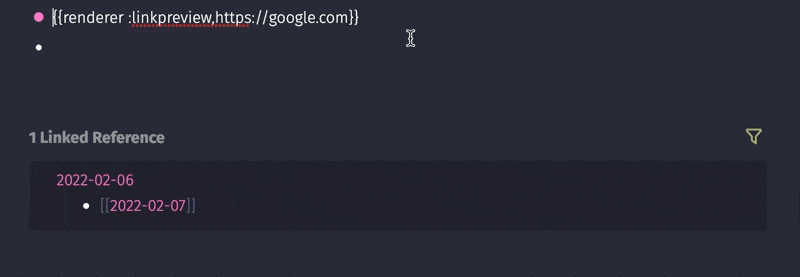
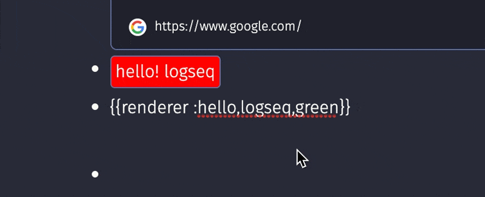

# 为logseq添加内容组件

## 前言

本文为本人发布`gitbook`的书籍，但是因为`gitbook`一直没有被谷歌索引，我也没有办法提交给谷歌(无法证明所有权)。无奈只能把该本的章节逐步搬运过来，提高SEO。希望那些想学习`logseq plugins 开发`的同学们能直接通过搜索引擎看到此书。

[原书本章地址](https://correctroad.gitbook.io/logseq-plugins-in-action/)：https://correctroad.gitbook.io/logseq-plugins-in-action/


## 起步

在`logseq`中有一种特殊的语法`{{renderer }}`，我们可以通过插件实现把`{{renderer }}`渲染为特定的内容。

比如在 `logseq-plugin-link-preview`插件中`{{renderer :linkpreview,https://google.com}}`将会被显示为：



## 注册渲染函数

我们可以用上一章的项目为基础，改一下`package.json`中的项目内容。

我们使用`onMacroRendererSlotted`去实现该功能

```javascript
  logseq.App.onMacroRendererSlotted(({ slot, payload} ) => {
    const [type,name] = payload.arguments
    if (type !== ':hello') return
    logseq.provideUI({
      key: 'h1-playground',
      slot, template: `
      <div class="hello">
        hello! ${name}
      </div>  
     `,
    })
  })
```

我们在`{{renderer :hello,Logseq}}`中`renderer`后面的内容就会存在`payload`的`arguments`中。我们可以通过解构的方式去得到里面的值。

修改`main.tsx`

```javascript
import '@logseq/libs'

async function main () {

  logseq.App.onMacroRendererSlotted(({ slot, payload} ) => {
    const [type,name] = payload.arguments
    if (type !== ':hello') return
    logseq.provideUI({
      key: 'hello',
      slot, template: `
      <div class="hello" >
        hello! ${name}
      </div>  
     `,
    })
  })

}

logseq.ready(main).catch(console.error)
```

`npm build`并载入`logseq`。


## 添加样式

光有`html`实现好看的内容，我们还需要为其提供`css`样式。

在`logseq`中， `logseq.provideStyle`提供了这个功能。

```
  logseq.provideStyle(`
    .hello {
       background-color: red;
       border: 1px solid var(--ls-border-color); 
       white-space: initial; 
       padding: 2px 4px; 
       border-radius: 4px; 
       user-select: none;
       cursor: default;
       display: flex;
       align-content: center;
    }`)
```

ps：该css出自`logseq-plugin-samples`

现在我们的`main.tsx`是这样的

```javascript
import '@logseq/libs'

async function main () {
  logseq.provideStyle(`
    .hello {
       background-color: red;
       border: 1px solid var(--ls-border-color); 
       white-space: initial; 
       padding: 2px 4px; 
       border-radius: 4px; 
       user-select: none;
       cursor: default;
       display: flex;
       align-content: center;
    }`)

  logseq.App.onMacroRendererSlotted(({ slot, payload} ) => {
    const [type,name] = payload.arguments
    if (type !== ':hello') return
    logseq.provideUI({
      key: 'hello',
      slot, template: `
      <div class="hello">
        hello! ${name}
      </div>  
     `,
    })
  })
}

logseq.ready(main).catch(console.error)
```

来看看效果：


## 事件触发

还有内容还不够，我们还可以为该`html`添加上事件

我们继续制作，当点击`hello! logseq`时，logseq消息提示出`hello! logseq`。logseq中`logseq.provideModel`可以让我们自己编写事件。并可以通过`e.dataset`传参。

事件函数：

```javascript
  logseq.provideModel({
    msg(e: any) {
      const {msg} = e.dataset;
      logseq.App.showMsg(`Hello! ${msg}`);
    }
  })
```

组件函数：

```javascript
  logseq.App.onMacroRendererSlotted(({ slot, payload} ) => {
    const [type,name] = payload.arguments
    if (type !== ':hello') return
    logseq.provideUI({
      key: 'hello',
      slot, template: `
      <div class="hello" data-msg="${name}" data-on-click="msg" >
        hello! ${name}
      </div>  
     `,
    })
  })
```

通过`data-xxx`我们可以向事件函数传参。

效果：


## 组件参数持久化

如果组件中存在特别的值并改变组件样式。比如我们希望本来背景是红的。点击一下变成绿的，再次点击再变回来。

### 修改组件增加背景颜色项

修改css：去掉了上面写死的`backgrounp-color`。

```javascript
  logseq.provideStyle(`
    .hello {
       border: 1px solid var(--ls-border-color); 
       white-space: initial; 
       padding: 2px 4px; 
       border-radius: 4px; 
       user-select: none;
       cursor: default;
       display: flex;
       align-content: center;
    }`)
```

修改组件

```javascript
  logseq.App.onMacroRendererSlotted(({ slot, payload} ) => {
    const [type,name,color] = payload.arguments
    if (type !== ':hello') return
    logseq.provideUI({
      key: 'hello',
      reset: true,
      slot, template: `
      <div style="background-color: ${ color }" class="hello" 
      data-block-uuid="${payload.uuid}"
      data-on-click="update" >
        hello! ${name}
      </div>  
     `,
    })
  })
}
```

**注意**：这里增加了`reset`，这个有什么用，后面会演示



### 事件改变block

我们现在来写我们的事件。

```javascript
  logseq.provideModel({
    async update(e: any) {
      const { blockUuid } = e.dataset;
      const block = await logseq.Editor.getBlock(blockUuid)
      let newContent = block?.content;
      if(block?.content?.indexOf("red") > -1) {
        newContent = block?.content?.replace(`red`, `green`)
      }else{
        newContent = block?.content?.replace(`green`, `red`)
      }
      await logseq.Editor.updateBlock(blockUuid, newContent)
    }
  })
```

我们先通过`logseq.Editor.getBlock`用传进来的`blockuuid`去得到`block`的内容。然后通过`logseq.Editor.updateBlock`去更新`block`的值。

效果：


到了最后，我们再回来去看看之前设置的`reset`有什么用？如何一个组件的`reset`没有设置。那么点击的效果就会变成这样：


项目受`logseq-plugin-samples`中的`logseq-pomodoro-timer`启发，部分代码源于此。

最后附上`main.tsx`完整代码

```javascript
import '@logseq/libs'

async function main () {
  logseq.provideModel({
    async update(e: any) {
      const { blockUuid } = e.dataset;
      const block = await logseq.Editor.getBlock(blockUuid)
      let newContent = block?.content;
      if(block?.content?.indexOf("red") > -1) {
        newContent = block?.content?.replace(`red`, `green`)
      }else{
        newContent = block?.content?.replace(`green`, `red`)
      }
      await logseq.Editor.updateBlock(blockUuid, newContent)
    }
  })
  logseq.provideStyle(`
    .hello {
       border: 1px solid var(--ls-border-color); 
       white-space: initial; 
       padding: 2px 4px; 
       border-radius: 4px; 
       user-select: none;
       cursor: default;
       display: flex;
       align-content: center;
    }`)

  logseq.App.onMacroRendererSlotted(({ slot, payload} ) => {
    const [type,name,color] = payload.arguments
    if (type !== ':hello') return
    logseq.provideUI({
      key: 'hello',
      reset: true,
      slot, template: `
      <div style="background-color: ${ color }" class="hello" 
      data-block-uuid="${payload.uuid}"
      data-on-click="msg" >
        hello! ${name}
      </div>  
     `,
    })
  })
}

logseq.ready(main).catch(console.error)
```

## 拓展

在`onMacroRendererSlotted`中常见判断组件类型有：通过`type.startsWith`判断和通过`type !== `判断。他们的区别与优劣是什么？

未完待续...
