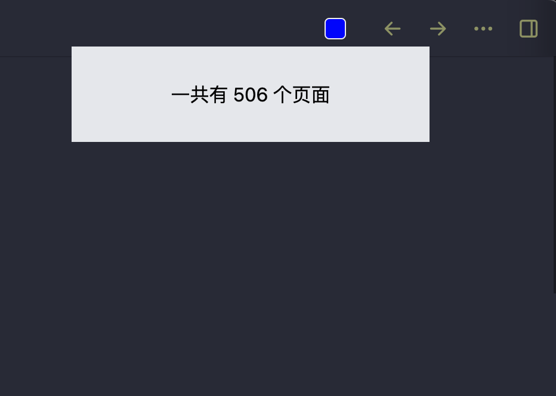

# 制作一个toolbar仪表盘

## 前言

本文为本人发布`gitbook`的书籍，但是因为`gitbook`一直没有被谷歌索引，我也没有办法提交给谷歌(无法证明所有权)。无奈只能把该本的章节逐步搬运过来，提高SEO。希望那些想学习`logseq plugins 开发`的同学们能直接通过搜索引擎看到此书。

[原书本章地址](https://correctroad.gitbook.io/logseq-plugins-in-action/chapter-1/make-a-toolbar-dashboard)：https://correctroad.gitbook.io/logseq-plugins-in-action/chapter-1/make-a-toolbar-dashboard


## 环境搭建

我们使用`logseq-plugin-template-react`为项目基础。

`git clone https://github.com/pengx17/logseq-plugin-template-react`

现在我们有了一个`手脚架`了。这个项目是用`pnpm`而不是传统的`npm`或者`yarn`，`pnpm`的优点大家使用之后一定会感觉到。使用方法和`npm`一致，把`npm`换成`pnpm`就行。

`pnpm install`安装依赖

## 项目结构

```
➜  logseq-plugin-template-react git:(master) tree -L 2
.
├── CHANGELOG.md
├── index.html
├── logo.svg
├── package.json
├── pnpm-lock.yaml
├── readme.md
├── release.config.js
├── renovate.json
├── src
│   ├── App.tsx # 页面代码写这，但是组件一般新建tsx。
│   ├── main.tsx # toolbar代码写这
│   └── utils.ts
├── tsconfig.json
└── vite.config.ts

1 directory, 13 files
```

## 注册toolbar

在 `main.tsx` 删掉原本的`logseq.provideUI`和`logseq.provideStyle`。

```typescript
logseq.provideStyle(css`
    div[data-injected-ui=${openIconName}-${pluginId}] {
      display: inline-flex;
      align-items: center;
      opacity: 0.55;
      font-weight: 500;
      padding: 0 5px;
      position: relative;
    }

    div[data-injected-ui=${openIconName}-${pluginId}]:hover {
      opacity: 0.9;
    }
  `);

  logseq.provideUI({
    key: openIconName,
    path: "#search",
    template: `
      <a data-on-click="show"
         style="opacity: .6; display: inline-flex;">⚙️</a>
    `,
  })
```

替换成：

```javascript
  logseq.provideStyle(css`
    .${openIconName} {
      width: 18px;
      height: 18px;
      margin: 2px 0.4em 0 0.4em;
      background-color: blue;
      border-radius: 4px;
      border: 1px solid #eee;
    }
  `);

  logseq.App.registerUIItem("toolbar", {
    key: "show-plugin-open",
    template: `
    <a data-on-click="show">
      <div class="${openIconName}"></div>
    </a>
  `,
  });
```

`logseq.App.registerUIItem`让我们向`toolbar`注册组件。

代码部分来源于`logseq-plugin-heatmap`项目。

现在我们运行`pnpm install && pnpm run build`。在`logseq`中载入，就可以在`toolbar`上看到我们的`UIItem`了。


当我们点击该蓝色图标时，就是我们的`页面`了。


## 新建页面

我们的目标是制做一个`仪表盘`。上面显示着`logseq`里的相关信息。在界面上参考`logseq-plugin-heatmap`


### 页面组件

新建`dashboard.tsx`和`dashboard.css`。

`dashborad.tsx`

```typescript
import React from "react";
import "./dashboard.css"

// eslint-disable-next-line react/display-name
export const Dashboard = React.forwardRef<HTMLDivElement>(({}, ref) => {
    return(
        <div className="dashboard-root">
            <div className="center">
                <h1>logseq borad!!!</h1>
            </div>
        </div>
    );
});
```

`dashborad.css`

```css
.dashboard-root {
    height: 8vh;
    width: 16vh;
    border-radius: 5%;
    display: flex;
    background-color: #e5e7eb;
}

.center{
    display: flex;
    margin: auto;
}
```

修改`App.tsx`

```typescript
import React, { useRef } from "react";
import { useAppVisible } from "./utils";
import { Dashboard } from "./dashboard";

function App() {
  const innerRef = useRef<HTMLDivElement>(null);
  const visible = useAppVisible();
  if (visible) {
    return (
      <main
        className="fixed inset-0 flex items-center justify-center"
        onClick={(e) => {
          if (!innerRef.current?.contains(e.target as any)) {
            window.logseq.hideMainUI();
          }
        }}
      >
        <Dashboard ref={innerRef}  />
      </main>
    );
  }
  return null;
}

export default App;
```

效果：

现在点击`UIItem`时就有一个小窗口出现在`logseq`正中央(因为`items-center justify-center`)。当我们点击`logseq`任意位置，都可以关闭该窗口。


### 调整页面位置

如果我们想像`logseq-plugin-heatmap`一样，页面出现在toolbar正下面。我们就需要调整页面的位置。


修改`dashboard.css`

```css
.dashboard-root {
    position: absolute;
    background-color: #e5e7eb;
    display: flex;
    width: 300px;
    height: 80px;
}

.center{
    display: flex;
    margin: auto;
}
```

修改`dashboard.tsx`

```typescript
import React from "react";
import "./dashboard.css"
import { useWindowSize } from "react-use";

function useIconPosition() {
    const windowSize = useWindowSize();
    return React.useMemo(() => {
        const right = windowSize.width - 10;
        const bottom = 20;
        return { right, bottom };
    }, [windowSize]);
}

// eslint-disable-next-line react/display-name
export const Dashboard = React.forwardRef<HTMLDivElement>(({}, ref) => {
    const { bottom, right } = useIconPosition();
    console.log(bottom, right);
    return(
        <div
            ref={ref}
            className="dashboard-root"
             style={{ left: right - 400, top: bottom + 20 }}
            >
            <div className="center">
                <h1>logseq borad!!!</h1>
            </div>
        </div>
    );
});
```

其中`useWindowSize`是用来获取`logseq`的窗口位置的。而`useIconPosition`是我从`logseq-plugin-heatmap`里扒来的。

`main.tsx`中`<main>`的`className`修改为`className="absolute inset-0"`

现在的效果：

.gif>)

### 页数内容

现在我们就要为我们的`dashboard`添加真正"有用"的功能了。

修改`dashboard.tsx`

```typescript
export const Dashboard = React.forwardRef<HTMLDivElement>(({}, ref) => {
    const { bottom, right } = useIconPosition();

    const [pageCount, setPageCount] = React.useState(0);
    useEffect(()=>{
        window.logseq.Editor.getAllPages().then(pages=>{
            setPageCount(pages.length);
        })
    },[])

    return(
        <div
            ref={ref}
            className="dashboard-root"
             style={{ left: right - 400, top: bottom + 20 }}
            >
            <div className="center">
                <h1> 一共有 {pageCount} 个页面 </h1>
            </div>
        </div>
    );
});
```

现在当我们点成`UIItem`，我们就能看到我们一共拥有多少页了。


