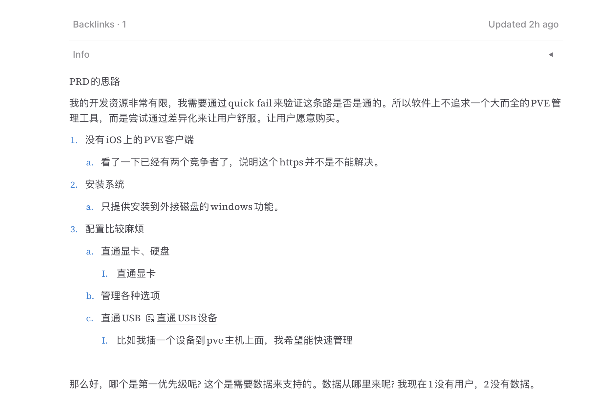

## 介绍
有好一段时间没有更新博客了，主要是因为从学校毕业之后转正的工作比较忙了。然后学习、沉淀了一段时间。最近又想开一个新的坑，与之前想到啥就做啥的 Side Project，这次我用上了学习各种 Indie Hacker 的方法。这篇文章主要还是记载一下我是怎么尝试 build 一个项目，而不是 PVE 本身和软件的介绍。

## Build 之路
大概一个月前开始感觉 PVE 在手机上不太好用，如果能有一个手机端的客户端就好了。再从而觉得如果只有管理感觉没有啥意思，如果再有一些很酷的功能，比如一键显卡直通、一键安装 Windows 系统等等那就更好了。

但是调研完市场之后感觉这个市场算是比较蓝海的，产品的形式还没有定义出来，像 VidHub 直接抄 Infuse Pro 就很舒服，做为一个 PVE Client，我很难说我觉得这些痛点是否是真的用户所需要的东西。 所以开始漫长的调研。

## 市场调研
其实前面就是市场调研，先是调研了市面上所有的 PVE 客户端，然后是 PVE 现有的工具。这个其实没有啥价值，现有的市场很小，没有一家说能是成熟的。

首先第一步就是搞 SEO，我用了五分钟做了 Landing Page，然后部署上去，想看看能不能收集到一些 User。觉得有可能再开工，但是发现各种不太可能，当然包括我对 SEO 不太熟，官网上线谷歌和Bing之后一周之后依然没有任何流量。只能说没有搞外链啥的基本不太可能有权重。

然后开始研究 SEO，我最初的想法是比如我不清楚用户需要什么，就可以通过SEO来看看需求对应的搜索量。比如如果 PVE GPU pass-through 的搜索量很大，就说明这个功能是用户所需要的。然后我还能从中找到我想不到的各种用户需求。

但是发现这个市场实在是太小了，我用了谷歌趋势，还在淘宝上买了 Ahrefs 的工具都没有找到什么有用的信息。比如前几名是 How install PVE, 后面几位也是一些很基础的问题。根本无法定位有效的需求。

所以开始埋伏在 Reddit 和 QQ 群。然后依然发现大家的问题是非常非常的小众，很难提取出共同的需求。

在上面简单的都做完之后，一无所获的我只能开始用户调研，我用 The Mom Test 的方法开始我认识的 PVE 用户开始大量的谈话。

这一步之后我依然感觉非常痛苦，首先我没有采用引导式的对话，我都是尽可能简单的和他们聊天谈 PVE。但是从他们身上只能感觉到 PVE 用起来没有啥坑(除了Ceph)，也没有踩什么坑，现在东西也都够用的感觉。

是的，我根本没有办法从用户的聊天中得到哪怕一个他们觉得的痛点。就算我带点引导的提问，你上次搞那个硬盘直通，你感觉有坑吗? 难搞吗，他们都会说感觉不难呀，没有啥坑呀。🤔  我一度怀疑这个市场这么小，是不是就是大家根本不需要这个玩意。

但是回过头来想想或许现在存留下来的玩家都是被筛选过的，前期觉得难的用户已经消失了，所以我的调研对象的取样错了。所以在大概列出功能之后还是决定开始开发。

## PVE Client 未来大概要做什么
大概关于 Marketing 的想法还是 SEO 先行，后续可以好好做 SEO，比如写一系列的文章，比如如何在 PVE 中显卡直通，内容就是使用我的软件一键配置 PVE 显卡直通。如何在 PVE 安装 Kail、Ubuntu、Windows。一系列文章来占领搜索引擎。

然后功能上先大概出一个 MVP，尝试拉一些早期用户起来，尽可能的通过倾听真实用户的需求，然后快速迭代来快速开发。目前最大的困难感觉就是倾听不到真实用户的需求。

比如第一个MVP中，我想给用户至少一个 ah moment。但是交付哪一个呢? 我没有提交 waitlist 用户的投票选项，也没有听到核心用户群的反应。所以在早期的 MVP 中会变得非常非常的迷茫。

今天用 VitePress 把 [PVE Client](https://pve.zeabur.app/)的 Landing Page 重构了一下。这个比我之前用的那个模块好做 Content 的 SEO 和 sitemap。

预期下周能产出一个基本能用的 MVP，希望能做完 SEO 之后能收获一些早期用户吧。
