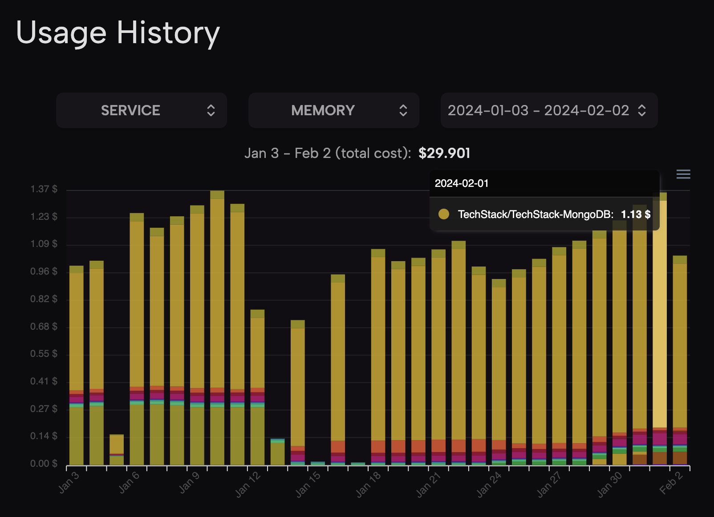
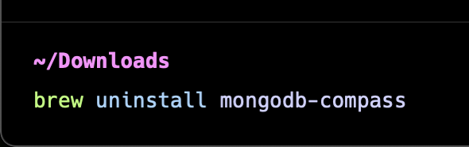

## TechStack 是什么?
[TechStack](https://github.com/Get-Tech-Stack/TechStack)是我去年开发的一款浏览器插件。大约收获了 400+ 的 Star 与 900 的日活。这个插件可以在 GitHub 仓库旁边显示当前仓库的技术栈。这个插件的初衷是为了帮助开发者更好的了解一个项目的技术栈，以便更好的学习和使用。

但是我最近减少对插件的开发与维护，并且在最近进行了一些小重构以降低成本。在这里我想谈谈为什么这不是一款好的软件和我为什么减少维护。

## TechStack 为什么不是一个好软件?
TechStack 算是我第一款『完成的 Side Project』。收获了一点点小关注。但是现在事后回过头来看，这个并不是一个『好软件』，我从来没有进行过市场分析、调研。也没有研究过开发者的需求。只是觉得这样一定很酷很有用，所以就开始做了。

但是事实上，虽然我每天都在使用(被动地)，但是我感觉我没有被帮助到，解决掉我的什么痛点或者痒点。对于这个插件，我最初的设想也很宏伟，不仅仅只是一个插件，还是一个入口、起点。我可以通过收集到的数据进行各种分析与分享。

比如我还可以再做一个网站来分析技术栈的使用情况，比如被应用到实际开发中的增长趋势。对比不同的技术栈应用情况来帮助用户在选择技术上时更好的决策。

以及用户可以选一些技术栈，找到一个项目，看看别人的代码是怎么写的。比如选择 Flink 和 Pulsar、 gRPC 和 SWR 这样通过拼接技术栈来找到一个项目。学习应该怎么写。

但是最后都没有实现，主要不是技术原因，还是我觉得这些并没有解决掉什么痒点和痛点，大家其实并不需要这个。

## TechStack 需要降低成本?
因为 TechStack 已经停止功能开发了，而且也绝不会从中获得任何收益。所以我觉得我需要必须降低运行成本，这里主要指服务端的成本。本来这个 TechStack 的运营成本确实很低，但是随着数据量的增长，已经高到一个让我难以接受的地步。

这些图是我一个 Zeabur 的账号的费用用量图，可以看到最大的成本支出是 TechStack 的数据库 MongoDB 所占用的。光数据库一个月的支出就将近 200+ 人民币。这个成本对于我来说是不可接受的。

这里谈谈 TechStack 在 MongoDB 中存了什么和为什么这么大的用量。TechStack 的最初的设计上使用两级缓存的机制，一级缓存是存储一个仓库对接的技术栈，有 1 天的过期时间。然后二级缓存是仓库对应的依赖文件，其就存储在 MongoDB 中。这样做的原因是因为早期我对 TechStack 的依赖项对应技术栈更新很频繁。所以我觉得这样做可以减少对 GitHub 的依赖文件的请求次数，缓存过期之后就可以用新的解析器对缓存好的依赖文件进行重新解析。

## TechStack 是如何降低成本的?

首先已经找出最大的问题所在，就是 MongoDB 的存储成本。我现在不需要存储这些依赖文件的内容了，所以我就用[`rockscache`](https://github.com/dtm-labs/rockscache)做了二级缓存，现在只缓存解析出来的结果，

所以现在可以把 MongoDB Compass 也给一起删掉啰! 我一点也不喜欢这个 electron 应用。又卡又慢一点也不好用，除了好看。

当然 TechStack 是一个非常大的异构项目，像 Request TechStack 的后端、Gradle Parser 等等是用 Java 来实现的，内存占用也是十分的大。尽管这次我还没有移除它们，但是在未来我也会考虑降本增效(笑)🤣。

## 我从 TechStack 学到了什么?
前面提到 TechStack 算是我第一款『完成的 Side Project』。所以我在这里开发中，还是学到特别特别多的东西。包括工程化的开发、监控还有很多很多工具，像是 Prometheus、Grafana、Flink、 Nest.js、Prism 等等。而且很多时间是为了学新技术而去用新技术。所以在很多地方采用了不是最优实践，也图增成本。

抛开技术不谈，就是学到运营与宣发，确实找到了很多平台。知道哪些平台能有流量，哪些没有。和应该怎么发。还有在这期间尝试去学习产品经理的理论与方法论。

在下一篇文章我可能谈谈[ToFree](https://tofree.zeabur.app/)，这也是一个免费、开源的项目。这个项目虽然是冷启动，但是收获了不少的关注，也帮助一个开源项目的 Star 翻了数倍。我想谈谈我是怎么想到，付了一个很低的成本，然后收获了一些不小的关注与用户，但是为什么我没有从中得到我想要的。做一些反思与总结。