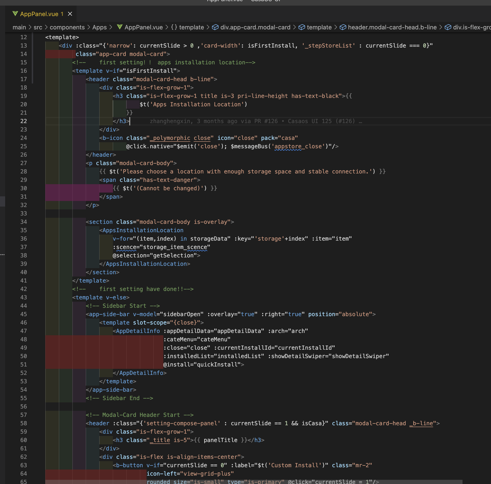
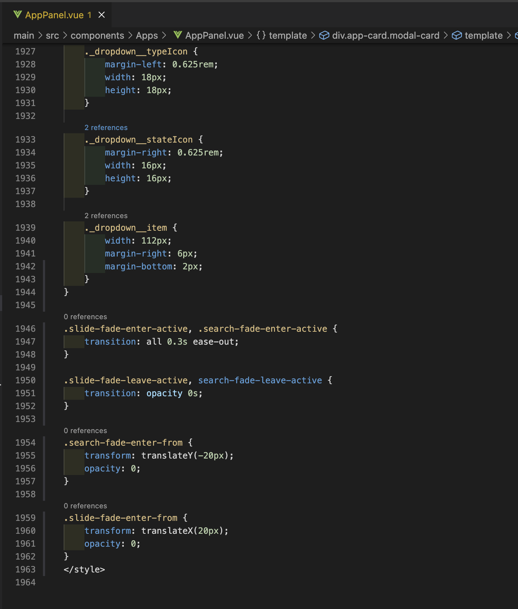
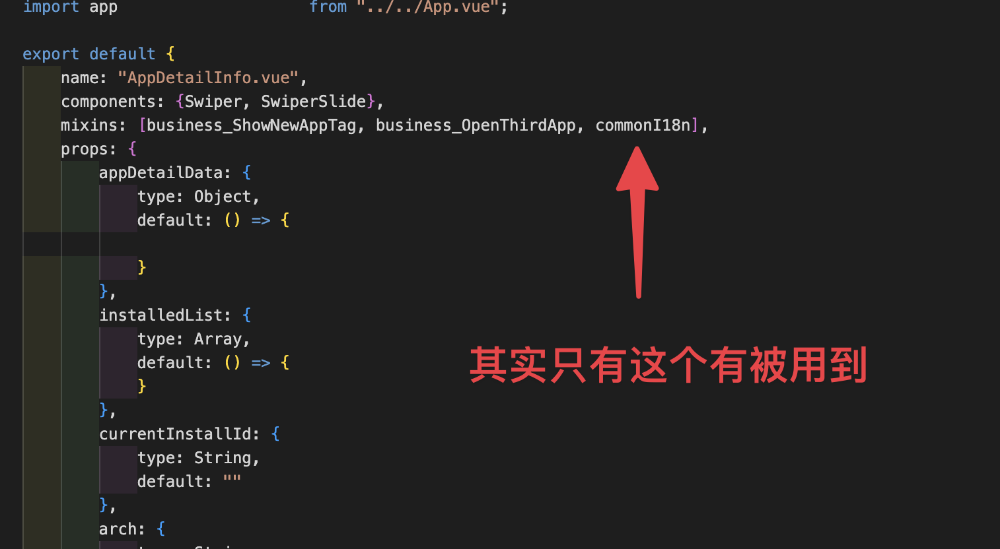
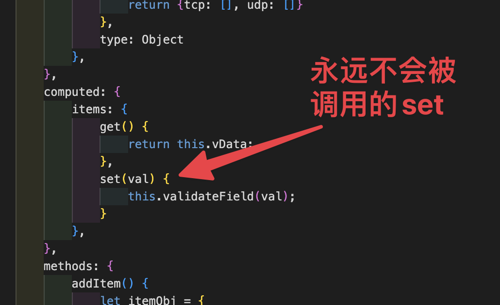
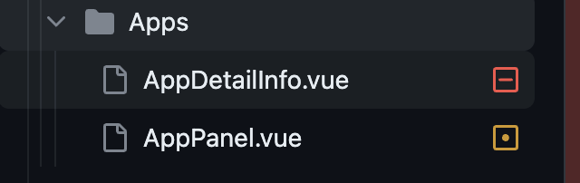
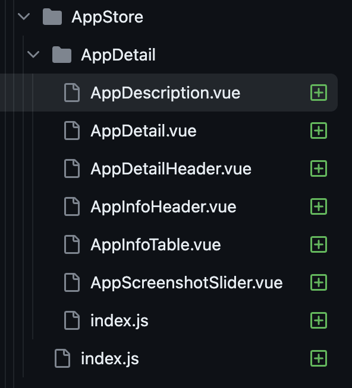

最近成为 IceWhale 的实习生🥳。主要工作是分配到了后端的开发，但是看到 CasaOS-UI 的这个代码质量确实不能忍呀🤪。直接上手重构，还好同事们都比较支持。😚看来 IceWhale 这个家还是不能没有我呀，也希望我在未来能成为像 Twitter 上那些前端网红吧。

## 目前的问题与目标
先让我们看看 CasaOS-UI 的问题。

### 代码版本管理混乱，分叉严重
目前 CasaOS-UI 有三个分支 main、0.4.6(未来发版的本来)、 特殊版(做一些特殊的功能)。其中每个 branch 都有特殊的代码，从任何一个分支 merge 或者 rebase 过去都要解决一堆冲突的问题。
这种问题说实话，我还真是第一次见。😗看来之前的同事在这堆屎山上确实糊了不少屎上去。

### 组件难以阅读
原来的组件许多都长达几百行，大量的 methods 和 data，看到长长 html 就能让人推动阅读欲望。
随便来一张截图来看看🤣 相信大家已经有点头晕了吧。

像这个文件可是高达 1964 行呢!

### 代码冗余
组件中存在大量没有用到函数、变量，还有一些被注释掉的功能、业务代码。这些只通过看其实根本不知道哪些会被调用到，哪些不会被调用到，在之前的开发中，因为这个问题，导致了许多时间的浪费。

带大家看看一些吧🤣
没有被用到的 mixins

在实际中永远不会被调到到的 set 函数(当然目前这里已经改了)

### 使用 Mixins 来实现复用，而不是 UseHook
使用 Mixins 来实现复用，而不是 UseHook，这个最大的问题就是很难判断目前复用的这个函数是来自哪个 Mixins 的，和某个 Mixins 到底有没有被使用到。当然或者能有什么插件能解决这个问题，不过目前我是不知道的。

### 其它问题
#### CSS live load 无效
这个应该算是其它工具链没有配置好，导致修改 CSS 之后需要手动刷新页面才能生效。

#### CSS 混乱
同时使用了 Sass、Bulma CSS，导致代码风格不统一，难以维护。还有大量的 CSS 是写在组件外面。

### 目标
重构的目标肯定是为了还技术债，降低未来的开发、维护成本。就 CasaOS-UI 的重构还有一个目标就是为了逐步转移以老旧的技术栈，在未来的开发能转移至 Vue3 中。

## 重构的内容
### 从 Options API 重构成 Composition API
基本没有太大问题，直接把 data 里的数据放到 ref、reactive 里就好了。
props用`defineProps`用重写，而本来methods中的方法用剪头函数重写，基本都没有遇到问题。

### 从 Mixins 重构成 UseHook
原来的通过 Mixins 来利用代码的方式，确实让我感觉不舒服，不过这个复用也是非常简单的。基本上就是改改就完成了。

### 代码结构的优化
本来代码就是一个个组件，现在代码通过多级文件夹来组合代码，尽量对外来屏蔽小组件，只暴露应该暴露的组件。

比如这个组件本来是一个 247 行的组件，然后我把它拆成多个小组件，但是这些小组件没有 export 出去。让代码看起来更舒服了一些。👀

## 还没有解决的问题
### CSS 的问题
目前代码使用了 Sass、 Bulma CSS 等一堆CSS，目前重写成本太大，所以重构基本都不碰CSS相关的部分。

### 代码分叉的问题
目前代码有几个branch，难以合并，这个确实需要较大的时间去推动把 main 和 版本分支 先 rebase 一下，解决一些冲突，以后通过设计，统一使用 main 分支来写代码，功能通过 guard 来实现版本开关。

### 提取一些公共的组件
我们代码中大量直接使用了第三方组件库，如`buefy`，这个对我们扩展有很大的影响，比如我们如果要实现dark mode之类，CSS挺难整。然后这个`buefy`也不支持Vue3，难以升级，最后是如果想加入一些好的组件实践也非常的困难(比如让组件支持快捷键)。

我个人的想法是把这些都提取出来，比如用`IWButton`(icewhale)来把原来的`b-button`来包一层，就是先把自己的组件包`buefy`包一层，来解耦出来，然后再通过 Headless UI库来逐步的替换`buefy`。

然后再进一步，CasaOS 是希望能支持第三方模块的，如果能把这些组件写好样式直接给第三方模块用，那就是非常好的。比如实现一个 IceWhale-UI。这样开发第三方模块的开发者就可以通过直接使用组件库来获得和 CasaOS 一样的界面风格了。

但是在后续研究中发现如果要实现一个组件库同时支持 Vue2、Vue3 是比较麻烦的，然后我想用的 HeadlessUI 又是一个只支持 Vue3 的库，所以这个问题还是需要再研究一下。🤔 后续有进展的话再来更新博客。

### 其它工具
整体代码风格还是比较差劲的，但是我目前还是没有上 eslint 和自动格式化工具，主要是怕改动太大，把其它几个分支的代码都搞出冲突来了。这个在后续解决完分支问题之后还是要上的。
然后是缺乏测试，其实这个项目还是有一些业务复杂度在的，所以上单测还是很有必要的，但是这个也是花费一些时间把工具链搭建好。🤔