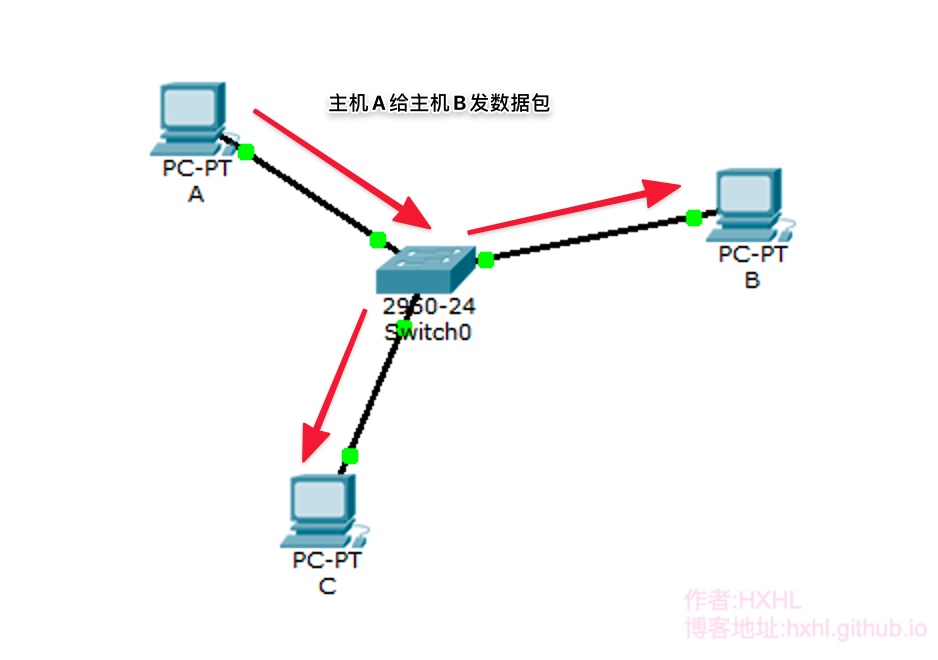
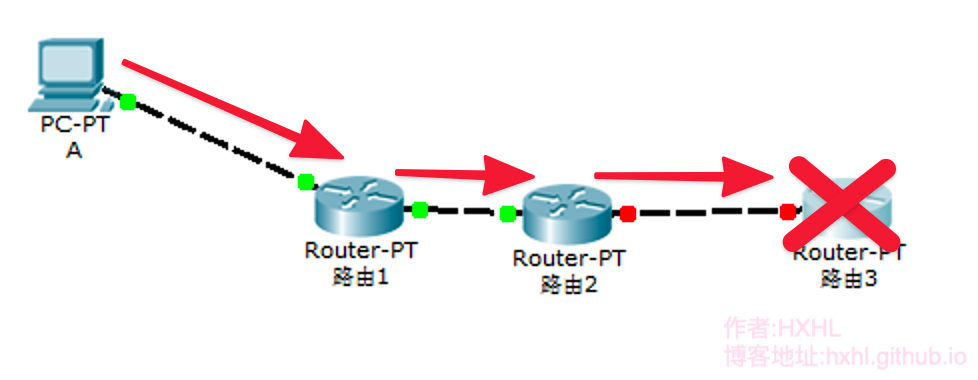
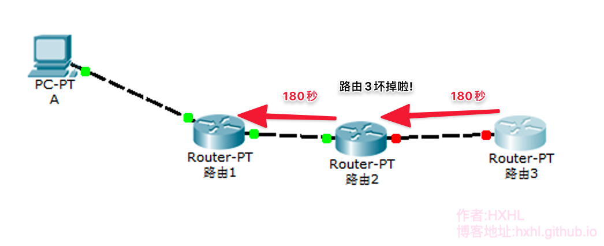
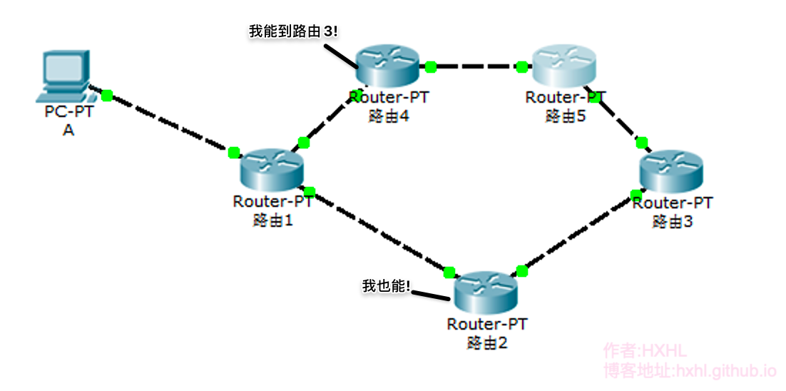
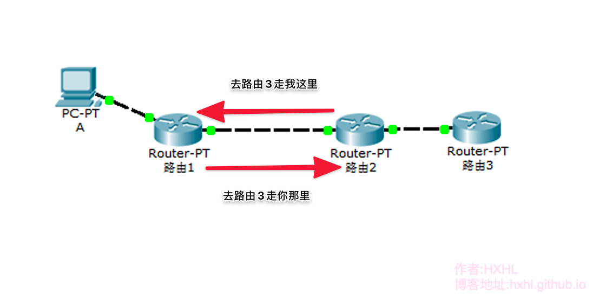
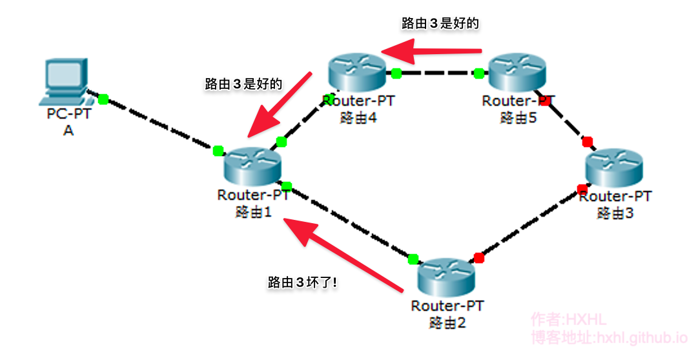
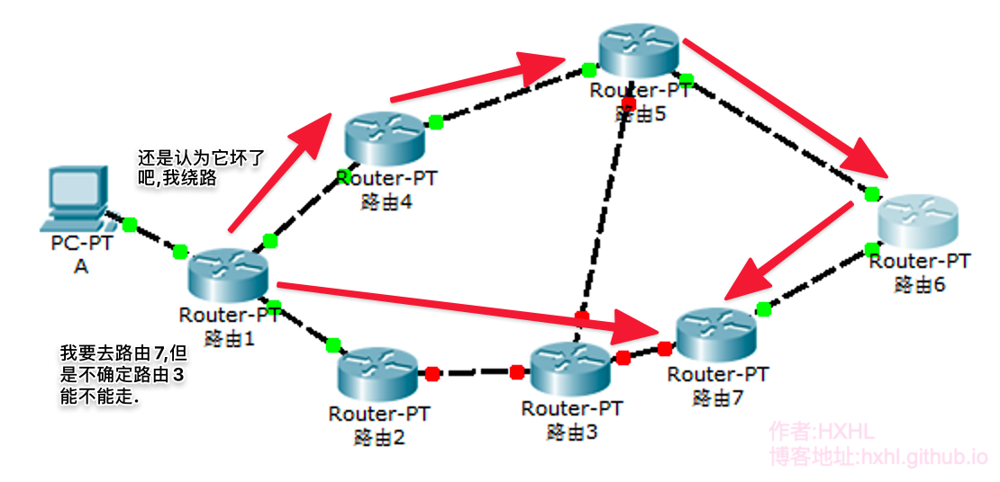

我想通过一步一步的发明出『RIP』.通过这样的方法,相信能对『RIP』的理解会深刻不少.

## 数据的传播方式

在这个网络中,所有的机子相连在一个『交换机』上,它们就是在一个局域网中,它们是怎么通信的呢？



主机A发给主机B一个数据包,但是其实这个局域网中的每一台机子都收到了这个数据包.但是它们会对数据做进行两次判断处理,来判断这个数据包,我是不是该接收.

首先,主机会先进行判断数据包是否是完整的(详细做法在这里,不繁述).如是数据包不是完整的,它们就会直接抛弃.

然后,它们进行第二次判断.判断这个数据包的目标地址,来确定是不是我该收的包(一种情况是目标地址就是自身ip,或者是一些特殊ip).

这个在一个局域网中,每次都是一台主机发,所有主机收.所以每次都只能有一台主机在发送数据,其它如果也发送, 就发生了冲突.我们就叫把这样一个网络叫做『冲突域』.

## 路由原理

因为冲突域每个机子都会收到同一份数据包.但是基本都是发给别人的会被抛弃的,这大大浪费了资源,如果真的这样搞,网络怎么能正常运行.我们可以让冲突域变的小一点,然后把几个冲突域连接在一起.这样似乎就能解决这个问题了.

可以如果一个数据出了冲突域.我要怎么知道去哪一个冲突域呢？我们就需要一个可以根据目标位置去转发到指定目标的『机器』

我们就发明一个叫『路由』的东西.它根据自身的路由表将不同的数据包不断地转发去他该去的冲突域中.

| ip          | 子网            | 接口   |
|:-----------:|:-------------:|:----:|
| 192.168.0.0 | 255.255.255.0 | f0/1 |
| 192.168.1.0 | 255.255.255.0 | f0/2 |
| 192.168.1.0 | 255.255.255.0 | f0/3 |

对于子网的不理解的人,可以去看我关于『[VLSM](https://correctroadh.github.io/posts/vlsm/)』的那一篇博文.

在思科路由中,我们通过

```
         ip route ip-address  netmask       interface
    # 例 ip route 192.168.1.1 255.255.255.0 f0/1
```

这样的命令去配置我们的路由表.

## 动态路由

**可以每次这样手动配置路由表也太麻烦了,有没有简单的办法配置路由？**

我们可以把每一台自己的路由表发送到其它的路由器上呀.这个网络中的每一台路由就都有整个网络的路由信息了.

那就让我们发明这样把自动配置路由信息的路由系统吧,我们把这个的系统叫做『动态路由』,然后制定一系列协议去规定该怎么交换路由信息.把这个叫做『路由协议』.

### 发送功能

第一个也是最重要的功能!把自己的路由表发给别的路由器, 每过几秒就进行一次发送.

嗯,这个时间太短,网络资源消耗太大.太长会使信息更新不及时.就挑一个合适的数字吧.每30s发送一次.

### 遇到第一个问题



**如果一个远处的路由3坏掉了,我还是按着我的路由表转发,那这个数据可就远远到达不了它的目的地了.**

所以我想加入『根据情况变更路由表』的功能.

### 自动失效功能

**怎么去判定一个远程的路由是否失效呢**

一个路由坏掉之后就不会再往外面发送信息了,那可以设计在一定时间内,我没有收到关于它的信息,那么判断它已经坏了!

把这个时间设成180s吧,反正一定要比30s长就行.如果在180s内没有收到关于一个路由的信息,那么它就是失效了.

### 遇到第二个问题

随着网络的运行,网络情况的不断改变,路由表里可能充满了已经失效的路由的数据,无论路由的内存有多大,总有一天会被占满,如果不把路由表里已经失效的路由数据给清除掉,就放不下一新的路由信息了.

所以我们还要一个『把失效的路由删除』的功能!

### 删除功能

一个路由可能因为各种不是本身的原因被认为失效.如果一失效就删除,似乎不太好,不如把这个路由标记为失效,不再使用它转发路由,然后给它一点机会.如果它确认失效的180s内收到它的信息,那么它就是恢复一个正常的路由,如果180s期满再删掉它.

### 遇到第三个问题

**随着路由越来越大,一个路由失效每次传到一个路由里都要经过180s,太慢了!有没有什么办法可以让远程的路由知道某个路由已经失效了？**



我们重新设计新的删除与发送能力.让路由主动告知别的路由,我已经知道的失效的路由的消息.让路由失效的消息更快的到达网络的每一个路由上.

直接删掉真的好吗？如果我把这个路由已经失效的消息告诉别人,而不是让每个路由都要硬等180s会不会更好呢?

### 新的删除功能

让每个路由在发送路由表的时候,带上已知的失效路由信息.同时让通知更久一些.在原先的删除机制上发动,一个路由失效180s期满后不直接删除.而是保持期满状态.而是让每个路由失效240s之后,再直接删掉.

### 第四个问题



**现在同时我收到两个路由告诉我,它们都可以到达路由3,我该怎么选择呢？**

### 路由计数

我们可以在路由信息上加上经过了几个路由,每经过一个路由的传播就增加一个,这个我就知道那条路径经过的路由最少了!

| ip          | 接口   | Hop(要过几个路由) |
|:-----------:|:----:|:-----------:|
| 192.168.0.0 | f0/1 | 2           |
| 192.168.1.0 | f0/2 | 3           |
| 192.168.1.0 | f0/3 | 1           |

### 第五个问题

**有没有什么办法可以更简单的通知某一个路由已经失效了.最好不要改变原本的数据格式.**

### 跳数上限

我们可以设定一个跳数上限,超过这个值就代表不可达的!可是多少好呢？

16个怎么样呢？由一个主机到别一个主机要经历16个路由器.不会吧,有这么庞大的网络吗？(rip设计的较早,那时没有这么庞大的网络,当然现在一个转发超过16个路由器的情况,所以rip现在只存在于一些小型的局域网中.)

**如果以后网络的真的超过16个路由呢？**

那以后有了.那也就以后的事以后再说吧!肯定会有新的支持大型网络的路由协议出来的.

当一个路由它的Hop为16,那么就代表它是不可达的!

### 第六个问题



**我发现网络资源还是有被浪费.你看路由1收到路由2的路由表,如果再把来自路由2接收来的路由表发回去,多不合适呀.**

### 水平分割

我要加入一个功能『在发送路由信息时,不发送来自它发给我们的路由信息』

### 第七个问题


这时候,路由1同时收到路由2说路由3坏了,拟路由1把路由3设置成了不可达,但是这时候路由4又告诉路由1,路由3是可以到达的.

这里可以是因为几种原因,路由3网络不稳定.路由4还没有收到路由3不可达的消息.或者还可能路由4是故意搞破坏的.或者路由2的消息才是错的.

我们应该怎么办呢？

### 保持关闭

无论哪种情况,都说明这个路由3存在争论,我们可以通过强制这个网络保持一种情况一段时间,让我们不会前后不一.

不过是保持开启还是保持关闭呢？如果网络是坏的.保持关闭,可能会通过其它方法去绕路,可能还能到达.但是保持开启.那发的数据一定会全部丢失.如果网络是好的.保持关闭,也不过绕路而;保持开启,可以到达.


### 第八个问题

用什么方式把数据传出去呢？我可不知道别的路由的IP地址呀.

要是能像学校的广播一样,让全校(网络)的学生(路由)都能听见就好.

对了!那就让我们发明一个『广播』吧!

### 广播

广播的目标地址设成多少好呢?一定得是不是主机用的ip地址,否则大家的广播,传到他那里,还是广播吗？ip地址中1-254都有人用了,那就255吧(这是鸡生蛋或者蛋生鸡的问题,在历史上的TCP/IP的规范制定肯定与这个不相符,但是为了大家的理解,这样构造故事.)

255.255.255.255,嗯.不错!如果目标地址是这个,就代表它是发给所有人的!

我们的路由协议就这样设计完成了(当然细节不止这么点,我只挑了一些代表性的功能)

### RIP诞生!

这样一个动态路由就这样完成了, 我们决定为它取一个名字,就叫它『Routing Information Protocol(路由信息协议)』好了,简称RIP!

### 遇到第九个问题

使用广播会不会太浪费资源了,我们发给RIP路由的信息,只要发给RIP路由就好了,发给主机和交换机的或者其它路由真是太浪费了传输资源了.

我要发明一个能发给指定人的广播!

只有加入我们rip小组的机子才会收到这个广播.那就叫它组播吧!

### 组播

那挑个什么样的ip地址作我们的组播ip呢？还要是没有人用的.哎!反正没有人用的ip多了去了,比如在D类网络(224.0.0.0～239.255.255.255)就没有人用嘛!(这又是个鸡生蛋或者蛋生鸡的问题).

我们把我们的RIP的组播地址设成224.0.0.9!只要目标地址是这个,就代表是发给rip路由的数据包!

### 第十个问题

呀!有个人发明了『VLSM』.在VLSM中有的机子的子网掩码会有不同.但是我们之前会了省下网络资源,在网络信息中没有把子网掩码带上.这可能导致看起来在一个网络中的两个IP其实在两个网络中!

### 带有子网信息的路由信息

所以我们在路由信息中不仅要有IP地址还要带上子网掩码,来精准的确实网络位置.

### 新的RIP

旧的RIP已经发布出去了, 我们又给旧的RIP加了点功能以适应不同的网络情况.可是它们又不互相兼容,该怎么办呢？

我们把新的RIP称为RIP 2吧.以区分不同的RIP协议!

| 旧RIP    | 新RIP    |
|:-------:|:-------:|
| RIPv1   | RIPv2   |
| 最高15跳计数 | 最高15跳计数 |
| 广播      | 组播      |
| 不支持VLSM | 支持VLSM  |

著作权归作者所有。

商业转载请联系作者获得授权，非商业转载请注明出处。

作者：CorrectRoad(HXHL)

链接：https://correctroadh.github.io/posts/rip/

作者：CorrectRoad's Blog