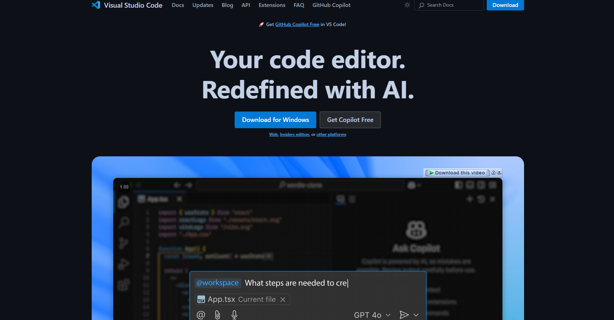

LaTeX is a high-quality typesetting system that is widely used in technical, academic, and scientific writing. It’s very popular in academia, especially in fields like mathematics, physics, computer science, and engineering.

LaTeX is not a word processor like Microsoft Word – rather, it’s a document preparation system that allows you to focus on the content of your writing while it handles the formatting. If you use LaTeX to write your formal documents (like a CV, résumé, or research paper), then you don’t need to worry about the formatting and structure, as everything can be done using LaTeX scripts.

If you use LaTeX to write your academic or research papers, you might be familiar with website-based applications like Overleaf. Overleaf is a website that allows anyone to read, write, and compile LaTeX scripts online.

These sites are okay for small tasks or compilations, or if you need only a little bit of free collaboration. But if you need to work on bigger projects or need to conduct many collaborative tasks, then the free tier may be insufficient. And in my opinion, the paid subscription costs too much.

But don’t worry: running LaTeX locally may be the perfect solution for you. I know this because I also faced a similar situation, and this simply changed my life! I also keep all of the tracks in Git (GitHub, GitLab, and so on) along with unlimited collaboration opportunities and compilation. And the great thing is, all of these are completely free as it’s all happening on my local machine.

So in this article, I am going to discuss the methods in detail. I have also created an in-depth video for you to understand how this works.

## Video Tutorial

<iframe width="893" height="502" src="https://www.youtube.com/watch?v=A45lWrndVHA" title="How To Run LaTeX Projects Locally (for FREE!) On Windows Operating System" frameborder="0" allow="accelerometer; autoplay; clipboard-write; encrypted-media; gyroscope; picture-in-picture; web-share" referrerpolicy="strict-origin-when-cross-origin" allowfullscreen></iframe>

## Resources You’ll Need:

1. GitHub Repository

This entire guide is available in one of my GitHub projects named [Install-LaTeX](https://github.com/FahimFBA/Install-LaTeX). The live website is available [here (fahimfba.github.io/Install-LaTeX)](https://fahimfba.github.io/Install-LaTeX/) as well. I would highly appreciate it if you star (⭐) the repository. Also, you can create issues [there](https://github.com/FahimFBA/Install-LaTeX/issues) if you face any problems. Any kind of good contribution is also welcome here.

2. Operating System

You can install LaTeX on any major operating system (Windows, MacOS, and Linux-based OSes). But in this article, I am only going to talk about the Windows operating system.

Here, I’m using the latest Windows 11 operating system, but the same procedure should be applicable to all of the Windows-based operating systems that are going to come out in the future. Windows 10 should also be okay too.

3. Editor

I am going to use the popular [Visual Studio Code](https://code.visualstudio.com/) as my editor. It is a 100% free and robust editor that’s very popular among devs all over the world. If you don’t already have it, go ahead and install it before proceeding further.

4. LaTeX Compiler/IDE

To work on LaTeX files, you’ll need a specific compiler. I am going to use [MikTeX](https://miktex.org/). There are other tools out there, but this is the best tool right now (according to me!). It is completely free and supports all major operating systems as well. It also has a built-in IDE, but we are going to use VS Code as our main editor.