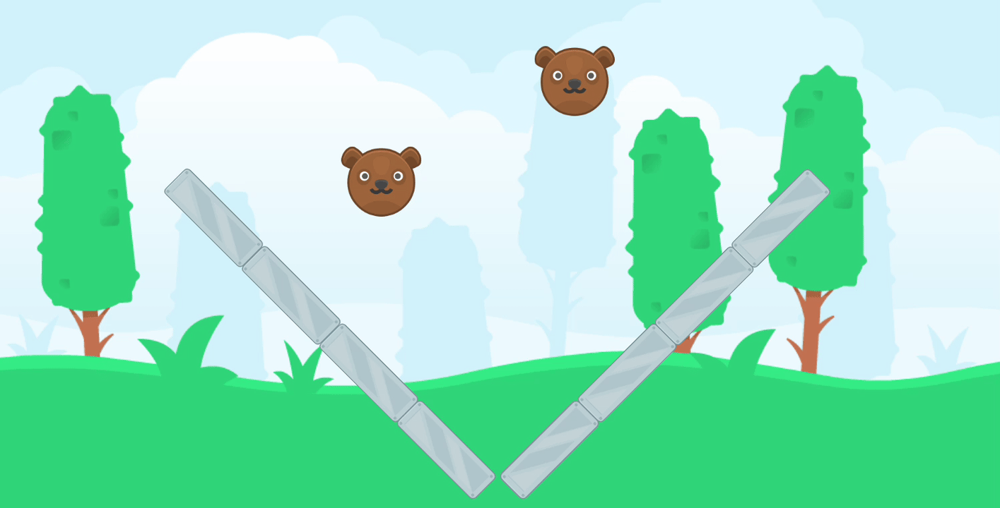

Here we are again. You may not know or recognize, but this is my second attempt at a game development blog. The first one was created at a time I didn't had much free time outside my full-time job, so it got swallowed by my other activities, but not this one, I promise.

You and I are going on a long and hopeful fun journey together. From the concept of the game, designing its systems, polishing its gameplay, to - finally - its release. Buckle up, it's going to be quite a ride.

## What I'm doing

In short, a game where you collect and create teams of special marbles, with different and unique abilities to battle in a arena. The player with at least one marble remaining, wins.

That is the general current idea for the battle. Of course, there will be hit points for each marble, special effects, sound, a better arena, the list goes on. But for now, that is the proof of concept we're working on while we refine the details of the core battle system.

## Tools and assets

The game engine that has forever a place in my heart, [Godot](https://godotengine.org/), takes the important role of the backbone programming engine here. With its easy-to-use language and great scenes/nodes system, it is fast and easy to iterate over. If you don't know them, make a visit to their site, a new major release just dropped, with a lot of big improvements, helping solidify Godot as the reference open source game engine.

As for the assets, I have [Kenney](https://kenney.nl) to thank for. I love his art and passion, giving to the game development community free assets (Creative Commons) to use in any project you'd like, ranging from 2D pixel art to fully animated 3D models. And don't let me get started on the UI and sounds as well! He's the whole package, go support our man!

## Next steps
I'm planning to publish weekly updates - probably on the weekends - to keep the momentum going. I'm very excited to work on this project and have its progress tracked every week.

At the release, we will look back at this tiny first blog post and admire how far we can go if we just keep working towards our goal.

> I know this was a quick read, so here is the [About](/about/) in case you missed it.

Have a great week, see you soon!