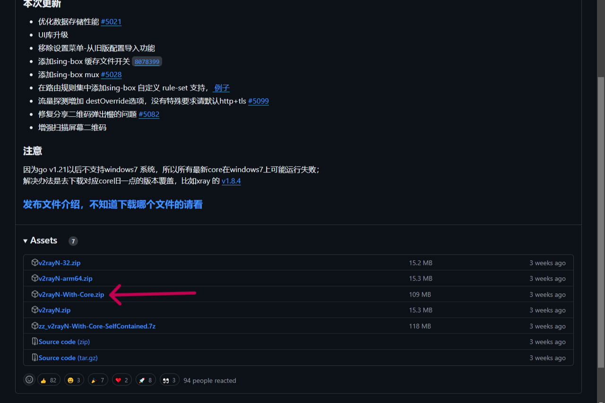
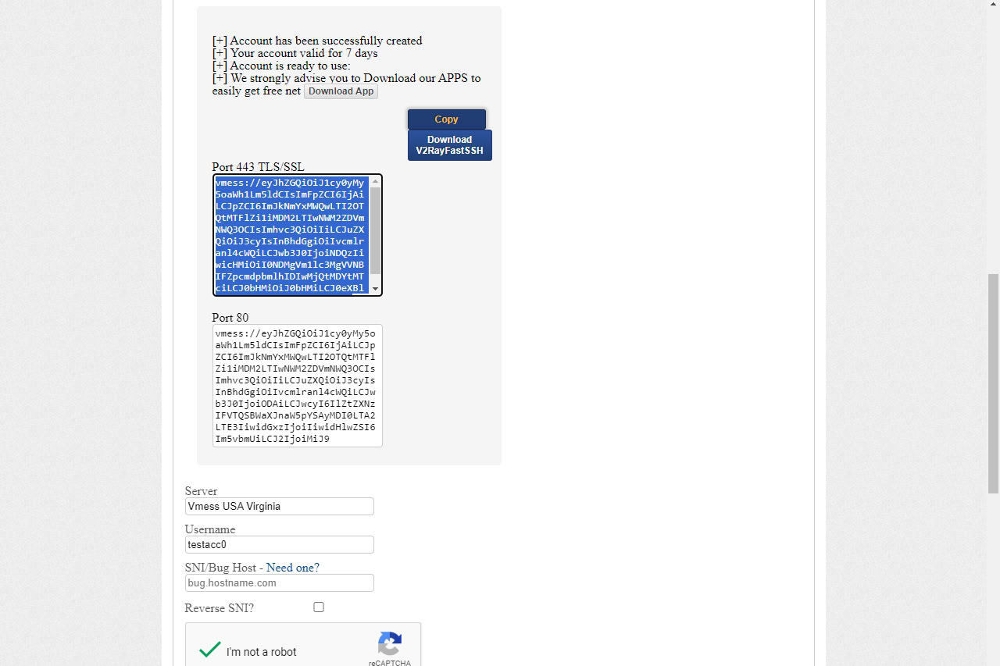
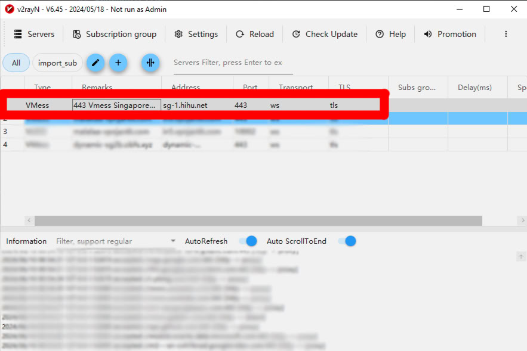
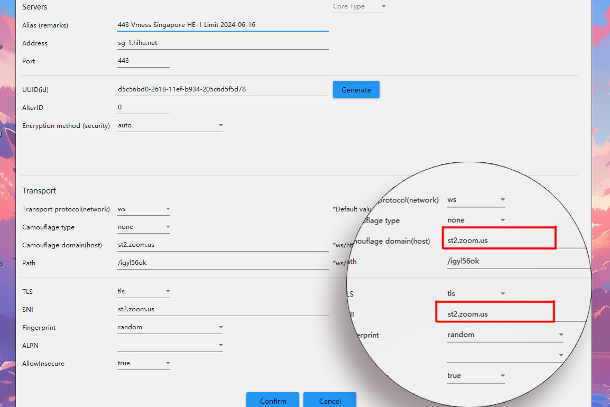

> Learn how to leverage **V2Ray** to bypass ISP-restricted data packages—particularly those targeting specific services like **Zoom**.
---
## What is V2Ray?

Think of **V2Ray** as a **VPN on steroids**. It offers more flexibility, advanced routing, and obfuscation features compared to traditional VPNs—making it ideal for evading restrictive ISP-level throttling and service-level firewalls.

---

## Prerequisites

Before proceeding, ensure you have the following:

- A Windows PC with administrator privileges
> [!NOTE]
> There are apps available for Android, iOS, and Linux, but this guide focuses on Windows.
- A **V2Ray server** (self-hosted or via a provider) — Free options include [FastSSH](https://www.fastssh.com) or [VPN Jantit](https://www.vpnjantit.com)  
- A **V2Ray client for Windows** — We'll use **v2rayN**

---

## Step 1: Download and Install V2Ray Client (v2rayN)

1. Download the latest version of **v2rayN-With-Core.zip** from the official GitHub repository:  
   👉 [https://github.com/2dust/v2rayN](https://github.com/2dust/v2rayN)

2. Extract the ZIP file and run the `v2rayN.exe`.

---

## Step 2: Create a V2Ray Account

You can either self-host or use a third-party service like **FastSSH**:

1. Visit the [FastSSH V2Ray section](https://www.fastssh.com)

2. Choose a server location and create an account  
3. Copy the configuration—specifically the **TLS Port 443** (preferred for SNI)

---

## Step 3: Import V2Ray Configuration

1. Open **v2rayN**
2. Press `Ctrl + V` to import the config from clipboard  
   Or go to **Servers > Import bulk URL from Clipboard**

---

## Step 4: Modify the Config for SNI Bypass

1. Double-click the imported config  
2. Change the following values:

| Field               | Value             |
|--------------------|-------------------|
| **Camouflage Type**     | None              |
| **Camouflage Domain**   | `aka.ms`          |
| **Fingerprint**         | Random            |
| **AllowInsecure**       | True              |

*(Use the appropriate domain for your targeted service — e.g., WhatsApp, Facebook, etc.)*

---

## Step 5: Start V2Ray

- Select the config and press **Enter** or right-click > **Start**  
- If the SNI host is valid and server config is correct, V2Ray will connect successfully.

---

## Bonus: Finding SNI Hosts

You can identify potential SNI hosts using:

- **Burp Suite** (manual inspection)
- **Online Subdomain Scanners** (e.g., crt.sh, Subfinder)

**Example SNI Hosts by Platform:**

### WhatsApp
>  `www.whatsapp.com`
>  `web.whatsapp.com`
>  `business.whatsapp.com`
>  `faq.whatsapp.com`

### Facebook
> `www.facebook.com`
> `mbasic.facebook.com`
> `web.facebook.com`
> `static.whatsapp.net`

### YouTube
>  `www.youtube.com`
>  `m.youtube.com`
>  `music.youtube.com`

---

## Final Thoughts

This method is a clever workaround for ISP-level service restrictions, particularly useful in regions where Zoom or WhatsApp data is metered separately. As always, use responsibly.

---

:::caution
This guide is for educational purposes only. Misusing network tunneling tools may violate your ISP's terms of service.
:::

peace ✌️