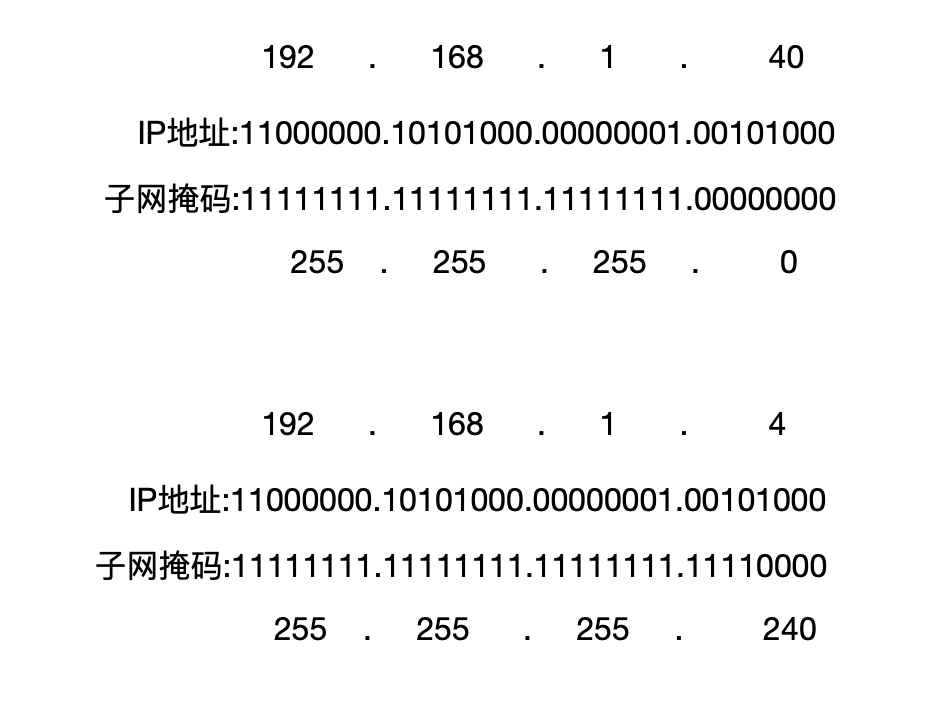

## 1.What is VLSM

**什么是VLSM?**

vlsm的中文名叫『可变长子网掩码』,是一种网络技术.

## 2.Why is VLSM?

这章不讲原理也不讲怎么用,我们来讲讲VLSM可以帮助我们做什么.

**我们为什么要使用VLSM?**

因为VLSM可以帮助我们节省IP地址,减少网络范围,前者的好处不言自明,后者则可以减轻路由器的负担.

**它是怎么把一个大网络分成几个小网络的?**

在下一章的原理部分,我们会详细的讲述的.

### 有类网络与无类网络

**什么样的网络是有类网络呢?**

A类、B类、C类网络就是有类网络,也就是说当一个网络中所有主机的子网掩码都一样时,那么这个网络就是有类网络.

**什么样的网络是无类网络呢?**

一个网络中有任意有一台主机的子网掩码不同于其它主机的子网掩码时,那么这个网络就是无类网络.比如一台主机的子网掩码是255.255.255.240,另一台主机的子网掩码是255.255.255.252

**那有类网络与无类网络在实际应用中有什么区别呢?**

一个网络如果是无类网络,那么它就只能使用RIPv2与OSPF等为无类网络所设计的路由协议,因为这些路由协议,会在路由通信时,带上主机的子网掩码,而RIP等路由协议将认为所有的网络接口都是同样的子网掩网,那么它就不会带上子网掩码.

**那有类网络和无类网络与VLSM有什么关系呢?**

VLSM是通过向子网掩码借位实现的,所以只要使用了VLSM,那么这个网络就是无类网络.

## 3.How is VLSM?

了解了VLSM的优点和为什么要使用它,那我们就开始讲解VLSM的原理了.

### VLSM的原理

IP地址是由网络号与主机号组成的,我们可以通过子网掩码与IP地址进行运算,那我们就可以把一个IP地址分成网络号与主机号.

如图所示,我们通过把0改成1,那么IP地址所在的IP位就从主机号,变成了网络号的一部分.

### 在C类网络上划分

**VLSM可以在哪些网络上使用?**

Vlsm当然可以A类B类任意网络上划分,不过一般来说C类用的更多也更直观.且在学完之后,你也可以在A类B类网络上使用VLSM了.

我现在将为你展示不同的子网掩码和它与IP地址的联系(在C类网络中).

| 前缀 | 子网掩码 | 能用的主机数 | 占用IP地址数 | 子网掩码(二进制) |
| :--: | :------: | :----------: | :----------: | ---------------: |
| /24  |    0     |     254      |     256      |         00000000 |
| /25  |   128    |     126      |     128      |         10000000 |
| /26  |   192    |      62      |      64      |         11000000 |
| /27  |   224    |      30      |      32      |         11100000 |
| /28  |   240    |      14      |      16      |         11110000 |
| /29  |   248    |      6       |      8       |         11111000 |
| /30  |   252    |      2       |      4       |         11111100 |

我们可以根据一个路由接口所需要的主机数,去挑选一个合适大小的子网掩码给你所划分的新网络.

**能不能演示一下怎么划分一个网络**

好的,我现在将划分『192.168.10.0』这个大网络,把它划分成三个小网络.

| IP   |                                          图例 |
| ---- | --------------------------------------------: |
| 0    |                                               |
| 16   |                    第一个网络-192.168.10.1/27 |
| 32   | --------------------------------------------- |
| 48   |                                               |
| 64   |                   第二个网络-192.168.10.33/27 |
| 80   | --------------------------------------------- |
| 96   |                   第三个网络-192.168.10.81/28 |
| 112  | --------------------------------------------- |
| 128  |                                               |
| 144  |                                               |
| 160  |                                               |
| 176  |                                               |
| 192  |                                               |
| ...  |                                          省略 |

这样我就得到了三 个小网络

| 网络 |          可用IP范围          |    子网掩码     |
| :--: | :--------------------------: | :-------------: |
|  1   |  192.168.10.2-192.168.10.31  | 255.255.255.224 |
|  2   | 192.168.10.33-192.168.10.79  | 255.255.255.224 |
|  3   | 192.168.10.81-192.168.10.111 | 255.255.255.240 |

**为什么可用IP范围头尾少了二个IP**

你观察的真细节,确实如此,这二个IP在网络中另有他用,它们维持着网络,使网络能正常工作,所以不能把这两个IP给其它人.

**划分子网的有什么规则吗?**

有,每一个网络的开始IP必须是它所占有IP地址数量的整数倍,因为这样才能知道这个网络的范围与判断任意一个IP是属于哪一个网络的.

**划分子网有什么技巧吗?**

建议网络自大往小的分划.这样肯定可以让每一个子网的开始IP与结束IP都是相连的,可以减少因为必须是整数的开始所空置的IP.

**每划分一个网络,那么就要失去一个网络的头与尾两个ip,但是如果不把网络进行划分就有254个IP可以使用,而把网络细划就会失去更多的头尾两个IP,导致可用IP比254还要少,为什么反而能节省IP地址?**

确实每划分一个网络,那么这个网络就要使用两个IP去使这个网络能正常使用.

但是为什么能节省IP地址呢?那是因为路由器有一个要求,即一个路由器的两个接口是不能在同一个网络之中.

如果不使用VLSM细分网络的话,那么给一个路由器接口分配IP地址至少就要分配一个C类网络,可C类网络可是有254个IP地址可以使用呀.如果路由器用不完254个,那剩余未分配的IP地址就被空置着,且不能被其实接口的主机使用.

著作权归作者所有。

商业转载请联系作者获得授权，非商业转载请注明出处。

作者：CorrectRoad(HXHL)

链接：https://correctroadh.github.io/posts/vlsm/

来源：CorrectRoad's Blog