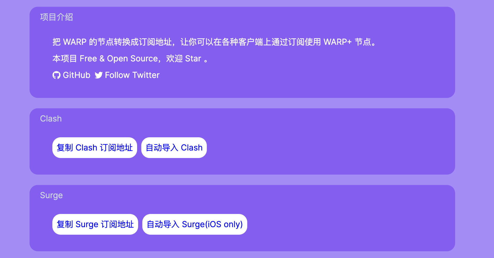
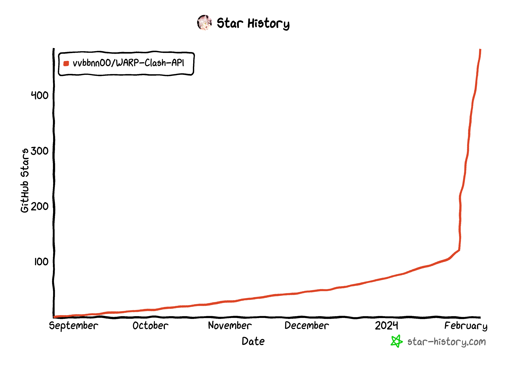

## ToFree 是什么?
[ToFree](https://tofree.zeabur.app) 是一个自动抓取 WARP+ 节点信息并将其转换成 Clash、Surge、WireGuard 等软件可订阅使用的工具。

## 为什么我要搞 ToFree?
WARP+ 应该是 2023 年推出的一款代理服务，因为能在中国大陆使用、并且免费的原因。很快就有大量的教程出来教大家如果在 Surge、Clash 上使用 WARP+ 的节点。我也在那时候尝试了一下。那时候我认识虽然免费而且速度勉强可以，但是这不值得我省下一个月几十块的机场钱。所以我再也没有用过了。但是这其实上是我忽略掉了 WARP+ 的一个很重要的价值。

我很早之前就看到[编程随想教使用 Tor 匿名的文章](https://program-think.blogspot.com/2020/08/Tor-Triple-Proxy.html)，其中提到使用赛风、自由门等等软件做为 Tor 前置代理。在我短暂的使用 Tor 的经历中我从来没有用过这些软件，因为这些软件虽然免费，但是无不是又卡又慢。对于我来说根本无法使用。所以我一直使用付费的机场作为 Tor 的前置代理。

但是在前段时间，我意识到如果在 Tor 前使用这些机场的代理，那么匿名的效果就会很差多。因为你在机场留下了付费的信息。所以我一直忽略了免费的另一面: 匿名。

所以我就想尝试通过订阅的方式为不同的代理软件提供免费、匿名的 WARP+ 代理。其竞争对手并不是付费的机场，而是之前那些免费的 Tor 前置代理软件。

## 经历
我有了这个想法一起就爬了起来，先在 GitHub 上搜索有没有人已经有了实现。幸运的是我一下就搜索到了。我尝试了一下，其功能还是可以工作的，实在太棒了，说明这个 ToFree 项目不会消耗我的太多精力与时间。

然后我做了一些优化，加了一个好看的前端界面，写一些代码解决了一些小 Bug，然后支持了 Surge 的订阅。部署在 Zeabur 上。然后在 V2EX 上做 Launch。没想到收获到了意料之外的关注度。

随便在尝试在阮一峰的周刊与 HelloGitHub 上再 Launch 一次，可惜没有过审。

## 整体设计
我对 WARP CLASH API 的主要改造是对用户体验上的改造。首先是网站的上手难度，其次是订阅链接的简洁性。

原 WARP Clash API，只提供了订阅链接，而且是非常复杂，在 path 后面还有大量的 param。我先是加了一个无参数，尽可能简单的订阅链接。如`https://subs.zeabur.app/clash`，这样用户在一台新设备上就可以直接默写出来订阅链接，这个体验其实是非常棒的。特别是在比如别人的设备上，比如帮我对象翻个墙。

然后加了一些 url schema 自动导入订阅软件这些就没有什么额外说的。🤔

至于这些改动，已经通过数个 PR 渐渐反馈到上游的开源项目中去。这个我觉得是很重要的，如果你代码用了什么开源项目，做了优化与改动还是得尽可能的反馈给上游与社区。这个并不是出于什么道德。而是可以降低你的维护成本。后续上游有什么修复或者新功能，你同步回来也方便。很有趣，出发点是自私的，但是结果确是对大家都好的。😋

## 收获
我从中收获了一个新朋友和大约 5 个新的 Twitter 粉丝。我和该开源项目的开发者成了朋友确实很开心，但是 5 个新的 Twitter 粉丝。确实没有达到我的预期。我在设计之初，希望收获一些关注，比如Twitter 粉丝，然后通过拿马斯克的广告费来盈利。所以我做了一些改造，比如 ToFree 上顶部放上直达 Follow 按扭的 Twitter Link。但是转化效果依然不理想。后续可以研究一下，是什么原因，比如是没有点开，还是用户没有登陆无法关注，或者觉得关注并没有带来价值。🤔

(Update: 后续长尾运营带来的粉丝还是不少的，大概有 20 ~ 30 个)
(Update: 后续长尾运营又带来了大约 300 个粉丝，这回舒服了)

帮助上游项目 [WARP Clash API](https://github.com/vvbbnn00/WARP-Clash-API) 的 Star 大概翻了四倍。
(Update: 后续翻了59倍)

## 反思与总结
最后大概来个总结，首先我在 UI/UX 上做的改造不错，解决 WARP 用起来麻烦的痒点，其次是在 Launch 上做的不错。做的还不够好的地方，主要就是后面两次在其它网站的 Launch 没有通过，可能是题材比较敏感或者写的内容不够吸引人。

这个模式也大概也有个雏形，我可能后面也会尝试继续挖掘生活中感受到的痛点，然后寻找是否有开源项目，解决开源项目常出现的 UX 不够友好的问题。然后发布，帮助到大家，收获关注。