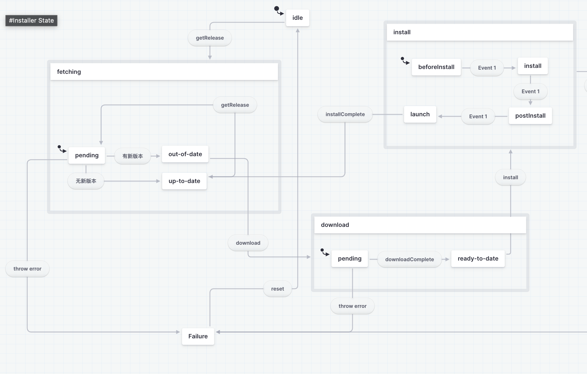
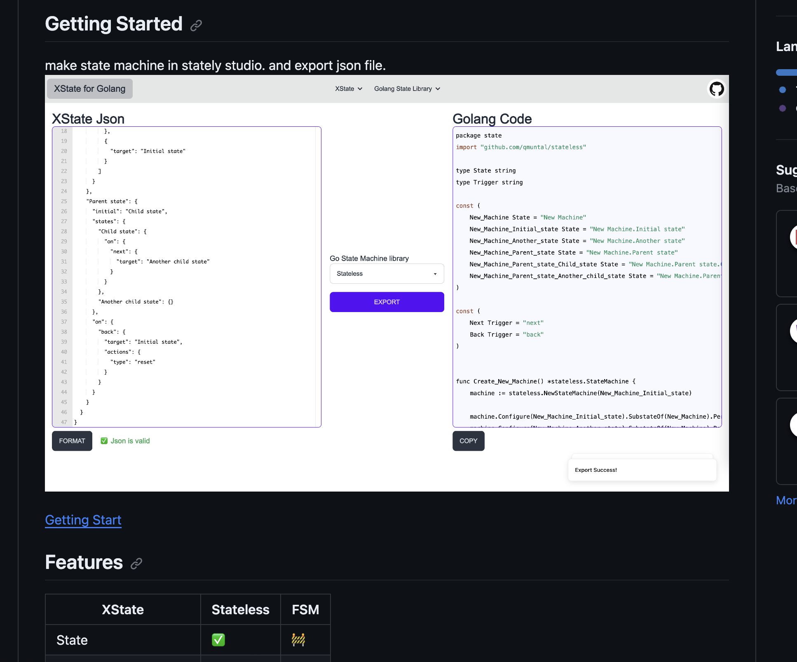

## 我对 XState 的想法
前几天在 v2 上了解到了 XState，最开始觉得这有啥用，React 有 Redux、Zustand，Vue 有 pinia。[example](https://xstate.js.org/docs/tutorials/reddit.html) 中的那些用法(比如管理loading之类的)不是被 SWR 和 React Query 完爆吗？

但是随着后续了解了生态，还是觉得挺有意思的。 比如像 [Stately Studio](https://stately.ai/docs/studio) 来描述复杂的状态机图。

如果 XState 用来像文档中用来管理各种登录前后、还有用 actor 和 invoke 去管理网络请求（or promise）的话确实大材小用了，但是如果说用来管理复杂的程序逻辑状态就合适多了。

前几天，我在冰鲸的实习做了一个 OTA 的程序，其实状态逻辑不太复杂，但是随着需求增加，代码也渐渐复杂了起来。比如需求会是同一个实现在不同的调用方会有不同的状态改变。然后不同的实现可能让会改变状态的值是一样的。 我的解决方式就是把状态变更层和不同的实现抽离起来，单独放一层。状态层会根据传入的调用信息处理业务逻辑更改状态。有点像前端的 Dispatch 和 Action 。

但是随着 CTO 让我补程序的流程图的时候我真的要哭了🤣 在飞书我在里画呀画真的好累呀。这里我就想到了 XState，如果先用 Stately Studio 画状态机图，然后生成状态机的代码，我就可以少画一次流程图啦。

## XState 在 Golang

XState 是一个前端库，所以只能导出成 TypeScript 代码，我的程序是用 Golang 写的，所以尽管 XState 看起来很好，但是依然没办法直接用上。

我就想这玩意在前端出现是浪费，前端无非就是请求加载。在同等生态位那么多竞争对手，要你干嘛。后面想了一下现在 Web 后端难道不是 Stateless 吗？更不需要了。只是我被我最近写的那些项目限制住了想象力。我的 Golang 程序中才会有这种状态机的需求。

就是可以理解成这种东西和 Web 应用没啥关系，主要就是工具类的应用才会用到。而且现在应用也确实基本是用 Electron 写的。所以在前端出现也确实更常用

### XState Export to Golang
我研究了一下 Golang 的 State Machine 的库，尽管因为语法和机制问题，Golang 少了很多 Promise 等机制，但是至少核心的功能能和前端等价起来，所以把 XState 迁移到 Golang 并非什么大工程。用不上啥 AST 、编译原理。直接生成代码模板往里面塞代码就完事了。

所以我大概做了一个工具，可以把 XState 给 export 成 Golang State Machine 的实现。

[XState For Golang](https://github.com/CorrectRoadH/XState-For-Golang) 如果能给我点个 Star 🌟 的话，就太感谢了🥺

## XState 的最佳实践
其实我也还是刚了解 XState 🤣。我也会经常在想，怎么去设计状态，某个情况是抽象成顶级状态还是子状态。State 怎么去命令，是用进行式，还是过去式。 Event 又是怎么去命名，用什么时态。

然后公司项目其实也固定下来了，目前估计不会让我重构，也没有啥新项目让我写，所以想把 XState 在公司内推开学习，眼前也没有啥可能。 所以我会尝试做几个 Side Project 或者 Demo 来尝试一下 XState in Golang，也欢迎大家一起来尝试和使用，并帮助我一起来改进这个程序。
