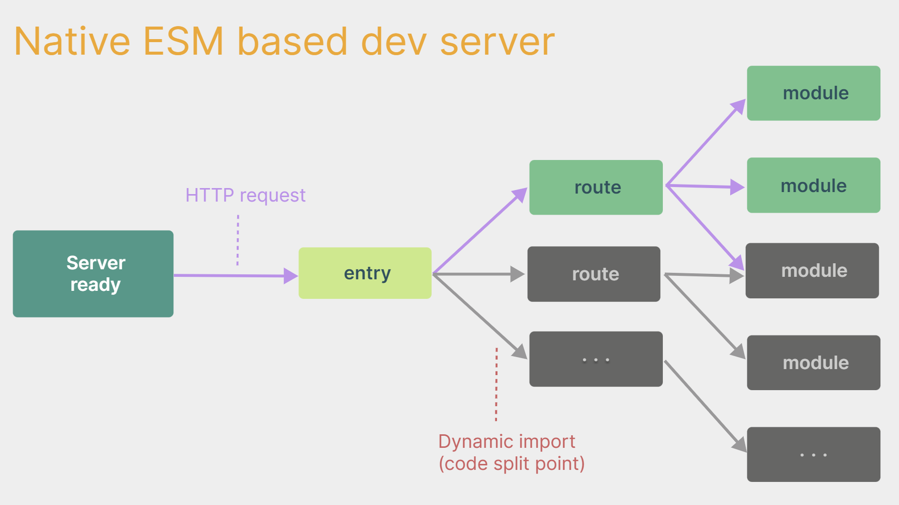
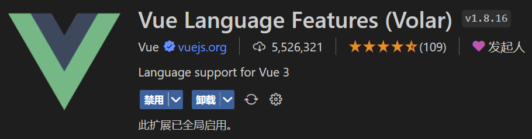
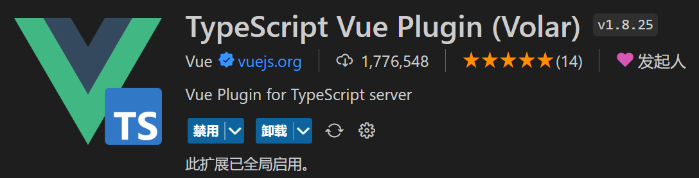
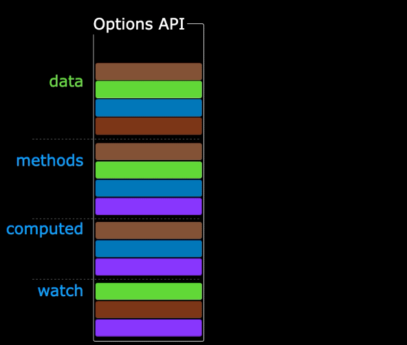
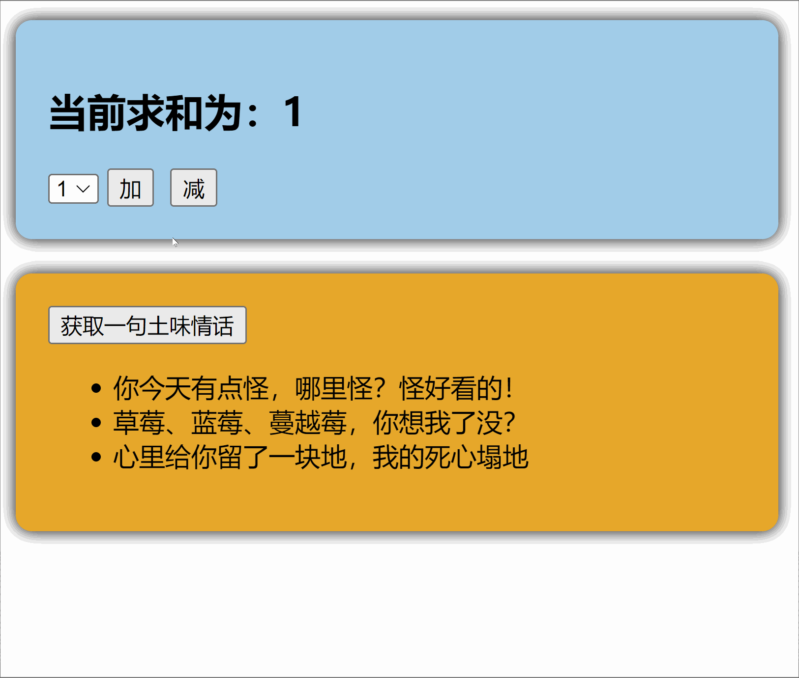

# 1. Vue3简介

- 2020年9月18日，`Vue.js`发布版`3.0`版本，代号：`One Piece`（n
- 经历了：[4800+次提交](https://github.com/vuejs/core/commits/main)、[40+个RFC](https://github.com/vuejs/rfcs/tree/master/active-rfcs)、[600+次PR](https://github.com/vuejs/vue-next/pulls?q=is%3Apr+is%3Amerged+-author%3Aapp%2Fdependabot-preview+)、[300+贡献者](https://github.com/vuejs/core/graphs/contributors)
- 官方发版地址：[Release v3.0.0 One Piece · vuejs/core](https://github.com/vuejs/core/releases/tag/v3.0.0)
- 截止2023年10月，最新的公开版本为：`3.3.4`

   

## 1.1. 【性能的提升】

- 打包大小减少`41%`。

- 初次渲染快`55%`, 更新渲染快`133%`。

- 内存减少`54%`。

  
## 1.2.【 源码的升级】

- 使用`Proxy`代替`defineProperty`实现响应式。

- 重写虚拟`DOM`的实现和`Tree-Shaking`。

  
## 1.3. 【拥抱TypeScript】

- `Vue3`可以更好的支持`TypeScript`。

  
## 1.4. 【新的特性】

1. `Composition API`（组合`API`）：
   - `setup`
   - `ref`与`reactive`
   - `computed`与`watch`
   
     ......
   
2. 新的内置组件：
   - `Fragment`
   - `Teleport`
   - `Suspense`

     ......

3. 其他改变：
   - 新的生命周期钩子
   - `data` 选项应始终被声明为一个函数
   - 移除`keyCode`支持作为` v-on` 的修饰符

     ......


# 2. 创建Vue3工程

## 2.1. 【基于 vue-cli 创建】
点击查看[官方文档](https://cli.vuejs.org/zh/guide/creating-a-project.html#vue-create)

> 备注：目前`vue-cli`已处于维护模式，官方推荐基于 `Vite` 创建项目。

```powershell
## 查看@vue/cli版本，确保@vue/cli版本在4.5.0以上
vue --version

## 安装或者升级你的@vue/cli 
npm install -g @vue/cli

## 执行创建命令
vue create vue_test

##  随后选择3.x
##  Choose a version of Vue.js that you want to start the project with (Use arrow keys)
##  > 3.x
##    2.x

## 启动
cd vue_test
npm run serve
```

---

## 2.2. 【基于 vite 创建】(推荐)
`vite` 是新一代前端构建工具，官网地址：[https://vitejs.cn](https://vitejs.cn/)，`vite`的优势如下：

- 轻量快速的热重载（`HMR`），能实现极速的服务启动。

- 对 `TypeScript`、`JSX`、`CSS` 等支持开箱即用。

- 真正的按需编译，不再等待整个应用编译完成。

- `webpack`构建 与 `vite`构建对比图如下：

  
  
  ​	
* 具体操作如下（点击查看[官方文档](https://cn.vuejs.org/guide/quick-start.html#creating-a-vue-application)）

```powershell
## 1.创建命令
npm create vue@latest

## 2.具体配置
## 配置项目名称
√ Project name: vue3_test
## 是否添加TypeScript支持
√ Add TypeScript?  Yes
## 是否添加JSX支持
√ Add JSX Support?  No
## 是否添加路由环境
√ Add Vue Router for Single Page Application development?  No
## 是否添加pinia环境
√ Add Pinia for state management?  No
## 是否添加单元测试
√ Add Vitest for Unit Testing?  No
## 是否添加端到端测试方案
√ Add an End-to-End Testing Solution? » No
## 是否添加ESLint语法检查
√ Add ESLint for code quality?  Yes
## 是否添加Prettiert代码格式化
√ Add Prettier for code formatting?  No
```
自己动手编写一个App组件

```vue
<template>
  <div class="app">
    <h1>你好啊！</h1>
  </div>
</template>

<script lang="ts">
  export default {
    name:'App' //组件名
  }
</script>

<style>
  .app {
    background-color: #ddd;
    box-shadow: 0 0 10px;
    border-radius: 10px;
    padding: 20px;
  }
</style>
```

安装官方推荐的`vscode`插件：

 


 

总结：

- `Vite` 项目中，`index.html` 是项目的入口文件，在项目最外层。
- 加载`index.html`后，`Vite` 解析 `<script type="module" src="xxx">` 指向的`JavaScript`。
- `Vue3`**中是通过 **`createApp` 函数创建一个应用实例。
## 2.3. 【一个简单的效果】

`Vue3`向下兼容`Vue2`语法，且`Vue3`中的模板中可以没有根标签

```vue
<template>
  <div class="person">
    <h2>姓名：{{name}}</h2>
    <h2>年龄：{{age}}</h2>
    <button @click="changeName">修改名字</button>
    <button @click="changeAge">年龄+1</button>
    <button @click="showTel">点我查看联系方式</button>
  </div>
</template>

<script lang="ts">
  export default {
    name:'App',
    data() {
      return {
        name:'张三',
        age:18,
        tel:'13888888888'
      }
    },
    methods:{
      changeName(){
        this.name = 'zhang-san'
      },
      changeAge(){
        this.age += 1
      },
      showTel(){
        alert(this.tel)
      }
    },
  }
</script>
```


# 3. Vue3核心语法
## 3.1.  【OptionsAPI 与 CompositionAPI】

- `Vue2`的`API`设计是`Options`（配置）风格的。
- `Vue3`的`API`设计是`Composition`（组合）风格的。
###  Options API 的弊端

`Options`类型的 `API`，数据、方法、计算属性等，是分散在：`data`、`methods`、`computed`中的，若想新增或者修改一个需求，就需要分别修改：`data`、`methods`、`computed`，不便于维护和复用。


### Composition API 的优势

可以用函数的方式，更加优雅的组织代码，让相关功能的代码更加有序的组织在一起。





> 说明：以上四张动图原创作者：大帅老猿

## 3.2. 【拉开序幕的 setup】
### setup 概述
`setup`是`Vue3`中一个新的配置项，值是一个函数，它是 `Composition API` **“表演的舞台**_**”**_，组件中所用到的：数据、方法、计算属性、监视......等等，均配置在`setup`中。

特点如下：

- `setup`函数返回的对象中的内容，可直接在模板中使用。
- `setup`中访问`this`是`undefined`。
- `setup`函数会在`beforeCreate`之前调用，它是“领先”所有钩子执行的。
```vue
<template>
  <div class="person">
    <h2>姓名：{{name}}</h2>
    <h2>年龄：{{age}}</h2>
    <button @click="changeName">修改名字</button>
    <button @click="changeAge">年龄+1</button>
    <button @click="showTel">点我查看联系方式</button>
  </div>
</template>

<script lang="ts">
  export default {
    name:'Person',
    setup(){
      // 数据，原来写在data中（注意：此时的name、age、tel数据都不是响应式数据）
      let name = '张三'
      let age = 18
      let tel = '13888888888'

      // 方法，原来写在methods中
      function changeName(){
        name = 'zhang-san' //注意：此时这么修改name页面是不变化的
        console.log(name)
      }
      function changeAge(){
        age += 1 //注意：此时这么修改age页面是不变化的
        console.log(age)
      }
      function showTel(){
        alert(tel)
      }

      // 返回一个对象，对象中的内容，模板中可以直接使用
      return {name,age,tel,changeName,changeAge,showTel}
    }
  }
</script>
```
### setup 的返回值

- 若返回一个**对象**：则对象中的：属性、方法等，在模板中均可以直接使用**（重点关注）。**
- 若返回一个**函数**：则可以自定义渲染内容，代码如下：
```jsx
setup(){
  return ()=> '你好啊！'
}
```
### setup 与 Options API 的关系

- `Vue2` 的配置（`data`、`methos`......）中**可以访问到** `setup`中的属性、方法。
- 但在`setup`中**不能访问到**`Vue2`的配置（`data`、`methos`......）。
- 如果与`Vue2`冲突，则`setup`优先。
### setup 语法糖
`setup`函数有一个语法糖，这个语法糖，可以让我们把`setup`独立出去，代码如下：

```vue
<template>
  <div class="person">
    <h2>姓名：{{name}}</h2>
    <h2>年龄：{{age}}</h2>
    <button @click="changName">修改名字</button>
    <button @click="changAge">年龄+1</button>
    <button @click="showTel">点我查看联系方式</button>
  </div>
</template>

<script lang="ts">
  export default {
    name:'Person',
  }
</script>

<!-- 下面的写法是setup语法糖 -->
<script setup lang="ts">
  console.log(this) //undefined
  
  // 数据（注意：此时的name、age、tel都不是响应式数据）
  let name = '张三'
  let age = 18
  let tel = '13888888888'

  // 方法
  function changName(){
    name = '李四'//注意：此时这么修改name页面是不变化的
  }
  function changAge(){
    console.log(age)
    age += 1 //注意：此时这么修改age页面是不变化的
  }
  function showTel(){
    alert(tel)
  }
</script>
```
扩展：上述代码，还需要编写一个不写`setup`的`script`标签，去指定组件名字，比较麻烦，我们可以借助`vite`中的插件简化

1. 第一步：`npm i vite-plugin-vue-setup-extend -D`
2. 第二步：`vite.config.ts`
```jsx
import { defineConfig } from 'vite'
import VueSetupExtend from 'vite-plugin-vue-setup-extend'

export default defineConfig({
  plugins: [ VueSetupExtend() ]
})
```

3. 第三步：`<script setup lang="ts" name="Person">`
## 3.3. 【ref 创建：基本类型的响应式数据】

- **作用：**定义响应式变量。
- **语法：**`let xxx = ref(初始值)`。
- **返回值：**一个`RefImpl`的实例对象，简称`ref对象`或`ref`，`ref`对象的`value`**属性是响应式的**。
- **注意点：**
   - `JS`中操作数据需要：`xxx.value`，但模板中不需要`.value`，直接使用即可。
   - 对于`let name = ref('张三')`来说，`name`不是响应式的，`name.value`是响应式的。
```vue
<template>
  <div class="person">
    <h2>姓名：{{name}}</h2>
    <h2>年龄：{{age}}</h2>
    <button @click="changeName">修改名字</button>
    <button @click="changeAge">年龄+1</button>
    <button @click="showTel">点我查看联系方式</button>
  </div>
</template>

<script setup lang="ts" name="Person">
  import {ref} from 'vue'
  // name和age是一个RefImpl的实例对象，简称ref对象，它们的value属性是响应式的。
  let name = ref('张三')
  let age = ref(18)
  // tel就是一个普通的字符串，不是响应式的
  let tel = '13888888888'

  function changeName(){
    // JS中操作ref对象时候需要.value
    name.value = '李四'
    console.log(name.value)

    // 注意：name不是响应式的，name.value是响应式的，所以如下代码并不会引起页面的更新。
    // name = ref('zhang-san')
  }
  function changeAge(){
    // JS中操作ref对象时候需要.value
    age.value += 1 
    console.log(age.value)
  }
  function showTel(){
    alert(tel)
  }
</script>
```
## 3.4. 【reactive 创建：对象类型的响应式数据】

- **作用：**定义一个**响应式对象**（基本类型不要用它，要用`ref`，否则报错）
- **语法：**`let 响应式对象= reactive(源对象)`。
- **返回值：**一个`Proxy`的实例对象，简称：响应式对象。
- **注意点：**`reactive`定义的响应式数据是“深层次”的。
```vue
<template>
  <div class="person">
    <h2>汽车信息：一台{{ car.brand }}汽车，价值{{ car.price }}万</h2>
    <h2>游戏列表：</h2>
    <ul>
      <li v-for="g in games" :key="g.id">{{ g.name }}</li>
    </ul>
    <h2>测试：{{obj.a.b.c.d}}</h2>
    <button @click="changeCarPrice">修改汽车价格</button>
    <button @click="changeFirstGame">修改第一游戏</button>
    <button @click="test">测试</button>
  </div>
</template>

<script lang="ts" setup name="Person">
import { reactive } from 'vue'

// 数据
let car = reactive({ brand: '奔驰', price: 100 })
let games = reactive([
  { id: 'ahsgdyfa01', name: '英雄联盟' },
  { id: 'ahsgdyfa02', name: '王者荣耀' },
  { id: 'ahsgdyfa03', name: '原神' }
])
let obj = reactive({
  a:{
    b:{
      c:{
        d:666
      }
    }
  }
})

function changeCarPrice() {
  car.price += 10
}
function changeFirstGame() {
  games[0].name = '流星蝴蝶剑'
}
function test(){
  obj.a.b.c.d = 999
}
</script>
```
## 3.5. 【ref 创建：对象类型的响应式数据】

- 其实`ref`接收的数据可以是：**基本类型**、**对象类型**。
- 若`ref`接收的是对象类型，内部其实也是调用了`reactive`函数。
```vue
<template>
  <div class="person">
    <h2>汽车信息：一台{{ car.brand }}汽车，价值{{ car.price }}万</h2>
    <h2>游戏列表：</h2>
    <ul>
      <li v-for="g in games" :key="g.id">{{ g.name }}</li>
    </ul>
    <h2>测试：{{obj.a.b.c.d}}</h2>
    <button @click="changeCarPrice">修改汽车价格</button>
    <button @click="changeFirstGame">修改第一游戏</button>
    <button @click="test">测试</button>
  </div>
</template>

<script lang="ts" setup name="Person">
import { ref } from 'vue'

// 数据
let car = ref({ brand: '奔驰', price: 100 })
let games = ref([
  { id: 'ahsgdyfa01', name: '英雄联盟' },
  { id: 'ahsgdyfa02', name: '王者荣耀' },
  { id: 'ahsgdyfa03', name: '原神' }
])
let obj = ref({
  a:{
    b:{
      c:{
        d:666
      }
    }
  }
})

console.log(car)

function changeCarPrice() {
  car.value.price += 10
}
function changeFirstGame() {
  games.value[0].name = '流星蝴蝶剑'
}
function test(){
  obj.value.a.b.c.d = 999
}
</script>
```
## 3.6. 【ref 对比 reactive】
宏观角度看：

> 1. `ref`用来定义：**基本类型数据**、**对象类型数据**；
>
> 2. `reactive`用来定义：**对象类型数据**。

- 区别：

> 1. `ref`创建的变量必须使用`.value`（可以使用`volar`插件自动添加`.value`）。
>
>     
>
> 2. `reactive`重新分配一个新对象，会**失去**响应式（可以使用`Object.assign`去整体替换）。

- 使用原则：
> 1. 若需要一个基本类型的响应式数据，必须使用`ref`。
> 2. 若需要一个响应式对象，层级不深，`ref`、`reactive`都可以。
> 3. 若需要一个响应式对象，且层级较深，推荐使用`reactive`。

## 3.7. 【toRefs 与 toRef】

- 作用：将一个响应式对象中的每一个属性，转换为`ref`对象。
- 备注：`toRefs`与`toRef`功能一致，但`toRefs`可以批量转换。
- 语法如下：
```vue
<template>
  <div class="person">
    <h2>姓名：{{person.name}}</h2>
    <h2>年龄：{{person.age}}</h2>
    <h2>性别：{{person.gender}}</h2>
    <button @click="changeName">修改名字</button>
    <button @click="changeAge">修改年龄</button>
    <button @click="changeGender">修改性别</button>
  </div>
</template>

<script lang="ts" setup name="Person">
  import {ref,reactive,toRefs,toRef} from 'vue'

  // 数据
  let person = reactive({name:'张三', age:18, gender:'男'})
	
  // 通过toRefs将person对象中的n个属性批量取出，且依然保持响应式的能力
  let {name,gender} =  toRefs(person)
	
  // 通过toRef将person对象中的gender属性取出，且依然保持响应式的能力
  let age = toRef(person,'age')

  // 方法
  function changeName(){
    name.value += '~'
  }
  function changeAge(){
    age.value += 1
  }
  function changeGender(){
    gender.value = '女'
  }
</script>
```
## 3.8. 【computed】

作用：根据已有数据计算出新数据（和`Vue2`中的`computed`作用一致）。

  

```vue
<template>
  <div class="person">
    姓：<input type="text" v-model="firstName"> <br>
    名：<input type="text" v-model="lastName"> <br>
    全名：<span>{{fullName}}</span> <br>
    <button @click="changeFullName">全名改为：li-si</button>
  </div>
</template>

<script setup lang="ts" name="App">
  import {ref,computed} from 'vue'

  let firstName = ref('zhang')
  let lastName = ref('san')

  // 计算属性——只读取，不修改
  /* let fullName = computed(()=>{
    return firstName.value + '-' + lastName.value
  }) */


  // 计算属性——既读取又修改
  let fullName = computed({
    // 读取
    get(){
      return firstName.value + '-' + lastName.value
    },
    // 修改
    set(val){
      console.log('有人修改了fullName',val)
      firstName.value = val.split('-')[0]
      lastName.value = val.split('-')[1]
    }
  })

  function changeFullName(){
    fullName.value = 'li-si'
  } 
</script>
```
## 3.9.【watch】

- 作用：监视数据的变化（和`Vue2`中的`watch`作用一致）
- 特点：`Vue3`中的`watch`只能监视以下**四种数据**：
> 1. `ref`定义的数据。
> 2. `reactive`定义的数据。
> 3. 函数返回一个值（`getter`函数）。
> 4. 一个包含上述内容的数组。

我们在`Vue3`中使用`watch`的时候，通常会遇到以下几种情况：
### * 情况一
监视`ref`定义的【基本类型】数据：直接写数据名即可，监视的是其`value`值的改变。

```vue
<template>
  <div class="person">
    <h1>情况一：监视【ref】定义的【基本类型】数据</h1>
    <h2>当前求和为：{{sum}}</h2>
    <button @click="changeSum">点我sum+1</button>
  </div>
</template>

<script lang="ts" setup name="Person">
  import {ref,watch} from 'vue'
  // 数据
  let sum = ref(0)
  // 方法
  function changeSum(){
    sum.value += 1
  }
  // 监视，情况一：监视【ref】定义的【基本类型】数据
  const stopWatch = watch(sum,(newValue,oldValue)=>{
    console.log('sum变化了',newValue,oldValue)
    if(newValue >= 10){
      stopWatch()
    }
  })
</script>
```
### * 情况二
监视`ref`定义的【对象类型】数据：直接写数据名，监视的是对象的【地址值】，若想监视对象内部的数据，要手动开启深度监视。

> 注意：
>
> * 若修改的是`ref`定义的对象中的属性，`newValue` 和 `oldValue` 都是新值，因为它们是同一个对象。
>
> * 若修改整个`ref`定义的对象，`newValue` 是新值， `oldValue` 是旧值，因为不是同一个对象了。

```vue
<template>
  <div class="person">
    <h1>情况二：监视【ref】定义的【对象类型】数据</h1>
    <h2>姓名：{{ person.name }}</h2>
    <h2>年龄：{{ person.age }}</h2>
    <button @click="changeName">修改名字</button>
    <button @click="changeAge">修改年龄</button>
    <button @click="changePerson">修改整个人</button>
  </div>
</template>

<script lang="ts" setup name="Person">
  import {ref,watch} from 'vue'
  // 数据
  let person = ref({
    name:'张三',
    age:18
  })
  // 方法
  function changeName(){
    person.value.name += '~'
  }
  function changeAge(){
    person.value.age += 1
  }
  function changePerson(){
    person.value = {name:'李四',age:90}
  }
  /* 
    监视，情况一：监视【ref】定义的【对象类型】数据，监视的是对象的地址值，若想监视对象内部属性的变化，需要手动开启深度监视
    watch的第一个参数是：被监视的数据
    watch的第二个参数是：监视的回调
    watch的第三个参数是：配置对象（deep、immediate等等.....） 
  */
  watch(person,(newValue,oldValue)=>{
    console.log('person变化了',newValue,oldValue)
  },{deep:true})
  
</script>
```
### *  情况三
监视`reactive`定义的【对象类型】数据，且默认开启了深度监视。
```vue
<template>
  <div class="person">
    <h1>情况三：监视【reactive】定义的【对象类型】数据</h1>
    <h2>姓名：{{ person.name }}</h2>
    <h2>年龄：{{ person.age }}</h2>
    <button @click="changeName">修改名字</button>
    <button @click="changeAge">修改年龄</button>
    <button @click="changePerson">修改整个人</button>
    <hr>
    <h2>测试：{{obj.a.b.c}}</h2>
    <button @click="test">修改obj.a.b.c</button>
  </div>
</template>

<script lang="ts" setup name="Person">
  import {reactive,watch} from 'vue'
  // 数据
  let person = reactive({
    name:'张三',
    age:18
  })
  let obj = reactive({
    a:{
      b:{
        c:666
      }
    }
  })
  // 方法
  function changeName(){
    person.name += '~'
  }
  function changeAge(){
    person.age += 1
  }
  function changePerson(){
    Object.assign(person,{name:'李四',age:80})
  }
  function test(){
    obj.a.b.c = 888
  }

  // 监视，情况三：监视【reactive】定义的【对象类型】数据，且默认是开启深度监视的
  watch(person,(newValue,oldValue)=>{
    console.log('person变化了',newValue,oldValue)
  })
  watch(obj,(newValue,oldValue)=>{
    console.log('Obj变化了',newValue,oldValue)
  })
</script>
```
### * 情况四
监视`ref`或`reactive`定义的【对象类型】数据中的**某个属性**，注意点如下：

1. 若该属性值**不是**【对象类型】，需要写成函数形式。
2. 若该属性值是**依然**是【对象类型】，可直接编，也可写成函数，建议写成函数。

结论：监视的要是对象里的属性，那么最好写函数式，注意点：若是对象监视的是地址值，需要关注对象内部，需要手动开启深度监视。

```vue
<template>
  <div class="person">
    <h1>情况四：监视【ref】或【reactive】定义的【对象类型】数据中的某个属性</h1>
    <h2>姓名：{{ person.name }}</h2>
    <h2>年龄：{{ person.age }}</h2>
    <h2>汽车：{{ person.car.c1 }}、{{ person.car.c2 }}</h2>
    <button @click="changeName">修改名字</button>
    <button @click="changeAge">修改年龄</button>
    <button @click="changeC1">修改第一台车</button>
    <button @click="changeC2">修改第二台车</button>
    <button @click="changeCar">修改整个车</button>
  </div>
</template>

<script lang="ts" setup name="Person">
  import {reactive,watch} from 'vue'

  // 数据
  let person = reactive({
    name:'张三',
    age:18,
    car:{
      c1:'奔驰',
      c2:'宝马'
    }
  })
  // 方法
  function changeName(){
    person.name += '~'
  }
  function changeAge(){
    person.age += 1
  }
  function changeC1(){
    person.car.c1 = '奥迪'
  }
  function changeC2(){
    person.car.c2 = '大众'
  }
  function changeCar(){
    person.car = {c1:'雅迪',c2:'爱玛'}
  }

  // 监视，情况四：监视响应式对象中的某个属性，且该属性是基本类型的，要写成函数式
  /* watch(()=> person.name,(newValue,oldValue)=>{
    console.log('person.name变化了',newValue,oldValue)
  }) */

  // 监视，情况四：监视响应式对象中的某个属性，且该属性是对象类型的，可以直接写，也能写函数，更推荐写函数
  watch(()=>person.car,(newValue,oldValue)=>{
    console.log('person.car变化了',newValue,oldValue)
  },{deep:true})
</script>
```
### * 情况五
监视上述的多个数据
```vue
<template>
  <div class="person">
    <h1>情况五：监视上述的多个数据</h1>
    <h2>姓名：{{ person.name }}</h2>
    <h2>年龄：{{ person.age }}</h2>
    <h2>汽车：{{ person.car.c1 }}、{{ person.car.c2 }}</h2>
    <button @click="changeName">修改名字</button>
    <button @click="changeAge">修改年龄</button>
    <button @click="changeC1">修改第一台车</button>
    <button @click="changeC2">修改第二台车</button>
    <button @click="changeCar">修改整个车</button>
  </div>
</template>

<script lang="ts" setup name="Person">
  import {reactive,watch} from 'vue'

  // 数据
  let person = reactive({
    name:'张三',
    age:18,
    car:{
      c1:'奔驰',
      c2:'宝马'
    }
  })
  // 方法
  function changeName(){
    person.name += '~'
  }
  function changeAge(){
    person.age += 1
  }
  function changeC1(){
    person.car.c1 = '奥迪'
  }
  function changeC2(){
    person.car.c2 = '大众'
  }
  function changeCar(){
    person.car = {c1:'雅迪',c2:'爱玛'}
  }

  // 监视，情况五：监视上述的多个数据
  watch([()=>person.name,person.car],(newValue,oldValue)=>{
    console.log('person.car变化了',newValue,oldValue)
  },{deep:true})

</script>
```
## 3.10. 【watchEffect】

* 官网：立即运行一个函数，同时响应式地追踪其依赖，并在依赖更改时重新执行该函数。

* `watch`对比`watchEffect`

  > 1. 都能监听响应式数据的变化，不同的是监听数据变化的方式不同
  >
  > 2. `watch`：要明确指出监视的数据
  >
  > 3. `watchEffect`：不用明确指出监视的数据（函数中用到哪些属性，那就监视哪些属性）。

* 示例代码：

  ```vue
  <template>
    <div class="person">
      <h1>需求：水温达到50℃，或水位达到20cm，则联系服务器</h1>
      <h2 id="demo">水温：{{temp}}</h2>
      <h2>水位：{{height}}</h2>
      <button @click="changePrice">水温+1</button>
      <button @click="changeSum">水位+10</button>
    </div>
  </template>
  
  <script lang="ts" setup name="Person">
    import {ref,watch,watchEffect} from 'vue'
    // 数据
    let temp = ref(0)
    let height = ref(0)
  
    // 方法
    function changePrice(){
      temp.value += 10
    }
    function changeSum(){
      height.value += 1
    }
  
    // 用watch实现，需要明确的指出要监视：temp、height
    watch([temp,height],(value)=>{
      // 从value中获取最新的temp值、height值
      const [newTemp,newHeight] = value
      // 室温达到50℃，或水位达到20cm，立刻联系服务器
      if(newTemp >= 50 || newHeight >= 20){
        console.log('联系服务器')
      }
    })
  
    // 用watchEffect实现，不用
    const stopWtach = watchEffect(()=>{
      // 室温达到50℃，或水位达到20cm，立刻联系服务器
      if(temp.value >= 50 || height.value >= 20){
        console.log(document.getElementById('demo')?.innerText)
        console.log('联系服务器')
      }
      // 水温达到100，或水位达到50，取消监视
      if(temp.value === 100 || height.value === 50){
        console.log('清理了')
        stopWtach()
      }
    })
  </script>
  ```
  
  

## 3.11. 【标签的 ref 属性】

作用：用于注册模板引用。

> * 用在普通`DOM`标签上，获取的是`DOM`节点。
>
> * 用在组件标签上，获取的是组件实例对象。

用在普通`DOM`标签上：

```vue
<template>
  <div class="person">
    <h1 ref="title1">尚硅谷</h1>
    <h2 ref="title2">前端</h2>
    <h3 ref="title3">Vue</h3>
    <input type="text" ref="inpt"> <br><br>
    <button @click="showLog">点我打印内容</button>
  </div>
</template>

<script lang="ts" setup name="Person">
  import {ref} from 'vue'
	
  let title1 = ref()
  let title2 = ref()
  let title3 = ref()

  function showLog(){
    // 通过id获取元素
    const t1 = document.getElementById('title1')
    // 打印内容
    console.log((t1 as HTMLElement).innerText)
    console.log((<HTMLElement>t1).innerText)
    console.log(t1?.innerText)
    
		/************************************/
		
    // 通过ref获取元素
    console.log(title1.value)
    console.log(title2.value)
    console.log(title3.value)
  }
</script>
```

用在组件标签上：

```vue
<!-- 父组件App.vue -->
<template>
  <Person ref="ren"/>
  <button @click="test">测试</button>
</template>

<script lang="ts" setup name="App">
  import Person from './components/Person.vue'
  import {ref} from 'vue'

  let ren = ref()

  function test(){
    console.log(ren.value.name)
    console.log(ren.value.age)
  }
</script>


<!-- 子组件Person.vue中要使用defineExpose暴露内容 -->
<script lang="ts" setup name="Person">
  import {ref,defineExpose} from 'vue'
	// 数据
  let name = ref('张三')
  let age = ref(18)
  /****************************/
  /****************************/
  // 使用defineExpose将组件中的数据交给外部
  defineExpose({name,age})
</script>
```


## 3.12. 【props】

> ```js
>// 定义一个接口，限制每个Person对象的格式
> export interface PersonInter {
>  id:string,
>  name:string,
>     age:number
>    }
>    
> // 定义一个自定义类型Persons
> export type Persons = Array<PersonInter>
> ```
> 
> `App.vue`中代码：
>
> ```vue
><template>
> 	<Person :list="persons"/>
> </template>
>   
> <script lang="ts" setup name="App">
>   import Person from './components/Person.vue'
>   import {reactive} from 'vue'
>     import {type Persons} from './types'
>   
>     let persons = reactive<Persons>([
>      {id:'e98219e12',name:'张三',age:18},
>       {id:'e98219e13',name:'李四',age:19},
>        {id:'e98219e14',name:'王五',age:20}
>      ])
>    </script>
>   
> ```
> 
> `Person.vue`中代码：
>
> ```Vue
><template>
> <div class="person">
>  <ul>
>      <li v-for="item in list" :key="item.id">
>         {{item.name}}--{{item.age}}
>       </li>
>     </ul>
>    </div>
>    </template>
>   
> <script lang="ts" setup name="Person">
> import {defineProps} from 'vue'
> import {type PersonInter} from '@/types'
>   
>   // 第一种写法：仅接收
> // const props = defineProps(['list'])
>   
>   // 第二种写法：接收+限制类型
> // defineProps<{list:Persons}>()
>   
>   // 第三种写法：接收+限制类型+指定默认值+限制必要性
> let props = withDefaults(defineProps<{list?:Persons}>(),{
>      list:()=>[{id:'asdasg01',name:'小猪佩奇',age:18}]
>   })
>    console.log(props)
>   </script>
>   ```
> 

## 3.13. 【生命周期】

* 概念：`Vue`组件实例在创建时要经历一系列的初始化步骤，在此过程中`Vue`会在合适的时机，调用特定的函数，从而让开发者有机会在特定阶段运行自己的代码，这些特定的函数统称为：生命周期钩子

* 规律：

  > 生命周期整体分为四个阶段，分别是：**创建、挂载、更新、销毁**，每个阶段都有两个钩子，一前一后。

* `Vue2`的生命周期

  > 创建阶段：`beforeCreate`、`created`
  >
  > 挂载阶段：`beforeMount`、`mounted`
  >
  > 更新阶段：`beforeUpdate`、`updated`
  >
  > 销毁阶段：`beforeDestroy`、`destroyed`

* `Vue3`的生命周期

  > 创建阶段：`setup`
  >
  > 挂载阶段：`onBeforeMount`、`onMounted`
  >
  > 更新阶段：`onBeforeUpdate`、`onUpdated`
  >
  > 卸载阶段：`onBeforeUnmount`、`onUnmounted`

* 常用的钩子：`onMounted`(挂载完毕)、`onUpdated`(更新完毕)、`onBeforeUnmount`(卸载之前)

* 示例代码：

  ```vue
  <template>
    <div class="person">
      <h2>当前求和为：{{ sum }}</h2>
      <button @click="changeSum">点我sum+1</button>
    </div>
  </template>
  
  <!-- vue3写法 -->
  <script lang="ts" setup name="Person">
    import { 
      ref, 
      onBeforeMount, 
      onMounted, 
      onBeforeUpdate, 
      onUpdated, 
      onBeforeUnmount, 
      onUnmounted 
    } from 'vue'
  
    // 数据
    let sum = ref(0)
    // 方法
    function changeSum() {
      sum.value += 1
    }
    console.log('setup')
    // 生命周期钩子
    onBeforeMount(()=>{
      console.log('挂载之前')
    })
    onMounted(()=>{
      console.log('挂载完毕')
    })
    onBeforeUpdate(()=>{
      console.log('更新之前')
    })
    onUpdated(()=>{
      console.log('更新完毕')
    })
    onBeforeUnmount(()=>{
      console.log('卸载之前')
    })
    onUnmounted(()=>{
      console.log('卸载完毕')
    })
  </script>
  ```

## 3.14. 【自定义hook】

- 什么是`hook`？—— 本质是一个函数，把`setup`函数中使用的`Composition API`进行了封装，类似于`vue2.x`中的`mixin`。

- 自定义`hook`的优势：复用代码, 让`setup`中的逻辑更清楚易懂。

示例代码：

- `useSum.ts`中内容如下：

  ```js
  import {ref,onMounted} from 'vue'
  
  export default function(){
    let sum = ref(0)
  
    const increment = ()=>{
      sum.value += 1
    }
    const decrement = ()=>{
      sum.value -= 1
    }
    onMounted(()=>{
      increment()
    })
  
    //向外部暴露数据
    return {sum,increment,decrement}
  }		
  ```
  
- `useDog.ts`中内容如下：

  ```js
  import {reactive,onMounted} from 'vue'
  import axios,{AxiosError} from 'axios'
  
  export default function(){
    let dogList = reactive<string[]>([])
  
    // 方法
    async function getDog(){
      try {
        // 发请求
        let {data} = await axios.get('https://dog.ceo/api/breed/pembroke/images/random')
        // 维护数据
        dogList.push(data.message)
      } catch (error) {
        // 处理错误
        const err = <AxiosError>error
        console.log(err.message)
      }
    }
  
    // 挂载钩子
    onMounted(()=>{
      getDog()
    })
  	
    //向外部暴露数据
    return {dogList,getDog}
  }
  ```

- 组件中具体使用：

  ```vue
  <template>
    <h2>当前求和为：{{sum}}</h2>
    <button @click="increment">点我+1</button>
    <button @click="decrement">点我-1</button>
    <hr>
     
    <span v-show="dogList.isLoading">加载中......</span><br>
    <button @click="getDog">再来一只狗</button>
  </template>
  
  <script lang="ts">
    import {defineComponent} from 'vue'
  
    export default defineComponent({
      name:'App',
    })
  </script>
  
  <script setup lang="ts">
    import useSum from './hooks/useSum'
    import useDog from './hooks/useDog'
  	
    let {sum,increment,decrement} = useSum()
    let {dogList,getDog} = useDog()
  </script>
  ```

    

---

# 4. 路由

## 4.1. 【对路由的理解】

 

## 4.2. 【基本切换效果】

- `Vue3`中要使用`vue-router`的最新版本，目前是`4`版本。

- 路由配置文件代码如下：

  ```js
  import {createRouter,createWebHistory} from 'vue-router'
  import Home from '@/pages/Home.vue'
  import News from '@/pages/News.vue'
  import About from '@/pages/About.vue'
  
  const router = createRouter({
  	history:createWebHistory(),
  	routes:[
  		{
  			path:'/home',
  			component:Home
  		},
  		{
  			path:'/about',
  			component:About
  		}
  	]
  })
  export default router
  ```
* `main.ts`代码如下：

  ```js
  import router from './router/index'
  app.use(router)
  
  app.mount('#app')
  ```

- `App.vue`代码如下

  ```vue
  <template>
    <div class="app">
      <h2 class="title">Vue路由测试</h2>
      <!-- 导航区 -->
      <div class="navigate">
        <RouterLink to="/home" active-class="active">首页</RouterLink>
        <RouterLink to="/news" active-class="active">新闻</RouterLink>
        <RouterLink to="/about" active-class="active">关于</RouterLink>
      </div>
      <!-- 展示区 -->
      <div class="main-content">
        <RouterView></RouterView>
      </div>
    </div>
  </template>
  
  <script lang="ts" setup name="App">
    import {RouterLink,RouterView} from 'vue-router'  
  </script>
  ```

## 4.3. 【两个注意点】

> 1. 路由组件通常存放在`pages` 或 `views`文件夹，一般组件通常存放在`components`文件夹。
>
> 2. 通过点击导航，视觉效果上“消失” 了的路由组件，默认是被**卸载**掉的，需要的时候再去**挂载**。

## 4.4.【路由器工作模式】

1. `history`模式

   > 优点：`URL`更加美观，不带有`#`，更接近传统的网站`URL`。
   >
   > 缺点：后期项目上线，需要服务端配合处理路径问题，否则刷新会有`404`错误。
   >
   > ```js
   > const router = createRouter({
   >   	history:createWebHistory(), //history模式
   >   	/******/
   > })
   > ```

2. `hash`模式

   > 优点：兼容性更好，因为不需要服务器端处理路径。
   >
   > 缺点：`URL`带有`#`不太美观，且在`SEO`优化方面相对较差。
   >
   > ```js
   > const router = createRouter({
   >   	history:createWebHashHistory(), //hash模式
   >   	/******/
   > })
   > ```

## 4.5. 【to的两种写法】

```vue
<!-- 第一种：to的字符串写法 -->
<router-link active-class="active" to="/home">主页</router-link>

<!-- 第二种：to的对象写法 -->
<router-link active-class="active" :to="{path:'/home'}">Home</router-link>
```

## 4.6. 【命名路由】

作用：可以简化路由跳转及传参（后面就讲）。

给路由规则命名：

```js
routes:[
  {
    name:'zhuye',
    path:'/home',
    component:Home
  },
  {
    name:'xinwen',
    path:'/news',
    component:News,
  },
  {
    name:'guanyu',
    path:'/about',
    component:About
  }
]
```

跳转路由：

```vue
<!--简化前：需要写完整的路径（to的字符串写法） -->
<router-link to="/news/detail">跳转</router-link>

<!--简化后：直接通过名字跳转（to的对象写法配合name属性） -->
<router-link :to="{name:'guanyu'}">跳转</router-link>
```


## 4.7. 【嵌套路由】

1. 编写`News`的子路由：`Detail.vue`

2. 配置路由规则，使用`children`配置项：

   ```ts
   const router = createRouter({
     history:createWebHistory(),
   	routes:[
   		{
   			name:'zhuye',
   			path:'/home',
   			component:Home
   		},
   		{
   			name:'xinwen',
   			path:'/news',
   			component:News,
   			children:[
   				{
   					name:'xiang',
   					path:'detail',
   					component:Detail
   				}
   			]
   		},
   		{
   			name:'guanyu',
   			path:'/about',
   			component:About
   		}
   	]
   })
   export default router
   ```
   
3. 跳转路由（记得要加完整路径）：

   ```vue
   <router-link to="/news/detail">xxxx</router-link>
   <!-- 或 -->
   <router-link :to="{path:'/news/detail'}">xxxx</router-link>
   ```

4. 记得去`Home`组件中预留一个`<router-view>`

   ```vue
   <template>
     <div class="news">
       <nav class="news-list">
         <RouterLink v-for="news in newsList" :key="news.id" :to="{path:'/news/detail'}">
           {{news.name}}
         </RouterLink>
       </nav>
       <div class="news-detail">
         <RouterView/>
       </div>
     </div>
   </template>
   ```

   

## 4.8. 【路由传参】

### query参数

   1. 传递参数

      ```vue
      <!-- 跳转并携带query参数（to的字符串写法） -->
      <router-link to="/news/detail?a=1&b=2&content=欢迎你">
      	跳转
      </router-link>
      				
      <!-- 跳转并携带query参数（to的对象写法） -->
      <RouterLink 
        :to="{
          //name:'xiang', //用name也可以跳转
          path:'/news/detail',
          query:{
            id:news.id,
            title:news.title,
            content:news.content
          }
        }"
      >
        {{news.title}}
      </RouterLink>
      ```

   2. 接收参数：

      ```js
      import {useRoute} from 'vue-router'
      const route = useRoute()
      // 打印query参数
      console.log(route.query)
      ```


### params参数

   1. 传递参数

      ```vue
      <!-- 跳转并携带params参数（to的字符串写法） -->
      <RouterLink :to="`/news/detail/001/新闻001/内容001`">{{news.title}}</RouterLink>
      				
      <!-- 跳转并携带params参数（to的对象写法） -->
      <RouterLink 
        :to="{
          name:'xiang', //用name跳转
          params:{
            id:news.id,
            title:news.title,
            content:news.title
          }
        }"
      >
        {{news.title}}
      </RouterLink>
      ```

   2. 接收参数：

      ```js
      import {useRoute} from 'vue-router'
      const route = useRoute()
      // 打印params参数
      console.log(route.params)
      ```

> 备注1：传递`params`参数时，若使用`to`的对象写法，必须使用`name`配置项，不能用`path`。
>
> 备注2：传递`params`参数时，需要提前在规则中占位。

## 4.9. 【路由的props配置】

作用：让路由组件更方便的收到参数（可以将路由参数作为`props`传给组件）

```js
{
	name:'xiang',
	path:'detail/:id/:title/:content',
	component:Detail,

  // props的对象写法，作用：把对象中的每一组key-value作为props传给Detail组件
  // props:{a:1,b:2,c:3}, 

  // props的布尔值写法，作用：把收到了每一组params参数，作为props传给Detail组件
  // props:true
  
  // props的函数写法，作用：把返回的对象中每一组key-value作为props传给Detail组件
  props(route){
    return route.query
  }
}
```

## 4.10. 【 replace属性】

  1. 作用：控制路由跳转时操作浏览器历史记录的模式。

  2. 浏览器的历史记录有两种写入方式：分别为```push```和```replace```：

     - ```push```是追加历史记录（默认值）。
     - `replace`是替换当前记录。

  3. 开启`replace`模式：

     ```vue
     <RouterLink replace .......>News</RouterLink>
     ```

## 4.11. 【编程式导航】

路由组件的两个重要的属性：`$route`和`$router`变成了两个`hooks`

```js
import {useRoute,useRouter} from 'vue-router'

const route = useRoute()
const router = useRouter()

console.log(route.query)
console.log(route.parmas)
console.log(router.push)
console.log(router.replace)
```

## 4.12. 【重定向】

1. 作用：将特定的路径，重新定向到已有路由。

2. 具体编码：

   ```js
   {
       path:'/',
       redirect:'/about'
   }
   ```


# 5. pinia 

## 5.1【准备一个效果】



## 5.2【搭建 pinia 环境】

第一步：`npm install pinia`

第二步：操作`src/main.ts`

```ts
import { createApp } from 'vue'
import App from './App.vue'

/* 引入createPinia，用于创建pinia */
import { createPinia } from 'pinia'

/* 创建pinia */
const pinia = createPinia()
const app = createApp(App)

/* 使用插件 */{}
app.use(pinia)
app.mount('#app')
```

此时开发者工具中已经有了`pinia`选项


## 5.3【存储+读取数据】

1. `Store`是一个保存：**状态**、**业务逻辑** 的实体，每个组件都可以**读取**、**写入**它。

2. 它有三个概念：`state`、`getter`、`action`，相当于组件中的： `data`、 `computed` 和 `methods`。

3. 具体编码：`src/store/count.ts`

   ```ts
   // 引入defineStore用于创建store
   import {defineStore} from 'pinia'
   
   // 定义并暴露一个store
   export const useCountStore = defineStore('count',{
     // 动作
     actions:{},
     // 状态
     state(){
       return {
         sum:6
       }
     },
     // 计算
     getters:{}
   })
   ```

4. 具体编码：`src/store/talk.ts`

   ```js
   // 引入defineStore用于创建store
   import {defineStore} from 'pinia'
   
   // 定义并暴露一个store
   export const useTalkStore = defineStore('talk',{
     // 动作
     actions:{},
     // 状态
     state(){
       return {
         talkList:[
           {id:'yuysada01',content:'你今天有点怪，哪里怪？怪好看的！'},
        		{id:'yuysada02',content:'草莓、蓝莓、蔓越莓，你想我了没？'},
           {id:'yuysada03',content:'心里给你留了一块地，我的死心塌地'}
         ]
       }
     },
     // 计算
     getters:{}
   })
   ```
   
5. 组件中使用`state`中的数据

   ```vue
   <template>
     <h2>当前求和为：{{ sumStore.sum }}</h2>
   </template>
   
   <script setup lang="ts" name="Count">
     // 引入对应的useXxxxxStore	
     import {useSumStore} from '@/store/sum'
     
     // 调用useXxxxxStore得到对应的store
     const sumStore = useSumStore()
   </script>
   ```

   ```vue
   <template>
   	<ul>
       <li v-for="talk in talkStore.talkList" :key="talk.id">
         {{ talk.content }}
       </li>
     </ul>
   </template>
   
   <script setup lang="ts" name="Count">
     import axios from 'axios'
     import {useTalkStore} from '@/store/talk'
   
     const talkStore = useTalkStore()
   </script>
   ```

   

## 5.4.【修改数据】(三种方式)

1. 第一种修改方式，直接修改

   ```ts
   countStore.sum = 666
   ```

2. 第二种修改方式：批量修改

   ```ts
   countStore.$patch({
     sum:999,
     school:'atguigu'
   })
   ```

3. 第三种修改方式：借助`action`修改（`action`中可以编写一些业务逻辑）

   ```js
   import { defineStore } from 'pinia'
   
   export const useCountStore = defineStore('count', {
     /*************/
     actions: {
       //加
       increment(value:number) {
         if (this.sum < 10) {
           //操作countStore中的sum
           this.sum += value
         }
       },
       //减
       decrement(value:number){
         if(this.sum > 1){
           this.sum -= value
         }
       }
     },
     /*************/
   })
   ```

4. 组件中调用`action`即可

   ```js
   // 使用countStore
   const countStore = useCountStore()
   
   // 调用对应action
   countStore.incrementOdd(n.value)
   ```


## 5.5.【storeToRefs】

- 借助`storeToRefs`将`store`中的数据转为`ref`对象，方便在模板中使用。
- 注意：`pinia`提供的`storeToRefs`只会将数据做转换，而`Vue`的`toRefs`会转换`store`中数据。

```vue
<template>
	<div class="count">
		<h2>当前求和为：{{sum}}</h2>
	</div>
</template>

<script setup lang="ts" name="Count">
  import { useCountStore } from '@/store/count'
  /* 引入storeToRefs */
  import { storeToRefs } from 'pinia'

	/* 得到countStore */
  const countStore = useCountStore()
  /* 使用storeToRefs转换countStore，随后解构 */
  const {sum} = storeToRefs(countStore)
</script>

```

## 5.6.【getters】

  1. 概念：当`state`中的数据，需要经过处理后再使用时，可以使用`getters`配置。

  2. 追加```getters```配置。

     ```js
     // 引入defineStore用于创建store
     import {defineStore} from 'pinia'
     
     // 定义并暴露一个store
     export const useCountStore = defineStore('count',{
       // 动作
       actions:{
         /************/
       },
       // 状态
       state(){
         return {
           sum:1,
           school:'atguigu'
         }
       },
       // 计算
       getters:{
         bigSum:(state):number => state.sum *10,
         upperSchool():string{
           return this. school.toUpperCase()
         }
       }
     })
     ```

  3. 组件中读取数据：

     ```js
     const {increment,decrement} = countStore
     let {sum,school,bigSum,upperSchool} = storeToRefs(countStore)
     ```

     

## 5.7.【$subscribe】

通过 store 的 `$subscribe()` 方法侦听 `state` 及其变化

```ts
talkStore.$subscribe((mutate,state)=>{
  console.log('LoveTalk',mutate,state)
  localStorage.setItem('talk',JSON.stringify(talkList.value))
})
```


## 5.8. 【store组合式写法】

```ts
import {defineStore} from 'pinia'
import axios from 'axios'
import {nanoid} from 'nanoid'
import {reactive} from 'vue'

export const useTalkStore = defineStore('talk',()=>{
  // talkList就是state
  const talkList = reactive(
    JSON.parse(localStorage.getItem('talkList') as string) || []
  )

  // getATalk函数相当于action
  async function getATalk(){
    // 发请求，下面这行的写法是：连续解构赋值+重命名
    let {data:{content:title}} = await axios.get('https://api.uomg.com/api/rand.qinghua?format=json')
    // 把请求回来的字符串，包装成一个对象
    let obj = {id:nanoid(),title}
    // 放到数组中
    talkList.unshift(obj)
  }
  return {talkList,getATalk}
})
```


# 6. 组件通信

**`Vue3`组件通信和`Vue2`的区别：**

* 移出事件总线，使用`mitt`代替。

- `vuex`换成了`pinia`。
- 把`.sync`优化到了`v-model`里面了。
- 把`$listeners`所有的东西，合并到`$attrs`中了。
- `$children`被砍掉了。

**常见搭配形式：**

 

## 6.1. 【props】

概述：`props`是使用频率最高的一种通信方式，常用与 ：**父 ↔ 子**。

- 若 **父传子**：属性值是**非函数**。
- 若 **子传父**：属性值是**函数**。

父组件：

```vue
<template>
  <div class="father">
    <h3>父组件，</h3>
		<h4>我的车：{{ car }}</h4>
		<h4>儿子给的玩具：{{ toy }}</h4>
		<Child :car="car" :getToy="getToy"/>
  </div>
</template>

<script setup lang="ts" name="Father">
	import Child from './Child.vue'
	import { ref } from "vue";
	// 数据
	const car = ref('奔驰')
	const toy = ref()
	// 方法
	function getToy(value:string){
		toy.value = value
	}
</script>
```

子组件

```vue
<template>
  <div class="child">
    <h3>子组件</h3>
		<h4>我的玩具：{{ toy }}</h4>
		<h4>父给我的车：{{ car }}</h4>
		<button @click="getToy(toy)">玩具给父亲</button>
  </div>
</template>

<script setup lang="ts" name="Child">
	import { ref } from "vue";
	const toy = ref('奥特曼')
	
	defineProps(['car','getToy'])
</script>
```

## 6.2. 【自定义事件】

1. 概述：自定义事件常用于：**子 => 父。**
2. 注意区分好：原生事件、自定义事件。

- 原生事件：
  - 事件名是特定的（`click`、`mosueenter`等等）	
  - 事件对象`$event`: 是包含事件相关信息的对象（`pageX`、`pageY`、`target`、`keyCode`）
- 自定义事件：
  - 事件名是任意名称
  - <strong style="color:red">事件对象`$event`: 是调用`emit`时所提供的数据，可以是任意类型！！！</strong >

3. 示例：

   ```html
   <!--在父组件中，给子组件绑定自定义事件：-->
   <Child @send-toy="toy = $event"/>
   
   <!--注意区分原生事件与自定义事件中的$event-->
   <button @click="toy = $event">测试</button>
   ```

   ```js
   //子组件中，触发事件：
   this.$emit('send-toy', 具体数据)
   ```

## 6.3. 【mitt】

概述：与消息订阅与发布（`pubsub`）功能类似，可以实现任意组件间通信。

安装`mitt`

```shell
npm i mitt
```

新建文件：`src\utils\emitter.ts`

```javascript
// 引入mitt 
import mitt from "mitt";

// 创建emitter
const emitter = mitt()

/*
  // 绑定事件
  emitter.on('abc',(value)=>{
    console.log('abc事件被触发',value)
  })
  emitter.on('xyz',(value)=>{
    console.log('xyz事件被触发',value)
  })

  setInterval(() => {
    // 触发事件
    emitter.emit('abc',666)
    emitter.emit('xyz',777)
  }, 1000);

  setTimeout(() => {
    // 清理事件
    emitter.all.clear()
  }, 3000); 
*/

// 创建并暴露mitt
export default emitter
```

接收数据的组件中：绑定事件、同时在销毁前解绑事件：

```typescript
import emitter from "@/utils/emitter";
import { onUnmounted } from "vue";

// 绑定事件
emitter.on('send-toy',(value)=>{
  console.log('send-toy事件被触发',value)
})

onUnmounted(()=>{
  // 解绑事件
  emitter.off('send-toy')
})
```

【第三步】：提供数据的组件，在合适的时候触发事件

```javascript
import emitter from "@/utils/emitter";

function sendToy(){
  // 触发事件
  emitter.emit('send-toy',toy.value)
}
```

**注意这个重要的内置关系，总线依赖着这个内置关系**

## 6.4.【v-model】

1. 概述：实现 **父↔子** 之间相互通信。

2. 前序知识 —— `v-model`的本质

   ```vue
   <!-- 使用v-model指令 -->
   <input type="text" v-model="userName">
   
   <!-- v-model的本质是下面这行代码 -->
   <input 
     type="text" 
     :value="userName" 
     @input="userName =(<HTMLInputElement>$event.target).value"
   >
   ```

3. 组件标签上的`v-model`的本质：`:moldeValue` ＋ `update:modelValue`事件。

   ```vue
   <!-- 组件标签上使用v-model指令 -->
   <AtguiguInput v-model="userName"/>
   
   <!-- 组件标签上v-model的本质 -->
   <AtguiguInput :modelValue="userName" @update:model-value="userName = $event"/>
   ```

   `AtguiguInput`组件中：

   ```vue
   <template>
     <div class="box">
       <!--将接收的value值赋给input元素的value属性，目的是：为了呈现数据 -->
   		<!--给input元素绑定原生input事件，触发input事件时，进而触发update:model-value事件-->
       <input 
          type="text" 
          :value="modelValue" 
          @input="emit('update:model-value',$event.target.value)"
       >
     </div>
   </template>
   
   <script setup lang="ts" name="AtguiguInput">
     // 接收props
     defineProps(['modelValue'])
     // 声明事件
     const emit = defineEmits(['update:model-value'])
   </script>
   ```

4. 也可以更换`value`，例如改成`abc`

   ```vue
   <!-- 也可以更换value，例如改成abc-->
   <AtguiguInput v-model:abc="userName"/>
   
   <!-- 上面代码的本质如下 -->
   <AtguiguInput :abc="userName" @update:abc="userName = $event"/>
   ```

   `AtguiguInput`组件中：

   ```vue
   <template>
     <div class="box">
       <input 
          type="text" 
          :value="abc" 
          @input="emit('update:abc',$event.target.value)"
       >
     </div>
   </template>
   
   <script setup lang="ts" name="AtguiguInput">
     // 接收props
     defineProps(['abc'])
     // 声明事件
     const emit = defineEmits(['update:abc'])
   </script>
   ```

5. 如果`value`可以更换，那么就可以在组件标签上多次使用`v-model`

   ```vue
   <AtguiguInput v-model:abc="userName" v-model:xyz="password"/>
   ```

   


## 6.5.【$attrs 】

1. 概述：`$attrs`用于实现**当前组件的父组件**，向**当前组件的子组件**通信（**祖→孙**）。

2. 具体说明：`$attrs`是一个对象，包含所有父组件传入的标签属性。

   >  注意：`$attrs`会自动排除`props`中声明的属性(可以认为声明过的 `props` 被子组件自己“消费”了)

父组件：

```vue
<template>
  <div class="father">
    <h3>父组件</h3>
		<Child :a="a" :b="b" :c="c" :d="d" v-bind="{x:100,y:200}" :updateA="updateA"/>
  </div>
</template>

<script setup lang="ts" name="Father">
	import Child from './Child.vue'
	import { ref } from "vue";
	let a = ref(1)
	let b = ref(2)
	let c = ref(3)
	let d = ref(4)

	function updateA(value){
		a.value = value
	}
</script>
```

子组件：

```vue
<template>
	<div class="child">
		<h3>子组件</h3>
		<GrandChild v-bind="$attrs"/>
	</div>
</template>

<script setup lang="ts" name="Child">
	import GrandChild from './GrandChild.vue'
</script>
```

孙组件：

```vue
<template>
	<div class="grand-child">
		<h3>孙组件</h3>
		<h4>a：{{ a }}</h4>
		<h4>b：{{ b }}</h4>
		<h4>c：{{ c }}</h4>
		<h4>d：{{ d }}</h4>
		<h4>x：{{ x }}</h4>
		<h4>y：{{ y }}</h4>
		<button @click="updateA(666)">点我更新A</button>
	</div>
</template>

<script setup lang="ts" name="GrandChild">
	defineProps(['a','b','c','d','x','y','updateA'])
</script>
```

## 6.6. 【$refs、$parent】

1. 概述：

   * `$refs`用于 ：**父→子。**
   * `$parent`用于：**子→父。**

2. 原理如下：

   | 属性      | 说明                                                     |
   | --------- | -------------------------------------------------------- |
   | `$refs`   | 值为对象，包含所有被`ref`属性标识的`DOM`元素或组件实例。 |
   | `$parent` | 值为对象，当前组件的父组件实例对象。                     |

## 6.7. 【provide、inject】

1. 概述：实现**祖孙组件**直接通信

2. 具体使用：

   * 在祖先组件中通过`provide`配置向后代组件提供数据
   * 在后代组件中通过`inject`配置来声明接收数据

4. 具体编码：

   【第一步】父组件中，使用`provide`提供数据

   ```vue
   <template>
     <div class="father">
       <h3>父组件</h3>
       <h4>资产：{{ money }}</h4>
       <h4>汽车：{{ car }}</h4>
       <button @click="money += 1">资产+1</button>
       <button @click="car.price += 1">汽车价格+1</button>
       <Child/>
     </div>
   </template>
   
   <script setup lang="ts" name="Father">
     import Child from './Child.vue'
     import { ref,reactive,provide } from "vue";
     // 数据
     let money = ref(100)
     let car = reactive({
       brand:'奔驰',
       price:100
     })
     // 用于更新money的方法
     function updateMoney(value:number){
       money.value += value
     }
     // 提供数据
     provide('moneyContext',{money,updateMoney})
     provide('car',car)
   </script>
   ```
   
   > 注意：子组件中不用编写任何东西，是不受到任何打扰的
   
   【第二步】孙组件中使用`inject`配置项接受数据。
   
   ```vue
   <template>
     <div class="grand-child">
       <h3>我是孙组件</h3>
       <h4>资产：{{ money }}</h4>
       <h4>汽车：{{ car }}</h4>
       <button @click="updateMoney(6)">点我</button>
     </div>
   </template>
   
   <script setup lang="ts" name="GrandChild">
     import { inject } from 'vue';
     // 注入数据
    let {money,updateMoney} = inject('moneyContext',{money:0,updateMoney:(x:number)=>{}})
     let car = inject('car')
   </script>
   ```


## 6.8. 【pinia】

参考之前`pinia`部分的讲解

## 6.9. 【slot】

### 1. 默认插槽


```vue
父组件中：
        <Category title="今日热门游戏">
          <ul>
            <li v-for="g in games" :key="g.id">{{ g.name }}</li>
          </ul>
        </Category>
子组件中：
        <template>
          <div class="item">
            <h3>{{ title }}</h3>
            <!-- 默认插槽 -->
            <slot></slot>
          </div>
        </template>
```

### 2. 具名插槽

```vue
父组件中：
        <Category title="今日热门游戏">
          <template v-slot:s1>
            <ul>
              <li v-for="g in games" :key="g.id">{{ g.name }}</li>
            </ul>
          </template>
          <template #s2>
            <a href="">更多</a>
          </template>
        </Category>
子组件中：
        <template>
          <div class="item">
            <h3>{{ title }}</h3>
            <slot name="s1"></slot>
            <slot name="s2"></slot>
          </div>
        </template>
```

### 3. 作用域插槽 

1. 理解：<span style="color:red">数据在组件的自身，但根据数据生成的结构需要组件的使用者来决定。</span>（新闻数据在`News`组件中，但使用数据所遍历出来的结构由`App`组件决定）

3. 具体编码：

   ```vue
   父组件中：
         <Game v-slot="params">
         <!-- <Game v-slot:default="params"> -->
         <!-- <Game #default="params"> -->
           <ul>
             <li v-for="g in params.games" :key="g.id">{{ g.name }}</li>
           </ul>
         </Game>
   
   子组件中：
         <template>
           <div class="category">
             <h2>今日游戏榜单</h2>
             <slot :games="games" a="哈哈"></slot>
           </div>
         </template>
   
         <script setup lang="ts" name="Category">
           import {reactive} from 'vue'
           let games = reactive([
             {id:'asgdytsa01',name:'英雄联盟'},
             {id:'asgdytsa02',name:'王者荣耀'},
             {id:'asgdytsa03',name:'红色警戒'},
             {id:'asgdytsa04',name:'斗罗大陆'}
           ])
         </script>
   ```


# 7. 其它 API

## 7.1.【shallowRef 与 shallowReactive 】

### `shallowRef`

1. 作用：创建一个响应式数据，但只对顶层属性进行响应式处理。

2. 用法：

   ```js
   let myVar = shallowRef(initialValue);
   ```

3. 特点：只跟踪引用值的变化，不关心值内部的属性变化。

### `shallowReactive`

1. 作用：创建一个浅层响应式对象，只会使对象的最顶层属性变成响应式的，对象内部的嵌套属性则不会变成响应式的

2. 用法：

   ```js
   const myObj = shallowReactive({ ... });
   ```

3. 特点：对象的顶层属性是响应式的，但嵌套对象的属性不是。

### 总结

> 通过使用 [`shallowRef()`](https://cn.vuejs.org/api/reactivity-advanced.html#shallowref) 和 [`shallowReactive()`](https://cn.vuejs.org/api/reactivity-advanced.html#shallowreactive) 来绕开深度响应。浅层式 `API` 创建的状态只在其顶层是响应式的，对所有深层的对象不会做任何处理，避免了对每一个内部属性做响应式所带来的性能成本，这使得属性的访问变得更快，可提升性能。


## 7.2.【readonly 与 shallowReadonly】

### **`readonly`**

1. 作用：用于创建一个对象的深只读副本。

2. 用法：

   ```js
   const original = reactive({ ... });
   const readOnlyCopy = readonly(original);
   ```

3. 特点：

   * 对象的所有嵌套属性都将变为只读。
   * 任何尝试修改这个对象的操作都会被阻止（在开发模式下，还会在控制台中发出警告）。

4. 应用场景：
   * 创建不可变的状态快照。
   * 保护全局状态或配置不被修改。

### **`shallowReadonly`**

1. 作用：与 `readonly` 类似，但只作用于对象的顶层属性。

2. 用法：

   ```js
   const original = reactive({ ... });
   const shallowReadOnlyCopy = shallowReadonly(original);
   ```

3. 特点：

   * 只将对象的顶层属性设置为只读，对象内部的嵌套属性仍然是可变的。

   * 适用于只需保护对象顶层属性的场景。

     

## 7.3.【toRaw 与 markRaw】

### `toRaw`

1. 作用：用于获取一个响应式对象的原始对象， `toRaw` 返回的对象不再是响应式的，不会触发视图更新。

   > 官网描述：这是一个可以用于临时读取而不引起代理访问/跟踪开销，或是写入而不触发更改的特殊方法。不建议保存对原始对象的持久引用，请谨慎使用。

   > 何时使用？ —— 在需要将响应式对象传递给非 `Vue` 的库或外部系统时，使用 `toRaw` 可以确保它们收到的是普通对象

2. 具体编码：

   ```js
   import { reactive,toRaw,markRaw,isReactive } from "vue";
   
   /* toRaw */
   // 响应式对象
   let person = reactive({name:'tony',age:18})
   // 原始对象
   let rawPerson = toRaw(person)
   
   
   /* markRaw */
   let citysd = markRaw([
     {id:'asdda01',name:'北京'},
     {id:'asdda02',name:'上海'},
     {id:'asdda03',name:'天津'},
     {id:'asdda04',name:'重庆'}
   ])
   // 根据原始对象citys去创建响应式对象citys2 —— 创建失败，因为citys被markRaw标记了
   let citys2 = reactive(citys)
   console.log(isReactive(person))
   console.log(isReactive(rawPerson))
   console.log(isReactive(citys))
   console.log(isReactive(citys2))
   ```

### `markRaw`

1. 作用：标记一个对象，使其**永远不会**变成响应式的。

   > 例如使用`mockjs`时，为了防止误把`mockjs`变为响应式对象，可以使用 `markRaw` 去标记`mockjs`

2. 编码：

   ```js
   /* markRaw */
   let citys = markRaw([
     {id:'asdda01',name:'北京'},
     {id:'asdda02',name:'上海'},
     {id:'asdda03',name:'天津'},
     {id:'asdda04',name:'重庆'}
   ])
   // 根据原始对象citys去创建响应式对象citys2 —— 创建失败，因为citys被markRaw标记了
   let citys2 = reactive(citys)
   ```

## 7.4.【customRef】

作用：创建一个自定义的`ref`，并对其依赖项跟踪和更新触发进行逻辑控制。

实现防抖效果（`useSumRef.ts`）：

```typescript
import {customRef } from "vue";

export default function(initValue:string,delay:number){
  let msg = customRef((track,trigger)=>{
    let timer:number
    return {
      get(){
        track() // 告诉Vue数据msg很重要，要对msg持续关注，一旦变化就更新
        return initValue
      },
      set(value){
        clearTimeout(timer)
        timer = setTimeout(() => {
          initValue = value
          trigger() //通知Vue数据msg变化了
        }, delay);
      }
    }
  }) 
  return {msg}
}
```

组件中使用：


# 8. Vue3新组件

## 8.1. 【Teleport】

- 什么是Teleport？—— Teleport 是一种能够将我们的**组件html结构**移动到指定位置的技术。

```html
<teleport to='body' >
    <div class="modal" v-show="isShow">
      <h2>我是一个弹窗</h2>
      <p>我是弹窗中的一些内容</p>
      <button @click="isShow = false">关闭弹窗</button>
    </div>
</teleport>
```

## 8.2. 【Suspense】

-  等待异步组件时渲染一些额外内容，让应用有更好的用户体验 
-  使用步骤： 
   -  异步引入组件
   -  使用`Suspense`包裹组件，并配置好`default` 与 `fallback`

```tsx
import { defineAsyncComponent,Suspense } from "vue";
const Child = defineAsyncComponent(()=>import('./Child.vue'))
```

```vue
<template>
    <div class="app">
        <h3>我是App组件</h3>
        <Suspense>
          <template v-slot:default>
            <Child/>
          </template>
          <template v-slot:fallback>
            <h3>加载中.......</h3>
          </template>
        </Suspense>
    </div>
</template>
```


## 8.3.【全局API转移到应用对象】

- `app.component`
- `app.config`
- `app.directive`
- `app.mount`
- `app.unmount`
- `app.use`

## 8.4.【其他】

- 过渡类名 `v-enter` 修改为 `v-enter-from`、过渡类名 `v-leave` 修改为 `v-leave-from`。


- `keyCode` 作为 `v-on` 修饰符的支持。

- `v-model` 指令在组件上的使用已经被重新设计，替换掉了 `v-bind.sync。`

- `v-if` 和 `v-for` 在同一个元素身上使用时的优先级发生了变化。

- 移除了`$on`、`$off` 和 `$once` 实例方法。

- 移除了过滤器 `filter`。

- 移除了`$children` 实例 `propert`。

  ......
