# Redis 数据库学习

## 前言


Redis（Remote Dictionary Server）即远程字典服务，是一个开源的内存数据存储系统，通常被称为数据结构服务器，它支持各种复杂的数据结构，如字符串、哈希表、列表、集合、有序集合等。Redis主要用于缓存、消息队列和实时分析等应用，它具有以下特点和优势：


1. **内存存储**：Redis的数据存储在 `内存 ` 中，这使得它具有非常高的读写速度。它的数据通常被 `持久化` 到硬盘上，以防止数据丢失。

2. **多数据结构支持**：`Redis` 支持多种数据结构，例如字符串、哈希、列表、集合、有序集合等。这使得它非常适合各种不同的用途，从简单的键值存储到更复杂的数据处理。

3. **持久化**：Redis 支持将数据持久化到硬盘上，以便在服务器重启后能够恢复数据。它有两种主要的持久化方式：RDB（快照）和AOF（追加文件）。

4. **发布/订阅**：Redis 支持发布/订阅模式，这使得它非常适合实现消息队列和实时通信应用。

5. **事务支持**：Redis 支持事务，可以使用 `MULTI` 和 `EXEC` 命令来执行一系列命令，这些命令将会以原子方式执行，保证了数据的一致性。

6. **分布式**：Redis 支持分布式架构，可以通过多个 Redis 实例来构建高可用性和容错性的系统。

7. **丰富的客户端库**：Redis 有许多不同语言的客户端库，可以轻松地与各种编程语言集成。


Redis 广泛应用于缓存、计数器、实时排行榜、会话管理、消息队列、分布式锁和数据分析等领域。它被广泛用于构建高性能和可伸缩性的Web应用和分布式系统。


需要注意的是，虽然Redis是一个强大的工具，但也需要谨慎使用。它是一个内存数据库，因此存储容量有限，如果不合理使用可能导致内存溢出。此外，在进行持久化配置时需要注意，以免数据丢失。


## Redis 环境配置

### windows 环境配置


#### 下载安装包


[github 下载地址](https://github.com/MicrosoftArchive/redis/releases)


[其他下载地址](https://robinliu.3322.org:8888/download/Redis-x64-3.2.100.msi)


因为 Windows 版本已经停止更新，最新的就是 3.2.100 版本，下载这个就行


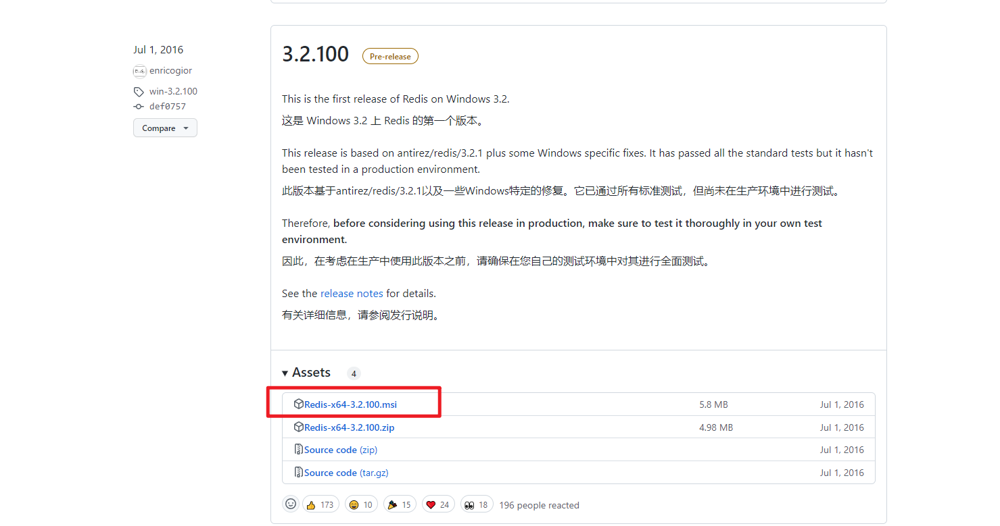


#### 安装


下载完成后，打开一直下一步即可


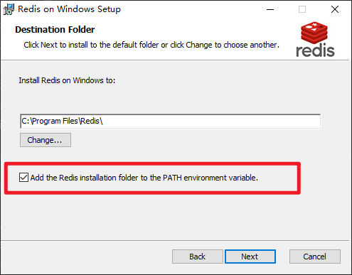


这里需要勾选该项，将 Redis 路径加入到系统环境变量中，方便以后启动


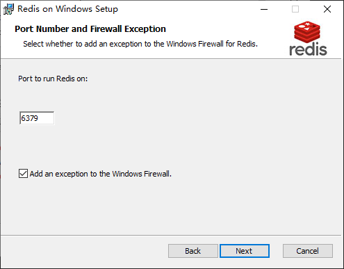


这里配置端口和防火墙，无特殊需求保持默认即可


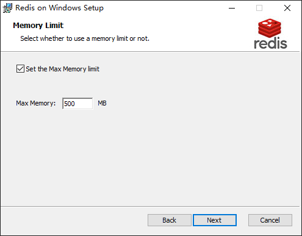


选择最大缓存容量，后续可通过配置文件更改，然后一直下一步，最后完成


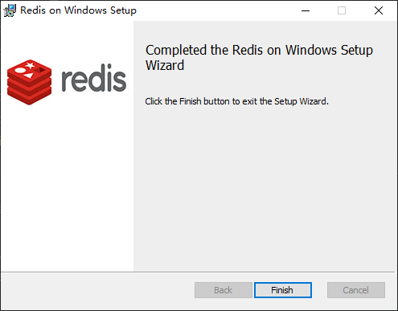


安装完成后，系统默认自动启动 Redis 服务，可在 任务管理器的服务中查看到当前 Redis 服务的状态


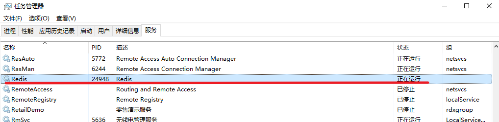


#### 验证


打开终端，执行指令 

```bash
redis-cli
```


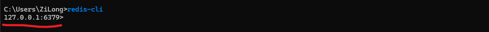


出现如上现象表示 redis 安装运行成功


#### 目录文件说明


关于 Redis 安装根目录下各个文件的介绍如下：


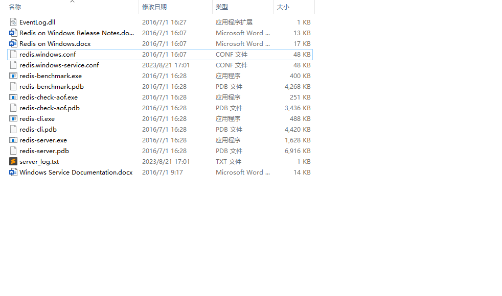


在 Windows 上安装 Redis 后，Redis 的相关文件通常会存在于 Redis 安装目录中。以下是一些常见的 Redis 目录和文件以及它们的作用：


1. **redis-server.exe**：这是 Redis 服务器的主要可执行文件，它用于启动 Redis 服务器。通过运行此文件，你可以启动 Redis 服务器以便开始使用。

   

2. **redis-cli.exe**：这是 Redis 客户端的可执行文件，它用于与 Redis 服务器进行交互。你可以使用它来执行 Redis 命令并管理 Redis 数据。

   

3. **redis-benchmark.exe**：这是 Redis 基准测试工具的可执行文件，用于测试 Redis 服务器的性能。它允许你模拟多个客户端并测量服务器的响应时间。

   

4. **redis-check-aof.exe** 和 **redis-check-rdb.exe**：这些是 Redis 数据持久化文件检查工具的可执行文件。它们用于检查和修复 AOF（Append-Only File）和 RDB（Redis Database）文件的完整性。

   

5. **redis.windows.conf**：这是 Redis 的配置文件。你可以通过编辑此文件来配置 Redis 服务器的行为，如端口号、持久化选项、内存限制等。

   

6. **redis.windows.conf.default**：这是默认的 Redis 配置文件示例，通常用作创建自定义配置文件的起点。

   

7. **README.md**：这个文件包含了一些有关 Redis 在 Windows 上的基本信息和使用说明。

   

8. **msvcr120.dll** 和其他依赖库文件：Redis 在 Windows 上可能需要一些动态链接库文件（DLL）作为依赖。这些文件通常与 Redis 安装包一起提供。

   

9. **Logs 目录**：这个目录包含 Redis 服务器的日志文件，用于记录服务器的活动和错误信息。


### Linux 环境配置


#### 检查 GCC 环境

因为 Redis 是 C语言写的，需要 GCC 环境才能使用

```bash
# 查看是否存在 GCC
rpm -qa|grep gcc*

# 如果不存在就安装
yum install gcc-c++
```


#### 创建目录，下载安装包

```bash
mkdir /usr/lib/redis
cd /usr/lib/redis/
wget https://mirrors.huaweicloud.com/redis/redis-7.2.0.tar.gz
tar -zxvf redis-7.2.0.tar.gz
```


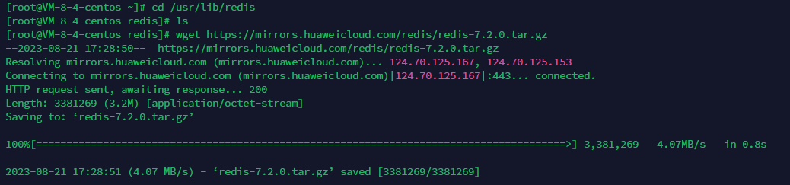

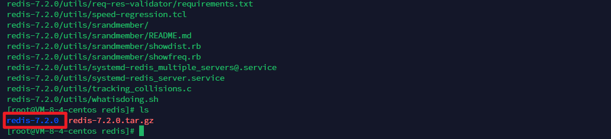


#### 进入目录，编译

```bash
cd redis-7.2.0
make
```

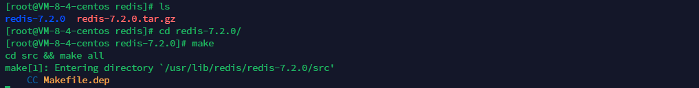


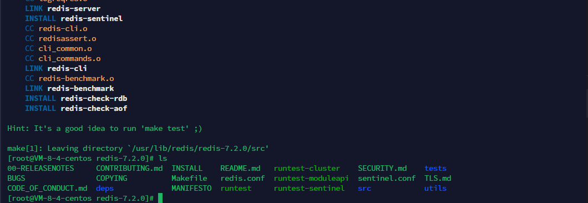


#### 安装，检查服务状态


```bash
make PREFIX=/usr/local/redis install

//查看是否有此服务

ls /usr/local/redis/bin
redis-benchmark  redis-check-aof  redis-check-rdb  redis-cli  redis-sentinel  redis-server
```


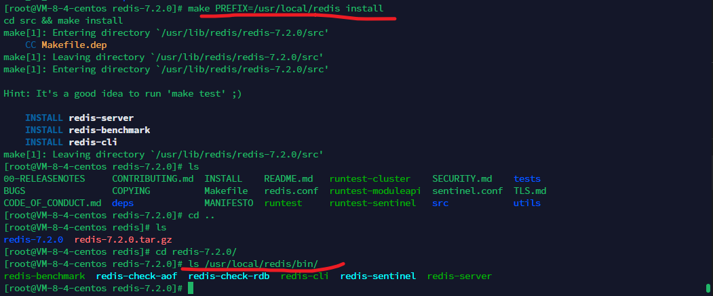


#### 把解压目录下配置文件复制到安装路径下

```bash
cp /usr/lib/redis/redis-7.2.0/redis.conf  /usr/local/redis/
```


#### 配置后端模式启动

```bash
vim /usr/local/redis/redis.conf

# 修改以下内容

#注释掉本机连接 供其他主机正常访问
 
# bind 127.0.0.1
 
# 关闭保护模式，默认是yes
 
protected-mode no
 
# redis后台启动，默认是no
 
daemonize yes
 
# redis链接密码设置，可以设密码，也可以不改此项
 
requirepass XXXXXX
```


redis-conf 配置文件介绍


```
daemonize：如需要在后台运行，把该项的值改为yes
 
pdifile：把pid文件放在/var/run/redis.pid，可以配置到其他地址
 
bind：指定redis只接收来自该IP的请求，如果不设置，那么将处理所有请求，在生产环节中最好设置该项
 
port：监听端口，默认为6379
 
timeout：设置客户端连接时的超时时间，单位为秒
 
loglevel：等级分为4级，debug，revbose，notice和warning。生产环境下一般开启notice
 
logfile：配置log文件地址，默认使用标准输出，即打印在命令行终端的端口上
 
database：设置数据库的个数，默认使用的数据库是0
 
save：设置redis进行数据库镜像的频率
 
rdbcompression：在进行镜像备份时，是否进行压缩
 
dbfilename：镜像备份文件的文件名
 
dir：数据库镜像备份的文件放置的路径
 
slaveof：设置该数据库为其他数据库的从数据库
 
masterauth：当主数据库连接需要密码验证时，在这里设定
 
requirepass：设置客户端连接后进行任何其他指定前需要使用的密码
 
maxclients：限制同时连接的客户端数量
 
maxmemory：设置redis能够使用的最大内存
 
appendonly：开启appendonly模式后，redis会把每一次所接收到的写操作都追加到appendonly.aof文件中，当redis重新启动时，会从该文件恢复出之前的状态
 
appendfsync：设置appendonly.aof文件进行同步的频率
 
vm_enabled：是否开启虚拟内存支持
 
vm_swap_file：设置虚拟内存的交换文件的路径
 
vm_max_momery：设置开启虚拟内存后，redis将使用的最大物理内存的大小，默认为0
 
vm_page_size：设置虚拟内存页的大小
 
vm_pages：设置交换文件的总的page数量
 
vm_max_thrrads：设置vm IO同时使用的线程数量
```


#### 指定配置文件启动


```bash
cd /usr/local/redis/
./bin/redis-server ./redis.conf
```


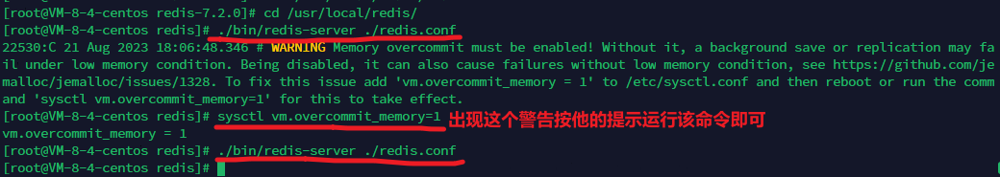


#### 查看运行状态，端口

```bash
ps -ef|grep redis
```


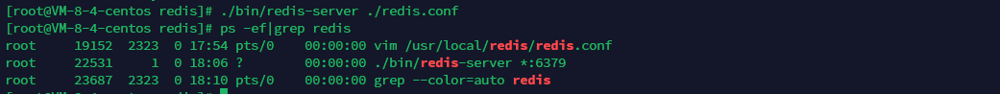


#### 本地连接与关闭


```bash
# 连接
cd /usr/local/redis
./bin/redis-cli 
# 退出
eixt
# 关闭
./bin/redis-cli shutdown
```


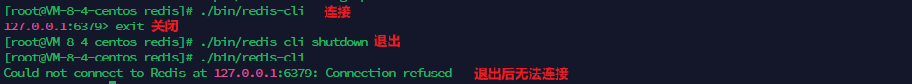


#### 远程连接

下载个 Redis 远程连接软件，或通过 ssh 命令连接都行，填写好 ip 端口即可连接，可视化查看存储内容


[我用的这个](https://github.com/qishibo/AnotherRedisDesktopManager)


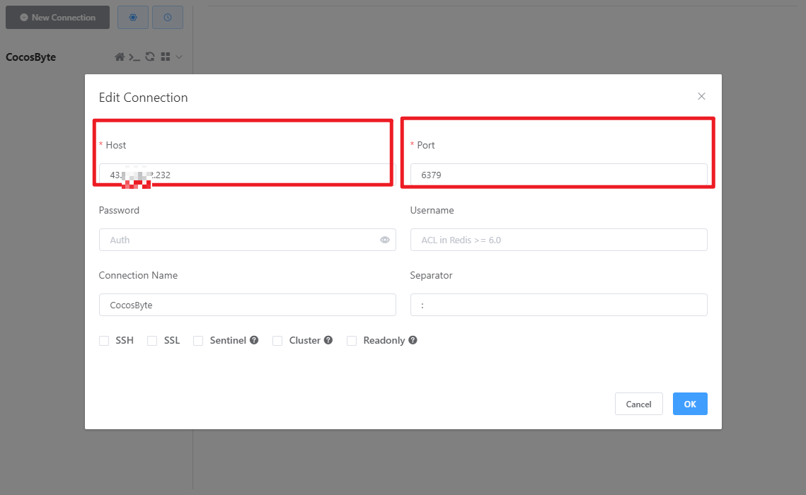


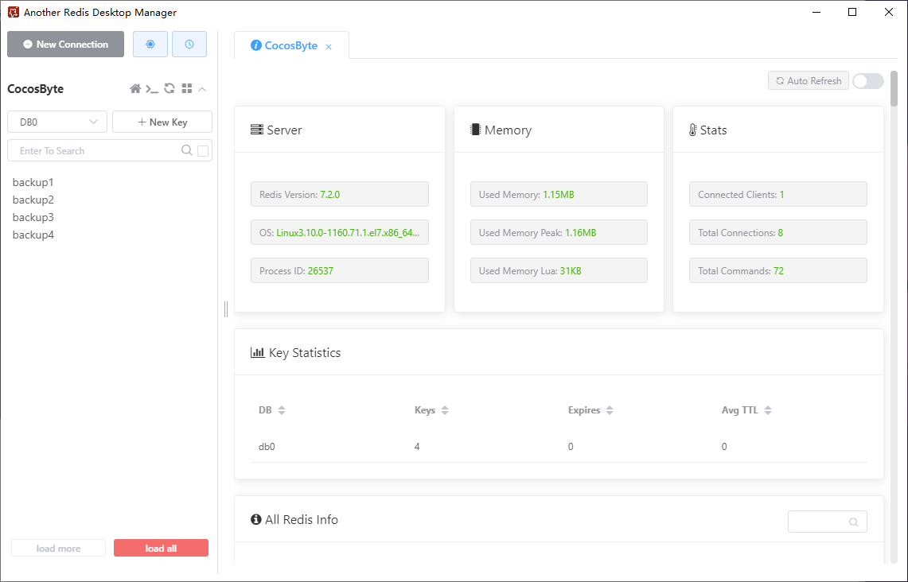


## 基本使用


> [Redis 命令查询网站](http://redis.cn/commands.html) 


### 数据库级别操作


- 查看所有数据库

  ```bash
  config get databases
  ```

  

  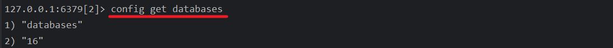

  可见我的 redis 中共有两个数据库，一个名为 `databases`, 一个名为 `16`

  

- 选择、切换数据库

  ```bash
  select + 数据库索引
  ```

  

  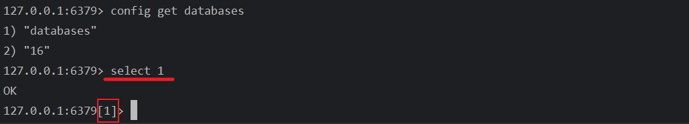

  

- 查看当前数据库大小

  ```bash
  DBSIZE
  ```

  

  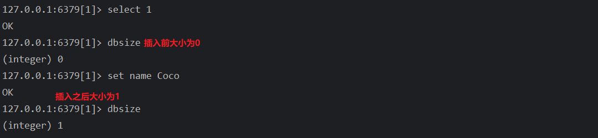

  

- 清空当前数据库

  ```bash
  FLUSHDB
  ```

  

  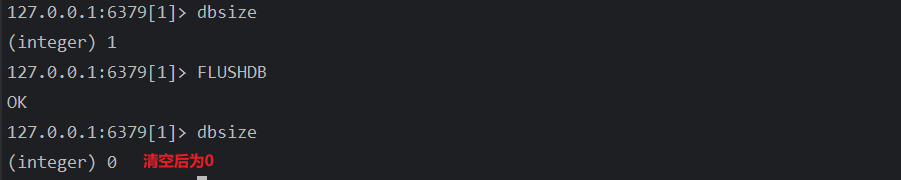

  

- 清空所有数据库

  ```bash
  FLUSHALL
  ```

  

  


### 数据级别操作


Redis 共分为五种数据类型，分别为：

1. 字符串 String

2. 哈希 hash    (是一种mapping 映射)

3. 列表 list

4. 集合 set

5. 有序集合 zset

   

接下来分别对每一类数据类型进行增删改查等命令学习


#### 字符串 String

String 是 redis 最基本的类型，最大能存储512MB的数据，String类型是二进制安全的，即可以存储任何数据、比如数字、图片、序列化对象等


##### 增加键值

- 设置单个值

  ```bash
  set key value
  ```

  例如：

  

  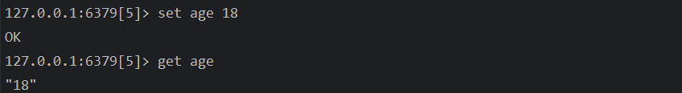

  

- 设置多个键值

  ```bash
  mset key value key2 value2 ..... keyn valuen
  ```

  例如：

  

  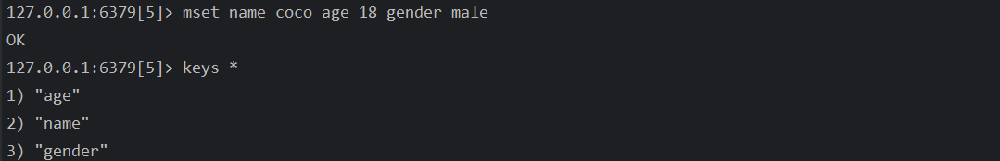

  

- 安全设置键值

  ```bash
  setnx key value
  ```

  

  即在键不存在的情况下才会设置，存在的话不会覆盖，例如：

  

  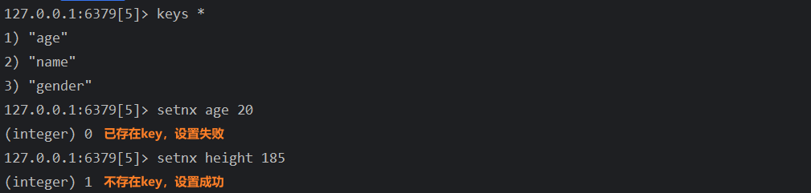

  

- 为某个 key 设置新值，并返回旧的值

  ```bash
  getset key value
  ```

  如果键存在，则返回旧值，设置新值；如果键不存在则返回 nil，并且设置新值

  例如：

  

  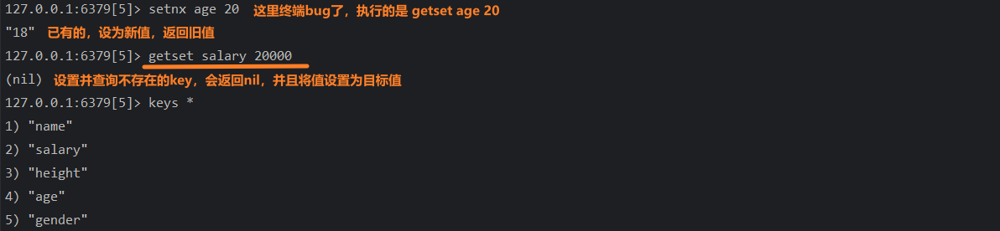


##### 有效时间相关

- 设置键及其过期时间

  ```bash
  setex key seconds value
  ```

  

- 设置键的过期时间

  ```bash
  expire key seconds
  ```

  

- 设置取消过期时间

  ```bash
  persist key
  ```

  

- 查询过期时间

  ```bash
  ttl key
  ```

  

- 以毫秒为单位查询过期时间

  ```bash
  pttl key
  ```

  

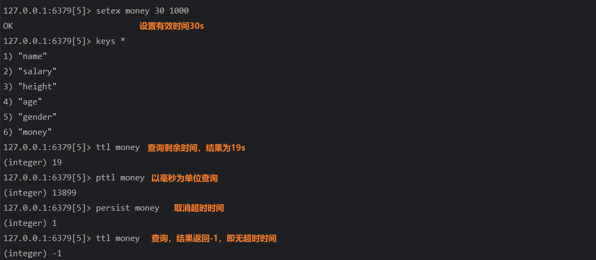


##### 删除键值


- 删除某个键及其值

  ```bash
  del key
  ```

  例如：

  

  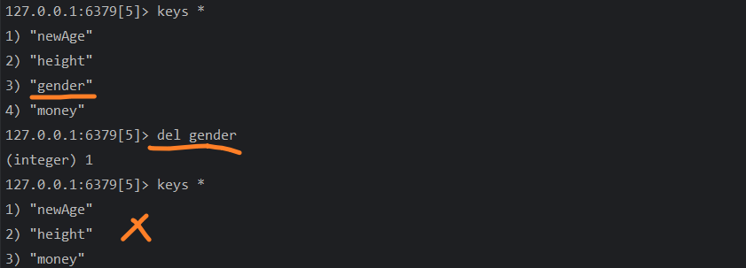

  

- 删除所有键值

  ```bash
  flushdb  或  flushall, 上文讲到过
  ```

  

##### 查询信息

- 查询单个键值

  ```bash
  get key
  ```

  例如：

  

  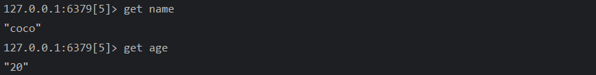

  

- 查询多个键值

  ```bash
  mget key1 key2 ... keyn
  ```

  例如：

  

  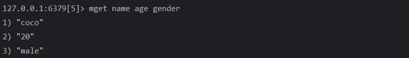

  

  注意：键不存在会返回 nil，例如：

  

  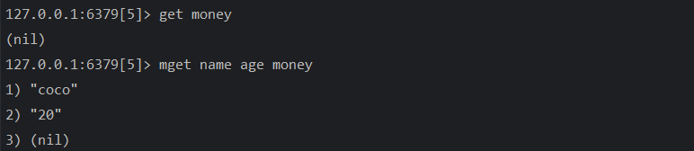


- 查找所有的 key 值

  ```bash
  keys *
  ```

  例如：

  

  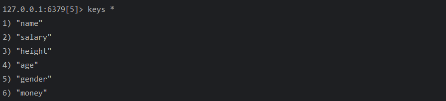

  

- 判断键值是否存在

  ```bash
  exists key
  ```

  例如：

  

  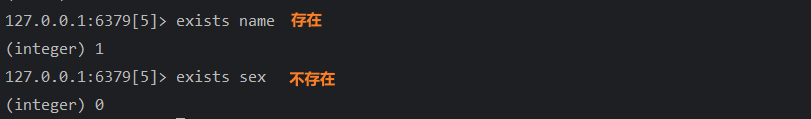

  

  

- 查看值对应的 value 类型

  ```bash
  type key
  ```

  例如：

  

  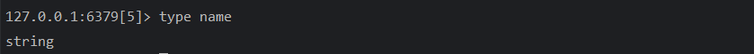

  

- 随机返回一个 key

  ```bash
  randomkey
  ```

  例如：

  

  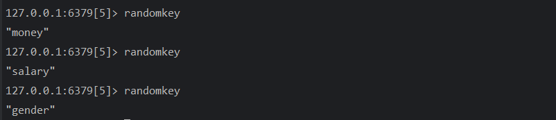

- 查询值的长度

  ```bash
  strlen key
  ```

  例如：

  

  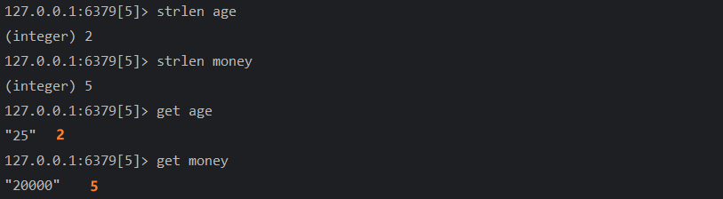

  

##### 修改信息

- 修改 key 名

  ```bash
  rename key newkey
  ```

  例如：

  

  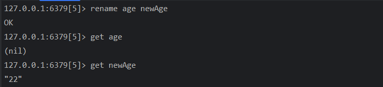

  

  注意：当 newkey 已存在时，会将 key 的值覆盖 newkey 的值

  

- 键对应的值 + 1，值为字符串类型数字

  ```bash
  incr key
  ```

  例如：

  

  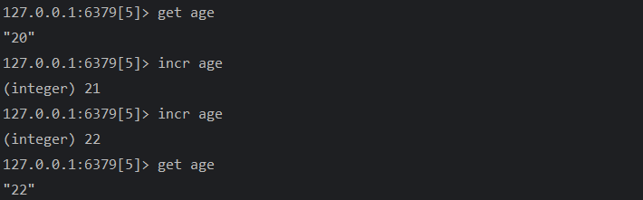

  

- 键对应的值 - 1，值为字符串类型数字

  ```bash
  decr key
  ```

  

- 键对应的值加指定整数，值为字符串类型数字

  ```bash
  incrby key num
  ```

  例如：

  

  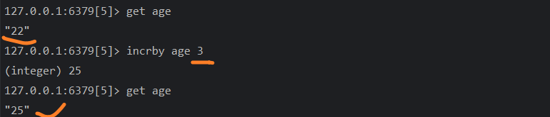

  

- 键对应的值减指定整数，值为字符串类型数字

  ```bash
  decrby key num
  ```

  


#### 哈希 hash

哈希结构（Hash）是一种数据结构，用于存储键值对，其中键是唯一的，而值可以包含多个字段和对应的值。哈希结构的内部实现非常高效，使得它非常适合用于存储和查询复杂的数据，常用于存储对象。

其与字符串类型相比多了一个 filed 部分，可以理解为哈希结构的键名为 filed(区域) 名称，值为一个 filed (区域)

例如：

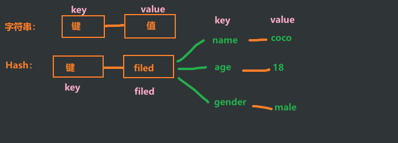

##### 增加键值

- 设置单个值

  ```bash
  hset key filed value
  ```

  例如：

  

  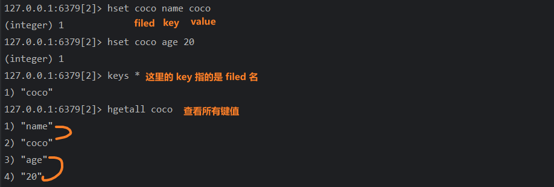

  

- 设置多个值

  ```bash
  hmset key field value [field value ……]
  ```

  例如：

  

  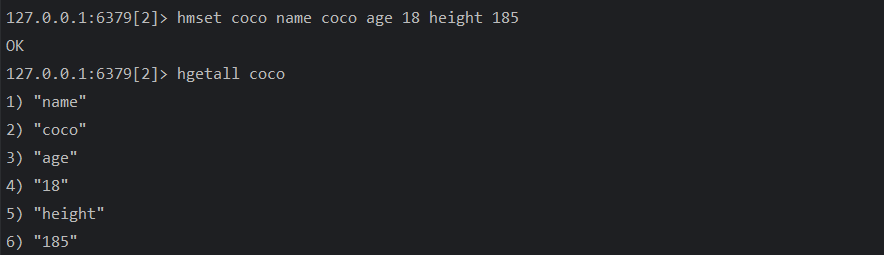

  

- 安全设置值

  ```bash
  hsetnx key field value
  ```

  例如：

  

  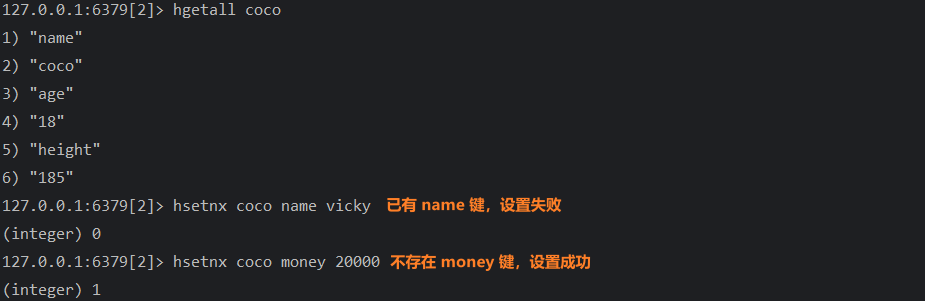


##### 删除键值


- 删除内部字段

  ```bash
  hdel key field [field ……]
  ```

  例如：

  

  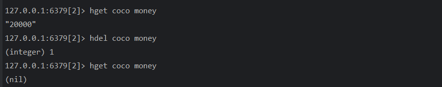

  

  

- 删除对象

  ```bash
  del key
  ```

  例如：

  

  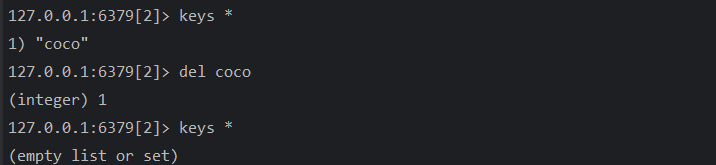


##### 查询信息

- 获取某 key 下的某 filed 值

  ```bash
  hget key filed
  ```

  

- 获取某 key 下的多个 filed 值

  ```bash
  hmget key filed filed2...
  ```

  

- 获取某 key 下的全部 filed 键值

  ```bash
  hgetall key
  ```

  

- 获取所有的 key

  ```bash
  hkeys key
  ```

  

- 获取所有的 value

  ```bash
  hvals key
  ```

  

- 查询 key 下的 filed 数量

  ```bash
  hlen key
  ```

  

- 查询 key 下的 filed 是否存在

  ```bash
  hexists key filed
  ```

  

例如：

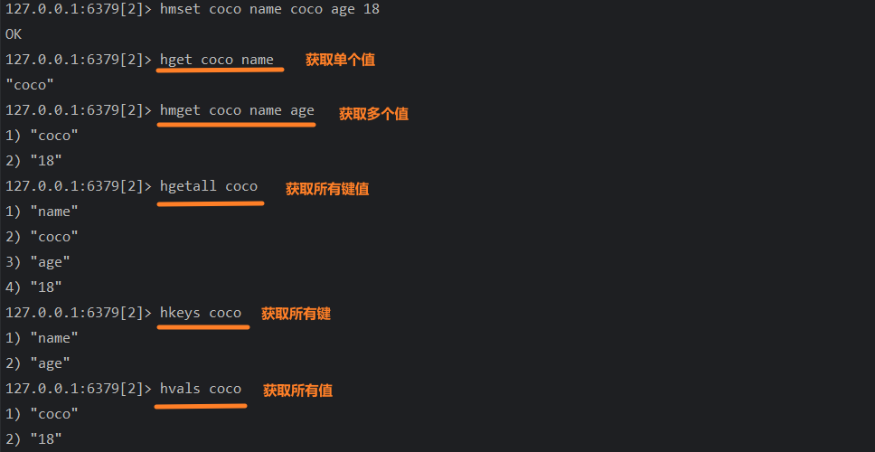


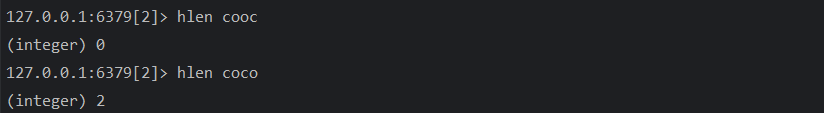


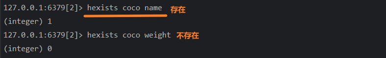


#### 列表 list

在 Redis 中，列表（List）是一种有序的数据结构，它可以包含重复的元素。Redis 的列表是通过双向链表实现的，这使得在列表的两端执行插入和删除操作非常高效。列表通常用于实现队列、栈、消息发布和订阅等数据结构和功能。


##### 添加元素

- 从左侧添加元素

  ```bash
  lpush key value [value.....]
  ```

  例如：

  

  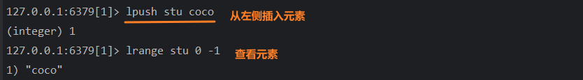

  

  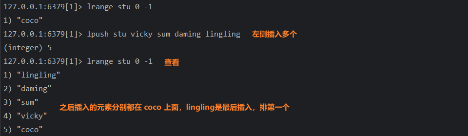

  

- 从右侧添加元素

  ```bash
  lpush key value [value...]
  ```

  例如：

  

  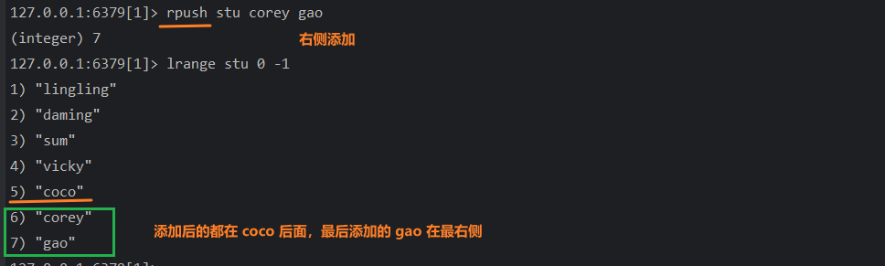


##### 删除元素


- 删除一个元素

  ```bash
  lrem key 1 value
  ```

  例如：

  

  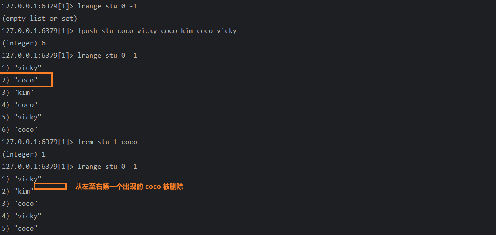

  

- 删除所有某值的元素

  ```bash
  lrem key 0 value
  ```

  例如：

  

  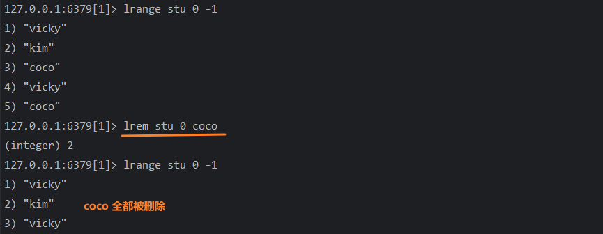

  

- 修剪列表

  ```bash
  ltrim key start stop
  ```

  例如：

  

  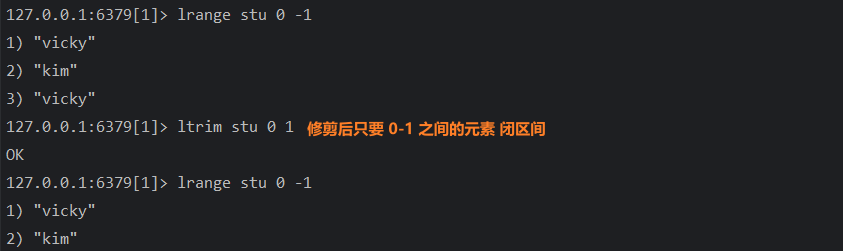


- 删除所有元素

  ```bash
  # 可以直接删掉键，这样键也没有了
  del key
  
  # 也可以修剪掉所有的元素，键还保留着
  ltrim key 0 0
  # （网上都说可以删光，我总是剩一个，还在找原因，后续补充上）
  ```

  

##### 查找元素

- 获取指定索引处的元素

  ```bash
  lindex key index
  ```

  例如：

  

  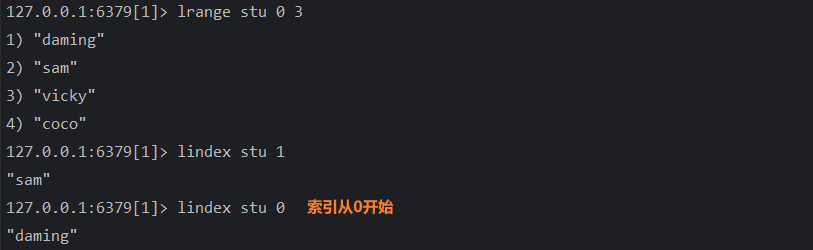

  

- 获取指定索引范围内的元素

  ```bash
  lrange key start stop
  ```

  例如：

  

  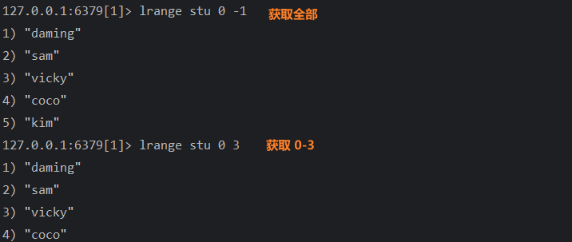

  

- 获取左侧第一个元素，并删除

  ```bash
  lpop key
  ```

  

- 获取右侧第一个元素，并删除

  ```bash
  rpop key
  ```

  例如：

  

  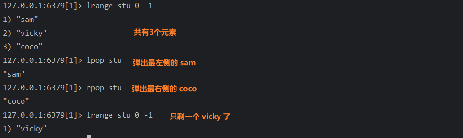

  

- 查询列表长度

  ```bash
  llen key
  ```

  例如：

  

  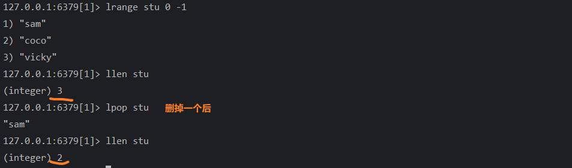

  


#### 集合 set

在 Redis 中，Set（集合）是一种无序且不允许重复元素的数据结构。Redis 的 Set 数据结构支持添加、删除、查找元素以及集合运算，如并集、交集和差集等操作。


##### 添加元素

- 向集合中添加元素

  ```bash
  sadd key value [value...]
  ```

  例如：

  

  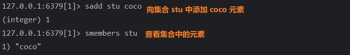

  

##### 移除元素

- 从集合中移除元素

  ```bash
  srem key value [value...]
  ```

  例如：

  

  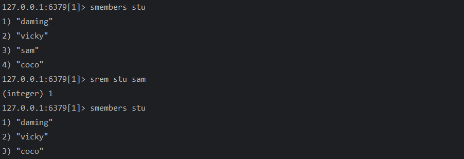

  

##### 查询信息

- 获取所有元素

  ```bash
  smembers key
  ```

  

- 获取集合中元素的数量

  ```bash
  scard key
  ```

  

- 判断元素在不在集合中

  ```bash
  sismember key value
  ```

  

- 随机获取几个元素

  ```bash
  srandmember key count
  ```

  

例如：

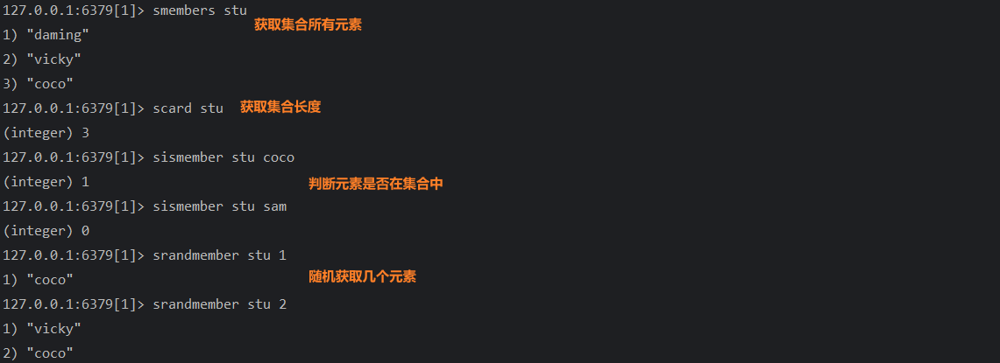


##### 集合运算


准备两个 set， 其中元素分别如下


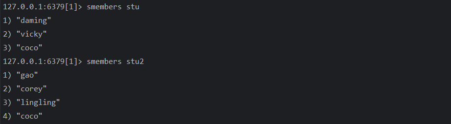


- 交集

  ```bash
  sinter key1 key2 [key....]
  ```

  例如：

  

  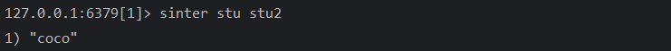

  

  

- 并集

  ```bash
  sunion key1 key2 [key...]
  ```

  例如：

  

  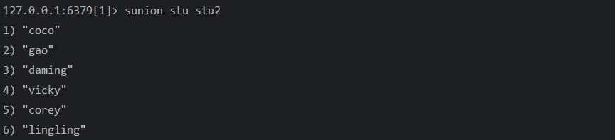

  

- 差集

  ```bash
  sdiff key1 key2 [key...]
  ```

  例如：

  

  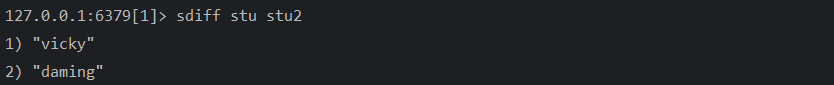

  


#### 有序集合 zset

在 Redis 中 ZSet（有序集合）是一种数据结构，它类似于集合（Set），但每个元素都关联着一个分数（score），这个分数用于对元素进行排序。ZSet 中的元素是唯一的。


##### 添加元素

- 为有序集合添加元素，要求指定元素和分数

  ```bash
  zadd key score value
  ```

  例如：

  

  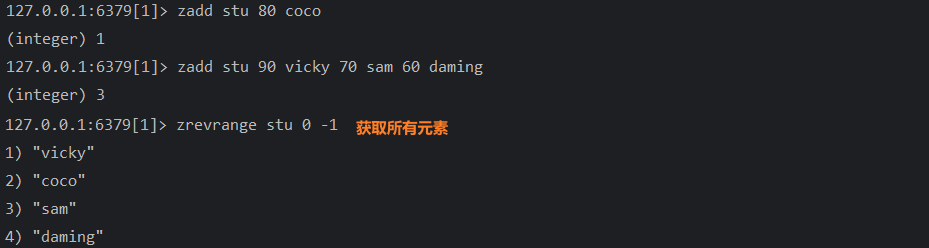

  

##### 删除元素

- 删除 zset 中的一个或多个元素

  ```bash
  zrem key value [value....]
  ```

  例如：

  

  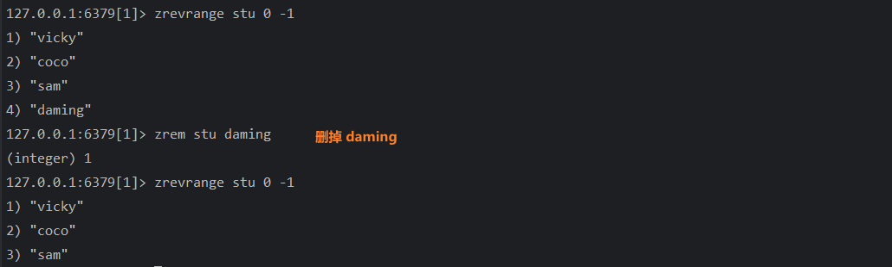


##### 修改信息

- 修改元素的分数信息

  ```bash
  zincrby key incr_score value
  ```

  例如：

  

  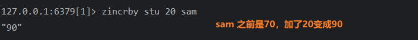

  

  注意：当分数为负数时为减少指定分数，例如：

  

  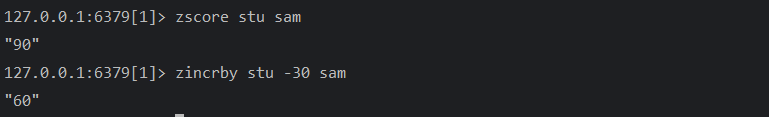


##### 查询信息


- 获取元素的分数

  ```bash
  zscore key value
  ```

  例如：

  

  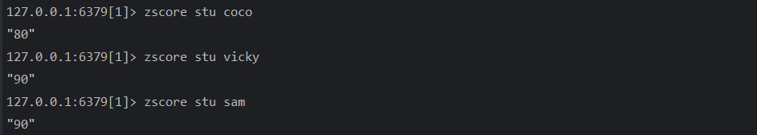

  

- 按分数从高到低获取元素

  ```bash
  zrevrange key start stop
  ```

  例如：

  

  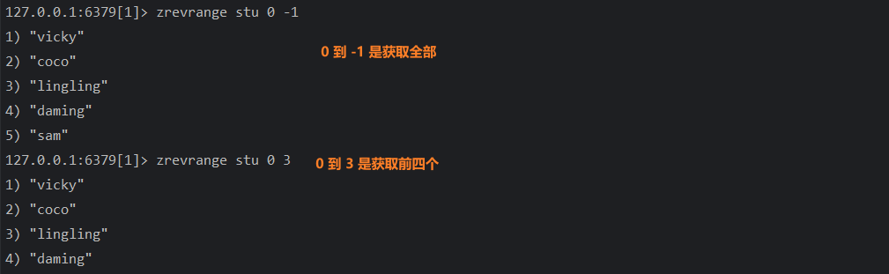

  

- 获取元素的排名(从0开始，分数最小的为0)

  ```bash
  zrank key value
  ```

  例如：

  

  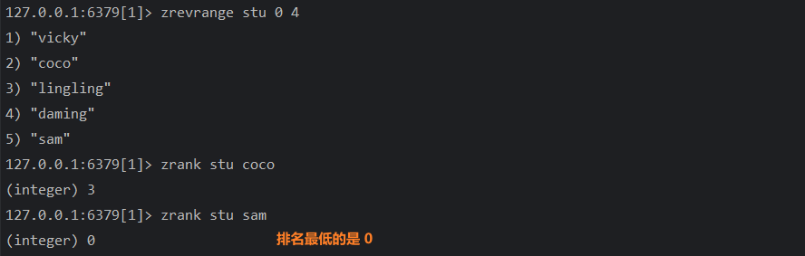

  

- 获取指定分数范围内的元素

  ```bash
  zrangebyscore key start stop
  ```

  例如：

  

  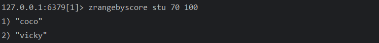


